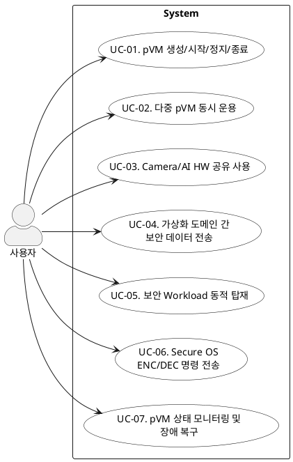

# Use Case 명세

> 본 문서는 기능 요구사항을 기반으로 Secure Vision AI Platform의 유스케이스를 도출하고 PlantUML 다이어그램으로 표현한 것이다.

---

## 1. 액터

| 액터 | 설명 |
|---|---|
| 사용자 | pVM 기반 보안 플랫폼을 운용하는 주체 (로봇 앱 개발자, 시스템 운영자 등) |

---

## 2. Use Case 목록

| UC ID | Use Case | 설명 |
|---|---|---|
| UC-01 | pVM 생성·시작·정지·종료 | pVM의 전체 생명주기를 관리하고 자원을 할당·회수한다 |
| UC-02 | 다중 pVM 동시 운용 | Secure Camera, Secure AI 등 복수 pVM을 독립적으로 동시에 운용한다 |
| UC-03 | ISP·NPU 공유 사용 | ISP·NPU 하드웨어 가속을 Host와 pVM에서 동시에 사용한다 |
| UC-04 | 격리 도메인 간 보안 데이터 전송 | pVM↔pVM, pVM↔Host 간 데이터를 비신뢰 주체에 노출 없이 전달한다 |
| UC-05 | 보안 워크로드 동적 탑재 | 펌웨어 재배포 없이 신규 보안 워크로드를 pVM에 동적으로 탑재한다 |
| UC-06 | Secure OS ENC/DEC 명령 전송 | pVM 내 Secure OS에 암호화·복호화 명령을 전송한다 |
| UC-07 | pVM 모니터링 및 장애 복구 | pVM 상태를 모니터링하고 비정상 종료 시 자원을 안전 회수 후 재시작한다 |

---

## 3. Use Case 다이어그램 (PlantUML)

---

## 4. 사용자 시나리오

| US-01 | pVM 생성·시작·정지·종료 — Secure Camera pVM 배포 |
|---|---|
| Actor | 사용자 |
| Pre-Condition | 시스템이 부팅되어 있고 pVM 이미지가 서명된 상태로 준비되어 있다 |
| Post-Condition | Secure Camera pVM이 격리 상태에서 실행 중이다 |
| Main Flow | 1. 사용자가 pVM 관리 API로 Secure Camera pVM 생성을 요청한다 2. 시스템이 메모리·CPU 자원을 할당하고 pVM 인스턴스를 초기화한다 3. 사용자가 pVM 시작 명령을 호출한다 4. pVM이 격리된 상태로 Running 상태가 된다 |
| Alternative Flow | - |

| US-02 | pVM 생성·시작·정지·종료 — pVM 정상 종료 및 자원 회수 |
|---|---|
| Actor | 사용자 |
| Pre-Condition | pVM이 실행 중이다 |
| Post-Condition | pVM이 종료되고 자원이 해제되었다 |
| Main Flow | 1. 사용자가 pVM 정지 명령을 호출한다 2. 시스템이 pVM 내 활성 프로세스에 종료 신호를 전달한다 3. pVM이 정상 종료 절차를 완료한다 4. 시스템이 할당된 메모리·CPU 자원을 회수한다 |
| Alternative Flow | - |

| US-03 | 다중 pVM 동시 운용 — Secure Camera + Secure AI 동시 운용 |
|---|---|
| Actor | 사용자 |
| Pre-Condition | Secure Camera pVM과 Secure AI pVM 이미지가 준비되어 있다 |
| Post-Condition | 두 pVM이 격리된 상태로 독립적으로 운용 중이다 |
| Main Flow | 1. 사용자가 Secure Camera pVM을 생성하고 시작한다 2. 사용자가 Secure AI pVM을 생성하고 시작한다 3. 두 pVM이 독립된 메모리 공간에서 동시에 실행된다 4. 사용자가 한 쪽 pVM에 강제 오류를 주입한다 5. 나머지 pVM과 Host는 정상 동작을 유지한다 |
| Alternative Flow | - |

| US-04 | ISP·NPU 공유 사용 — ISP 자원 공유 및 잔류 데이터 삭제 |
|---|---|
| Actor | 사용자 |
| Pre-Condition | Secure Camera pVM과 Host가 모두 실행 중이다 |
| Post-Condition | 두 주체가 ISP를 충돌·데이터 유출 없이 사용했다 |
| Main Flow | 1. Secure Camera pVM이 ISP 사용을 요청한다 2. 시스템이 SMMU/IOMMU를 통해 ISP 접근 권한을 Secure Camera pVM에 전용 할당한다 3. Secure Camera pVM이 ISP로 영상을 처리한다 4. 처리 완료 후 시스템이 ISP 버퍼의 잔류 데이터를 삭제하고 접근 권한을 반환한다 5. Host의 일반 카메라 기능이 동일한 ISP를 이어서 사용한다 |
| Alternative Flow | - |

| US-05 | 격리 도메인 간 보안 데이터 전송 — 영상 데이터 보안 파이프라인 전송 |
|---|---|
| Actor | 사용자 |
| Pre-Condition | Secure Camera pVM과 Secure AI pVM이 모두 실행 중이다 |
| Post-Condition | 영상 데이터가 Host에 노출되지 않고 Secure AI pVM에 전달되었다 |
| Main Flow | 1. Secure Camera pVM이 영상 프레임 데이터를 보안 공유 버퍼에 기록한다 2. 공유 버퍼는 두 pVM만 접근 가능하며 Host는 직접 읽을 수 없다 3. Secure AI pVM이 공유 버퍼에서 데이터를 읽어 NPU 추론 입력으로 사용한다 4. 전송 완료 후 공유 버퍼가 초기화된다 |
| Alternative Flow | - |

| US-06 | 보안 워크로드 동적 탑재 — 신규 프라이버시 처리 워크로드 탑재 |
|---|---|
| Actor | 사용자 |
| Pre-Condition | 플랫폼이 실행 중이고 신규 워크로드 이미지가 서명되어 있다 |
| Post-Condition | 신규 보안 워크로드가 격리 환경에서 실행 중이다 |
| Main Flow | 1. 사용자가 신규 보안 워크로드 이미지를 pVM 관리 API에 전달한다 2. 시스템이 이미지 서명을 검증한다 3. 시스템이 새 pVM 인스턴스를 생성하고 워크로드를 탑재한다 4. 펌웨어 재배포 없이 새 워크로드가 기존 pVM들과 독립적으로 실행된다 |
| Alternative Flow | 서명 검증 실패 시 탑재를 중단하고 사용자에게 오류를 반환한다 |

| US-07 | Secure OS ENC/DEC 명령 전송 — 추론 결과 암호화 후 외부 전달 |
|---|---|
| Actor | 사용자 |
| Pre-Condition | Secure AI pVM이 실행 중이고 pVM 내 Secure OS가 초기화되어 있다 |
| Post-Condition | 추론 결과가 암호화된 상태로 외부에 전달되었다 |
| Main Flow | 1. 사용자가 Secure OS에 ENC 명령과 추론 결과 데이터를 전달한다 2. Secure OS가 TrustZone TEE 키를 사용하여 데이터를 암호화한다 3. 암호화된 데이터가 사용자에게 반환된다 4. 사용자가 암호화된 데이터를 외부 시스템으로 전달한다 |
| Alternative Flow | TEE 키 조회 실패 시 오류를 반환하고 평문 데이터는 pVM 외부로 유출하지 않는다 |

| US-08 | pVM 모니터링 및 장애 복구 — 비정상 종료 감지 및 재시작 |
|---|---|
| Actor | 사용자 |
| Pre-Condition | pVM이 실행 중이고 모니터링이 활성화되어 있다 |
| Post-Condition | 장애 pVM이 재시작되었고 다른 pVM과 Host는 영향받지 않았다 |
| Main Flow | 1. 시스템이 pVM 하트비트 또는 상태 이상을 감지한다 2. 사용자에게 장애 알림이 전달된다 3. 시스템이 해당 pVM의 자원을 안전하게 회수한다 4. 다른 pVM과 Host는 영향받지 않고 정상 동작을 유지한다 5. 자동 재시작 정책 또는 사용자 명령에 따라 pVM이 재시작된다 6. 재시작된 pVM이 정상 상태로 복귀한다 |
| Alternative Flow | 재시작 3회 실패 시 pVM을 비활성 상태로 격리하고 사용자에게 수동 조치를 요청한다 |

