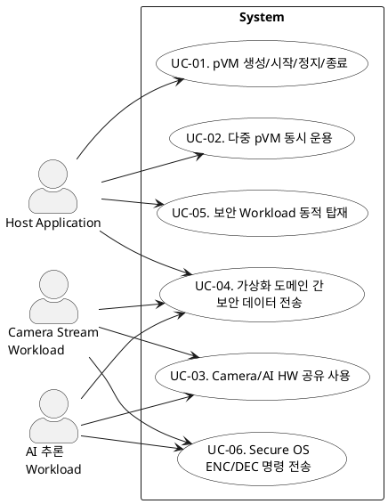

# Use Case 명세

> 본 문서는 기능 요구사항을 기반으로 Secure Vision AI Platform의 유스케이스를 도출하고 PlantUML 다이어그램으로 표현한 것이다.

---

## 1. 액터

| 액터 | 설명 |
|---|---|
| Host Application | pVM 생성/운용과 보안 Workload 탑재를 요청하는 Host 측 애플리케이션 |
| Camera Stream Workload | Camera HW를 사용해 영상 스트림을 처리하고 도메인 간 데이터 전송에 참여하는 보안 Workload |
| AI 추론 Workload | AI HW 추론과 Secure OS 연동을 수행하고 도메인 간 데이터 전송에 참여하는 보안 Workload |

---

## 2. Use Case 목록

| UC ID | Use Case | 설명 |
|---|---|---|
| UC-01 | pVM 생성/시작/정지/종료 | pVM의 전체 생명주기를 관리하고 자원을 할당/회수한다 |
| UC-02 | 다중 pVM 동시 운용 | Secure Camera, Secure AI 등 복수 pVM을 독립적으로 동시에 운용한다 |
| UC-03 | Camera/AI HW 공유 사용 | Camera/AI HW 하드웨어 가속을 Host와 pVM에서 동시에 사용한다 |
| UC-04 | 도메인 간 보안 데이터 전송 | pVM↔pVM, pVM↔Host 간 데이터를 비신뢰 주체에 노출 없이 전달한다 |
| UC-05 | 보안 Workload 동적 탑재 | 펌웨어 재배포 없이 신규 보안 Workload를 pVM에 동적으로 탑재한다 |
| UC-06 | Secure OS ENC/DEC 명령 전송 | pVM 내 Secure OS에 암호화/복호화 명령을 전송한다 |

---

## 3. Use Case 다이어그램 (PlantUML)

---

> 유즈케이스 명세는 [`01_use_case_spec.md`](01_use_case_spec.md) 참조
