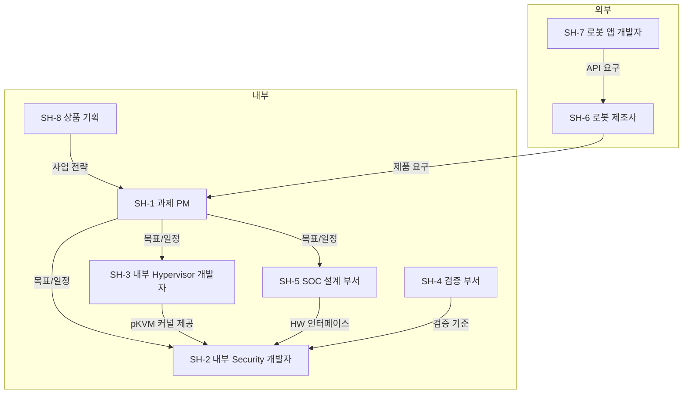

# 요구사항 수집

> 본 문서는 `00_overview.md`(과제 소개)를 기준 문서로 하여, 요구사항 분석의 첫 단계인 **요구사항 수집** 결과를 정리한다.
> 진행 순서: **요구사항 수집(본 문서)** → 요구사항 도출(FR/QA/CONST) → 품질 속성 명세 → Architectural Driver 선정

---

## 1. 주요 Stakeholder 정의

### 1.1 Stakeholder 식별 기준

본 과제의 산출물은 "로봇용 커스텀 SoC와 함께 제공되는 보안 Framework"이므로, 다음 두 관점에서 이해관계자를 식별한다.

- **내부(공급) 관점**: Framework를 기획/개발/검증하는 사내 조직
- **외부(수요) 관점**: Framework를 채택/사용하는 고객과 개발자

### 1.2 Stakeholder 목록

| Stakeholder | 구분 | 역할 |
|-------------|------|------|
| 과제 PM | 내부 | 사업 목표/일정 총괄, 리소스 배분 |
| 내부 Security 개발자 | 내부 | 보안 Framework(Middleware/드라이버/통신) 개발, Secure OS 이식/공존 |
| 내부 Hypervisor 개발자 | 내부 | pKVM 커널(EL2) 제공/유지, hypercall 인터페이스 협의 |
| 검증 부서 | 내부 | 격리/성능 목표의 객관적 검증 |
| SOC 설계 부서 | 내부 | Camera/AI HW 등 SoC HW 설계, HW 인터페이스 제공 |
| 로봇 제조사 | 외부 | SoC 채택 고객, 제품 요구 정의 |
| 로봇 앱 개발자 | 외부 | Framework API로 보안 Workload 개발 |
| 상품 기획 | 내부 | SoC 사업 전략/상품 방향 수립 |

### 1.3 Stakeholder 관계

---

## 2. 수집 방법

| # | 방법 | 대상 Stakeholder | 수집 내용 |
|---|------|------------------|-----------|
| M-1 | **문서 분석** | SH-1, SH-3 | 과제 소개서(`00_overview.md`), 2026-05-29 리뷰 회의 결정사항(과제명 변경, pKVM 포팅 제외, Secure OS 이식 포함), 보안 사고 사례 자료 [A][C][F][G] |
| M-2 | **이해관계자 인터뷰** | SH-1, SH-2, SH-6, SH-8 | 상품 기획의 SoC 사업 전략, 과제 PM의 사업 목표, 로봇 제조사의 제품 요구(기술 미팅), Security 개발자의 기존 TrustZone Secure OS 공존 조건 |
| M-3 | **레퍼런스 시나리오 워크스루** | SH-2, SH-6, SH-7 | Secure Vision AI 파이프라인(캡처→Camera HW→AI HW 추론→판단 결과 전달)을 단계별로 추적하며 기능/품질 요구 식별 |
| M-4 | **경쟁/유사 솔루션 벤치마킹** | SH-8, SH-5 | Android AVF(Microdroid, VirtualizationService) 구조 분석을 통한 시장/HW 관점의 기능 기준선 및 차별화 지점(Linux 네이티브, Secure OS 수용, TrustZone 공존) 식별 |
| M-5 | **기술 검증(PoC)/파트 간 기술 협의** | SH-2, SH-3, SH-5 | pKVM hypercall 인터페이스 범위, HW IP(Camera/AI HW)의 Host/pVM 간 공유(SW 중재) 실현 범위, Secure OS 이식 작업량 등 기술 제약 수집 |
| M-6 | **품질 속성 명세** | 전체 | 수집된 VOS를 측정 가능한 품질 속성 명세로 구체화하고 우선순위 결정 (3단계 "품질 속성 명세"에서 수행) |

---

## 3. VOS (Voice of Stakeholder) 정리

수집 방법(M-1~M-5)을 통해 확보한 이해관계자의 요구를 VOS로 정리한다.
각 VOS는 이후 단계(요구사항 도출)에서 FR(기능 요구사항), QA(품질 속성), CONST(제약사항)로 분류/정제된다.

| ID | Stakeholder | VOS |
|----|-------------|-----------------|
| VOS-01 | 로봇 제조사 | Host 침해 시에도 영상/모델/추론 데이터가 노출되지 않아야 한다. |
| VOS-02 | 로봇 제조사 | Camera/AI HW 가속을 보안 기능과 일반 기능이 함께 사용해야 한다. |
| VOS-03 | 로봇 제조사 | Android 의존 없이 Yocto/Ubuntu 기반 Linux에서 동작해야 한다. |
| VOS-04 | 로봇 제조사 | 보안 기능의 전력/메모리 오버헤드는 탑재 가능 수준이어야 한다. |
| VOS-05 | 상품 기획 | 신규 보안 시나리오를 Framework 수정 없이 수용해야 한다. |
| VOS-06 | 과제 PM | 2026-10-30까지 제한된 인력으로 E2E 데모를 완료해야 한다. |
| VOS-07 | 내부 Security 개발자 | Secure Camera와 Secure AI 도메인은 독립적으로 동시 운용되어야 한다. |
| VOS-08 | SOC 설계 부서 | Camera/AI HW 사용 중 DMA 격리와 잔류 데이터 소거가 필요하다. |
| VOS-09 | 내부 Security 개발자 | 도메인 간 데이터 전달은 노출 없이 빠르게 이뤄져야 한다. |
| VOS-10 | 내부 Hypervisor 개발자 | 기 포팅된 pKVM과 제공 hypercall 범위 안에서 설계해야 한다. |
| VOS-11 | 내부 Security 개발자 (SRCX, Secure OS 이식) | Secure OS 이식 인터페이스가 안정적으로 정의되어야 한다. |
| VOS-12 | 내부 Security 개발자 (기존 TrustZone 공존) | 기존 TrustZone TEE 기능과 SMC 경로가 유지되어야 한다. |
| VOS-13 | 검증 부서 | Host 침해 시 격리 유지 여부를 객관적으로 검증할 수 있어야 한다. |
| VOS-14 | 로봇 앱 개발자 | pVM API는 비보안 전문가도 사용할 만큼 단순해야 한다. |
| VOS-15 | 상품 기획 | 개인정보/규제 대응을 위한 기술적 격리 증빙이 필요하다. |
| VOS-16 | 내부 Security 개발자 | pVM 장애가 Host와 다른 pVM에 전파되지 않아야 한다. |

### 3.1 VOS와 기준 문서 요구사항(R-1~R-5)의 대응

`00_overview.md` 2.2절의 시나리오 요구사항은 VOS의 핵심을 선반영한 것이며, 대응 관계는 다음과 같다. R-1~R-5에 직접 대응되지 않는 VOS(굵게)는 다음 단계(요구사항 도출)에서 추가로 다룬다.

| 기준 문서 요구사항 | 대응 VOS |
|--------------------|----------|
| R-1 Host 비신뢰 격리 | VOS-01, VOS-15 |
| R-2 HW 고성능 연산 지원 | VOS-02, VOS-08 |
| R-3 다중 도메인 동시 운용 | VOS-07, VOS-09 |
| R-4 동적 확장성 | VOS-05 |
| R-5 기존 Secure OS 상호운용 | VOS-11, VOS-12 |
| (R-1~R-5 외 신규) | **VOS-03(Linux 네이티브), VOS-04(자원 효율), VOS-06(일정/인력), VOS-10(pKVM 전제), VOS-13(시험 용이성), VOS-14(사용성), VOS-16(가용성)** |

---

## 다음 단계

수집된 VOS-01~VOS-16을 입력으로, **요구사항 도출** 단계에서 FR(기능 요구사항), QA(품질 속성), CONST(제약사항)를 도출한다.
