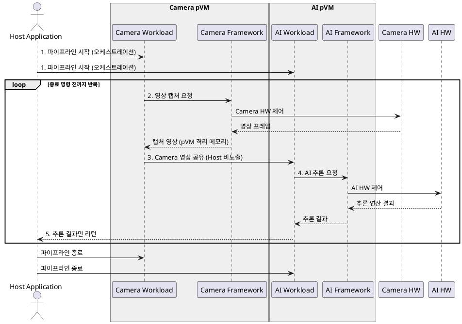

# 레퍼런스 시나리오: Secure Vision AI

본 문서는 Framework 아키텍처 설계의 기준이 되는 레퍼런스 시나리오를 정의한다. 이후의 아키텍처 설계는 본 시나리오의 실행 흐름을 지원하는 것을 1차 목표로 하며, 시나리오 선정 배경과 시스템 요구사항 도출은 `00_overview.md`를 따른다.

## 1. 시나리오 개요

로봇의 카메라 영상이 캡처부터 AI 추론까지 전 구간에서 Host OS로부터 격리된 채 처리되고, Host Application에는 추론 결과만 전달된다. Host Application은 전체 파이프라인의 시작/반복/종료를 오케스트레이션하지만, 영상 원본/모델/중간 데이터에는 접근할 수 없다.

## 2. 구성 요소

| 구성 요소 | 실행 위치 | 역할 |
|-----------|----------|------|
| **Host Application** | Host OS (Linux) | 전체 동작을 오케스트레이션한다. 파이프라인 시작/종료를 요청하고, 최종 추론 결과를 수신하여 활용한다 |
| **Camera pVM** | pKVM 보호 VM | Camera Workload의 격리 실행 환경. Host로부터 Stage-2 메모리 격리 |
| **Camera Workload** | Camera pVM 내부 | Camera Framework를 사용하여 영상을 캡처하고, 캡처 영상을 AI Workload로 공유한다 |
| **Camera Framework** | Camera pVM 내부 | Camera HW(HW IP)를 사용한 영상 캡처 기능을 Camera Workload에 제공한다 |
| **AI pVM (Secure pVM)** | pKVM 보호 VM | AI Workload의 격리 실행 환경. Host로부터 Stage-2 메모리 격리 |
| **AI Workload** | AI pVM 내부 | 공유받은 영상에 대해 AI Framework를 사용하여 AI 추론을 수행하고, 결과를 Host Application으로 리턴한다 |
| **AI Framework** | AI pVM 내부 | AI HW(HW IP)를 사용한 AI 추론 기능을 AI Workload에 제공한다 |
| **Camera HW / AI HW** | 커스텀 SoC HW IP | 각각 영상 캡처와 AI 추론을 가속한다. Host의 일반 기능과 공유되는 자원 |

```
┌────────────────────────────────────────────────────────────────────┐
│ Host OS (Linux)                                                    │
│  ┌──────────────────┐                                              │
│  │ Host Application │ ① 파이프라인 시작 / ⑤ 추론 결과 수신          │
│  └───────┬──────────┘                                              │
│          │ 오케스트레이션                        ▲ 추론 결과만       │
├──────────┼─────────────────────────────────────┼───────────────────┤
│          ▼                                     │                   │
│  ┌───────────────────────┐   ③ 영상 공유   ┌───┴───────────────────┐│
│  │ Camera pVM            │ ─────────────► │ AI pVM                ││
│  │  ┌─────────────────┐  │                │  ┌─────────────────┐  ││
│  │  │ Camera Workload │  │                │  │ AI Workload     │  ││
│  │  └───────┬─────────┘  │                │  └───────┬─────────┘  ││
│  │  ┌───────▼─────────┐  │                │  ┌───────▼─────────┐  ││
│  │  │ Camera Framework│  │                │  │ AI Framework    │  ││
│  │  └───────┬─────────┘  │                │  └───────┬─────────┘  ││
│  └──────────┼────────────┘                └──────────┼────────────┘│
├─────────────┼────────────────────────────────────────┼─────────────┤
│      ② 영상 캡처                                ④ AI 추론           │
│  ┌──────────▼──────────┐                  ┌──────────▼──────────┐  │
│  │ Camera HW (HW IP)   │                  │ AI HW (HW IP)       │  │
│  └─────────────────────┘                  └─────────────────────┘  │
└────────────────────────────────────────────────────────────────────┘
```

## 3. 실행 흐름

### 3.1 단계 정의

| 단계 | 동작 | 설명 |
|---:|------|------|
| 1 | **파이프라인 시작 (Host Application)** | Host Application이 전체 동작의 오케스트레이터로서 Secure Vision AI 파이프라인의 시작을 요청한다. Camera pVM과 AI pVM이 준비되고 각 Workload가 실행 상태로 전환된다 |
| 2 | **영상 캡처 (Camera Workload)** | Camera pVM에서 동작하는 Camera Workload가 Camera Framework를 통해 Camera HW를 사용하여 영상 프레임을 캡처한다. 캡처된 영상은 pVM 격리 메모리에 유지되며 Host에 노출되지 않는다 |
| 3 | **영상 공유 (Camera pVM → AI pVM)** | 캡처된 Camera 영상을 AI Workload로 공유한다. 공유 과정에서도 영상 원본은 Host OS에 노출되지 않아야 한다 |
| 4 | **AI 추론 (AI Workload)** | AI pVM에서 동작하는 AI Workload가 AI Framework를 통해 AI HW를 사용하여 공유받은 영상에 대한 AI 추론을 수행한다. 모델 가중치와 추론 중간 데이터는 pVM 격리 메모리에 유지된다 |
| 5 | **결과 리턴 (AI pVM → Host Application)** | AI 추론 결과(판단 결과)를 Host Application으로 리턴한다. 영상 원본, 모델, 중간 데이터는 전달 대상에서 제외된다 |
| 6 | **반복** | 단계 2(영상 캡처)부터 다시 반복한다. 반복은 Host Application이 종료를 명령할 때까지 지속된다 |

### 3.2 시퀀스 다이어그램



## 4. 데이터 보호 경계

| 데이터 | 위치 | Host OS 접근 |
|--------|------|:---:|
| 영상 원본(캡처 프레임) | Camera pVM 격리 메모리, pVM 간 공유 구간 | 불가 |
| AI 모델 가중치 | AI pVM 격리 메모리 | 불가 |
| 추론 중간 데이터 | AI pVM 격리 메모리 | 불가 |
| 추론 결과(판단 결과) | AI pVM → Host Application 전달 | **가능 (유일한 전달 대상)** |

## 5. 시나리오가 Framework에 요구하는 지원 기능

본 시나리오의 각 단계는 Framework가 제공해야 할 기능을 직접 도출한다. 이 목록이 이후 아키텍처 설계(구성요소/인터페이스 정의)의 입력이 된다.

| 시나리오 단계 | Framework 지원 기능 | 관련 요구사항 (`00_overview.md`) |
|---|---|---|
| 1. 파이프라인 시작/종료 | Host Application이 사용할 파이프라인 제어 API, pVM 생명주기 관리(생성/실행/종료), Workload 탑재 | R-3, R-4 |
| 2. 영상 캡처 | Camera pVM 내에서 Camera HW를 안전하게 사용할 수 있는 HW IP 접근 경로 (Host 일반 기능과 동시 사용) | R-1, R-2 |
| 3. 영상 공유 | Host에 노출되지 않는 pVM 간 데이터(영상 프레임) 공유 채널 | R-1 |
| 4. AI 추론 | AI pVM 내에서 AI HW를 안전하게 사용할 수 있는 HW IP 접근 경로 (Host 일반 기능과 동시 사용) | R-1, R-2 |
| 5. 결과 리턴 | pVM에서 Host Application으로의 결과 전달 채널 (민감 데이터 비포함) | R-1 |
| 6. 반복 | 반복 구간(2~5)의 지속 수행을 지원하는 채널/자원의 안정적 유지 | R-2 |
