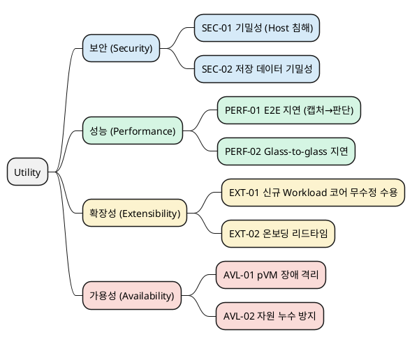

# QA Utility Tree 및 측정 방법 (재편)

> 본 문서는 `03_utility_tree.md`의 QA를 **보안/성능/확장성/가용성** 4개 관점으로 재편하고,
> 각 관점당 2개 QA(총 8개)의 응답 측정치와 측정 방법을 정리한다.
>
> 관련 문서: [`02_requirements.md`](02_requirements.md), [`03_quality_attribute_specification.md`](03_quality_attribute_specification.md), [`03_utility_tree.md`](03_utility_tree.md), [`05_decision_points.md`](05_decision_points.md), [`99_reference_scenario_flow.md`](99_reference_scenario_flow.md), [`99_security_qa_metrics.md`](99_security_qa_metrics.md)

---

## 1. 측정 원칙

- **게이트(불변가치, O/X)**: 위반 시 출하 불가인 릴리스 조건. "노출 0건", "권한 중첩 0", "memcpy 0회", "코어 수정 0 LoC", "다운타임 0" 등이 해당한다. 이것은 KPI가 아니라 정의상 조건이다.
- **KPI(연속값)**: 게이트의 신뢰도·달성도를 추세로 관리 가능한 연속 지표. "0건"은 시험한 범위 안에서의 0건이므로, KPI는 대부분 *시험의 깊이·커버리지*와 *성능 예산 소모율*을 측정한다.
- 수치 목표는 가정치이며, 로봇 제조사 협의 및 PoC 결과에 따라 보정한다.

---

## 2. Utility Tree

### 2.1 QA 요약

> 설명은 [`06_qa_quality_scenarios.md`](06_qa_quality_scenarios.md)의 시나리오 Description을 한 줄로 요약한 것이다.

| 품질속성 | ID | 설명 | 응답 측정치 (게이트 / KPI) |
|---|---|---|---|
| 기밀성 (Host 침해) | SEC-01 | Host가 루트 권한까지 침해되어도 pVM 내 영상/모델/추론 데이터가 생명주기 전 구간에서 노출되지 않는다 | **게이트**: 노출 0건 / **KPI**: 공격 벡터 자동화 커버리지 100%, TCB 규모(KLoC) 및 릴리스당 증가율 5% 이내, CEM 공격 잠재력 25점 이상 |
| 저장 데이터 기밀성 | SEC-02 | 저장 상태의 영상/모델/추론 데이터는 파일시스템 침해 시에도 평문과 키가 노출되지 않는다 | **게이트**: 파일시스템 침해 시 평문 노출 0건 / **KPI**: 부채널 TVLA t-값 4.5 미만, 키 회전 지연 |
| E2E 지연 (캡처→판단) | PERF-01 | 프레임 캡처부터 판단 결과 전달까지 E2E 지연이 실시간 예산 이내다 | **KPI**: p99 100ms 이하, 표준 모델 SingleStream 추론 지연 p90(비격리 대비 상대 성능 90% 이상) |
| Glass-to-glass 지연 | PERF-02 | 캡처부터 원격 운영자 화면 표시까지의 지연이 관제/원격 개입 요건을 만족한다 | **KPI**: 캡처→운영자 화면 p95 200ms 이하 |
| 코어 무수정 수용 | EXT-01 | 신규 Workload를 Framework 코어 수정 없이 패키징/탑재만으로 수용한다 | **게이트**: Framework 코어 수정 0 LoC / **KPI**: breaking change 0건 추세 |
| 온보딩 리드타임 | EXT-02 | 신규 Workload의 개발→통합 온보딩이 표준 절차만으로 단기간에 완료된다 | **KPI**: 신규 Workload 통합 평균 5인일 이내 |
| pVM 장애 격리 | AVL-01 | pVM 장애가 Host, 다른 pVM, 로봇 기본 동작으로 전파되지 않는다 | **게이트**: 장애 전파로 인한 Host/타 pVM 다운타임 0 |
| 자원 누수 방지 | AVL-02 | 장애-재시작이 장기 반복되어도 격리 메모리 등 자원 누수가 누적되지 않는다 | **KPI**: 1,000회 crash-restart soak 기준 누수율 0 수렴 |

---

## 3. 보안 (Security)

| ID | 품질 속성 | 응답 측정치 (게이트 / KPI) | 측정 방법 | 중요도/난이도 | 연관 |
|---|---|---|---|:---:|---|
| SEC-01 | 기밀성 (Host 침해) | **게이트**: 노출 0건 / **KPI**: 공격 벡터 자동화 커버리지 100%, TCB 규모(KLoC) 및 릴리스당 증가율 5% 이내, 경계 돌파 최소 공격 잠재력(CEM) 25점 이상 | pVM 내 canary 마커 주입 후 root Host가 `/proc/kcore`·`/dev/mem`·DMA로 전체 덤프, 마커 검출 자동 판정. 생명주기 13단계(특히 할당/회수)마다 반복. TCB는 신뢰 코드 LoC 집계, 분기별 침투 시험으로 CC/CEM 공격 잠재력 산정 | H/H | QA-01, DP1 |
| SEC-02 | 저장 데이터 기밀성 | **게이트**: 파일시스템 침해 시 평문 노출 0건 / **KPI**: 부채널 TVLA t-값 4.5 미만, 키 회전 지연 | Host 파일시스템에서 저장 blob 덤프 후 평문 패턴 스캔. ENC/DEC 경로 전력/EM 부채널 시험(ISO/IEC 17825) | H/H | DP6, QA-01 |

## 4. 성능 (Performance)

| ID | 품질 속성 | 응답 측정치 (게이트 / KPI) | 측정 방법 | 중요도/난이도 | 연관 |
|---|---|---|---|:---:|---|
| PERF-01 | E2E 지연 (캡처→판단) | **KPI**: p99 100ms 이하, 표준 모델 SingleStream 추론 지연 p90(비격리 대비 상대 성능 90% 이상) | 캡처 HW 타임스탬프(PTS)를 파이프라인 끝까지 전파, 단계별 지연 분해. 추론 구간은 MLPerf Inference(Edge, SingleStream) 방식 p90으로 측정하여 고객 비교 평가와 정합 | H/H | QA-03, MLPerf |
| PERF-02 | Glass-to-glass 지연 | **KPI**: 캡처→운영자 화면 p95 200ms 이하 | 화면 타임코드 캡처 방식으로 캡처~표시 실측. 인코딩/전송/표시 포함 상품 레벨 지표 | M/M | 시장(관제) |

## 5. 확장성 (Extensibility)

| ID | 품질 속성 | 응답 측정치 (게이트 / KPI) | 측정 방법 | 중요도/난이도 | 연관 |
|---|---|---|---|:---:|---|
| EXT-01 | 코어 무수정 수용 | **게이트**: Framework 코어 수정 0 LoC / **KPI**: breaking change 0건 추세 | 신규 Workload 추가 전후 코어 디렉터리 diff를 CI로 자동 검사 | H/H | QA-04, DP2 |
| EXT-02 | 온보딩 리드타임 | **KPI**: 신규 Workload 통합 평균 5인일 이내 | 파일럿 온보딩 공수 실측 | M/M | 시장 |

## 6. 가용성 (Availability)

| ID | 품질 속성 | 응답 측정치 (게이트 / KPI) | 측정 방법 | 중요도/난이도 | 연관 |
|---|---|---|---|:---:|---|
| AVL-01 | pVM 장애 격리 | **게이트**: 장애 전파로 인한 Host/타 pVM 다운타임 0 | 장애 주입 중 이웃 pVM·Host 동작 지속 여부 확인 | H/M | QA-06, DP1 |
| AVL-02 | 자원 누수 방지 | **KPI**: 1,000회 crash-restart soak 기준 누수율 0 수렴 | 반복 장애 후 Framework 자원 원장과 실제 커널 상태 대사(reconciliation) | H/M | DP1 |

---

## 7. 원본 QA 매핑

| 원본 (03_utility_tree.md) | 재편 후 위치 |
|---|---|
| QA-01 (Host 침해 기밀성) | SEC-01, SEC-02 |
| QA-03 (실시간 처리) | PERF-01 |
| QA-04 (Workload 수용) | EXT-01 |
| QA-06 (pVM 장애 격리) | AVL-01 |

---

## 8. 시장 근거 출처

- [Latency in live network video surveillance (Axis 백서)](https://whitepapers.axis.com/en-us/latency-in-live-network-video-surveillance) — 감시 영상 지연 구성 요소
- [Glass-to-glass 지연 측정 (Vay)](https://vay.io/how-to-measure-glass-to-glass-video-latency/) — 원격 제어 200ms 요건
- MLPerf Inference (Edge, SingleStream) — 엣지 AI 추론 지연 벤치마크 방법론
- ISO/IEC 17825 (TVLA) / FIPS 140-3 — 부채널 누출 판정 기준 (t-값 4.5)
