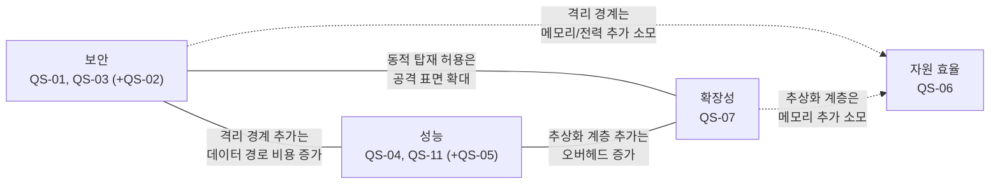

# 품질 속성 선정 (QAW)

> 본 문서는 `02_requirements.md`에서 도출한 QA-01~QA-11을 입력으로, QAW(Quality Attribute Workshop)를 통해 품질 속성 시나리오를 구체화하고 우선순위를 평가하여 **핵심 품질 속성**을 선정한다.
> 진행 순서: 요구사항 수집 → 요구사항 도출 → **품질 속성 선정(본 문서)** → Architectural Driver 선정
>
> 각 시나리오와 관련된 유즈케이스 명세는 [`01_use_case_spec.md`](01_use_case_spec.md) 참조.

---

## 1. QAW 개요

| 항목 | 내용 |
|------|------|
| 목적 | QA-01~QA-11을 측정 가능한 품질 속성 시나리오로 구체화하고, 중요도/난이도 평가를 통해 아키텍처 설계를 주도할 핵심 QA를 선정 |
| 참석자 | SH-1 과제 PM, SH-2 Security 파트(SRCX 포함), SH-3 HV 파트, SH-4 품질/검증 조직, SH-5 로봇 제조사(기술 창구) |
| 절차 | (1) QA별 시나리오 작성(6요소) → (2) 응답 측정치 합의 → (3) 중요도/난이도 평가 → (4) 핵심 QA 선정 |
| 평가 기준 | **중요도**: 미충족 시 비즈니스 영향(사업 진입/제품 출시/사고 피해) / **난이도**: 아키텍처 구조에 미치는 영향과 달성의 기술적 어려움. 각각 H/M/L |

> 응답 측정치의 수치 목표(프레임율, 지연 등)는 레퍼런스 시나리오의 일반적 요구 수준을 기준으로 한 **가정치**이며, 로봇 제조사와의 협의 및 PoC 결과에 따라 보정한다.

---

## 2. 품질 속성 시나리오

각 시나리오는 6요소(자극원, 자극, 환경, 대상, 응답, 응답 측정치)로 명세한다. QS 번호는 QA 번호와 1:1 대응한다.

### QS-01: 보안 — Host 침해 시 기밀성 (QA-01)

> 관련 UC: UC-04 (격리 도메인 간 보안 데이터 전송), UC-06 (Secure OS ENC/DEC 명령 전송)

| 요소 | 내용 |
|------|------|
| 자극원 | Host OS 루트 권한을 탈취한 공격자(커널 익스플로잇, 악성 커널 모듈) |
| 자극 | Host 커널 권한으로 pVM 메모리 읽기 시도 (물리 메모리 직접 매핑, KVM 인터페이스 오용, 페이지 테이블 조작 등) |
| 환경 | Secure Vision AI 파이프라인 정상 동작 중 |
| 대상 | pVM 내 영상 원본, AI 모델 가중치, 추론 중간 데이터 |
| 응답 | Stage-2 격리에 의해 모든 접근이 차단되고, 비정상 접근 시도가 기록된다 |
| 응답 측정치 | 침투 시험 전 케이스에서 격리 메모리 노출 0건 (차단율 100%) |

### QS-02: 보안 — 도메인 간 격리 (QA-02)

> 관련 UC: UC-02 (다중 pVM 동시 운용), UC-04 (격리 도메인 간 보안 데이터 전송)

| 요소 | 내용 |
|------|------|
| 자극원 | 침해된 보안 Workload(예: 취약점이 악용된 Secure Camera pVM) |
| 자극 | 다른 pVM(Secure AI)의 메모리/통신 채널에 대한 접근 시도 |
| 환경 | 다중 pVM 동시 운용 중 (UC-02) |
| 대상 | 타 pVM의 메모리, 보안 채널 버퍼 |
| 응답 | pVM 간 격리에 의해 접근이 차단되고, 침해 영향이 해당 pVM 내부로 한정된다 |
| 응답 측정치 | 교차 도메인 접근 시험 전 케이스 차단 (노출 0건) |

### QS-03: 보안 — HW IP DMA 경로 격리 (QA-03)

> 관련 UC: UC-03 (Camera/AI HW 공유 사용)

| 요소 | 내용 |
|------|------|
| 자극원 | 침해된 Host 또는 비할당 pVM |
| 자극 | (a) pVM이 사용 중인 Camera/AI HW의 DMA를 조작하여 격리 메모리 접근 시도, (b) HW IP 사용 주체 전환 직후 이전 도메인의 잔류 데이터 읽기 시도 |
| 환경 | HW IP가 SW 중재로 Host/pVM 간 공유되는 상태 (UC-03) |
| 대상 | 격리 메모리, HW IP 내부 버퍼/레지스터의 잔류 데이터 |
| 응답 | S2MPU에 의해 DMA 접근이 차단되고, 전환 시 잔류 데이터가 소거된다 |
| 응답 측정치 | DMA 우회 시험 전 케이스 차단, 전환 후 잔류 데이터 검출 0바이트 |

### QS-04: 성능 — 실시간 처리 (QA-04)

> 관련 UC: UC-03 (Camera/AI HW 공유 사용), UC-04 (격리 도메인 간 보안 데이터 전송)

| 요소 | 내용 |
|------|------|
| 자극원 | 카메라 센서 |
| 자극 | 1080p 30fps 영상 스트림 지속 유입 (가정치) |
| 환경 | 격리 파이프라인(Secure Camera→Secure AI) 정상 동작, Host 통상 부하 |
| 대상 | End-to-End 파이프라인 (캡처→Camera HW→AI HW 추론→판단) |
| 응답 | Camera/AI HW 가속으로 프레임 드롭 없이 처리 |
| 응답 측정치 | 30fps 유지, 캡처→판단 E2E 지연 100ms 이하, 비격리 구성 대비 처리 성능 저하 10% 이내 (가정치) |

### QS-05: 성능 — 도메인 간 통신 오버헤드 (QA-05)

> 관련 UC: UC-04 (격리 도메인 간 보안 데이터 전송)

| 요소 | 내용 |
|------|------|
| 자극원 | Secure Camera pVM |
| 자극 | 프레임 단위 대용량 영상 데이터를 Secure AI pVM으로 전달 |
| 환경 | 파이프라인 정상 동작 중 (UC-04 Main Flow 1~4 수행) |
| 대상 | 도메인 간 보안 채널(공유 메모리/RPC) |
| 응답 | 데이터 노출 없이 전달되며 파이프라인 실시간성이 유지된다 |
| 응답 측정치 | 프레임 데이터 복사 횟수 0회(zero-copy) 또는 프레임당 전달 지연 5ms 이하 (가정치) |

### QS-06: 자원 효율 (QA-06)

> 관련 UC: UC-01 (pVM 생성/시작/정지/종료), UC-02 (다중 pVM 동시 운용)

| 요소 | 내용 |
|------|------|
| 자극원 | 시스템 통합자(로봇 제조사) |
| 자극 | 보안 Framework + pVM 2개(Camera, AI) 상시 운용 |
| 환경 | 로봇 제품의 통상 동작 상태 (UC-02 정상 운용 중) |
| 대상 | SoC 메모리/전력 예산 |
| 응답 | 비격리 구성 대비 추가 자원 소모가 제품 탑재 가능 한도 이내 |
| 응답 측정치 | Framework/격리 운용에 따른 추가 메모리 256MB 이하, 전력 증가 5% 이내 (가정치) |

### QS-07: 확장성 — 신규 Workload 수용 (QA-07)

> 관련 UC: UC-05 (보안 Workload 동적 탑재)

| 요소 | 내용 |
|------|------|
| 자극원 | 로봇 제조사 / Workload 개발자 |
| 자극 | 신규 보안 Workload(예: 개인정보 처리, 펌웨어 보호) 추가 요구 |
| 환경 | Framework가 제품에 배포/운용 중인 상태 (UC-05 Pre-Condition 충족) |
| 대상 | Framework 본체(Middleware/커널 드라이버) |
| 응답 | 펌웨어 재배포/Framework 수정 없이 Workload 패키징/탑재만으로 수용된다 |
| 응답 측정치 | Framework 코어 수정 0 LoC, Workload 패키지 작성/탑재만으로 동작 |

### QS-08: 변경 용이성 — Secure OS 교체 (QA-08)

> 관련 UC: UC-06 (Secure OS ENC/DEC 명령 전송)

| 요소 | 내용 |
|------|------|
| 자극원 | 서드파티 Secure OS 벤더 / 로봇 제조사 |
| 자극 | 탑재된 Secure OS를 다른 Secure OS로 교체 |
| 환경 | 설계/통합 단계 또는 제품 유지보수 단계 |
| 대상 | Secure OS와 무관한 SW(Framework, Host Middleware, 타 Workload) |
| 응답 | Secure OS 패키지 교체만으로 완료되며 무관 SW는 수정되지 않는다 |
| 응답 측정치 | Secure OS 외 모듈의 수정 파일 0개 |

### QS-09: 가용성 — pVM 장애 격리 (QA-09)

> 관련 UC: UC-07 (pVM 모니터링 및 장애 복구)

| 요소 | 내용 |
|------|------|
| 자극원 | 오동작하는 보안 Workload |
| 자극 | pVM 비정상 종료(크래시, 무응답) |
| 환경 | 다중 pVM 운용 중인 로봇 통상 동작 상태 (UC-07 Pre-Condition 충족) |
| 대상 | Host OS, 타 pVM, 로봇 기본 동작 |
| 응답 | 장애가 해당 pVM에 한정되고, Framework가 자원을 안전하게 회수한 뒤 재시작한다 |
| 응답 측정치 | Host/타 pVM 다운타임 0, 장애 pVM 재시작 3초 이내 (가정치) |

### QS-10: 시험 용이성 — 격리 보장 검증 (QA-10)

> 관련 UC: UC-04 (격리 도메인 간 보안 데이터 전송), UC-07 (pVM 모니터링 및 장애 복구)

| 요소 | 내용 |
|------|------|
| 자극원 | 품질/검증 조직 |
| 자극 | 격리 보장(QS-01~03)에 대한 객관적 검증 요구 |
| 환경 | 통합 시험 단계 및 회귀 시험 |
| 대상 | 격리 메커니즘(Stage-2, SMMU, 보안 채널) |
| 응답 | Host 침해 모사 도구 등 재현 가능한 자동화 시험으로 격리 유지가 검증된다 |
| 응답 측정치 | 격리 관련 요구사항(QA-01~03)의 자동화 시험 커버 100%, 회귀 시험 반복 실행 가능 |

### QS-11: 성능 — HW IP 공유 오버헤드 (QA-11)

> 관련 UC: UC-03 (Camera/AI HW 공유 사용)

| 요소 | 내용 |
|------|------|
| 자극원 | Host 일반 기능(일반 촬영 등)과 보안 파이프라인 |
| 자극 | 단일 Context HW IP(Camera/AI HW)에 대한 동시 사용 요구 |
| 환경 | SW 중재 기반 HW IP 공유 운용 중 (UC-03 Main Flow 1~5 수행) |
| 대상 | HW IP 중재 계층 |
| 응답 | 양쪽 요구가 모두 처리되며 어느 쪽의 실시간성도 깨지지 않는다 |
| 응답 측정치 | Host/보안 파이프라인 각각 목표 프레임율 유지(저하 10% 이내), 사용 주체 전환 오버헤드 1ms 이하 (가정치) |

---

## 3. 우선순위 평가

| QS | 품질 속성 | 중요도 | 근거 (중요도) | 난이도 | 근거 (난이도) |
|----|----------|:------:|---------------|:------:|---------------|
| QS-01 | 보안 (Host 침해 기밀성) | **H** | 과제의 존재 이유(R-1). 미충족 시 제품 출시 전제 조건 상실, 사고 시 직접 피해(VOS-01, 16, 17) | **H** | Host 비신뢰 전제의 전 구간(메모리/통신/HW) 격리 설계 필요. TCB 최소화와 기능성의 상충 |
| QS-02 | 보안 (도메인 간 격리) | **H** | 다중 도메인 구조(R-3)의 보안 전제. 한 도메인 침해의 전파는 전체 신뢰 모델 붕괴 | M | pVM 간 격리는 Stage-2 메커니즘 재사용 가능. 보안 채널 경계 설계가 관건 |
| QS-03 | 보안 (DMA 경로 격리) | **H** | HW 가속(R-2)과 격리(R-1)를 동시에 성립시키는 조건. 미충족 시 격리 자체가 무효 | **H** | 단일 Context HW의 공유/전환/소거를 SMMU 제어와 결합해야 함. HW IP별 특성 의존 |
| QS-04 | 성능 (실시간 처리) | **H** | 실시간성 미달 시 제품 기능 자체가 불성립(VOS-02). 보안을 위해 성능을 포기할 수 없음 | **H** | 가상화 경계를 넘는 데이터 경로에서 비격리 대비 10% 이내 저하 달성이 어려움 |
| QS-05 | 성능 (통신 오버헤드) | **H** | QS-04의 하위 조건. 도메인 간 전달이 병목이면 파이프라인 실시간성 불성립 | M | zero-copy 공유 메모리 설계로 달성 가능하나 격리 보장과의 양립 설계 필요 |
| QS-06 | 자원 효율 | **H** | 추가 메모리/전력 소모가 더 높은 SoC 사양을 요구하여 제품 **가격 경쟁력**에 직접 영향. 대량 양산 로봇에서 단가 상승은 사업성 저하로 직결(VOS-04) | M | pVM 메모리 예약/동적 회수 설계로 대응 가능 |
| QS-07 | 확장성 (Workload 수용) | **H** | 과제 핵심 키워드(VOS-05). 단일 시나리오 솔루션은 사업 경쟁력 없음. AVF 대비 차별화 지점 | **H** | 플러그인형 패키징/로딩 구조, 인터페이스 안정성 등 Framework 전체 구조를 결정 |
| QS-08 | 변경 용이성 (Secure OS 교체) | M | 서드파티 Secure OS 수용(VOS-15) 항목이나, 표준 GP(GlobalPlatform) TEE API 지원만으로 교체가 가능하여 별도 구조 차별화가 불필요. 사업 영향은 중간 | M | QS-07의 확장 구조가 갖춰지면 인터페이스 추상화로 달성 가능 |
| QS-09 | 가용성 (장애 격리) | M | 로봇 기본 동작 보호는 중요하나, 격리 구조 자체가 장애 전파를 1차 차단 | M | 장애 복구(FR-07)의 자원 회수/재시작 설계로 대응 |
| QS-10 | 시험 용이성 | M | 검증 불가능한 보안 주장은 수용 불가(VOS-13)/규제 증빙(VOS-17)과 연계 | M | 침해 모사 도구/시험 훅 설계 필요하나 구조 전체를 결정하지는 않음 |
| QS-11 | 성능 (HW IP 공유 오버헤드) | **H** | Host 일반 기능과 보안 기능의 동시 성립 조건(VOS-02). 미충족 시 제품 기능 절충 발생 | **H** | 다중 Context 미지원 HW의 SW 중재는 보안(QS-03)/성능(QS-04)과 삼중 상충. 본 과제 고유의 난제 |

---

## 4. 핵심 품질 속성 선정

### 4.1 선정 기준

- **1순위 (Architectural Driver 후보)**: 중요도 H이고 난이도 H — 아키텍처 구조를 직접 결정하며 실패 시 과제 목표가 무산되는 항목
- **2순위 (핵심 QA와 함께 달성)**: 중요도 H이고 난이도 M — 1순위 해결 구조 위에서 함께 달성되도록 설계. 특정 1순위 그룹에 종속되거나, 어느 그룹에도 속하지 않는 교차 관심사로서 독립적으로 다룬다
- **3순위 (설계 시 고려)**: 중요도 M — 구조 결정 후 설계/검증 단계에서 충족 확인

### 4.2 선정 결과

| 순위 | 품질 속성 그룹 | 포함 시나리오 | 비고 |
|:----:|---------------|--------------|------|
| 1 | **보안 (Security)** | QS-01 (Host 침해 기밀성), QS-03 (DMA 경로 격리) | QS-02(도메인 간 격리)는 2순위로 그룹에 포함 |
| 1 | **성능 (Performance)** | QS-04 (실시간 처리), QS-11 (HW IP 공유 오버헤드) | QS-05(통신 오버헤드)는 2순위로 그룹에 포함 |
| 1 | **확장성 (Extensibility)** | QS-07 (Workload 수용) | 종속 2순위 시나리오 없음 (QS-08은 중요도 재평가로 3순위로 이동) |
| 2 | **자원 효율 (Resource Efficiency)** | QS-06 (자원 효율) | 가격 경쟁력에 직결되는 독립 2순위. 특정 1순위 그룹에 종속되지 않는 교차 관심사로, 구조 설계 시 메모리/전력 footprint 제약으로 작용 |
| 3 | 변경 용이성, 가용성, 시험 용이성 | QS-08, QS-09, QS-10 | 구조 결정 후 설계/검증 단계에서 충족 확인 |

### 4.3 핵심 QA 간 상충 관계

선정된 세 핵심 QA(1순위)는 서로 상충하며, 여기에 가격 경쟁력에 직결되는 자원 효율(2순위)이 추가 제약으로 작용한다. 이 상충의 해소가 아키텍처 설계의 중심 과제다.

- **보안 vs 성능**: 격리 경계(Stage-2, SMMU, 보안 채널)를 강화할수록 데이터 경로 비용이 증가한다. zero-copy 공유와 격리 보장의 양립(QS-05), HW 가속과 DMA 격리의 양립(QS-03/04/11)이 핵심 상충 지점이다.
- **보안 vs 확장성**: Workload 동적 탑재(QS-07)는 검증되지 않은 코드의 진입 경로가 될 수 있어, 패키지 검증/서명 구조가 전제되어야 한다.
- **성능 vs 확장성**: 다양한 Workload를 수용하기 위한 추상화 계층은 호출 경로를 늘려 오버헤드를 유발할 수 있다.
- **자원 효율(2순위) 상충**: 격리 경계(보안)와 추상화 계층(확장성)은 모두 추가 메모리/전력을 소모하므로 자원 효율과 상충한다. 가격 경쟁력 제약(중요도 H) 하에서 격리/확장 구조의 메모리/전력 footprint를 탑재 한도 이내로 최소화하는 설계가 요구된다.

---

## 다음 단계

선정된 핵심 품질 속성(보안, 성능, 확장성)과 그 시나리오를, 가격 경쟁력에 직결되는 자원 효율(2순위) 제약과 함께 FR/CONST와 결합하여, **Architectural Driver 선정** 단계에서 아키텍처 설계를 주도할 동인을 확정한다.
