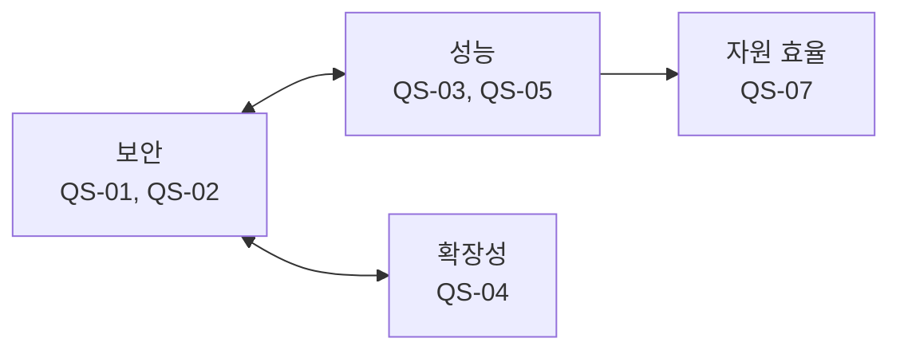

# 품질 속성 선정 (QAW)

> 본 문서는 `02_requirements.md`에서 도출한 QA-01~QA-09을 입력으로, QAW(Quality Attribute Workshop)를 통해 품질 속성 시나리오를 구체화하고 우선순위를 평가하여 **핵심 품질 속성**을 선정한다.
>
> 진행 순서: 요구사항 수집 → 요구사항 도출 → **품질 속성 선정(본 문서)** → Architectural Driver 선정

관련 유즈케이스 명세는 [`01_use_case_spec.md`](01_use_case_spec.md) 참조.

---

## 1. QAW 개요

| 항목 | 내용 |
|------|------|
| 목적 | QA-01~QA-09을 측정 가능한 품질 속성 시나리오로 구체화하고, 중요도/난이도 평가를 통해 아키텍처 설계를 주도할 핵심 QA를 선정 |
| 참석자 | SH-1 과제 PM, SH-2 Security 파트(SRCX 포함), SH-3 HV 파트, SH-4 품질/검증 조직, SH-5 로봇 제조사(기술 창구) |
| 절차 | (1) QA별 시나리오 작성(6요소) → (2) 응답 측정치 합의 → (3) 중요도/난이도 평가 → (4) 핵심 QA 선정 |
| 평가 기준 | **중요도**: 미충족 시 비즈니스 영향 / **난이도**: 아키텍처 구조 영향과 기술적 어려움. 각각 H/M/L |

---

## 2. 품질 속성 시나리오

### QS-01: 보안 — Host 침해 시 기밀성 (QA-01)

관련 UC: UC-01, UC-04

| 요소 | 내용 |
|------|------|
| 자극원 | Host OS 루트 권한을 탈취한 공격자(커널 익스플로잇, 악성 커널 모듈) |
| 자극 | Host 커널 권한으로 pVM 메모리 읽기 시도 |
| 환경 | Secure Vision AI 파이프라인 정상 동작 중 |
| 대상 | pVM 내 영상 원본, AI 모델 가중치, 추론 중간 데이터 |
| 응답 | Stage-2 격리에 의해 모든 접근이 차단되고, 비정상 접근 시도가 기록된다 |
| 응답 측정치 | 침투 시험 전 케이스에서 격리 메모리 노출 0건 (차단율 100%) |

### QS-02: 보안 — HW 접근 격리 (QA-02)

관련 UC: UC-03

| 요소 | 내용 |
|------|------|
| 자극원 | Host 일반 기능과 보안 파이프라인 |
| 자극 | Camera/AI HW 사용 주체 전환 또는 동시 사용 요구 |
| 환경 | SW 중재 기반 HW IP 공유 운용 중 |
| 대상 | HW IP 중재 계층, S2MPU 권한 상태 |
| 응답 | 이전 주체 권한 회수 후 다음 주체 권한을 부여하며, 권한 중첩 구간이 발생하지 않는다 |
| 응답 측정치 | S2MPU 권한 상태 로그에서 권한 중첩 구간 없음 (위반 횟수 = 0) |

### QS-03: 성능 — 실시간 처리 (QA-03)

관련 UC: UC-02, UC-03, UC-04

| 요소 | 내용 |
|------|------|
| 자극원 | 카메라 센서 |
| 자극 | 1080p 30fps 영상 스트림 지속 유입 (가정치) |
| 환경 | 격리 파이프라인(Secure Camera→Secure AI) 정상 동작, Host 통상 부하 |
| 대상 | End-to-End 파이프라인(캡처→Camera HW→AI HW 추론→판단) |
| 응답 | Camera/AI HW 가속으로 프레임 드롭 없이 처리 |
| 응답 측정치 | 30fps 유지, 캡처→판단 E2E 지연 100ms 이하, 비격리 구성 대비 처리 성능 저하 10% 이내 (가정치) |

### QS-04: 확장성 — 신규 Workload 수용 (QA-04)

관련 UC: UC-05

| 요소 | 내용 |
|------|------|
| 자극원 | 로봇 제조사 / Workload 개발자 |
| 자극 | 신규 보안 Workload(예: 개인정보 처리, 펌웨어 보호) 추가 요구 |
| 환경 | Framework가 제품에 배포/운용 중인 상태 |
| 대상 | Framework 본체(Middleware/커널 드라이버) |
| 응답 | 펌웨어 재배포/Framework 수정 없이 Workload 패키징/탑재만으로 수용된다 |
| 응답 측정치 | Framework 코어 수정 0 LoC, Workload 패키지 작성/탑재만으로 동작 |

### QS-05: 성능 — 도메인 간 통신 오버헤드 (QA-05)

관련 UC: UC-04

| 요소 | 내용 |
|------|------|
| 자극원 | Secure Camera pVM |
| 자극 | 프레임 단위 대용량 영상 데이터를 Secure AI pVM으로 전달 |
| 환경 | 파이프라인 정상 동작 중 |
| 대상 | 도메인 간 보안 채널(공유 메모리/RPC) |
| 응답 | 데이터 노출 없이 전달되며 파이프라인 실시간성이 유지된다 |
| 응답 측정치 | 프레임 데이터 복사 횟수 0회(zero-copy) 또는 프레임당 전달 지연 5ms 이하 (가정치) |

### QS-06: 가용성 — pVM 장애 격리 (QA-06)

| 요소 | 내용 |
|------|------|
| 자극원 | 오동작하는 보안 Workload |
| 자극 | pVM 비정상 종료(크래시, 무응답) |
| 환경 | 다중 pVM 운용 중인 로봇 통상 동작 상태 |
| 대상 | Host OS, 타 pVM, 로봇 기본 동작 |
| 응답 | 장애가 해당 pVM에 한정되고, Framework가 자원을 안전하게 회수한 뒤 재시작한다 |
| 응답 측정치 | Host/타 pVM 다운타임 0, 장애 pVM 재시작 3초 이내 (가정치) |

### QS-07: 자원 효율 (QA-07)

관련 UC: UC-01, UC-02

| 요소 | 내용 |
|------|------|
| 자극원 | 시스템 통합자(로봇 제조사) |
| 자극 | 보안 Framework + pVM 2개(Camera, AI) 상시 운용 |
| 환경 | 로봇 제품의 통상 동작 상태 |
| 대상 | SoC 메모리/전력 예산 |
| 응답 | 비격리 구성 대비 추가 자원 소모가 제품 탑재 가능 한도 이내 |
| 응답 측정치 | Framework/격리 운용에 따른 추가 메모리 256MB 이하, 전력 증가 5% 이내 (가정치) |

### QS-08: 시험 용이성 — 격리 보장 검증 (QA-08)

| 요소 | 내용 |
|------|------|
| 자극원 | 품질/검증 조직 |
| 자극 | 주요 격리 보장(QA-01, QA-02, QA-05)에 대한 객관적 검증 요구 |
| 환경 | 통합 시험 단계 및 회귀 시험 |
| 대상 | 격리 메커니즘(Stage-2, S2MPU, 보안 채널) |
| 응답 | Host 침해 모사 도구 등 재현 가능한 자동화 시험으로 격리 유지가 검증된다 |
| 응답 측정치 | 주요 격리 요구사항의 자동화 시험 커버 100%, 회귀 시험 반복 실행 가능 |

### QS-09: 변경 용이성 — Secure OS 교체 (QA-09)

관련 UC: UC-06

| 요소 | 내용 |
|------|------|
| 자극원 | 서드파티 Secure OS 벤더 / 로봇 제조사 |
| 자극 | 탑재된 Secure OS를 다른 Secure OS로 교체 |
| 환경 | 설계/통합 단계 또는 제품 유지보수 단계 |
| 대상 | Secure OS와 무관한 SW(Framework, Host Middleware, 타 Workload) |
| 응답 | Secure OS 패키지 교체만으로 완료되며 무관 SW는 수정되지 않는다 |
| 응답 측정치 | Secure OS 외 모듈의 수정 파일 0개 |

---

## 3. 시나리오 평가

| QS | 품질 속성 | 중요도 | 중요도 근거 | 난이도 | 난이도 근거 |
|----|----------|:------:|-------------|:------:|-------------|
| QS-01 | 보안 (Host 침해 기밀성) | **H** | Host 침해를 전제로 한 데이터 비노출은 과제의 최상위 보호 목표 | **H** | pKVM Stage-2, 메모리 소유권, 공격 카탈로그 검증이 구조를 결정 |
| QS-02 | 보안 (HW 접근 격리) | **H** | Camera/AI HW 공유 시 배타 접근이 깨지면 격리 무결성이 무효화 | **H** | S2MPU 권한 전환 순서와 DMA/HW 잔류 상태 처리가 구조를 결정 |
| QS-03 | 성능 (실시간 처리) | **H** | 실시간성 미달 시 제품 기능 자체가 불성립 | **H** | 가상화 경계를 넘는 데이터 경로에서 10% 이내 저하 달성이 어려움 |
| QS-04 | 확장성 (Workload 수용) | **H** | 과제 핵심 차별화 지점이며 단일 시나리오 솔루션은 사업성이 낮음 | **H** | 패키징/로딩/검증 인터페이스가 Framework 전체 구조를 결정 |
| QS-05 | 성능 (통신 오버헤드) | **H** | 도메인 간 전달이 병목이면 파이프라인 실시간성이 불성립 | M | zero-copy 설계로 달성 가능하나 격리 보장과의 양립 설계 필요 |
| QS-06 | 가용성 (pVM 장애 격리) | M | 로봇 기본 동작 보호는 중요하나, 핵심 격리 구조 이후 생명주기 관리에서 대응 가능 | M | 장애 감지/자원 회수/재시작 정책 설계 필요 |
| QS-07 | 자원 효율 | M | 가격 경쟁력과 배터리 시간에 영향을 주지만 최상위 보호 목표는 아님 | M | pVM 메모리 예약/동적 회수와 전력 최적화로 대응 가능 |
| QS-08 | 시험 용이성 | M | 객관적 검증과 규제 증빙에 필요하나 별도 런타임 구조 결정성은 낮음 | M | 공격 카탈로그와 CI 자동화 체계 수립 필요 |
| QS-09 | 변경 용이성 (Secure OS 교체) | M | 장기 유지보수성에는 중요하나 초기 핵심 구조 결정성은 상대적으로 낮음 | M | 표준 API와 어댑터 경계 정의로 대응 가능 |

---

## 4. 핵심 품질 속성 선정

### 4.1 우선순위 결과

| 우선순위 | QS | QA | 품질 속성 | 선정 여부 |
|:------:|----|----|----------|----------|
| 1 | QS-01 | QA-01 | 보안 (Host 침해 기밀성) | **선정** |
| 2 | QS-02 | QA-02 | 보안 (HW 접근 격리) | **선정** |
| 3 | QS-03 | QA-03 | 성능 (실시간 처리) | **선정** |
| 4 | QS-04 | QA-04 | 확장성 (Workload 수용) | **선정** |
| 5 | QS-05 | QA-05 | 성능 (통신 오버헤드) | **선정** |
| 6 | QS-06 | QA-06 | 가용성 (pVM 장애 격리) | 설계/검증 단계 확인 |
| 7 | QS-07 | QA-07 | 자원 효율 | 설계/검증 단계 확인 |
| 8 | QS-08 | QA-08 | 시험 용이성 | 설계/검증 단계 확인 |
| 9 | QS-09 | QA-09 | 변경 용이성 (Secure OS 교체) | 설계/검증 단계 확인 |

### 4.2 선정된 핵심 품질 속성

| 순위 | 품질 속성 그룹 | 포함 QS/QA | 비고 |
|:---:|---------------|------------|------|
| 1 | **보안 (Security)** | QS-01 / QA-01 | 신뢰 경계와 보호 범위를 직접 결정 |
| 2 | **보안 (Security)** | QS-02 / QA-02 | HW 공유 시 격리 무결성을 결정 |
| 3 | **성능 (Performance)** | QS-03 / QA-03 | 실시간 파이프라인 데이터 경로를 결정 |
| 4 | **확장성 (Extensibility)** | QS-04 / QA-04 | Workload 패키징/탑재 구조를 결정 |
| 5 | **성능 (Performance)** | QS-05 / QA-05 | zero-copy 보안 채널 구조를 결정 |

### 4.3 QA 그룹 관계

- **보안 vs 성능**: 격리 경계(Stage-2, S2MPU, 보안 채널)를 강화할수록 데이터 경로 비용이 증가한다. zero-copy 공유와 격리 보장의 양립(QS-05), HW 가속과 격리의 양립(QS-02/QS-03)이 핵심 상충 지점이다.
- **보안 vs 확장성**: Workload 동적 탑재(QS-04)는 검증되지 않은 코드의 진입 경로가 될 수 있어, 패키지 검증/서명 구조가 전제되어야 한다.
- **성능 vs 자원 효율**: 실시간 처리를 위해 pVM/버퍼/HW 자원을 충분히 확보하되, QA-07의 탑재 한도 이내로 최소화하는 설계가 요구된다.

---

## 다음 단계

선정된 핵심 QA(QA-01~QA-05)를 FR/CONST와 결합하여 **Architectural Driver 선정** 단계에서 설계 동인을 확정한다.
