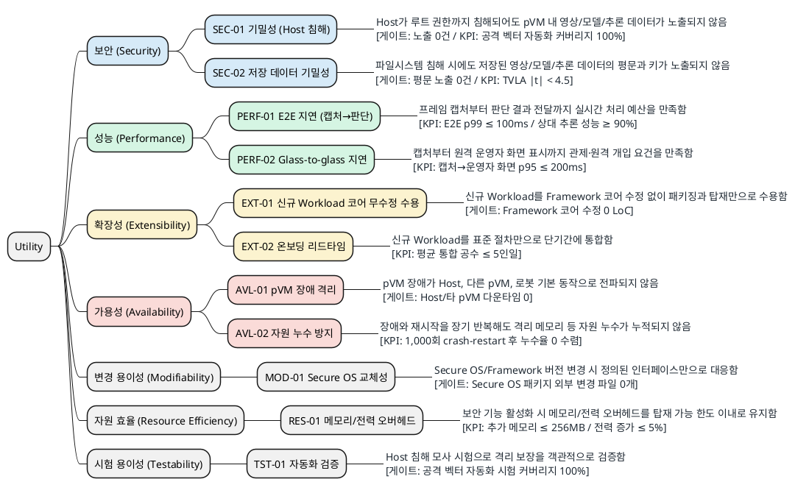

# 품질 속성 선정 및 측정 (Utility Tree)

> 본 문서는 핵심 품질 속성을 **보안/성능/확장성/가용성** 관점으로 분류하고, 변경 용이성·자원 효율·시험 용이성을 함께 Utility Tree로 구조화하여
> 각 리프 시나리오의 응답 측정치, 측정 방법, 중요도와 난이도를 정리한다.
>
> 진행 순서: 요구사항 수집 → 요구사항 도출 → **품질 속성 선정 및 측정(본 문서)** → Architectural Driver 선정

관련 문서: [`02_requirements.md`](02_requirements.md), [`03_quality_attribute_specification.md`](03_quality_attribute_specification.md), [`05_decision_points.md`](05_decision_points.md), [`99_reference_scenario_flow.md`](99_reference_scenario_flow.md), [`99_security_qa_metrics.md`](99_security_qa_metrics.md)

---

## 1. 평가 및 측정 기준

| 구분 | 기준 |
|---|---|
| 중요도 | 미충족 시 비즈니스 영향(사업 진입, 제품 출시, 사고 피해). H/M/L |
| 난이도 | 아키텍처 구조에 미치는 영향과 달성의 기술적 어려움. H/M/L |
| 게이트 | 위반 시 출하할 수 없는 불변 조건(O/X). 노출 0건, 코어 수정 0 LoC 등이 해당 |
| KPI | 달성도와 추세를 관리하는 연속 지표. 시험 커버리지, 지연, 성능 예산 소모율 등이 해당 |

> 수치 목표는 가정치이며, 로봇 제조사 협의 및 PoC 결과에 따라 보정한다.

---

## 2. Utility Tree

### 2.1 리프 시나리오 요약

| ID | 품질 속성 | 중요도 | 난이도 | 우선순위 |
|---|---|:---:|:---:|:---:|
| SEC-01 | 기밀성 (Host 침해) | **H** | **H** | 1순위 |
| PERF-01 | E2E 지연 (캡처→판단) | **H** | **H** | 2순위 |
| EXT-01 | 신규 Workload 코어 무수정 수용 | **H** | **H** | 3순위 |
| SEC-02 | 저장 데이터 기밀성 | **H** | **H** | 4순위 |
| AVL-01 | pVM 장애 격리 | **H** | M | 5순위 |
| AVL-02 | 자원 누수 방지 | **H** | M | 6순위 |
| PERF-02 | Glass-to-glass 지연 | M | M | 7순위 |
| EXT-02 | 온보딩 리드타임 | M | M | 8순위 |
| RES-01 | 메모리/전력 오버헤드 | M | M | 9순위 |
| TST-01 | 자동화 검증 | M | M | 10순위 |
| MOD-01 | Secure OS 교체성 | M | M | 11순위 |

---

## 3. 응답 측정치 및 측정 방법

### 3.1 보안 (Security)

| ID | 응답 측정치 (게이트 / KPI) | 측정 방법 | 연관 |
|---|---|---|---|
| SEC-01 | **게이트**: 노출 0건 **KPI**: 공격 벡터 자동화 커버리지 100%, TCB 규모 및 릴리스당 증가율 5% 이내, 경계 돌파 최소 공격 잠재력(CEM) 25점 이상 | pVM에 canary 마커를 주입하고 root Host에서 `/proc/kcore`, `/dev/mem`, DMA를 이용해 전체 덤프한 뒤 마커 검출 여부를 자동 판정한다. 생명주기 13단계마다 반복하고, 신뢰 코드 LoC와 침투 시험 결과를 집계한다. | QS-01, DP1 |
| SEC-02 | **게이트**: 파일시스템 침해 시 평문 노출 0건 **KPI**: 부채널 TVLA \|t\| < 4.5, 키 회전 지연 | Host 파일시스템에서 저장 blob을 덤프해 평문 패턴을 스캔하고, ENC/DEC 경로의 전력·EM 부채널을 ISO/IEC 17825 방식으로 시험한다. | QS-01, DP6 |

### 3.2 성능 (Performance)

| ID | 응답 측정치 (게이트 / KPI) | 측정 방법 | 연관 |
|---|---|---|---|
| PERF-01 | **KPI**: E2E p99 100ms 이하, 표준 모델 SingleStream 추론 지연 p90 기준 비격리 대비 상대 성능 90% 이상 | 캡처 HW 타임스탬프(PTS)를 파이프라인 끝까지 전파해 단계별 지연을 분해한다. 추론 구간은 MLPerf Inference Edge SingleStream 방식으로 측정한다. | QS-02, MLPerf |
| PERF-02 | **KPI**: 캡처→운영자 화면 p95 200ms 이하 | 화면 타임코드 캡처 방식으로 인코딩, 전송, 표시를 포함한 전체 지연을 실측한다. | 시장(관제) |

### 3.3 확장성 (Extensibility)

| ID | 응답 측정치 (게이트 / KPI) | 측정 방법 | 연관 |
|---|---|---|---|
| EXT-01 | **게이트**: Framework 코어 수정 0 LoC **KPI**: breaking change 0건 유지 | 신규 Workload 추가 전후 코어 디렉터리 diff를 CI에서 자동 검사한다. | QS-03, DP2 |
| EXT-02 | **KPI**: 신규 Workload 통합 평균 5인일 이내 | 파일럿 Workload의 개발 시작부터 통합 완료까지 실제 투입 공수를 기록해 평균을 산출한다. | 시장 |

### 3.4 가용성 (Availability)

| ID | 응답 측정치 (게이트 / KPI) | 측정 방법 | 연관 |
|---|---|---|---|
| AVL-01 | **게이트**: 장애 전파로 인한 Host/타 pVM 다운타임 0 | pVM 장애를 주입하면서 Host와 이웃 pVM의 동작 지속 여부를 확인한다. | QS-05, DP1 |
| AVL-02 | **KPI**: 1,000회 crash-restart soak 시험 후 누수율 0 수렴 | 장애와 재시작을 반복한 뒤 Framework 자원 원장과 실제 커널 상태를 대사한다. | DP1 |

### 3.5 변경 용이성 (Modifiability)

| ID | 응답 측정치 (게이트 / KPI) | 측정 방법 | 연관 |
|---|---|---|---|
| MOD-01 | **게이트**: Secure OS 패키지 외부 변경 파일 0개 | Secure OS 교체 전후 diff에서 Secure OS 패키지 외부 파일 변경 수를 계산한다. | QS-08 |

### 3.6 자원 효율 (Resource Efficiency)

| ID | 응답 측정치 (게이트 / KPI) | 측정 방법 | 연관 |
|---|---|---|---|
| RES-01 | **KPI**: 추가 메모리 256MB 이하, 전력 증가 5% 이하 | `/proc/meminfo`, cgroup 집계, PMIC 텔레메트리 또는 전력 계측 장비로 비격리 구성과 비교한다. | QS-06 |

### 3.7 시험 용이성 (Testability)

| ID | 응답 측정치 (게이트 / KPI) | 측정 방법 | 연관 |
|---|---|---|---|
| TST-01 | **게이트**: 주요 격리 요구사항별 공격 벡터 자동화 시험 커버리지 100% | 공격 벡터와 자동화 테스트 매핑표에서 미커버 항목 수를 계산하고 CI 반복 실행 가능성을 확인한다. | QS-07 |

---

## 4. 수치 근거 및 검증 성격

| ID | 수치 설정 근거 | 근거 유형 / 확보 방법 |
|---|---|---|
| SEC-01 | 노출이 1건이라도 발생하면 Host 침해 기밀성 보장이 깨지므로 임계값이 아닌 정의상 조건이다. | **불변 조건**. 공격 벡터는 GP TEE PP와 `99_security_qa_metrics.md`를 기준으로 구체화하고 PoC로 검증 |
| SEC-02 | 저장 데이터의 평문 노출 0건은 기밀성의 정의상 조건이며, TVLA 기준은 ISO/IEC 17825를 따른다. | **불변 조건 + 표준 기준**. 저장 blob 분석과 전력·EM 계측으로 검증 |
| PERF-01 | 제어 판단의 실시간성을 위한 초기 E2E 예산과 고객 비교가 가능한 MLPerf 방식을 함께 적용한다. | **가정치 + 산업 벤치마크**. 제조사 협의와 PoC 결과로 보정 |
| PERF-02 | 인코딩·전송·표시를 포함한 원격 관제의 상호작용 한계를 초기 목표로 설정한다. | **시장 기준**. 상품 환경의 네트워크 조건별 실측으로 보정 |
| EXT-01 | 플러그인 아키텍처에서 신규 Workload 수용 시 코어 무수정은 정의상 조건이다. | **불변 조건**. 코어 경계를 설계 단계에서 명시하고 CI diff로 검증 |
| EXT-02 | 반복 가능한 표준 온보딩 절차의 초기 생산성 목표다. | **가정치**. 파일럿별 실제 투입 공수로 보정 |
| AVL-01 | pVM 장애 격리 주장이 성립하기 위한 최소 조건이다. | **불변 조건**. 장애 주입 PoC로 검증 |
| AVL-02 | 장기 반복 운용에서 자원 누수가 누적되지 않음을 확인하기 위한 soak 기준이다. | **가정치**. 반복 횟수와 허용 오차는 PoC 결과로 보정 |
| MOD-01 | OS 교체성은 정의된 인터페이스 밖의 재이식이 없어야 성립한다. | **불변 조건**. GP TEE API 등 표준 인터페이스 준수 여부를 확인 |
| RES-01 | AVF pVM의 공개 운용 규모와 제품 배터리 예산을 기준으로 한 초기 목표다. | **가정치**. SoC 예산표와 PoC 전력 프로파일링으로 보정 |
| TST-01 | 미커버 공격 벡터가 있으면 격리 보장에 대한 객관적 검증 주장이 성립하지 않는다. | **불변 조건**. 공격 벡터-자동화 테스트 매핑과 CI 반복 실행으로 검증 |

---

## 5. 근거 출처

- [Latency in live network video surveillance (Axis 백서)](https://whitepapers.axis.com/en-us/latency-in-live-network-video-surveillance) — 감시 영상 지연 구성 요소
- [Glass-to-glass 지연 측정 (Vay)](https://vay.io/how-to-measure-glass-to-glass-video-latency/) — 원격 제어 200ms 요건
- MLPerf Inference (Edge, SingleStream) — 엣지 AI 추론 지연 벤치마크 방법론
- ISO/IEC 17825 (TVLA) / FIPS 140-3 — 부채널 누출 판정 기준
