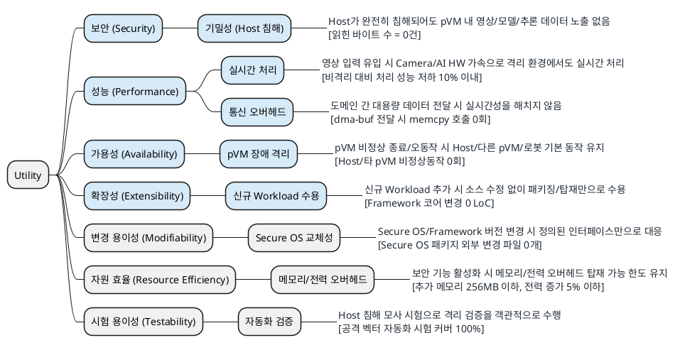

# 품질 속성 선정 (Utility Tree)

> 본 문서는 `02_requirements.md`의 QA-01~QA-08을 ATAM Utility Tree로 구조화하고, 각 리프 시나리오를 (중요도, 난이도)로 평가하여 **핵심 품질 속성**을 선정한다.
>
> 진행 순서: 요구사항 수집 → 요구사항 도출 → **품질 속성 선정(본 문서)** → Architectural Driver 선정

관련 유즈케이스 명세는 [`01_use_case_spec.md`](01_use_case_spec.md) 참조.

---

## 1. 평가 기준

| 축 | 기준 |
|----|------|
| 중요도 | 미충족 시 비즈니스 영향 (사업 진입/제품 출시/사고 피해). H/M/L |
| 난이도 | 아키텍처 구조에 미치는 영향과 달성의 기술적 어려움. H/M/L |

> 수치 목표는 가정치이며, 로봇 제조사 협의 및 PoC 결과에 따라 보정한다.

---

## 2. Utility Tree

### 2.1 응답 측정치 상세와 수치 근거

각 리프 시나리오의 응답 측정치에 대해 측정 방법, 수치 설정 근거, 근거의 성격을 정리한다.

| QA | 응답 측정치 | 측정 방법 | 수치 설정 근거 | 근거 유형 / 확보 방법 |
|----|------------|----------|---------------|---------------------|
| QA-01 | 격리 메모리 노출 0건 | `/dev/mem`, KVM 인터페이스 오용, 페이지 테이블 조작 등 Host 침해 테스트 시험에서 pVM 소유 메모리 읽기 여부 확인 | 노출이 1건이라도 있으면 Host 침해 기밀성 보장이 깨지므로 임계값이 아니라 정의상 조건 | **불변 조건**. 공격 벡터는 GP TEE PP 및 `99_security_qa_metrics.md` 기준으로 구체화 |
| QA-02 | 비격리 대비 처리 성능 저하 10% 이내 | 동일 HW에서 비격리 구성과 격리 구성의 fps/E2E 지연을 비교 | KVM 계열 가상화의 I/O 경로 오버헤드가 문헌상 통상 5~15%로 보고되는 범위에서 제품 기능 유지 상한으로 설정 | **가정치**. PoC 결과와 제조사 협의로 보정 |
| QA-03 | Framework 코어 수정 0 LoC | 신규 Workload 추가 전후 diff에서 Framework 코어 모듈 변경 라인 수를 카운트 | 플러그인 아키텍처의 정의상 코어 무수정을 요구 | **불변 조건**. 설계 단계에서 “코어” 경계를 명시 |
| QA-04 | 도메인 간 dma-buf 버퍼 전달 시 memcpy 호출 0회 | dma-buf 등 버퍼 전달 시 복사 횟수를 계측 | 대용량 데이터 전달 경로에서 복사가 발생하면 zero-copy 목표가 깨지고 실시간성 저하 위험이 커짐 | **불변 조건**. 코드 확인과 PoC 계측으로 검증 |
| QA-05 | Host/타 pVM 비정상 동작 0회 | 장애 주입시 타 도메인 영향 여부 확인 | pVM 장애 격리 주장의 최소 조건 | **불변 조건**. 장애 주입 PoC로 보정 |
| QA-06 | 추가 메모리 256MB 이하, 전력 증가 5% 이내 | `/proc/meminfo`, cgroup 집계, PMIC 텔레메트리 또는 전력 계측 장비로 비교 | AVF pVM의 공개 운용 규모와 제품 배터리 예산을 기준으로 한 초기 목표 | **가정치**. SoC 예산표와 PoC 전력 프로파일링으로 보정 |
| QA-07 | 주요 격리 요구사항 자동화 시험 커버 100% | 공격 벡터와 자동화 테스트 매핑표에서 미커버 항목 수를 카운트 | 미커버 항목이 있으면 객관적 검증 주장이 성립하지 않음 | **불변 조건**. CI 반복 실행 가능성 포함 |
| QA-08 | Secure OS 패키지 외부 변경 파일 0개 | Secure OS 교체 전후 diff에서 Secure OS 패키지 외부 파일 변경 수를 카운트 | OS 교체성 주장이 성립하려면 인터페이스 외 재이식이 없어야 함 | **불변 조건**. GP TEE API 등 표준 인터페이스 준수 여부 확인 |

---

## 3. 리프 시나리오 평가

### 3.1 리프 시나리오 평가 요약

| ID | 품질 속성 | 중요도 | 난이도 | 우선순위 |
|----|----------|:------:|:------:|:--------:|
| QA-01 | 보안 (Host 침해 기밀성) | **H** | **H** | 1순위 |
| QA-02 | 성능 (실시간 처리) | **H** | **H** | 2순위 |
| QA-03 | 확장성 (Workload 수용) | **H** | **H** | 3순위 |
| QA-04 | 성능 (통신 오버헤드) | **H** | M | 4순위 |
| QA-05 | 가용성 (pVM 장애 격리) | **H** | M | 5순위 |
| QA-06 | 자원 효율 | M | M | 6순위 |
| QA-07 | 시험 용이성 (격리 검증) | M | M | 7순위 |
| QA-08 | 변경 용이성 (Secure OS 교체) | M | M | 8순위 |

### 3.2 리프 시나리오 평가 상세

| ID | 품질 속성 | 요구사항 | 중요도 | 난이도 | 우선순위 |
|----|----------|---------|:------:|:------:|:--------:|
| QA-01 | 보안 (Host 침해 기밀성) | Host가 완전히 침해되어도 pVM 내 영상/모델/추론 데이터는 노출되지 않는다. `[침해 테스트 시험에서 pVM 소유 메모리로부터 읽힌 바이트 수 = 0건]` | **H** | **H** | 1순위 |
| QA-02 | 성능 (실시간 처리) | 영상 입력이 유입될 때 Camera/AI HW 가속으로 격리 환경에서도 실시간 처리 속도를 만족한다. `[전체 파이프라인에 대해서 (비격리 fps - 격리 fps) / 비격리 fps <= 10%]` | **H** | **H** | 2순위 |
| QA-03 | 확장성 (Workload 수용) | 신규 Workload 추가 시 소스 수정 없이 패키징/탑재만으로 수용된다. `[Workload 추가 전후 diff에서 Framework 변경 라인 수 = 0 LoC]` | **H** | **H** | 3순위 |
| QA-04 | 성능 (통신 오버헤드) | 도메인 간 대용량 데이터 전달 시 통신 오버헤드가 실시간성을 해치지 않는다. `[도메인 간 dma-buf 버퍼 전달 시 memcpy 호출 횟수 = 0회]` | **H** | M | 4순위 |
| QA-05 | 가용성 (pVM 장애 격리) | pVM이 비정상 종료/오동작해도 Host/다른 pVM 동작은 유지된다. `[Host/다른 VM 비정상 동작 없음 (비정상 동작 0회)]` | **H** | M | 5순위 |
| QA-06 | 자원 효율 | 보안 기능 활성화 시 메모리/전력 오버헤드가 탑재 가능 한도 이내로 유지된다. `[(격리 메모리 - 비격리 메모리) <= 256MB, (격리 전력 - 비격리 전력) / 비격리 전력 <= 5%]` | M | M | 6순위 |
| QA-07 | 시험 용이성 (격리 검증) | 격리 검증이 필요할 때 Host 침해를 모사한 시험으로 객관적으로 검증할 수 있다. `[(전체 공격 벡터 항목 - 미커버 항목) / 전체 항목 = 100%]` | M | M | 7순위 |
| QA-08 | 변경 용이성 (Secure OS 교체) | Secure OS/Framework 버전이 변경될 때 정의된 인터페이스만으로 대응하고 재이식하지 않는다. `[Secure OS 교체 전후 diff에서 Secure OS 패키지 외부 변경 파일 수 = 0개]` | M | M | 8순위 |
