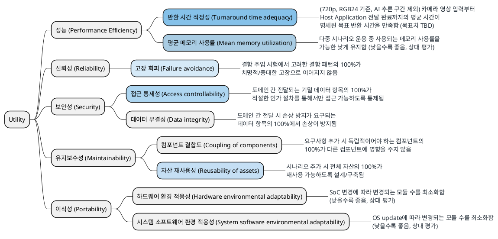

# 품질 속성 선정 및 측정 (Utility Tree)

> 본 문서는 핵심 품질 속성을 ISO/IEC 25010 품질 모델에 따라 **성능/신뢰성/보안성/유지보수성/이식성**의 5개 품질 특성과 8개 부특성으로 분류하고,
> 각 리프 지표의 측정 함수(ISO/IEC 25023), KPI, 중요도와 난이도, 우선순위를 Utility Tree로 구조화하여 정리한다.
>
> 진행 순서: 요구사항 수집 → 요구사항 도출 → **품질 속성 선정 및 측정(본 문서)** → Architectural Driver 선정

관련 문서: [`02_requirements.md`](02_requirements.md), [`03_quality_attribute_specification.md`](03_quality_attribute_specification.md), [`05_decision_points.md`](05_decision_points.md), [`99_ios_standard.md`](99_ios_standard.md), [`99_reference_scenario_flow.md`](99_reference_scenario_flow.md)

---

## 1. 평가 및 측정 기준

| 구분 | 기준 |
|---|---|
| 품질 특성/부특성 | ISO/IEC 25010:2023 품질 모델의 품질 특성과 부특성에 매핑한다 |
| 측정 함수 | ISO/IEC 25023의 측정 지표(측정 함수)를 우선 적용한다. 지표 ID는 `99_ios_standard.md`를 따른다 |
| 중요도 | 미충족 시 비즈니스 영향(사업 진입, 제품 출시, 사고 피해). H/M/L |
| 난이도 | 아키텍처 구조에 미치는 영향과 달성의 기술적 어려움. H/M/L |
| 우선순위 | 중요도와 난이도 평가를 종합하여 상위 5개 지표에 1~5순위를 부여한다. 나머지는 미부여(-) |

> 수치 목표는 협의 및 PoC 결과에 따라 보정한다.

---

## 2. Utility Tree

> 파란색 배경 노드는 우선순위 1~5 지표이며, 진할수록 우선순위가 높다 (1순위 가장 진함).

### 2.1 리프 지표 요약

| ID | 품질 속성 | 부특성 | 지표명 | 중요도 | 난이도 | 우선순위 |
|---|---|---|---|:---:|:---:|:---:|
| PERF-01 | 성능 | 시간 반응성 | 반환 시간 적정성 (Turnaround time adequacy) | **H** | **H** | 1 |
| PERF-02 | 성능 | 자원 활용성 | 평균 메모리 사용률 (Mean memory utilization) | **H** | **H** | 2 |
| SEC-01 | 보안성 | 기밀성 | 접근 통제성 (Access controllability) | **H** | M | 3 |
| MNT-02 | 유지보수성 | 재사용성 | 자산 재사용성 (Reusability of assets) | **H** | M | 4 |
| REL-01 | 신뢰성 | 결함 허용성 | 고장 회피 (Failure avoidance) | **H** | M | 5 |
| SEC-02 | 보안성 | 무결성 | 데이터 무결성 (Data integrity) | **H** | L | - |
| MNT-01 | 유지보수성 | 모듈성 | 컴포넌트 결합도 (Coupling of components) | M | M | - |
| PORT-01 | 이식성 | 적응성 | 하드웨어 환경 적응성 (Hardware environmental adaptability) | M | M | - |
| PORT-02 | 이식성 | 적응성 | 시스템 소프트웨어 환경 적응성 (System software environmental adaptability) | M | M | - |

---

## 3. 측정 지표 및 측정 방법

### 3.1 성능 (Performance Efficiency)

| ID | 부특성 | 지표명 (ISO 25023) | 설명 | 측정 함수 및 방법 |
|---|---|---|---|---|
| PERF-01 | 시간 반응성 | 반환 시간 적정성 (Turnaround time adequacy) [PTb-4-S] | (720p, RGB24 기준, AI 추론 구간 제외) 카메라 영상 입력부터 Host Application 전달 완료까지의 평균 시간(ms)이 명세된 목표 반환 시간을 만족해야 한다 (목표치 TBD, 협의 필요). | X = A/B. A: 실측 평균 반환 시간, B: 명세된 목표 반환 시간 |
| PERF-02 | 자원 활용성 | 평균 메모리 사용률 (Mean memory utilization) [PRu-2-G] | 다중 시나리오가 운용 중일 때 사용되는 메모리 사용률을 가능한 낮게 유지해야 한다 (낮을수록 좋음, 상대 평가). | X = Σ(Ai/Bi)/n. Ai: 실제 사용한 메모리 크기, Bi: 가용 메모리 크기. 낮을수록 좋음 |

### 3.2 신뢰성 (Reliability)

| ID | 부특성 | 지표명 (ISO 25023) | 설명 | 측정 함수 및 방법 |
|---|---|---|---|---|
| REL-01 | 결함 허용성 | 고장 회피 (Failure avoidance) [RFt-1-G] | 결함 주입 시험에서 고려한 결함 패턴의 100%가 치명적/중대한 고장으로 이어지지 않도록 통제되어야 한다. | X = A/B. A: 치명적/중대한 고장으로 이어지지 않도록 통제된 결함 패턴 수, B: 고려한 결함 패턴 수. 결함 주입 시험 등으로 측정 |

### 3.3 보안성 (Security)

| ID | 부특성 | 지표명 (ISO 25023) | 설명 | 측정 함수 및 방법 |
|---|---|---|---|---|
| SEC-01 | 기밀성 | 접근 통제성 (Access controllability) [SCo-1-G] | 도메인 간 전달되는 기밀 데이터 항목의 100%가 적절한 인가 절차를 통해서만 접근 가능하도록 통제되어야 한다. | X = A/B. A: 적절한 인가 절차를 통해서만 접근 가능하도록 통제된 기밀 데이터 항목 수, B: 접근 통제가 요구되는 기밀 데이터 항목 수 |
| SEC-02 | 무결성 | 데이터 무결성 (Data integrity) [SIn-1-G] | 도메인 간 전달 시 손상 방지가 요구되는 데이터 항목의 100%에서 손상(corruption)이 방지되어야 한다. | X = A/B. A: 손상(corruption)이 방지된 데이터 항목 수, B: 손상 방지가 요구되는 데이터 항목 수 |

### 3.4 유지보수성 (Maintainability)

| ID | 부특성 | 지표명 (ISO 25023) | 설명 | 측정 함수 및 방법 |
|---|---|---|---|---|
| MNT-01 | 모듈성 | 컴포넌트 결합도 (Coupling of components) [MMo-1-G] | 요구사항 추가 시 독립적이어야 하는 컴포넌트의 100%가 다른 컴포넌트에 영향을 주지 않아(수정되지 않아)야 한다. | X = A/B. A: 다른 컴포넌트에 영향을 주지 않는(독립적인) 컴포넌트 수, B: 독립적이어야 하는 컴포넌트 수 |
| MNT-02 | 재사용성 | 자산 재사용성 (Reusability of assets) [MRe-1-G] | 시나리오 추가 시 전체 자산의 100%가 재사용 가능하도록 설계/구축되어야 한다. | X = A/B. A: 재사용 가능하도록 설계/구축된 자산 수, B: 전체 자산 수 |

### 3.5 이식성 (Portability)

| ID | 부특성 | 지표명 (ISO 25023) | 설명 | 측정 함수 및 방법 |
|---|---|---|---|---|
| PORT-01 | 적응성 | 하드웨어 환경 적응성 (Hardware environmental adaptability) [PAd-1-G] | SoC 변경에 따라 변경되는 모듈 수를 최소화하여 새 하드웨어 환경에서 미달 기능 비율을 가능한 낮게 유지해야 한다 (낮을수록 좋음, 상대 평가). | X = 1 − A/B. A: 새 하드웨어 환경에서 과업을 완료하지 못했거나 요구 수준에 미달한 기능 수, B: 새 하드웨어 환경에서 시험한 기능 수 |
| PORT-02 | 적응성 | 시스템 소프트웨어 환경 적응성 (System software environmental adaptability) [PAd-2-S] | OS update에 따라 변경되는 모듈 수를 최소화하여 새 시스템 소프트웨어 환경에서 미달 기능 비율을 가능한 낮게 유지해야 한다 (낮을수록 좋음, 상대 평가). | X = 1 − A/B. A: 새 OS/미들웨어 등 시스템 소프트웨어 환경에서 과업을 완료하지 못한 기능 수, B: 시험한 기능 수 |

---

## 4. 근거 출처

- ISO/IEC 25010:2023 (System and software quality models) — 품질 특성/부특성 분류 기준
- ISO/IEC 25023 (Measurement of system and software product quality) — 측정 함수 및 지표 ID
- [`99_ios_standard.md`](99_ios_standard.md) — 본 프로젝트의 ISO 25010/25023 조사 정리 문서 (지표 ID 표기 기준)
