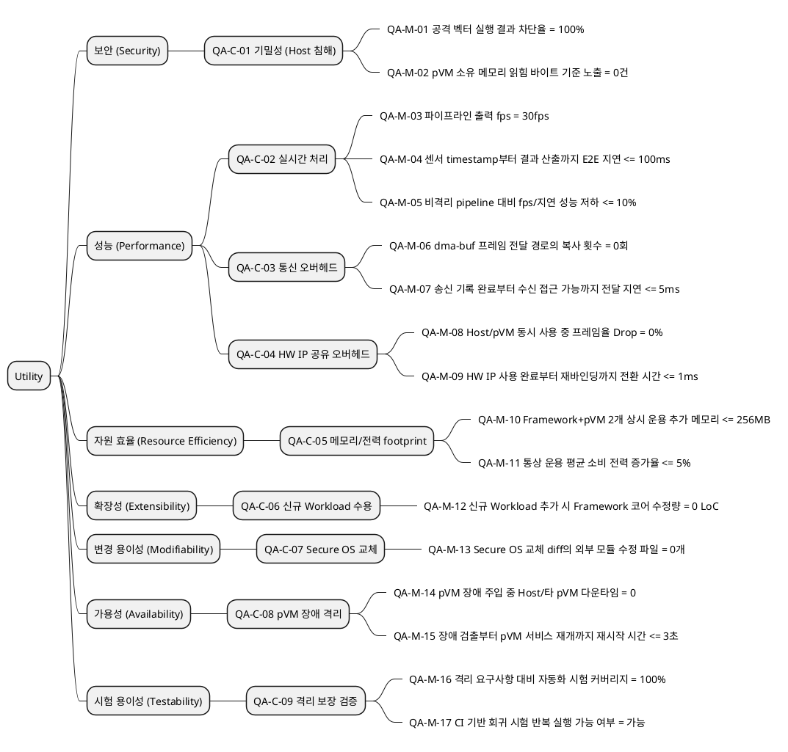

# 1. Utility Tree

# 2. 응답 측정치 상세와 수치 근거

각 리프 시나리오의 응답 측정치에 대해 측정 방법, 수치 설정 근거, 근거의 성격을 정리한다. 근거 유형은 세 가지로 구분한다.

- **불변 조건**: 임계값이 아니라 해당 품질 주장이 성립하기 위한 정의상의 조건 (0건/0 LoC/100% 등). 다른 값을 목표로 삼는 것 자체가 무의미하므로 객관적이다.
- **표준/문헌**: 산업 표준, UX/HCI 기준, 가상화 성능 문헌 등 외부 근거가 있는 값이다.
- **가정치**: 현재 단계에서 PoC와 제조사 협의로 확정해야 하는 초기 목표값이다.

| QA-C ID | QA-M ID | 응답 측정치 | 측정 방법 | 수치 설정 근거 | 근거 유형 / 확보 방법 |
|---------|---------|------------|----------|---------------|---------------------|
| QA-C-01 | QA-M-01 | 공격 벡터 차단율 100% | Host 루트 권한 침해 테스트 도구로 공격 벡터를 전 항목 실행하고, 차단된 항목 비율을 산출 | 보안 속성은 부분 달성이 무의미하며, 식별된 공격 전부 차단이 합격 기준 | **불변 조건**. 공격 벡터는 GP TEE PP 공격 목록과 Android VRP의 pKVM Boundary Defeat 사례를 기준으로 구성 (`99_security_qa_metrics.md` 참조) |
| QA-C-01 | QA-M-02 | 격리 메모리 노출 0건 | 공격 실행 중 pVM 소유 메모리에서 실제로 읽힌 바이트와 노출 이벤트 수를 계측 | 단 1건의 노출로 기밀성 침해가 성립하므로 목표값은 0건이어야 함 | **불변 조건**. 공격 벡터의 완전성을 GP TEE PP 기준으로 보강 |
| QA-C-02 | QA-M-03 | 30fps 유지 | 파이프라인 출구에서 초당 처리 프레임 수를 카운트하고 이동 평균으로 지속 유지 여부를 판정 | 30fps는 카메라/영상 산업의 표준 기본 프레임율이며 레퍼런스 시나리오의 센서 출력 규격 | **표준**. 타겟 카메라 센서 데이터시트로 확정 |
| QA-C-02 | QA-M-04 | E2E 지연 100ms 이하 | 센서 timestamp와 판단 결과 산출 시각의 차이를 프레임별 계측하고 p99로 평가 | HCI 기준에서 0.1초는 즉각 반응으로 인지되는 상한 | **문헌 + 가정치**. 로봇 제조사의 인지-행동 루프 요구 지연으로 보정 |
| QA-C-02 | QA-M-05 | 비격리 대비 성능 저하 10% 이내 | 동일 HW에서 비격리 pipeline과 격리 구성의 fps/지연을 비교 | KVM 계열 가상화의 I/O 경로 오버헤드가 문헌상 통상 5~15%로 보고되는 범위에서 상한 설정 | **가정치**. PoC 실측 뒤 제조사 협의로 보정 |
| QA-C-03 | QA-M-06 | 프레임 전달 복사 횟수 0회 | dma-buf 등 버퍼 전달 경로에서 코드 경로와 trace로 복사 횟수를 확인 | zero-copy 주장을 만족하려면 프레임 데이터 복사가 없어야 함 | **불변 조건**. 타겟 보드에서 dma-buf 전달 경로 검증 |
| QA-C-03 | QA-M-07 | 도메인 간 프레임당 전달 지연 5ms 이하 | 송신 도메인 기록 완료 시각과 수신 도메인 접근 가능 시각의 차이를 계측 | 30fps 프레임 예산 33.3ms 중 약 15%를 전달 단계에 배분한 값 | **산술 도출 + 가정치**. memcpy/dma-buf 마이크로벤치마크로 검증 |
| QA-C-04 | QA-M-08 | 기존 프레임율 유지, Drop 0% | Host 일반 촬영과 보안 파이프라인을 동시 실행하며 양측의 프레임 drop 수를 카운트 | 프레임 drop은 사용자 체감 기능 실패와 실시간성 위반으로 이어지므로 0%가 기능 성립 조건 | **불변 조건**. 순간 부하의 예외 허용 여부는 제조사와 협의 |
| QA-C-04 | QA-M-09 | 사용 주체 전환 1ms 이하 | 사용 완료 확인, 잔류 데이터 소거, S2MPU 재설정, 재바인딩 구간의 소요 시간을 계측 | 33.3ms 프레임 간격의 약 3%로, 전환이 프레임 스케줄에 영향을 주지 않도록 배분 | **산술 도출 + 가정치**. 전환 시퀀스 마이크로벤치마크로 보정 |
| QA-C-05 | QA-M-10 | 추가 메모리 256MB 이하 | Framework+pVM 2개 상시 운용 상태와 비격리 구성의 시스템 메모리 사용량 차이를 계측 | AVF Microdroid pVM이 통상 128~256MB급으로 운용되는 공개 구성 사례를 기준으로 추정 | **유사 시스템 참조 + 가정치**. 타겟 SoC 메모리 예산표로 확정 |
| QA-C-05 | QA-M-11 | 전력 증가 5% 이내 | 전력 계측 장비 또는 PMIC 텔레메트리로 통상 운용 평균 소비 전력을 비교 | 현재 객관적 근거가 부족하므로 제품 배터리 가동시간 요구에서 역산해야 함 | **가정치**. PoC 전력 프로파일링으로 보정 |
| QA-C-06 | QA-M-12 | Framework 코어 수정 0 LoC | 신규 Workload 추가 전후 git diff에서 Framework 코어 모듈 변경 라인 수를 카운트 | 플러그인 아키텍처의 개방-폐쇄 원칙상 코어 무수정이 목표 조건 | **불변 조건**. 코어 경계를 설계 단계에서 명시 |
| QA-C-07 | QA-M-13 | Secure OS 외 모듈 수정 파일 0개 | Secure OS 교체 작업 diff에서 Secure OS 패키지 외부 변경 파일 수를 카운트 | 인터페이스 추상화 목표의 정의상 Secure OS 외부 변경이 없어야 함 | **불변 조건**. 후보 Secure OS의 GP TEE API 준수 여부를 사전 확인 |
| QA-C-08 | QA-M-14 | Host/타 pVM 다운타임 0 | pVM 강제 kill, 게스트 커널 panic 등 장애 주입 중 Host 서비스와 타 pVM 응답 중단 시간을 계측 | 격리 구조의 정의상 장애 비전파가 성립해야 함 | **불변 조건** |
| QA-C-08 | QA-M-15 | 장애 pVM 재시작 3초 이내 | 장애 검출 시각부터 pVM 재시작 완료와 Workload 서비스 재개 시각까지 계측 | AVF pVM(Microdroid) 부팅이 초 단위로 보고되는 점에 기반한 초기 목표 | **가정치**. PoC 부팅 시간과 서비스 허용 중단 시간으로 확정 |
| QA-C-09 | QA-M-16 | 자동화 시험 커버리지 100% | 격리 요구사항별 공격 벡터와 자동화 테스트의 매핑표를 작성하고 미커버 항목 수를 카운트 | 시험되지 않은 격리 주장 항목이 있으면 검증 완료 주장이 성립하지 않음 | **불변 조건**. GP TEE PP 공격 목록을 기준으로 커버리지 분모 확보 |
| QA-C-09 | QA-M-17 | 회귀 반복 실행 가능 | CI에서 동일 공격/격리 테스트가 반복 실행 가능한지 확인 | 격리 보장은 반복 가능한 회귀 검증 체계가 있어야 유지 가능 | **불변 조건**. CI 실행 로그와 테스트 결과로 확인 |
