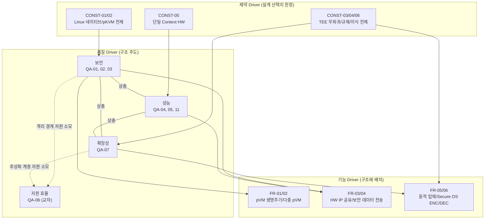

# Architectural Driver 선정

> 본 문서는 요구사항 분석의 마지막 단계로, `02_requirements.md`(FR/CONST)와 `03_quality_attribute_workshop.md`(핵심 QA)를 입력으로 아키텍처 설계를 주도할 **Architectural Driver(AD)** 를 선정한다.
> 진행 순서: 요구사항 수집 → 요구사항 도출 → 품질 속성 선정(QAW) → **Architectural Driver 선정(본 문서)**
>
> 기능 Driver(FR)와 대응하는 유즈케이스 명세는 [`01_use_case_spec.md`](01_use_case_spec.md) 참조.

---

## 1. 선정 기준

Architectural Driver는 아키텍처 구조(컴포넌트 분할, 신뢰 경계, 인터페이스, 데이터 경로)를 형성하는 요구사항으로, 다음 원칙에 따라 선정한다.

| 구분 | 선정 원칙 |
|------|----------|
| **FR (기능)** | 전체 FR 중 **구조 결정성이 높은 중요 FR을 선별**하여 선정한다. 구조에 영향 없이 상위 구조 안에서 구현 가능한 FR은 제외한다. |
| **QA (품질)** | QAW에서 선정된 **핵심 QA(1/2순위)** 를 선정한다. 3순위 QA는 구조 결정 후 설계/검증 단계에서 충족을 확인한다. |
| **CONST (제약)** | **전체를 선정**한다. 제약은 협상 불가능한 전제로서 모든 설계 결정의 선택지를 한정하기 때문이다. |

---

## 2. 기능 Driver 선정 (FR)

FR-01~FR-06을 구조 결정성 기준으로 평가한다.

| ID | 요구사항 | 관련 UC | 선정 | 판정 사유 |
|----|---------|---------|:----:|----------|
| FR-01 | pVM 생성/시작/정지/종료 | UC-01 | **선정** | Framework 본체(Middleware/드라이버)의 책임 분할과 컴포넌트 경계를 결정 |
| FR-02 | 다중 pVM 동시 운용 | UC-02 | **선정** | 다중 도메인 구조(도메인 단위 독립 관리)를 강제. TrustZone 이진 구조와의 차별화 지점 |
| FR-03 | Camera/AI HW 공유 사용 | UC-03 | **선정** | HW IP 중재 계층이라는 신규 구조 요소를 강제. 중재자의 위치(Host 커널/전용 pVM)가 전체 구조를 좌우 |
| FR-04 | 도메인 간 보안 데이터 전송 | UC-04 | **선정** | 도메인 간 데이터 경로(공유 메모리/RPC 채널) 구조와 격리 영역 내 데이터 유지 규칙을 결정 |
| FR-05 | 보안 Workload 동적 탑재 | UC-05 | **선정** | 플러그인형 패키징/로딩 구조와 패키지 검증 체계를 강제 |
| FR-06 | Secure OS ENC/DEC 명령 전송 | UC-06 | **선정** | Framework-게스트 간 ABI(부팅 규약, 가상 디바이스, 통신 규약) 고정 및 pVM→TEE 요청 라우팅(SMC 포워딩)과 기존 경로 무회귀를 만족하는 연동 계층을 결정 |

**선정 결과: FR-01, FR-02, FR-03, FR-04, FR-05, FR-06 (6건)**

---

## 3. 품질 Driver 선정 (QA)

QAW(`03_quality_attribute_workshop.md`)의 우선순위 평가 결과를 따른다.

| ID | 품질 속성 (시나리오) | QAW 순위 | 선정 | 판정 사유 |
|----|---------------------|:--------:|:----:|----------|
| QA-01 | 보안 — Host 침해 기밀성 (QS-01) | 1순위 | **선정** | 신뢰 경계를 결정하는 최상위 driver. 신뢰 주체는 EL2(pKVM)뿐이며 Host 측 Framework도 비신뢰 영역으로 설계 |
| QA-02 | 보안 — 도메인 간 격리 (QS-02) | 2순위 | **선정** | 다중 도메인 신뢰 모델의 전제. 보안 채널 경계 설계를 결정 |
| QA-03 | 보안 — DMA 경로 격리 (QS-03) | 1순위 | **선정** | HW 가속과 격리의 동시 성립 조건. SMMU 제어/잔류 데이터 소거 구조를 결정 |
| QA-04 | 성능 — 실시간 처리 (QS-04) | 1순위 | **선정** | 격리 경계 통과 최소화, 데이터/제어 경로 분리 등 데이터 경로 구조를 결정 |
| QA-05 | 성능 — 통신 오버헤드 (QS-05) | 2순위 | **선정** | zero-copy 공유 메모리 채널과 격리 보장의 양립 구조를 결정 |
| QA-06 | 자원 효율 (QS-06) | 2순위 | **선정** | 가격 경쟁력에 직결되는 자원 제약(VOS-04). 격리 경계/추상화 계층의 메모리/전력 footprint를 탑재 한도 이내로 최소화하도록 강제하는 교차 관심사 |
| QA-07 | 확장성 — Workload 수용 (QS-07) | 1순위 | **선정** | 과제 핵심 키워드. 플러그인 구조와 인터페이스 계약의 안정성을 강제 |
| QA-08 | 변경 용이성 — Secure OS 교체 (QS-08) | 3순위 | 제외 | 표준 GP(GlobalPlatform) TEE API 지원만으로 교체 가능. QA-07 확장 구조/FR-06(Secure OS 실행) 위에서 충족되며 독자적 구조 결정 없음 |
| QA-09 | 가용성 (QS-09) | 3순위 | 제외 | 격리 구조가 장애 전파를 1차 차단. 생명주기 관리(FR-01) 설계 안에서 대응 |
| QA-10 | 시험 용이성 (QS-10) | 3순위 | 제외 | 침해 모사 도구/시험 훅은 구조 결정 후 검증 설계에서 대응 |
| QA-11 | 성능 — HW IP 공유 오버헤드 (QS-11) | 1순위 | **선정** | 단일 Context HW의 SW 중재에서 보안/성능이 동시에 걸리는 본 과제 고유의 난제 |

**선정 결과: QA-01, QA-02, QA-03, QA-04, QA-05, QA-06, QA-07, QA-11 (8건)**

---

## 4. 제약 Driver 선정 (CONST)

제약사항은 협상 불가능한 설계 전제이므로 **전체(CONST-01~CONST-06)를 driver로 선정**한다.

| ID | 제약사항 | 구조 영향 |
|----|---------|----------|
| CONST-01 | Linux 네이티브 | Android 스택(VirtualizationService 등) 의존 컴포넌트 사용 불가. 표준 Linux 인터페이스(KVM ioctl, VFIO, dma-buf 등) 기반 설계 강제 |
| CONST-02 | pKVM 커널 전제 (EL2 수정 불가) | 모든 격리/할당 기능을 제공되는 hypercall 범위 안에서 실현. HV 파트와의 조기 인터페이스 확정이 설계 착수 조건 |
| CONST-03 | 기존 TEE 경로 무회귀 | 기존 SMC 경로를 우회하지 않는 연동 계층 배치 강제. TrustZone 공존 구조(FR-08)의 전제 |
| CONST-04 | 규제 준수 (기술적 격리 증빙) | 격리 보장을 증빙 가능한 형태(문서화/시험 가능)로 설계해야 함. 검증 구조와 연계 |
| CONST-05 | 타겟 HW (단일 Context HW IP, HW 변경 불가) | HW IP 공유를 HW 가상화 없이 SW 중재로만 실현해야 함. FR-03/QA-11 해법의 선택지를 한정 |
| CONST-06 | Secure OS 신규 개발 제외 | 기존 Secure OS의 이식/수정을 전제로 한 게스트 실행 환경(FR-06) 설계 강제 |

---

## 5. Architectural Driver 종합

선정된 driver는 총 **20건** (FR 6 + QA 8 + CONST 6)이다.

| 구분 | 선정 Driver | 제외 |
|------|------------|------|
| 기능 (FR) | FR-01, FR-02, FR-03, FR-04, FR-05, FR-06 | - |
| 품질 (QA) | QA-01, QA-02, QA-03, QA-04, QA-05, QA-06, QA-07, QA-11 | QA-08, QA-09, QA-10 |
| 제약 (CONST) | CONST-01~CONST-06 (전체) | — |

### 5.1 Driver 간 관계

제약 driver가 설계 선택지를 한정하고, 그 위에서 품질 driver가 구조를 주도하며, 기능 driver가 구조에 배치된다. 품질 driver 간에는 QAW에서 식별한 상충(보안↔성능↔확장성)이 존재한다.

### 5.2 설계 착수 순서

설계 착수 순서는 `00_overview.md` 6.3절의 핵심 개발 기술(T-1~T-5)과 연계하여 정한다. 각 단계에서 해당 핵심 기술의 Design Point를 추출하며, 이는 6.3절의 Bottom-up 설계 접근(Design Point 추출 → 핵심 DP 선정)과 연결된다.

| 순서 | 작업 | 관련 Driver | 핵심 기술 |
|:----:|------|------------|----------|
| 1 | 신뢰 모델 확정 — TCB 범위(Host 측 Framework의 TCB 제외 여부), 공격자 모델, 보호 범위(기밀성/무결성 보장 / 가용성 제외 등) 결정 | QA-01, QA-02, CONST-02 | T-1~T-5 공통 전제 (특히 T-1의 책임 배치 결정) |
| 2 | 생명주기/다중 pVM 관리 골격 설계 | FR-01, FR-02, QA-06, CONST-01 | T-1 |
| 3 | HW IP 중재 구조 실현 가능성 검증 (PoC) | FR-03, QA-03, QA-11, CONST-05 | T-2 |
| 4 | 통신/데이터 경로(zero-copy 보안 채널) 구조 설계 | FR-04, QA-04, QA-05 | T-3 |
| 5 | 보안 Workload 실행 방식 결정 | FR-05, QA-07, CONST-06 | T-4 |
| 6 | Secure OS 실행 환경 및 TrustZone 연동 구조 배치 | FR-06, CONST-03, CONST-06 | T-4/T-5 |

> 순서 1(신뢰 모델 확정)은 어느 단일 핵심 기술에도 속하지 않는 전역 설계 결정으로, 모든 핵심 기술의 구조 선택지(예: T-2 중재자의 배치 위치)에 영향을 미친다. 산출물인 신뢰 모델 문서(TCB 목록, 공격자 모델, 보호 속성별 의존 메커니즘)는 이후 후보 구조 평가의 기준이 된다. 상세 논거는 `99_trust_boundary_qna.md` 참조.

---

## 6. 요구사항 분석 단계 완료 요약

| 단계 | 산출물 | 결과 |
|------|--------|------|
| 1. 요구사항 수집 | `01_requirements_collection.md` | Stakeholder 9개, 수집 방법 7개, VOS 18건 |
| 1-b. 유즈케이스 도출 | `01_use_case.md`, `01_use_case_spec.md` | UC-01~UC-06 (액터: 사용자, FR-01~FR-06 대응) |
| 2. 요구사항 도출 | `02_requirements.md` | FR 6건, QA 11건, CONST 6건 (VOS 추적성 확보) |
| 3. 품질 속성 선정 | `03_quality_attribute_workshop.md` | 시나리오 QS-01~11, 핵심 QA: 보안/성능/확장성 |
| 4. Architectural Driver 선정 | `04_architectural_drivers.md` (본 문서) | Driver 20건 = 중요 FR 6 + 핵심 QA 8 + CONST 전체 6 |

## 다음 단계

선정된 Architectural Driver를 입력으로 아키텍처 설계 단계로 진입한다. 5.2절의 착수 순서에 따라 신뢰 모델 확정, 생명주기/다중 pVM 관리 골격 설계, HW IP 중재 구조 PoC를 먼저 수행하고, 이를 기준으로 후보 구조를 설계/평가한다.
