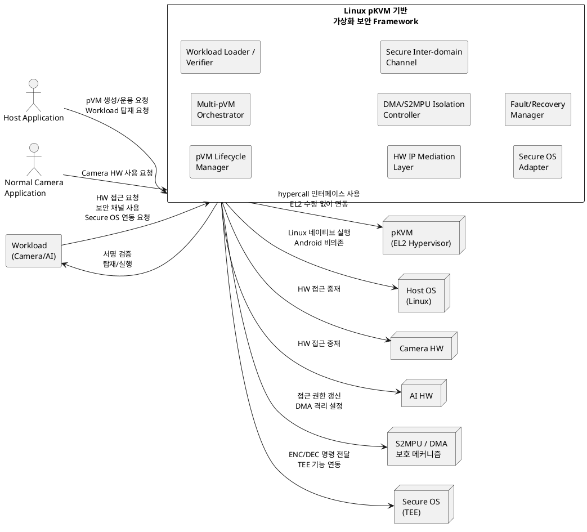

# Context View

본 문서는 `docs/01_*`, `docs/02_requirements.md`, `docs/03_*` 문서를 기준으로 개발 대상 System과 외부 모듈을 식별한다.

**핵심 문장:** 본 System은 pKVM 기반 pVM의 생명주기, Workload 탑재, Camera/AI HW 접근, 도메인 간 데이터 전송을 중재하고, Hypervisor/HW Driver/Secure OS 등 외부 실행 기반과 연동해 보안 격리와 성능 요구를 만족하는 Framework이다.

## 1. 개발 대상 System

개발 대상 System은 **Linux pKVM 기반 가상화 보안 Framework**이다.

문서상 구현 책임은 pKVM 자체나 SoC HW 자체가 아니라, 그 위에서 보안 pVM과 Workload를 운용하는 Framework 계층에 있다. 따라서 System 경계 안쪽은 보안 Framework의 Middleware, 커널 드라이버, 통신, 중재, 검증 지원 계층으로 본다.

주요 근거는 다음과 같다.

| 근거 문서 | 내용 |
|---|---|
| `01_use_case.md` | Secure Vision AI Platform의 유스케이스를 정의 |
| `01_vos_collection.md` | 산출물을 "로봇용 커스텀 SoC와 함께 제공되는 보안 Framework"로 정의 |
| `03_quality_attribute_specification.md` | Framework 본체를 Middleware/커널 드라이버로 표현 |

## 2. System 내부 모듈 후보

| 모듈 | 역할 | 관련 요구/품질 |
|---|---|---|
| pVM Lifecycle Manager | pVM 생성/시작/정지/종료, 자원 할당/회수 | FR-01 |
| Multi-pVM Orchestrator | Secure Camera pVM, Secure AI pVM 등 복수 pVM 동시 운용 | FR-02, QA-05 |
| Workload Loader / Verifier | 서명 검증 후 보안 Workload 동적 탑재 | FR-05, QA-03, CS-06 |
| HW IP Mediation Layer | Camera/AI HW를 Host와 pVM이 공유하도록 SW 중재 | FR-03, CS-05 |
| DMA/S2MPU Isolation Controller | HW 사용 주체 전환 시 권한 회수/부여, DMA 격리, 잔류 데이터 방지 | FR-03 |
| Secure Inter-domain Channel | pVM-pVM, pVM-Host 간 보안 데이터 전송, 공유 메모리/RPC/dma-buf 기반 zero-copy 후보 | FR-04, QA-04 |
| Secure OS Adapter | pVM 내 Workload의 ENC/DEC 요청을 Secure OS로 전달 | FR-06, QA-08, CS-03 |
| Fault/Recovery Manager | pVM 장애 격리, 자원 회수, Workload 서비스 재개 | QA-05 |

## 3. 외부 모듈 및 외부 의존 요소

| 외부 모듈/요소 | 짧은 역할 | System과의 관계 |
|---|---|---|
| Host Application | System에 보안 서비스 생명주기를 요청하는 주체 | pVM 생성/운용 요청, Workload 탑재 요청 |
| Normal Camera Application | System의 HW 중재와 충돌할 수 있는 일반 Camera 사용 주체 | Camera HW 사용 요청 |
| Workload(Camera/AI) | System이 pVM에 탑재하고 HW/보안 기능 사용을 중재하는 실행 단위 | Camera/AI HW 사용 요청, ENC/DEC 요청 |
| pKVM(EL2 Hypervisor) | System이 pVM 생성과 자원 제어를 위임하는 실행 기반 | pVM 생성/삭제, CPU/Memory 할당 |
| Camera HW Driver | System이 Camera HW 접근을 요청하는 외부 제어 경로 | Camera HW 사용 |
| AI HW Driver | System이 AI HW 접근을 요청하는 외부 제어 경로 | AI HW 사용 |
| S2MPU/DMA HW Driver | System이 HW 사용 주체 전환 시 접근 격리를 요청하는 제어 경로 | HW 접근 격리, DMA 격리 |
| Secure OS(TEE) | System이 민감 데이터 ENC/DEC 처리를 위임하는 보안 실행 환경 | ENC/DEC 동작 |

## 4. Context Diagram

## 5. System 경계 요약

System 경계 안쪽은 다음 책임을 가진다.

- pVM 생명주기와 다중 pVM 운용 관리
- 보안 Workload 동적 탑재와 서명 검증
- Host/pVM 간 Camera/AI HW 공유 중재
- DMA/S2MPU 기반 HW 접근 격리
- pVM-pVM, pVM-Host 간 보안 데이터 전송
- Secure OS ENC/DEC 연동

System 경계 바깥쪽은 다음 요소로 본다.

- Host Application, Normal Camera Application
- pVM 내부 Workload(Camera/AI)
- pKVM(EL2 Hypervisor)와 hypercall 인터페이스
- Host OS(Linux) 실행 환경
- Camera/AI HW, S2MPU/DMA 보호 메커니즘
- Secure OS(TEE)

## 6. 판단 기준

다음 기준으로 내부/외부를 구분했다.

| 구분 | 기준 |
|---|---|
| System 내부 | Secure Vision AI Platform/보안 Framework가 직접 제공해야 하는 기능, 품질 속성 달성을 위해 Framework가 통제해야 하는 계층 |
| 외부 모듈 | Framework가 사용하거나 연동하지만 직접 구현 대상이 아닌 실행 환경, HW, OS, Hypervisor, 애플리케이션, 사용자/고객 |
