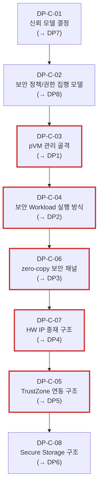

# Decision Point 목록

> 본 문서는 `04_architectural_drivers.md` 5.2절의 설계 착수 순서, `99_additional_decision_points.md`의 교차(cross-cutting) Decision Point, 추가로 식별한 보안 정책 결정을 통합하여, 아키텍처 설계 착수 전 확정해야 할 **Decision Point**를 정리한다.
>
> 진행 순서: 요구사항 수집 → 요구사항 도출 → 품질 속성 명세 → Architectural Driver 선정 → **Decision Point 목록(본 문서)**

---

## 1. 개요

Decision Point(DP)는 Architectural Driver로부터 도출되는 구체적인 설계 결정 단위다. DP를 해결하기 전까지는 후보 구조를 평가할 기준이 성립하지 않는다.

각 DP의 제목은 해당 DP가 해결을 통해 확보하려는 **핵심 품질 속성**이 수식하는 형태로 표기한다. 따라서 각 DP의 문제 상황과 설계질문은 그 품질 속성을 중심으로 정리한다.

본 문서는 DP를 두 단계로 정리한다. 먼저 Framework 구조를 설계하는 순서를 따라 **DP Candidate(DP-C-01 ~ DP-C-08)**를 도출하고(1.1절), 이어서 중요도/난이도/구조 설계 순서를 종합하여 실제 설계 착수 순서인 **DP 선정(DP1 ~ DP8)**을 확정한다(2.2절).

### 1.1 DP Candidate 선정 — Framework 구조 설계 순서

DP Candidate는 Framework 구조를 top-down으로 설계하는 순서를 따라 도출한다. 신뢰의 토대를 먼저 고정하고, 그 위에 권한/연동/골격/실행/성능/저장 결정을 차례로 쌓는다. 이 순서가 각 candidate의 선행 관계(2절 "선행 DP Candidate" 열)를 형성한다.

1. **신뢰 토대** — DP-C-01 (신뢰 모델): 모든 보안 주장과 TCB 경계를 정한다.
2. **접근 통제** — DP-C-02 (보안 정책/권한 집행): pVM, Workload, HW, 채널 권한의 일관된 집행 기준을 정한다.
3. **관리 골격** — DP-C-03 (pVM 관리 골격): 모든 Workload/메커니즘이 배치되는 생명주기 구조를 세운다.
4. **실행 방식** — DP-C-04 (보안 Workload 실행 방식): 골격 위에서 Workload를 무결하게 실행/수용하는 방식을 정한다.
5. **통신 채널** — DP-C-06 (zero-copy 보안 채널): pVM 간 대용량 데이터 전달 경로와 버퍼 보호 모델을 정한다.
6. **HW 중재** — DP-C-07 (HW IP 중재): 채널/버퍼 가정을 바탕으로 Camera/AI HW 접근과 DMA 격리를 정한다.
7. **레거시 연동** — DP-C-05 (TrustZone 연동): HW/채널 경계 위에서 기존 GP API/TEE 자산과의 후방호환 경계를 정한다.

Candidate 번호(DP-C-01 ~ DP-C-08)는 위 **구조 설계 순서**를, 최종 "DP 선정" 번호(DP1 ~ DP8)는 실제 **설계 착수 순서**를 나타낸다. 둘의 차이와 근거는 2.2절에서 설명한다.

---

## 2. DP Candidate 전체 목록

| DP Candidate ID | 제목 | 관련 Driver | 선행 DP Candidate | DP 선정 |
|-----------------|------|------------|-------------------|:-------:|
| DP-C-01 | 시스템의 보안 정책 신뢰를 위한 신뢰 모델 결정 | QA-01, CS-02 | — | DP7 |
| DP-C-02 | 접근 통제 일관성을 위한 보안 정책 및 권한 집행 모델 설계 | QA-01, FR-01, FR-02, FR-03, FR-04, FR-06, CS-02 | DP-C-01 | DP8 |
| DP-C-03 | 기밀성, 확장성, 가용성을 위한 pVM 관리 골격 설계 | FR-01, FR-02, QA-01, QA-04, QA-07, CS-01 | DP-C-02 | DP1 |
| DP-C-04 | 무결성 보장을 위한 보안 Workload 실행 방식 설계 | FR-06, QA-01, QA-04, QA-05 | DP-C-03 | DP2 |
| DP-C-05 | GP API Backward Compatibility를 위한 TrustZone 연동 구조 설계 | FR-08, QA-03, CS-03 | DP-C-01, DP-C-07 | DP5 |
| DP-C-06 | 성능(통신 오버헤드)을 위한 zero-copy 보안 채널 구조 설계 | FR-04, QA-01, QA-02, QA-03, QA-04 | DP-C-04 | DP3 |
| DP-C-07 | 성능(실시간 처리) 및 자원 효율을 위한 HW IP 중재 구조 설계 | FR-03, QA-04, QA-09, CS-05 | DP-C-06 | DP4 |
| DP-C-08 | 보안(기밀성)을 위한 Secure Storage 구조 설계 | FR-08, QA-01, QA-04 | DP-C-05, DP-C-04 | DP6 |

---

### 2.1 DP Candidate 의존성 다이어그램

화살표(`→`)는 **선행 관계**(앞 candidate의 설계 결정을 토대로 다음 candidate 설계를 진행)를 나타낸다. 괄호 안의 `DPn`은 최종 DP 선정(착수) 순서다. 빨간색 테두리는 구조 설계 순서의 최장 경로(critical path)를 나타낸다.

---

### 2.2 DP 선정 순서 근거

DP Candidate의 번호는 Framework를 top-down으로 설계하는 **구조 설계 순서**를 따르지만, 실제 설계 착수 순서인 "DP 선정"은 아래 세 가지를 종합하여 재배열한다.

- **중요도**: 핵심 품질 속성(보안/성능/확장성)을 직접 결정하거나, 다른 DP가 배치되는 구조적 토대가 되는 결정을 앞당긴다.
- **난이도**: 기술 리스크가 큰 결정을 조기에 착수하여 PoC로 실현 가능성을 먼저 검증한다.
- **구조 설계 순서**: candidate 의존성(선행 관계)상 먼저 가정되어야 하는 결정은 초기 가정으로 출발하되, concrete 구조가 드러난 뒤 최종 확정하는 것이 효율적인 횡단 결정은 후순위로 둔다.

| DP 선정 | DP Candidate | 제목(약칭) | 선정 근거 (중요도/난이도/구조 순서) |
|:-------:|:------------:|-----------|-------------------------------------|
| **DP1** | DP-C-03 | pVM 관리 골격 |  |
| **DP2** | DP-C-04 | 보안 Workload 실행 방식 |  |
| **DP3** | DP-C-06 | zero-copy 보안 채널 | Workload 실행 구조가 정해진 뒤 pVM 간 데이터 전달 경로와 채널 권한/버퍼 보호 모델을 먼저 확정한다. |
| **DP4** | DP-C-07 | HW IP 중재 | zero-copy 채널의 버퍼/소유권 가정을 바탕으로 Camera/AI HW 접근 전환과 DMA 격리 경계를 정한다. |
| **DP5** | DP-C-05 | TrustZone 연동 | HW/채널 경계가 정해진 뒤 기존 TEE/GP API 호출 경로와 후방호환 범위를 확정한다. |
| **DP6** | DP-C-08 | Secure Storage |  |
| **DP7** | DP-C-01 | 신뢰 모델 |  |
| **DP8** | DP-C-02 | 보안 정책/권한 집행 |  |

> 즉 DP1~DP2는 구조의 골격을, DP3~DP6은 리스크가 크거나 성능을 좌우하는 메커니즘을, DP7~DP8은 전 구간에 걸친 신뢰/정책 결정을 최종 고정하는 단계다. DP7/DP8은 설계 시작 시점에 **초기 가정**으로 선행되며, 본 표의 순서는 그 가정을 최종 **확정(lock)**하는 순서를 의미한다.

---

## 3. DP Candidate 상세

각 DP Candidate를 산출근거 Driver, 선행 DP Candidate, 문제 상황, 해결해야 할 설계질문으로 정리한다. 헤더의 `(→ DPn)`은 2.2절의 최종 착수 순서다.

---

#### DP1: 기밀성, 확장성, 가용성을 위한 pVM 관리 골격 설계 (→ DP-C-03)

**산출근거 Driver**
- FR-01: pVM 생성/시작/정지/종료와 자원 할당/회수 관리 필요
- FR-02: Secure Camera, Secure AI 등 다중 pVM 동시 운용 필요
- QA-01: pVM 내 보호 자산의 기밀성이 생명주기 전 구간에서 유지되어야 함
- QA-02: 다중 pVM 간 독립 격리 보장
- QA-04: pVM별 자원 예약/회수가 비격리 대비 추가 메모리/전력을 탑재 한도 이내로 유지해야 함
- QA-07: pVM 장애가 Host/타 pVM로 전파되지 않고 안전하게 회수/재시작되어야 함
- CS-01: Android 스택 의존 없이 Linux 네이티브로 동작해야 함

**선행 DP Candidate**
- DP-C-02 (보안 정책/권한 집행 모델): pVM 생성/자원 할당 권한을 누가 정의/검증/집행하는지가 정해져야 pVM 제어 인터페이스에 권한 검증 지점을 배치할 수 있다.

**문제 상황**
- Secure Vision AI는 최소 두 개 이상의 pVM을 독립적으로 생성/운용해야 하며, 생명주기 관리 구조가 없으면 후속 Workload 실행/HW IP 중재/보안 채널 설계를 배치할 기준이 없다.
- Linux 네이티브 제약 때문에 Android AVF의 VirtualizationService 같은 구조를 그대로 사용할 수 없다.
- pVM별 메모리/전력을 과다 예약하면 자원 효율(QA-04) 한도를 초과하고, 회수가 늦으면 다중 pVM 운용 시 누수가 발생한다.
- pVM 장애 시 자원이 안전하게 회수/재시작되지 않으면 Host/타 pVM의 가용성(QA-07)이 깨진다.

**해결해야 할 설계질문**
- 생명주기 관리자, pVM 제어 인터페이스, 자원 할당자의 책임 경계를 어떻게 나눌 것인가?
- 도메인별 메모리/CPU/디바이스 자원을 어떤 단위로 분리/예약/회수할 것인가?
- Linux 네이티브 제어면과 최소 pKVM hypercall 계약은 무엇으로 둘 것인가?

---

#### DP2: 무결성 보장을 위한 보안 Workload 실행 방식 설계 (→ DP-C-04)

**산출근거 Driver**
- FR-06: 신규 보안 Workload를 펌웨어 재배포 없이 동적으로 탑재/실행해야 함
- QA-01: Host 침해 시 보호 자산이 악성 pVM 또는 변조된 Workload로 노출되지 않아야 함
- QA-02: 실행되는 Workload가 다른 도메인과 독립 격리되어야 함
- QA-04: Workload 실행 구조의 추가 자원 소모가 탑재 한도 이내여야 함
- QA-05: Framework 소스 수정 없이 신규 Workload를 수용해야 함

**선행 DP Candidate**
- DP-C-03 (pVM 관리 골격): Workload는 pVM 생명주기 위에서 실행되므로, 생성/자원 할당/회수 골격이 확정되어야 실행/로딩/검증 절차를 그 위에 배치할 수 있다.

**문제 상황**
- 다양한 보안 Workload를 매번 Framework 수정으로 수용하면 동적 확장성과 QA-05이 성립하지 않는다.
- Host가 비신뢰이면 Host가 로딩하는 pVM 이미지/Workload 패키지가 실제 승인된 코드인지 별도로 검증(무결성, QA-01)해야 한다.
- 검증 주체를 Host에만 두면 Host 침해 시 우회될 수 있고, EL2 검증은 CS-02(EL2 수정 불가) 제약을 받는다.
- 패키지 형식/로딩 규약이 불명확하면 Workload 개발팀과 Framework 개발팀의 결합도가 커지고, 실행 구조의 자원 오버헤드(QA-04)가 통제되지 않는다.

**해결해야 할 설계질문**
- Workload 패키지 구조와 표준 실행/로딩 인터페이스를 어디까지 정의할 것인가?
- pVM 이미지/Workload 패키지의 서명 검증과 measured boot는 누가 수행할 것인가?
- 검증 결과를 권한 정책(DP-C-02)과 키 방출 조건(DP-C-08)에 어떻게 연결할 것인가?

---

#### DP3: 성능(통신 오버헤드)을 위한 zero-copy 보안 채널 구조 설계 (→ DP-C-06)

**산출근거 Driver**
- FR-04: pVM↔pVM, pVM↔Host 간 보안 채널 제공 필요
- QA-01: 채널을 통과하는 보호 자산이 Host에 노출되지 않아야 함
- QA-02: 채널이 도메인 간 격리 경계를 깨지 않아야 함
- QA-02: Secure Vision AI 파이프라인의 실시간 처리 필요
- QA-03: 도메인 간 통신 오버헤드가 실시간성을 해치지 않아야 함
- QA-04: 채널 버퍼의 추가 메모리 소모가 탑재 한도 이내여야 함

**선행 DP Candidate**
- DP-C-04 (보안 Workload 실행 방식): 채널의 양단은 실행되는 Workload(Secure Camera/Secure AI)이므로, Workload 실행/격리 구조가 확정되어야 채널의 종단점과 권한 가정을 정할 수 있다. HW IP 중재(DP-C-07)의 DMA 버퍼 소유권 결정과는 상호 참조하여 정합을 맞춘다.

**문제 상황**
- Secure Camera에서 Secure AI로 전달되는 영상 데이터는 대용량이므로 복사 기반 전달은 성능 병목이 될 가능성이 높다.
- Host가 비신뢰인 상황에서도 공유 메모리 기반 zero-copy 채널의 내용을 Host가 읽거나 변조하지 못해야 한다(QA-01, QA-02).
- 제어 경로와 데이터 경로를 섞으면 보안 정책, 실패 처리, 성능 측정이 복잡해질 수 있다.
- 영상 데이터는 Camera/AI HW의 DMA 버퍼와 직결되므로 HW IP 중재(DP-C-07)의 버퍼 소유권/DMA 경로와 정합되어야 한다.

**해결해야 할 설계질문**
- Secure Camera→Secure AI 영상 데이터는 어떤 공유 메모리 구조로 zero-copy 전달할 것인가?
- RPC 제어 경로와 공유 메모리 데이터 경로를 어떻게 분리할 것인가?
- 채널 버퍼 보호 정책과 권한 확인 결과를 채널 수립 절차에 어떻게 반영할 것인가?

---

#### DP4: 성능(실시간 처리) 및 자원 효율을 위한 HW IP 중재 구조 설계 (→ DP-C-07)

**산출근거 Driver**
- FR-03: Camera/AI HW 등 HW IP를 Host와 pVM이 공유/할당할 수 있어야 함
- QA-03: HW IP DMA 경로 격리와 잔류 데이터 소거 필요
- QA-04: 중재 계층의 추가 자원 소모가 탑재 한도 이내여야 함
- QA-09: HW IP 공유/전환 오버헤드가 실시간성을 해치지 않아야 함
- CS-05: 단일 Context HW IP이며 HW 변경 불가

**선행 DP Candidate**
- DP-C-04 (보안 Workload 실행 방식): HW IP를 사용하는 주체는 실행되는 보안 Workload(pVM)이므로, Workload 실행 구조와 검증 경계가 확정되어야 중재자가 어떤 주체에게 HW IP 사용을 허용/전환할지 일관되게 설계할 수 있다.

**문제 상황**
- Camera/AI HW는 다중 Context를 지원하지 않는 공유 자원이므로 Host와 pVM의 동시 사용 요구를 SW 중재로 풀어야 한다.
- 중재자를 Host 커널에 두면 Host 비신뢰 전제 때문에 격리는 S2MPU와 신뢰 주체가 보장해야 한다.
- 중재자를 별도 서비스 pVM에 두면 신뢰 경계는 좋아질 수 있으나 전환 지연과 구현 복잡도가 증가할 수 있다.
- HW IP 공유는 본 과제의 핵심 기술 리스크이므로 조기 PoC가 필요하다.

**해결해야 할 설계질문**
- HW IP 중재자는 Host 커널 드라이버와 서비스 pVM 중 어디에 둘 것인가?
- pVM 사용 구간의 S2MPU 설정과 Host 조작 차단을 누가 보장할 것인가?
- 사용 주체 전환 시 잔류 데이터 소거와 전환 오버헤드 측정을 어떻게 정의할 것인가?

---

#### DP5: GP API Backward Compatibility를 위한 TrustZone 연동 구조 설계 (→ DP-C-05)

**산출근거 Driver**
- FR-08: pVM Workload가 기존 TrustZone Secure OS 기반 TEE 기능과 연동해야 함
- QA-03: pVM→TEE 호출 경로의 통신 오버헤드가 파이프라인 실시간성을 해치지 않아야 함
- CS-03: 기존 TrustZone Secure OS의 SMC 경로와 TEE 기능은 무회귀로 유지해야 함

**선행 DP Candidate**
- DP-C-01 (신뢰 모델): TrustZone EL3/S-EL1을 신뢰 주체로 둘 것인지가 신뢰 모델에서 결정되어야, pVM→TEE 경로의 배치와 TEE를 신뢰 앵커로 사용하는 범위를 정할 수 있다.
- DP-C-07 (HW IP 중재): HW 사용 주체와 DMA 버퍼 소유권 경계가 정해져야 TEE 호출 경로와 후방호환 범위를 일관되게 배치할 수 있다.

**문제 상황**
- 기존 키 관리/인증 기능은 TrustZone TEE에 남아 있으므로 pVM 기반 신규 구조와 공존해야 하며, 기존 GP API 호출은 후방호환되어야 한다.
- Secure Storage(DP-C-08)의 저장 보호는 TrustZone TEE를 신뢰 앵커로 쓸 수 있는지에 따라 구조가 달라진다.
- 기존 SMC 경로를 깨면 신규 Framework 도입이 기존 제품 기능의 회귀로 이어질 수 있다.
- pVM→TEE 호출 경로가 비효율적이면 보안 파이프라인의 통신 오버헤드(QA-03)가 증가한다.

**해결해야 할 설계질문**
- 기존 Host→TEE SMC 경로를 유지하면서 pVM→TEE 호출 경로를 어디에 추가할 것인가?
- TEE는 pVM 호출 주체의 신뢰성을 어떻게 확인할 것인가?
- TrustZone TEE를 Secure Storage의 키 관리 신뢰 앵커로 사용할 것인가?

---

#### DP6: 보안(기밀성)을 위한 Secure Storage 구조 설계 (→ DP-C-08)

**산출근거 Driver**
- FR-08: 기존 TrustZone TEE의 키 관리/인증 기능과 연동 가능
- QA-01: Host 침해 시 AI 모델 가중치/영상 원본/추론 중간 데이터가 정지 상태에서 노출되지 않아야 함
- QA-02: 저장 자산의 복호화/접근이 도메인 격리 경계를 깨지 않아야 함
- QA-04: 저장 암호화/복호화의 추가 자원 소모가 탑재 한도 이내여야 함

**선행 DP Candidate**
- DP-C-05 (TrustZone 연동 구조): 암호화 키의 생성/보관 주체로 TrustZone TEE를 사용할 수 있는지가 먼저 결정되어야 키 관리 주체(TEE/EL2/별도 키 관리 서비스)의 선택지를 평가할 수 있다.
- DP-C-04 (보안 Workload 실행 방식): Workload 패키지의 저장 암호화 범위와 복호화 시점이 실행/로딩 절차에 맞물리므로, 실행 방식이 확정되어야 평문 노출 없는 키 전달/복호화 경로를 설계할 수 있다.

**문제 상황**
- 실행 중 메모리 격리가 유지되어도 AI 모델 가중치나 Workload 패키지가 Host 파일시스템에 평문으로 저장되면 Host 침해 시 보호 자산이 노출된다.
- 저장 보호의 키 관리 주체는 TrustZone TEE, pKVM EL2, 별도 키 관리 서비스 중 어디를 신뢰할지에 따라 달라진다.
- 복호화 시점과 키 전달 경로가 잘못 설계되면 실행 직전 또는 로딩 과정에서 평문이 Host에 노출될 수 있다.

**해결해야 할 설계질문**
- 어떤 자산을 저장 시 암호화하고, 암호화 범위는 어디까지로 할 것인가?
- 암호화 키는 누가 생성/보관/사용하며, pVM에는 어떤 경로로 전달할 것인가?
- 키 회전/폐기/Workload 삭제 시 저장 자산을 어떻게 무효화할 것인가?

---

#### DP7: 시스템의 보안 정책 신뢰를 위한 신뢰 모델 결정 (→ DP-C-01)

**산출근거 Driver**
- QA-01: Host 침해 시 pVM 내 보호 자산의 기밀성 보장
- QA-02: pVM 간 독립 격리 보장
- CS-02: 기 포팅된 pKVM 커널을 전제로 하며 EL2 수정 불가

**선행 DP Candidate**
- 없음 — 본 candidate는 전체 DP의 출발점이다. 여기서 확정되는 TCB 범위/공격자 모델/보호 속성이 후속 DP 전체의 후보 구조 평가 기준이 된다.

**문제 상황**
- pKVM이 Host 비신뢰라는 큰 방향은 제공하지만, 본 과제의 Host 측 Framework/커널 드라이버를 TCB 안에 둘지 밖에 둘지는 별도 결정이 필요하다.
- 신뢰 모델이 확정되지 않으면 HW IP 중재자, 보안 채널 중개자, Workload 검증 주체의 배치 기준이 흔들린다.
- 병렬 설계 중 팀별 신뢰 가정이 달라지면 전체 격리 주장(QA-01, QA-02)이 가장 약한 가정으로 무너진다.

**해결해야 할 설계질문**
- Host 측 Framework를 TCB에 포함할 것인가, 비신뢰 영역으로 둘 것인가?
- 공격자 모델과 보호 속성(기밀성/무결성/가용성 범위)을 어디까지로 한정할 것인가?
- EL2(pKVM), TrustZone, 서비스 pVM 중 어떤 컴포넌트를 신뢰 주체로 둘 것인가?

> 상세 논거: `99_trust_boundary_qna.md` 참조

---

#### DP8: 접근 통제 일관성을 위한 보안 정책 및 권한 집행 모델 설계 (→ DP-C-02)

**산출근거 Driver**
- QA-01, QA-02: Host 및 pVM 간 비신뢰 전제에서 보호 자산과 도메인 격리 보장
- FR-01: pVM 생성/시작/정지/종료 등 생명주기 동작의 권한 판단 필요
- FR-02: 다중 pVM 동시 운용 시 도메인별 권한 분리 필요
- FR-03: HW IP 사용 권한과 DMA 경로 할당 필요
- FR-04: pVM 간 보안 채널 수립 권한 필요
- FR-06: 보안 Workload 동적 탑재 권한 필요
- CS-02: EL2 수정 불가 제약 아래 권한 집행 위치 결정 필요

**선행 DP Candidate**
- DP-C-01 (신뢰 모델): Host Framework가 TCB 밖이라면 권한 집행을 Host에 단독으로 둘 수 없으므로, TCB 범위와 신뢰 주체가 먼저 확정되어야 권한 집행 위치를 결정할 수 있다.

**문제 상황**
- pVM 생성/운용, HW IP 사용, 채널 수립, Workload 로딩은 모두 권한 판단이 필요한 동작이다.
- Host가 비신뢰이면 Host Framework가 단독으로 권한을 허가하는 구조는 QA-01, QA-02의 신뢰 모델과 충돌할 수 있다.
- 정책 모델이 없으면 pVM 관리 골격(DP-C-03)과 Workload 실행(DP-C-04)이 서로 다른 권한 가정으로 설계될 위험이 있다.

**해결해야 할 설계질문**
- pVM 생성, HW IP 사용, 채널 수립, Workload 로딩 권한을 누가 정의/검증/집행할 것인가?
- 권한 정책은 manifest, 도메인별 권한 테이블, 런타임 정책 중 무엇으로 표현할 것인가?
- 정책 위반 또는 권한 철회 시 pVM/채널/HW IP 할당을 어떻게 차단/회수할 것인가?

---

## 4. Reference Scenario 단계 - DP-C 매트릭스

본 절은 `99_reference_scenario_flow.md`의 13개 실행 단계가 어떤 DP Candidate의 설계 결정에 의해 구체화되는지 매핑한다. 사용자가 제외 요청한 `DP-C-01`(신뢰 모델)과 `DP-C-02`(보안 정책/권한 집행)는 매트릭스 열에서 제외한다.

| 단계 | 요청/동작 | DP-C-03 pVM 관리 골격 | DP-C-04 Workload 실행 방식 | DP-C-06 zero-copy 보안 채널 | DP-C-07 HW IP 중재 | DP-C-05 TrustZone 연동 | DP-C-08 Secure Storage |
|---:|---|:---:|:---:|:---:|:---:|:---:|:---:|
| 1 | Host Application이 파이프라인 시작 요청 | O |  |  |  |  |  |
| 2 | 요청 권한 및 정책 확인 |  |  |  |  |  |  |
| 3 | Workload 이미지 검증 |  | O |  |  |  |  |
| 4 | pVM 생성 및 자원 할당 | O |  |  |  |  |  |
| 5 | Workload 탑재 및 실행 | O | O |  |  |  |  |
| 6 | 보안 RPC 채널 구성 |  |  | O |  | O |  |
| 7 | Camera HW 캡쳐 수행 |  |  |  | O |  |  |
| 8 | Camera 영상 암호화 저장 |  |  |  |  | O | O |
| 9 | Camera 영상 프레임 전달 |  |  | O |  |  |  |
| 10 | AI HW 추론 수행 |  |  |  | O |  |  |
| 11 | AI 데이터 암호화 저장 |  |  |  |  | O | O |
| 12 | Host Application으로 결과 전달 |  |  | O |  |  |  |
| 13 | 장애 처리 혹은 파이프라인 종료 | O | O | O | O |  |  |

### 4.1 매핑 기준

- `DP-C-03`은 pVM 생성, 자원 할당, 생명주기 전환, 장애 회수/종료가 직접 나타나는 단계에 표시한다.
- `DP-C-04`는 Workload 이미지 검증, 탑재, 실행, 중지처럼 보안 Workload 실행 계약이 필요한 단계에 표시한다.
- `DP-C-05`는 Secure OS/TEE 기능 연동이 필요한 보안 RPC 구성과 암호화 저장 단계에 표시한다.
- `DP-C-06`은 pVM 간 또는 pVM-Host 간 데이터/결과 전달 채널이 필요한 단계에 표시한다.
- `DP-C-07`은 Camera/AI HW 사용, DMA 격리, HW 권한 전환이 직접 필요한 단계에 표시한다.
- `DP-C-08`은 영상/AI 데이터가 저장 상태에서 암호화 보호되어야 하는 단계에 표시한다.
- 2단계의 요청 권한 및 정책 확인은 주로 `DP-C-02`에 해당하므로 본 매트릭스에서는 표시하지 않는다.
