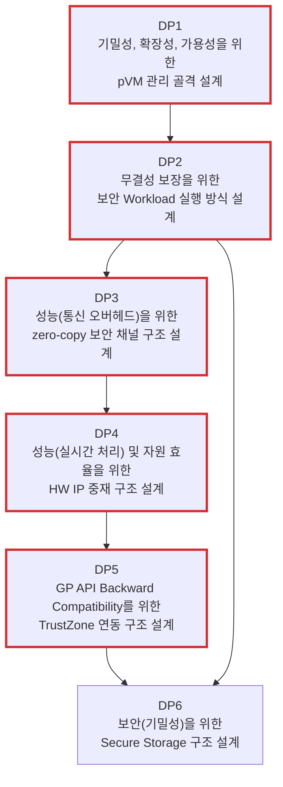

# Decision Point 목록

> 본 문서는 `04_architectural_drivers.md`에서 선정한 Architectural Driver를 입력으로, 아키텍처 설계 착수 전 확정해야 할 **Decision Point(DP1~DP6)**를 정리한다.
>
> 진행 순서: 요구사항 수집 → 요구사항 도출 → 품질 속성 명세 → Architectural Driver 선정 → **Decision Point 목록(본 문서)**

---

## 1. 개요

Decision Point(DP)는 Architectural Driver로부터 도출되는 구체적인 설계 결정 단위다. DP를 해결하기 전까지는 후보 구조를 평가할 기준이 성립하지 않는다.

각 DP의 제목은 해당 DP가 해결을 통해 확보하려는 **핵심 품질 속성**이 수식하는 형태로 표기한다. 따라서 각 DP의 문제 상황과 설계질문은 그 품질 속성을 중심으로 정리한다.

DP 번호(DP1~DP6)는 실제 **설계 착수 순서**를 나타내며, 착수 순서는 다음 세 가지를 종합하여 정한다.

- **중요도**: 핵심 품질 속성(보안/성능/확장성)을 직접 결정하거나, 다른 DP가 배치되는 구조적 토대가 되는 결정을 앞당긴다.
- **난이도**: 기술 리스크가 큰 결정을 조기에 착수하여 PoC로 실현 가능성을 먼저 검증한다.
- **구조 설계 순서**: 의존성(선행 관계)상 먼저 확정되어야 하는 결정을 앞에 둔다.

---

## 2. DP 전체 목록

| DP | 제목 | 관련 Driver | 선행 DP |
|:--:|------|------------|:-------:|
| DP1 | 기밀성, 확장성, 가용성을 위한 pVM 관리 골격 설계 | FR-01, FR-02, FR-05, QA-01, QA-04, QA-06, CS-01, CS-02 | — |
| DP2 | 무결성 보장을 위한 보안 Workload 실행 방식 설계 | FR-01, FR-05, QA-01, QA-04, CS-01, CS-02 | DP1 |
| DP3 | 성능(통신 오버헤드)을 위한 zero-copy 보안 채널 구조 설계 | FR-03, FR-04, QA-01, QA-02, QA-03, QA-05, CS-01, CS-02 | DP2 |
| DP4 | 성능(실시간 처리) 및 자원 효율을 위한 HW IP 중재 구조 설계 | FR-03, QA-01, QA-02, QA-03, CS-01, CS-02 | DP3 |
| DP5 | GP API Backward Compatibility를 위한 TrustZone 연동 구조 설계 | FR-06, QA-01, QA-03, QA-05, CS-03 | DP4 |
| DP6 | 보안(기밀성)을 위한 Secure Storage 구조 설계 | FR-06, QA-01, QA-03, CS-03 | DP5, DP2 |

---

### 2.1 DP 의존성 다이어그램

화살표(`→`)는 **선행 관계**(앞 DP의 설계 결정을 토대로 다음 DP 설계를 진행)를 나타낸다. 빨간색 테두리는 설계 순서의 최장 경로(critical path)를 나타낸다.

---

### 2.2 착수 순서 근거

- **DP1~DP2 (구조의 골격)**: 모든 Workload/메커니즘이 배치되는 pVM 생명주기 골격과, 그 위에서 Workload를 무결하게 실행/수용하는 방식을 먼저 확정한다. 후속 DP의 종단점(pVM, Workload)이 여기서 정의된다.
- **DP3~DP4 (핵심 리스크/성능 메커니즘)**: 대용량 영상 전달과 HW IP 공유는 본 과제의 핵심 기술 리스크이자 성능(QA-03, QA-05)을 좌우하는 결정이므로, 골격 확정 직후 착수하여 조기 PoC로 검증한다. 두 DP는 DMA 버퍼 소유권을 공유하므로 상호 참조하여 정합을 맞춘다.
- **DP5~DP6 (레거시 연동과 저장 보호)**: TrustZone 연동은 HW/채널 경계가 드러난 뒤 후방호환 범위를 확정하는 것이 효율적이며, Secure Storage는 키 관리 신뢰 앵커(DP5)와 Workload 로딩 절차(DP2)가 확정되어야 평가할 수 있으므로 마지막에 둔다.

---

## 3. DP 상세

각 DP를 산출근거 Driver, 선행 DP, 문제 상황, 해결해야 할 설계질문으로 정리한다.

---

#### DP1: 기밀성, 확장성, 가용성을 위한 pVM 관리 골격 설계

**산출근거 Driver**
- FR-01: pVM 생성/시작/정지/종료와 자원 할당/회수를 관리하는 기능을 제공해야 함
- FR-02: Secure Camera, Secure AI 등 복수 pVM을 독립적으로 동시 운용해야 함
- FR-05: 보안 Workload 동적 탑재가 pVM 생명주기 골격 위에서 수행되어야 함
- QA-01: 생성부터 종료/회수까지 생명주기 전 구간에서 pVM 메모리가 Host로부터 격리되어야 함
- QA-04: 신규 Workload를 Framework 코어 수정 0 LoC로 수용할 수 있는 골격이어야 함
- QA-06: pVM 장애 시 Host/타 pVM 다운타임 0을 유지하며 자원 회수와 3초 이내 재시작이 가능해야 함
- CS-01: Android 스택(VirtualizationService 등) 의존 없이 Linux 네이티브로 동작해야 함
- CS-02: 기 포팅된 pKVM을 전제로 EL2 수정 없이 hypercall 범위 내에서 설계해야 함

**선행 DP**
- 없음 — 본 DP는 전체 설계의 출발점이다. 여기서 확정되는 생명주기 골격 위에 후속 DP의 실행/채널/HW 중재/저장 결정이 배치된다.

**문제 상황**
- Secure Vision AI는 Secure Camera와 Secure AI 두 pVM을 독립적으로 동시 생성/운용해야 하는데, 생명주기와 자원 할당/회수를 담당하는 골격이 없으면 후속 설계(Workload 실행, 보안 채널, HW 중재)를 배치할 기준 자체가 없다.
- pVM 메모리는 생성 시점의 할당부터 종료 시점의 회수까지 전 구간에서 Host 접근이 차단되어야 하므로, 생명주기 상태 전환마다 Stage-2 보호 상태(할당/donate/회수)의 전환 규칙이 함께 정의되어야 한다.
- Android AVF의 VirtualizationService 같은 기존 관리 컴포넌트는 Android 시스템 서비스에 종속되어 사용할 수 없고, EL2는 수정할 수 없으므로 관리 기능 전체를 Linux user/kernel 공간과 기존 hypercall 계약 안에 배치해야 한다.
- pVM이 크래시/무응답 상태가 되어도 Host와 타 pVM의 동작은 유지되어야 하며, 장애 pVM의 격리 메모리와 자원이 안전하게 회수되지 않으면 다중 pVM 운용에서 누수와 가용성 저하가 누적된다.

**해결해야 할 설계질문**
- 생명주기 관리자, pVM 제어 인터페이스, 자원 할당자의 책임을 Linux user 공간과 커널 드라이버에 어떻게 나누어 배치할 것인가?
- pVM별 메모리/CPU/디바이스 자원을 어떤 단위로 예약/할당하고, 정상 종료와 장애 시 각각 어떤 절차로 회수할 것인가?
- 생명주기 상태 모델(생성/시작/정지/종료/장애)과 각 상태 전환 시 pKVM hypercall 호출 계약을 무엇으로 정의할 것인가?

---

#### DP2: 무결성 보장을 위한 보안 Workload 실행 방식 설계

**산출근거 Driver**
- FR-01: Workload 실행/중지 절차가 pVM 시작/정지 흐름과 맞물려야 함
- FR-05: 신규 보안 Workload를 재배포 없이 서명 검증 후 동적으로 pVM에 탑재해야 함
- QA-01: Host가 침해되어도 승인되지 않은 코드가 pVM에서 실행되지 않아야 함
- QA-04: 신규 Workload를 코어 수정 없이 패키징/탑재만으로 수용하는 표준 계약이 필요함
- CS-01: Workload 패키징/로딩 경로가 Linux 네이티브 환경에서 동작해야 함
- CS-02: EL2를 수정할 수 없으므로 검증/로딩 책임을 기존 pKVM 계약 안에서 배치해야 함

**선행 DP**
- DP1 (pVM 관리 골격): Workload는 pVM 생명주기 위에서 실행되므로, 생성/자원 할당/회수 골격이 확정되어야 탑재/검증/실행 절차를 그 위에 배치할 수 있다.

**문제 상황**
- Workload 이미지와 패키지는 비신뢰 Host의 파일시스템과 로딩 경로를 거쳐 pVM에 전달되므로, Host가 침해되면 변조된 이미지가 탑재될 수 있다. 탑재 전 서명 검증이 어디에서 누구에 의해 수행되는지가 무결성 보장의 성패를 가른다.
- 검증 주체를 Host에 두면 Host 침해 시 검증 자체가 우회되고, EL2에 검증 로직을 추가하는 것은 EL2 수정 불가 제약에 걸린다. 신뢰할 수 있는 검증 위치의 선택지가 구조적으로 제한되어 있다.
- Workload마다 실행 형태(런타임, 의존성)가 다른데 표준 패키지 형식과 로딩 계약이 없으면 신규 Workload 수용 시마다 Framework 코어 수정이 필요해져 확장성 목표(코어 수정 0 LoC)가 성립하지 않는다.
- Workload 실행/중지가 pVM 시작/정지 흐름과 정합되지 않으면, 실행 중 Workload가 남은 채 pVM 자원이 회수되는 등 생명주기 골격과의 경계가 모호해진다.

**해결해야 할 설계질문**
- Workload 패키지 형식(이미지, 매니페스트, 서명)과 표준 실행/로딩 인터페이스를 어디까지 정의할 것인가?
- 서명 검증과 부팅 시 무결성 측정(measured boot)은 어느 신뢰 주체가 어느 시점에 수행할 것인가?
- Workload 실행/중지 절차를 DP1의 pVM 생명주기 상태 전환에 어떻게 결합할 것인가?

---

#### DP3: 성능(통신 오버헤드)을 위한 zero-copy 보안 채널 구조 설계

**산출근거 Driver**
- FR-03: 채널 버퍼가 Camera/AI HW의 DMA 버퍼와 직결되므로 HW 공유 구조와 정합되어야 함
- FR-04: pVM↔pVM, pVM↔Host 간 데이터를 비신뢰 주체에 노출 없이 전달해야 함
- QA-01: Host가 침해되어도 채널로 전달되는 영상/추론 데이터가 노출되지 않아야 함
- QA-02: 공유 메모리 접근 권한이 도메인 간 배타적 격리를 깨지 않아야 함
- QA-03: 프레임 전달이 30fps, E2E 지연 100ms 이내의 실시간 처리 예산 안에 들어야 함
- QA-05: 도메인 간 버퍼 전달 시 memcpy 호출 0회의 zero-copy가 요구됨
- CS-01: Linux 네이티브 IPC/공유 메모리(dma-buf 등) 메커니즘 범위에서 구현되어야 함
- CS-02: 메모리 공유/보호 전환이 기존 pKVM hypercall(share/donate) 계약 안에서 이루어져야 함

**선행 DP**
- DP2 (보안 Workload 실행 방식): 채널의 양단은 실행되는 Workload(Secure Camera/Secure AI)이므로, Workload 실행/격리 구조가 확정되어야 채널의 종단점과 신뢰 가정을 정할 수 있다.

**문제 상황**
- Secure Camera에서 Secure AI로 프레임 단위 대용량 영상이 지속적으로 흐르는데, 복사 기반 전달은 memcpy 0회라는 통신 오버헤드 목표와 실시간 처리 예산을 동시에 위반한다. 공유 메모리 기반 zero-copy가 사실상 유일한 선택지다.
- 그러나 공유 메모리는 격리와 본질적으로 긴장 관계다. 두 pVM이 같은 버퍼를 공유하면서도 비신뢰 Host는 그 버퍼를 읽거나 변조할 수 없어야 하며, 공유 권한이 도메인 간 배타적 격리를 무너뜨리지 않아야 한다.
- 버퍼의 소유권/접근권 전환을 pKVM hypercall로 수행할 때, 전환 자체의 빈도와 비용이 프레임 주기(33ms)를 잠식하면 zero-copy의 이득이 사라진다.
- 채널 버퍼는 Camera/AI HW의 DMA 대상 버퍼와 동일한 메모리를 가리키게 되므로, DMA 소유권을 다루는 HW IP 중재(DP4)와 버퍼 수명/권한 모델이 어긋나면 격리 구멍 또는 이중 관리가 발생한다.

**해결해야 할 설계질문**
- 프레임 버퍼를 어떤 공유 메모리 구조(공유 풀, 소유권 이전, 링 버퍼 등)로 zero-copy 전달하고, 버퍼 권한 전환 규약은 무엇으로 할 것인가?
- 저빈도 제어 경로(RPC)와 고대역 데이터 경로(공유 메모리)를 어떻게 분리하고 각각 어떤 전송 수단에 배치할 것인가?
- 채널 수립/해제 시 상대 도메인 확인과 버퍼 보호 상태 전환을 어떤 절차로 수행할 것인가?

---

#### DP4: 성능(실시간 처리) 및 자원 효율을 위한 HW IP 중재 구조 설계

**산출근거 Driver**
- FR-03: 단일 Context인 Camera/AI HW를 Host와 pVM이 SW 중재로 공유하고, 사용 주체 전환 시 격리를 보장해야 함
- QA-01: HW가 pVM 데이터를 처리하는 동안 그 데이터가 DMA 경로를 통해 Host에 노출되지 않아야 함
- QA-02: 사용 주체 전환 시 S2MPU 권한 상태에 두 주체의 중첩 구간이 없어야 함(위반 횟수 0)
- QA-03: HW 사용 주체 전환 오버헤드가 30fps 실시간 파이프라인을 해치지 않아야 함
- CS-01: 중재 구조가 Linux 네이티브 드라이버 모델 안에서 구현되어야 함
- CS-02: EL2 수정 없이 기존 pKVM 계약 범위에서 HW 접근 권한 전환을 설계해야 함

**선행 DP**
- DP3 (zero-copy 보안 채널): HW DMA 버퍼는 채널 버퍼와 동일 메모리를 공유하므로, 채널의 버퍼 소유권/보호 모델이 정해져야 DMA 경로의 권한 전환을 정합되게 설계할 수 있다.

**문제 상황**
- Camera/AI HW는 다중 Context를 하드웨어적으로 제공하지 않는 단일 Context 공유 자원인데, Host의 일반 기능(일반 촬영/일반 추론)과 보안 파이프라인이 동시에 사용을 요구하므로 SW 중재로 시분할 공유를 풀어야 한다.
- 사용 주체 전환 시 이전 주체의 접근 권한 회수, HW 내 잔류 데이터 소거, 다음 주체 권한 부여가 원자적으로 이루어지지 않으면 S2MPU 권한 중첩 구간이 생겨 보안 파이프라인의 데이터가 Host 측으로 새어 나갈 수 있다.
- 중재자를 Host 커널 드라이버에 두면 Host가 비신뢰이므로 격리 보장은 중재자가 아닌 S2MPU 설정과 별도 신뢰 주체가 담보해야 하고, 중재자를 별도 서비스 pVM에 두면 신뢰 경계는 개선되나 전환 지연과 구현 복잡도가 증가한다.
- 전환 절차(권한 회수, 소거, 재부여)가 빈번하면 그 오버헤드가 프레임 주기를 잠식하므로, 실시간 처리 목표와 배타적 격리 목표를 동시에 만족하는 전환 설계는 본 과제의 핵심 기술 리스크로서 조기 PoC가 필요하다.

**해결해야 할 설계질문**
- HW IP 중재자는 Host 커널 드라이버와 별도 서비스 pVM 중 어디에 배치할 것인가?
- pVM 사용 구간의 S2MPU 설정과 그 무결성은 어떤 신뢰 주체가 보장하고, Host의 임의 조작을 어떻게 차단할 것인가?
- 사용 주체 전환 절차(권한 회수 → 잔류 데이터 소거 → 권한 부여)를 어떻게 정의하고 전환 오버헤드를 어떻게 측정/검증할 것인가?

---

#### DP5: GP API Backward Compatibility를 위한 TrustZone 연동 구조 설계

**산출근거 Driver**
- FR-06: pVM 내 Workload가 Secure OS에 ENC/DEC 명령을 전송할 수 있어야 함
- QA-01: pVM→TEE 호출 과정에서 명령/키/민감 데이터가 비신뢰 Host에 노출되지 않아야 함
- QA-03: TEE 호출이 파이프라인 경로에 포함될 때 실시간 처리 성능을 해치지 않아야 함
- QA-05: pVM→TEE 호출 경로의 통신 오버헤드가 과도하지 않아야 함
- CS-03: GlobalPlatform 표준 규격을 준수하고 기존 TrustZone TEE 자산과 무회귀로 공존해야 함

**선행 DP**
- DP4 (HW IP 중재): HW 사용 주체와 DMA 버퍼 소유권 경계가 정해져야, TEE 호출 경로가 파이프라인의 어느 지점에 어떤 데이터로 삽입되는지 일관되게 배치할 수 있다.

**문제 상황**
- 고객사의 키 관리/인증 자산은 TrustZone Secure OS 위의 GP TEE API(TA) 기반으로 이미 운용 중이며, 기존 Host(REE)→TEE SMC 호출 경로는 무회귀로 유지되어야 한다. 신규 pVM 도메인은 이 구조에 추가로 공존해야 한다.
- 기존 GP 클라이언트 API는 REE(Host)에서의 호출만 전제하므로, pVM 내 Workload가 ENC/DEC 명령을 전송하는 경로는 새로 정의해야 한다. 이때 GP 표준 API 표면을 유지해야 Workload 개발자의 기존 자산이 재사용된다.
- 호출 경로가 Host를 경유하면 명령 파라미터와 데이터가 비신뢰 Host에 노출될 수 있고, TEE 입장에서는 호출자가 승인된 pVM인지 침해된 Host가 위장한 것인지 구분할 근거가 필요하다.
- ENC/DEC이 영상/추론 데이터의 저장 경로에 놓이면 pVM→TEE 왕복 오버헤드가 파이프라인 실시간성과 통신 오버헤드 예산을 잠식할 수 있다.

**해결해야 할 설계질문**
- 기존 Host→TEE SMC 경로를 그대로 유지하면서 pVM→TEE 호출 경로를 어디에(직접 SMC, Host 경유 프록시, 중계 서비스) 추가할 것인가?
- TEE는 pVM 호출 주체의 신원과 무결성을 어떤 근거로 확인할 것인가?
- pVM 내 Workload에 GP 표준 API 표면을 어느 범위까지 제공하여 기존 TA/클라이언트 자산의 후방호환을 보장할 것인가?

---

#### DP6: 보안(기밀성)을 위한 Secure Storage 구조 설계

**산출근거 Driver**
- FR-06: 데이터 저장/복구 시 ENC/DEC을 Secure OS 기능과 연동하여 수행해야 함
- QA-01: 저장 상태의 영상/AI 모델/추론 데이터가 Host 파일시스템 침해 시에도 노출되지 않아야 함
- QA-03: 저장/복구 경로의 암호화/복호화가 실시간 파이프라인 성능을 해치지 않아야 함
- CS-03: 키 관리 등 저장 보호의 신뢰 기능이 기존 GP 표준/TrustZone TEE 자산과 호환되어야 함

**선행 DP**
- DP5 (TrustZone 연동 구조): 암호화 키의 생성/보관 주체로 TrustZone TEE를 사용할 수 있는지와 pVM→TEE 경로가 먼저 확정되어야 키 관리 구조의 선택지를 평가할 수 있다.
- DP2 (보안 Workload 실행 방식): Workload 패키지/모델의 복호화 시점이 탑재/로딩 절차와 맞물리므로, 실행 방식이 확정되어야 평문 노출 없는 복호화 경로를 설계할 수 있다.

**문제 상황**
- 실행 중 메모리 격리가 완벽해도 AI 모델 가중치, 캡처 영상, 추론 결과가 Host 파일시스템에 평문으로 저장되면 Host 침해 한 번으로 보호 자산 전체가 노출된다. 저장 상태의 기밀성은 메모리 격리와 별개로 확보해야 한다.
- 저장 매체와 파일시스템은 비신뢰 Host가 관리하므로, 암호문 저장 자체는 Host에 맡기되 키와 평문은 Host에 닿지 않는 구조가 필요하다. 키가 pVM으로 전달되는 경로나 복호화 직후의 평문이 Host에 노출되면 전체 보호가 무너진다.
- 키의 생성/보관 주체를 기존 TrustZone TEE(GP 표준 키 관리 자산 재사용)로 할지 별도 신뢰 주체로 할지에 따라 구조가 달라지며, 이는 DP5의 연동 경로 결정에 종속된다.
- 프레임 단위 영상 저장이나 기동 시 대용량 모델 복호화가 파이프라인 경로에 놓이면, ENC/DEC 처리량이 실시간 처리 예산을 잠식할 수 있다.

**해결해야 할 설계질문**
- 어떤 자산(모델, 영상, 추론 결과, Workload 패키지)을 저장 시 암호화 대상으로 하고 암호화 수행 지점을 어디에 둘 것인가?
- 암호화 키는 누가 생성/보관하며, 어떤 조건(무결성 검증 결과 등) 아래 어떤 경로로 pVM에 방출할 것인가?
- 키 폐기/회전과 Workload 삭제 시 저장 자산 무효화를 어떻게 보장할 것인가?

---

## 4. Reference Scenario 단계 - DP 매트릭스

본 절은 `99_reference_scenario_flow.md`의 13개 실행 단계가 어떤 DP의 설계 결정에 의해 구체화되는지 매핑한다.

| 단계 | 요청/동작 | DP1 pVM 관리 골격 | DP2 Workload 실행 방식 | DP3 zero-copy 보안 채널 | DP4 HW IP 중재 | DP5 TrustZone 연동 | DP6 Secure Storage |
|---:|---|:---:|:---:|:---:|:---:|:---:|:---:|
| 1 | Host Application이 파이프라인 시작 요청 | O |  |  |  |  |  |
| 2 | 요청 권한 및 정책 확인 |  |  |  |  |  |  |
| 3 | Workload 이미지 검증 |  | O |  |  |  |  |
| 4 | pVM 생성 및 자원 할당 | O |  |  |  |  |  |
| 5 | Workload 탑재 및 실행 | O | O |  |  |  |  |
| 6 | 보안 RPC 채널 구성 |  |  | O |  | O |  |
| 7 | Camera HW 캡쳐 수행 |  |  |  | O |  |  |
| 8 | Camera 영상 암호화 저장 |  |  |  |  | O | O |
| 9 | Camera 영상 프레임 전달 |  |  | O |  |  |  |
| 10 | AI HW 추론 수행 |  |  |  | O |  |  |
| 11 | AI 데이터 암호화 저장 |  |  |  |  | O | O |
| 12 | Host Application으로 결과 전달 |  |  | O |  |  |  |
| 13 | 장애 처리 혹은 파이프라인 종료 | O | O | O | O |  |  |

### 4.1 매핑 기준

- `DP1`은 pVM 생성, 자원 할당, 생명주기 전환, 장애 회수/종료가 직접 나타나는 단계에 표시한다.
- `DP2`는 Workload 이미지 검증, 탑재, 실행, 중지처럼 보안 Workload 실행 계약이 필요한 단계에 표시한다.
- `DP3`은 pVM 간 또는 pVM-Host 간 데이터/결과 전달 채널이 필요한 단계에 표시한다.
- `DP4`는 Camera/AI HW 사용, DMA 격리, HW 권한 전환이 직접 필요한 단계에 표시한다.
- `DP5`는 Secure OS/TEE 기능 연동이 필요한 보안 RPC 구성과 암호화 저장 단계에 표시한다.
- `DP6`은 영상/AI 데이터가 저장 상태에서 암호화 보호되어야 하는 단계에 표시한다.
- 2단계의 요청 권한 및 정책 확인은 보안 정책/권한 집행에 관한 횡단(cross-cutting) 결정으로 본 문서의 DP 범위에서 제외하므로 표시하지 않는다.
