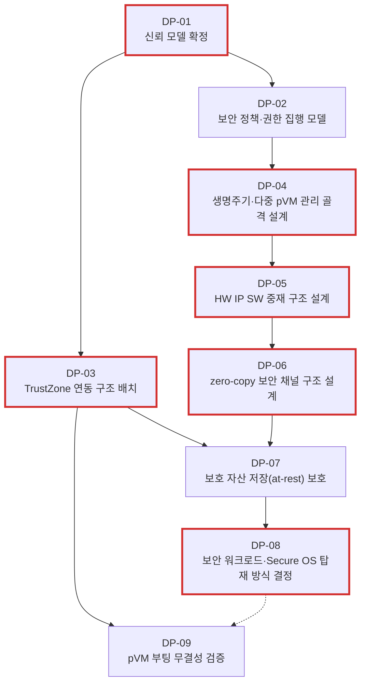

# Design Point 목록

> 본 문서는 `04_architectural_drivers.md` 5.2절의 설계 착수 순서(T-1 ~ T-5 연계 6단계), `99_additional_design_points.md`의 교차(cross-cutting) Design Point, 추가로 식별한 보안 정책 DP를 통합하여, 아키텍처 설계 착수 전 확정해야 할 **Design Point**를 정리한다.
>
> 진행 순서: 요구사항 수집 → 요구사항 도출 → QAW → Architectural Driver 선정 → **Design Point 목록(본 문서)**

---

## 1. 개요

Design Point(DP)는 Architectural Driver로부터 도출되는 구체적인 설계 결정 단위다. DP를 해결하기 전까지는 후보 구조를 평가할 기준이 성립하지 않는다.

격리 증빙·감사 체계, pVM 아이덴티티·채널 상대 인증, 침해 시도 탐지·변조 불가 로깅은 범위에서 제거했다. 남은 DP는 선행 의존성 기준으로 `DP-01`부터 `DP-09`까지 재정렬했다.

| 유형 | 설명 | 건수 |
|------|------|:----:|
| **T-연계 DP** | 핵심 기술 T-1 ~ T-5(또는 공통 전제)와 직결된 설계 결정 | 6건 |
| **교차 DP** | 단일 T에 속하지 않고 Driver에서 직접 요구되는 설계 결정 | 3건 |

---

## 2. Design Point 전체 목록

| DP ID | 제목 | 유형 | 관련 Driver | 선행 DP |
|-------|------|:----:|------------|---------|
| DP-01 | 신뢰 모델 확정 | T-연계 | QA-01, QA-02, CONST-02 | — |
| DP-02 | 보안 정책·권한 집행 모델 | 교차 | QA-01, QA-02, FR-03, FR-04, FR-06, CONST-02 | DP-01 |
| DP-03 | TrustZone 연동 구조 배치 | T-연계 | FR-08, CONST-03 | DP-01 |
| DP-04 | 생명주기·다중 pVM 관리 골격 설계 | T-연계 | FR-01, FR-02, CONST-01 | DP-02 |
| DP-05 | HW IP SW 중재 구조 설계 | T-연계 | FR-03, QA-03, QA-11, CONST-05 | DP-02, DP-04(병행) |
| DP-06 | zero-copy 보안 채널 구조 설계 | T-연계 | FR-04, QA-04, QA-05 | DP-05 |
| DP-07 | 보호 자산 저장(at-rest) 보호 | 교차 | QA-01 × FR-08 | DP-03, DP-06 |
| DP-08 | 보안 워크로드·Secure OS 탑재 방식 결정 | T-연계 | FR-06, FR-07, QA-07, QA-08, CONST-06 | DP-07 |
| DP-09 | pVM 부팅 무결성 검증 | 교차 | QA-01 × FR-06 | DP-03, DP-08(병행) |

---

### 2.1 DP 의존성 다이어그램

실선 화살표(`→`)는 선행 조건(해당 DP가 완료되어야 다음 DP를 착수할 수 있음), 점선 화살표(`-.->`)는 병행 착수 또는 결과를 참조하는 약한 의존성을 나타낸다. 빨간색 선은 critical path를, 빨간색 테두리는 T-연계 DP를 나타낸다.

## 3. Design Point 상세

---

#### DP-01: 신뢰 모델 확정

**산출근거 Driver**
- QA-01: Host 침해 시 pVM 내 보호 자산의 기밀성 보장
- QA-02: pVM 간 독립 격리 보장
- CONST-02: 기 포팅된 pKVM 커널을 전제로 하며 EL2 수정 불가

**선행 DP**
- 없음 — 본 DP는 전체 DP의 출발점이다. 여기서 확정되는 TCB 범위·공격자 모델·보호 속성이 후속 DP 전체의 후보 구조 평가 기준이 된다.

**문제 상황**
- pKVM이 Host 비신뢰라는 큰 방향은 제공하지만, 본 과제의 Host 측 프레임워크·커널 드라이버를 TCB 안에 둘지 밖에 둘지는 별도 결정이 필요하다.
- 신뢰 모델이 확정되지 않으면 HW IP 중재자, 보안 채널 중개자, 워크로드 검증 주체의 배치 기준이 흔들린다.
- 병렬 설계 중 팀별 신뢰 가정이 달라지면 전체 격리 주장(QA-01, QA-02)이 가장 약한 가정으로 무너진다.

**해결해야 할 설계질문**
- Host 측 프레임워크(미들웨어·커널 드라이버)는 TCB에 포함하는가, 아니면 비신뢰 영역으로 보는가?
- 공격자는 Host 커널 권한, pVM 내부 권한, 물리 접근 권한 중 어디까지 가진다고 가정하는가?
- 보호 속성은 기밀성·무결성까지인가, 가용성(DoS)도 포함하는가?
- EL2(pKVM), TrustZone EL3·S-EL1, 별도 서비스 pVM 중 어떤 컴포넌트를 신뢰 주체로 둘 것인가?
- 신뢰 모델 문서에는 TCB 목록, 공격자 모델, 보호 속성별 의존 메커니즘을 어떤 수준으로 명시할 것인가?

> 상세 논거: `99_trust_boundary_qna.md` 참조

---

#### DP-02: 보안 정책·권한 집행 모델

**산출근거 Driver**
- QA-01, QA-02: Host 및 pVM 간 비신뢰 전제에서 보호 자산과 도메인 격리 보장
- FR-03: HW IP 사용 권한과 DMA 경로 할당 필요
- FR-04: pVM 간 보안 채널 수립 권한 필요
- FR-06: 보안 워크로드 동적 탑재 권한 필요
- CONST-02: EL2 수정 불가 제약 아래 권한 집행 위치 결정 필요

**선행 DP**
- DP-01 (신뢰 모델 확정): Host 프레임워크가 TCB 밖이라면 권한 집행을 Host에 단독으로 둘 수 없으므로, TCB 범위와 신뢰 주체가 먼저 확정되어야 권한 집행 위치를 결정할 수 있다.

**문제 상황**
- pVM 생성, HW IP 사용, 채널 수립, 워크로드 로딩은 모두 권한 판단이 필요한 동작이다.
- Host가 비신뢰이면 Host 프레임워크가 단독으로 권한을 허가하는 구조는 QA-01, QA-02의 신뢰 모델과 충돌할 수 있다.
- 정책 모델이 없으면 DP-04와 DP-05가 서로 다른 권한 가정으로 설계될 위험이 있다.

**해결해야 할 설계질문**
- pVM 생성, HW IP 사용, 채널 수립, 워크로드 로딩 권한은 누가 정의·검증·집행하는가?
- 권한 정책은 워크로드 패키지 manifest, 도메인별 권한 테이블, 런타임 정책 중 무엇으로 표현하는가?
- EL2, TrustZone TEE, 별도 서비스 pVM, Host 프레임워크 중 어떤 컴포넌트가 어떤 권한을 집행하는가?
- 권한 불일치, 정책 위반, 권한 철회 시 pVM·채널·HW IP 할당을 어떻게 차단·회수하는가?
- DP-08의 패키지 manifest 권한을 DP-09의 측정값과 어떻게 연결할 것인가?

---

#### DP-03: TrustZone 연동 구조 배치

**산출근거 Driver**
- FR-08: pVM 워크로드가 기존 TrustZone Secure OS 기반 TEE 기능과 연동해야 함
- CONST-03: 기존 TrustZone Secure OS의 SMC 경로와 TEE 기능은 무회귀로 유지해야 함

**선행 DP**
- DP-01 (신뢰 모델 확정): TrustZone EL3·S-EL1을 신뢰 주체로 둘 것인지가 신뢰 모델에서 결정되어야, pVM→TEE 경로의 배치와 TEE를 신뢰 앵커로 사용하는 범위를 정할 수 있다.

**문제 상황**
- 기존 키 관리·인증 기능은 TrustZone TEE에 남아 있으므로 pVM 기반 신규 구조와 공존해야 한다.
- DP-07의 저장 보호와 DP-09의 부팅 무결성은 TrustZone TEE를 신뢰 앵커로 쓸 수 있는지에 따라 구조가 달라진다.
- 기존 SMC 경로를 깨면 신규 프레임워크 도입이 기존 제품 기능의 회귀로 이어질 수 있다.

**해결해야 할 설계질문**
- pVM이 기존 TEE를 호출할 때 SMC 포워딩·라우팅 경로를 어디에 둘 것인가?
- 기존 Host→TEE SMC 경로를 변경 없이 유지하면서 pVM→TEE 경로를 어떻게 추가할 것인가?
- pVM이 TEE를 호출할 때 호출 주체의 신뢰성을 TEE가 어떻게 확인할 것인가?
- DP-07의 키 관리와 DP-09의 이미지 검증에 TrustZone TEE를 사용할 것인가?
- TrustZone 연동 실패가 pVM, Host, 기존 TEE 기능에 어떤 영향을 주도록 제한할 것인가?

---

#### DP-04: 생명주기·다중 pVM 관리 골격 설계

**산출근거 Driver**
- FR-01: pVM 생성·시작·정지·종료와 자원 할당·회수 관리 필요
- FR-02: Secure Camera, Secure AI 등 다중 pVM 동시 운용 필요
- CONST-01: Android 스택 의존 없이 Linux 네이티브로 동작해야 함

**선행 DP**
- DP-02 (보안 정책·권한 집행 모델): pVM 생성·자원 할당 권한을 누가 정의·검증·집행하는지가 정해져야 pVM 제어 인터페이스에 권한 검증 지점을 배치할 수 있다.

**문제 상황**
- Secure Vision AI는 최소 두 개 이상의 pVM을 독립적으로 생성·운용해야 하며, 생명주기 관리 구조가 없으면 후속 HW IP 중재·보안 채널·탑재 방식 설계를 배치할 기준이 없다.
- Linux 네이티브 제약 때문에 Android AVF의 VirtualizationService 같은 구조를 그대로 사용할 수 없다.
- DP-05의 HW IP 중재 PoC는 기술 리스크가 크므로 DP-04 전체 완료를 기다리기보다 최소 계약이 정해지는 즉시 병행 착수할 필요가 있다.

**해결해야 할 설계질문**
- 생명주기 관리자, pVM 제어 인터페이스, 자원 할당자의 책임 경계를 어떻게 나눌 것인가?
- 도메인별 메모리·CPU·디바이스 자원을 어떤 단위로 분리·회수할 것인가?
- KVM ioctl, VFIO, dma-buf 등 어떤 Linux 네이티브 인터페이스를 기본 제어면으로 사용할 것인가?
- HV 파트와 확정해야 할 최소 pKVM hypercall 계약은 무엇인가?
- pVM 생성, 메모리 할당, hypercall 최소 계약 중 어떤 항목이 정해지면 DP-05 PoC를 병행 착수할 수 있는가?

---

#### DP-05: HW IP SW 중재 구조 설계

**산출근거 Driver**
- FR-03: ISP·NPU 등 HW IP를 Host와 pVM이 공유·할당할 수 있어야 함
- QA-03: HW IP DMA 경로 격리와 잔류 데이터 소거 필요
- QA-11: HW IP 공유·전환 오버헤드가 실시간성을 해치지 않아야 함
- CONST-05: 단일 컨텍스트 HW IP이며 HW 변경 불가

**선행 DP**
- DP-02 (보안 정책·권한 집행 모델): HW IP 사용 권한과 DMA 경로 할당 권한의 집행 주체가 정해져야 중재자 배치 후보(Host 커널 드라이버 vs 별도 서비스 pVM)를 일관된 권한 가정 위에서 평가할 수 있다.
- DP-04 (생명주기·다중 pVM 관리 골격 설계, 병행): HW IP 중재 PoC는 pVM 생성·메모리 할당·hypercall 최소 계약만 확보되면 착수할 수 있으므로, DP-04 전체 완료를 기다리지 않고 최소 계약 확정 즉시 병행 착수한다.

**문제 상황**
- ISP·NPU는 다중 컨텍스트를 지원하지 않는 공유 자원이므로 Host와 pVM의 동시 사용 요구를 SW 중재로 풀어야 한다.
- 중재자를 Host 커널에 두면 Host 비신뢰 전제 때문에 격리는 SMMU/IOMMU와 신뢰 주체가 보장해야 한다.
- 중재자를 별도 서비스 pVM에 두면 신뢰 경계는 좋아질 수 있으나 전환 지연과 구현 복잡도가 증가할 수 있다.
- HW IP 공유는 본 과제의 핵심 기술 리스크이므로 조기 PoC가 필요하다.

**해결해야 할 설계질문**
- HW IP 중재자는 Host 커널 드라이버에 둘 것인가, 별도 서비스 pVM에 둘 것인가?
- pVM 사용 구간의 SMMU/IOMMU 설정은 누가 제어하고, Host 조작을 어떻게 차단할 것인가?
- 사용 주체 전환 시 HW IP 내부 버퍼·레지스터의 잔류 데이터는 언제, 누가, 어떻게 소거할 것인가?
- 중재·전환 오버헤드는 어떤 시나리오와 수치 기준으로 측정할 것인가?
- DP-04의 어떤 최소 기능이 확보되면 HW IP 중재 PoC를 병행 착수할 수 있는가?

---

#### DP-06: zero-copy 보안 채널 구조 설계

**산출근거 Driver**
- FR-04: pVM↔pVM, pVM↔Host 간 보안 채널 제공 필요
- QA-04: Secure Vision AI 파이프라인의 실시간 처리 필요
- QA-05: 도메인 간 통신 오버헤드가 실시간성을 해치지 않아야 함

**선행 DP**
- DP-05 (HW IP SW 중재 구조 설계): Secure Camera→Secure AI 영상 데이터는 ISP·NPU의 DMA 버퍼와 직결되므로, HW IP 중재 구조의 버퍼 소유권과 DMA 경로가 확정되어야 zero-copy 공유 메모리 구조를 결정할 수 있다.

**문제 상황**
- Secure Camera에서 Secure AI로 전달되는 영상 데이터는 대용량이므로 복사 기반 전달은 성능 병목이 될 가능성이 높다.
- Host가 비신뢰인 상황에서도 공유 메모리 기반 zero-copy 채널의 내용을 Host가 읽거나 변조하지 못해야 한다.
- 제어 경로와 데이터 경로를 섞으면 보안 정책, 실패 처리, 성능 측정이 복잡해질 수 있다.

**해결해야 할 설계질문**
- Secure Camera→Secure AI 영상 데이터는 어떤 공유 메모리 구조로 zero-copy 전달할 것인가?
- RPC 제어 경로와 공유 메모리 데이터 경로를 어떻게 분리할 것인가?
- 채널 수립·해제·재협상 절차와 실패 처리는 어떻게 정의할 것인가?
- Host가 채널 버퍼를 열람하거나 재매핑하지 못하도록 어떤 Stage-2/SMMU 정책을 적용할 것인가?
- 인증·권한 확인 결과를 채널 수립 절차에 어떻게 반영할 것인가?

---

#### DP-07: 보호 자산 저장(at-rest) 보호

**산출근거 Driver**
- QA-01: Host 침해 시 AI 모델 가중치·영상 원본·추론 중간 데이터가 노출되지 않아야 함
- FR-08: 기존 TrustZone TEE의 키 관리·인증 기능과 연동 가능

**선행 DP**
- DP-03 (TrustZone 연동 구조 배치): 암호화 키의 생성·보관 주체로 TrustZone TEE를 사용할 수 있는지가 먼저 결정되어야 키 관리 주체(TEE·EL2·별도 키 관리 서비스)의 선택지를 평가할 수 있다.
- DP-06 (zero-copy 보안 채널 구조 설계): 복호화 키를 pVM에 전달하는 경로는 보안 채널 구조에 의존하므로, 채널 구조가 확정되어야 평문 노출 없는 키 전달 경로를 설계할 수 있다.

**문제 상황**
- 실행 중 메모리 격리가 유지되어도 AI 모델 가중치나 워크로드 패키지가 Host 파일시스템에 평문으로 저장되면 Host 침해 시 보호 자산이 노출된다.
- 저장 보호의 키 관리 주체는 TrustZone TEE, pKVM EL2, 별도 키 관리 서비스 중 어디를 신뢰할지에 따라 달라진다.
- 복호화 시점과 키 전달 경로가 잘못 설계되면 실행 직전 또는 로딩 과정에서 평문이 Host에 노출될 수 있다.

**해결해야 할 설계질문**
- AI 모델 가중치, 워크로드 패키지, 설정 파일 중 어떤 자산을 저장 시 암호화할 것인가?
- 암호화 키는 TrustZone TEE, pKVM EL2, 별도 키 관리 서비스 중 누가 생성·보관·사용할 것인가?
- 암호화 범위는 패키지 단위, 파일 단위, 파일시스템 전체 중 무엇으로 할 것인가?
- 복호화는 어느 시점에 수행하고, 복호화 키는 어떤 경로로 pVM에 전달할 것인가?
- 키 회전, 폐기, 워크로드 삭제 시 저장 자산을 어떻게 무효화할 것인가?

---

#### DP-08: 보안 워크로드·Secure OS 탑재 방식 결정

**산출근거 Driver**
- FR-06: 신규 보안 워크로드를 펌웨어 재배포 없이 동적으로 탑재해야 함
- FR-07: 이식·수정된 기존 Secure OS를 pVM 게스트로 실행해야 함
- QA-07: 프레임워크 소스 수정 없이 신규 워크로드를 수용해야 함
- QA-08: Secure OS 교체 시 관련 없는 SW는 수정되지 않아야 함
- CONST-06: Secure OS 신규 개발은 제외하고 기존 Secure OS 이식·수정만 범위에 포함

**선행 DP**
- DP-07 (보호 자산 저장(at-rest) 보호): 워크로드 패키지의 저장 암호화 범위와 복호화 시점이 패키지 형식과 로딩 절차를 좌우하므로, 저장 보호 방식이 먼저 결정되어야 한다.

**문제 상황**
- 다양한 보안 워크로드와 Secure OS를 매번 프레임워크 수정으로 수용하면 R-4 동적 확장성과 QA-07이 성립하지 않는다.
- 패키지 형식, 부팅 규칙, 가상 디바이스, 통신 규칙이 불명확하면 Secure OS 이식팀과 프레임워크 개발팀의 결합도가 커진다.
- Secure OS 교체 시 무관 SW 무수정을 보장하려면 교체 가능한 경계와 호환성 규칙이 먼저 정해져야 한다.

**해결해야 할 설계질문**
- 워크로드 패키지는 이미지, 메타데이터, 권한 manifest, 설정을 어떤 구조로 포함해야 하는가?
- pVM 게스트의 부팅 규약, 가상 디바이스 인터페이스, pVM↔프레임워크 통신 규약은 어디까지 표준화할 것인가?
- 워크로드 설치·로딩·교체 절차는 어떤 단계와 검증 지점을 가져야 하는가?
- Secure OS 교체 시 프레임워크, Host 미들웨어, 타 워크로드가 수정되지 않도록 어떤 추상화 경계를 둘 것인가?
- DP-09의 이미지 검증과 DP-02의 권한 정책을 패키지 탑재 절차에 어떻게 연결할 것인가?

---

#### DP-09: pVM 부팅 무결성 검증

**산출근거 Driver**
- QA-01: Host 침해 시 보호 자산이 악성 pVM 또는 변조된 워크로드로 노출되지 않아야 함
- FR-06: 비신뢰 Host 환경에서 보안 워크로드를 동적으로 로딩해야 함

**선행 DP**
- DP-03 (TrustZone 연동 구조 배치): 이미지 서명 검증과 측정값 보관에 TrustZone TEE를 신뢰 앵커로 사용할 수 있는지에 따라 검증 주체의 선택지가 달라진다.
- DP-08 (보안 워크로드·Secure OS 탑재 방식 결정, 병행): 검증 지점은 패키지 형식과 설치·로딩·교체 절차에 맞물리므로, 탑재 방식 설계와 병행하여 검증 절차를 결정한다.

**문제 상황**
- Host가 비신뢰이면 Host가 로딩하는 pVM 이미지와 워크로드 패키지가 실제 승인된 코드인지 별도로 검증해야 한다.
- 검증 주체를 Host에만 두면 Host 침해 시 우회될 수 있고, EL2 검증은 CONST-02(EL2 수정 불가) 제약을 받는다.
- 저장 보호와 정책 집행은 부팅된 이미지가 승인된 코드인지에 대한 측정·검증 결과를 필요로 한다.

**해결해야 할 설계질문**
- pVM 이미지와 워크로드 패키지의 서명 검증은 EL2, Host 드라이버, 별도 서비스 pVM, TrustZone TEE 중 누가 수행할 것인가?
- measured boot 체인은 어디서 시작하고 어디서 종료할 것인가?
- EL2 수정 없이 이미지 진위와 측정값을 신뢰할 수 있게 만드는 방법은 무엇인가?
- 검증 실패 시 pVM 생성, 워크로드 로딩, 채널 수립을 어떻게 차단할 것인가?
- 부팅 측정값을 DP-02의 정책 manifest 및 DP-07의 키 방출 조건과 어떻게 연결할 것인가?
