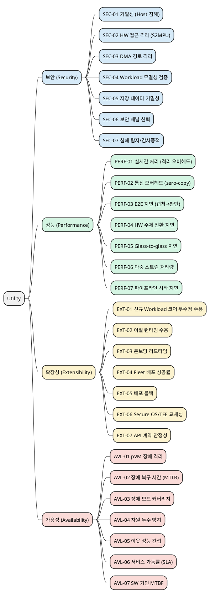

# QA Utility Tree 및 측정 방법 (재편)

> 본 문서는 `03_utility_tree.md`의 QA를 **보안/성능/확장성/가용성** 4개 관점으로 재편하고,
> 각 관점당 7개 QA(총 28개)로 확장하여 응답 측정치와 측정 방법을 정리한다.
>
> 관련 문서: [`02_requirements.md`](02_requirements.md), [`03_quality_attribute_specification.md`](03_quality_attribute_specification.md), [`03_utility_tree.md`](03_utility_tree.md), [`05_decision_points.md`](05_decision_points.md), [`99_reference_scenario_flow.md`](99_reference_scenario_flow.md), [`99_security_qa_metrics.md`](99_security_qa_metrics.md)

---

## 1. 측정 원칙

- **게이트(불변가치, O/X)**: 위반 시 출하 불가인 릴리스 조건. "노출 0건", "권한 중첩 0", "memcpy 0회", "코어 수정 0 LoC", "다운타임 0" 등이 해당한다. 이것은 KPI가 아니라 정의상 조건이다.
- **KPI(연속값)**: 게이트의 신뢰도·달성도를 추세로 관리 가능한 연속 지표. "0건"은 시험한 범위 안에서의 0건이므로, KPI는 대부분 *시험의 깊이·커버리지*와 *성능 예산 소모율*을 측정한다.
- 각 관점에서 앞번호(1~4)는 **기술 검증 축**(PoC/CI 단계), 뒷번호는 **규제·계약 축**(인증/운용 단계)으로 배치하여 측정 시점을 구분한다.
- 수치 목표는 가정치이며, 로봇 제조사 협의 및 PoC 결과에 따라 보정한다.

---

## 2. Utility Tree

---

## 3. 보안 (Security)

| ID | 품질 속성 | 응답 측정치 (게이트 / KPI) | 측정 방법 | 중요도/난이도 | 연관 |
|---|---|---|---|:---:|---|
| SEC-01 | 기밀성 (Host 침해) | **게이트**: 노출 0건 / **KPI**: 공격 벡터 자동화 커버리지 100%, TCB 규모(KLoC) 및 릴리스당 증가율 5% 이내, 경계 돌파 최소 공격 잠재력(CEM) 25점 이상 | pVM 내 canary 마커 주입 후 root Host가 `/proc/kcore`·`/dev/mem`·DMA로 전체 덤프, 마커 검출 자동 판정. 생명주기 13단계(특히 할당/회수)마다 반복. TCB는 신뢰 코드 LoC 집계, 분기별 침투 시험으로 CC/CEM 공격 잠재력 산정 | H/H | QA-01, DP1 |
| SEC-02 | HW 접근 격리 (S2MPU) | **게이트**: 권한 중첩 0 / **KPI**: 무위반 누적 전환 10^6회, 잔류 스캔 커버리지 100% | 전환 이벤트마다 권한 비트맵 로깅 후 오프라인 중첩 판정, 경합 스트레스 하네스로 고빈도 강제 전환 | H/H | QA-02, DP4 |
| SEC-03 | DMA 경로 격리 | **게이트**: 비할당 도메인 접근 0 / **KPI**: DMA 공격 벡터 구현율 100% | Thunderclap형 DMA 공격으로 비할당 메모리 접근 시도, SMMU/S2MPU 설정 조합별 카탈로그 전수 시험 | H/H | QA-02, DP4 |
| SEC-04 | Workload 무결성 검증 | **게이트**: 미검증 이미지 탑재 0건, 변조 이미지 탐지율 100% / **KPI**: 검증 소요 p99, IEC 62443-4-2 EDR 요구항목 충족률(SL2 100%, SL3 추적 목표 90% 이상) | 서명/manifest/버전/해시 변조 케이스를 주입하고 탑재 거부 여부 확인. 검증 주체가 Host 침해와 독립인지 경로 검증. secure boot·서명 업데이트 등 SL2 핵심 요구를 ISASecure CSA 항목별로 대사 | H/H | DP2, IEC 62443 |
| SEC-05 | 저장 데이터 기밀성 | **게이트**: 파일시스템 침해 시 평문 노출 0건 / **KPI**: 부채널 TVLA t-값 4.5 미만, 키 회전 지연 | Host 파일시스템에서 저장 blob 덤프 후 평문 패턴 스캔. ENC/DEC 경로 전력/EM 부채널 시험(ISO/IEC 17825) | H/H | DP6, QA-01 |
| SEC-06 | 보안 채널 신뢰 | **게이트**: 비인가 주체 TEE 호출 성립 0건 / **KPI**: 호출자 신원·무결성 검증 커버리지 100% | pVM→TEE RPC에 위조 신원으로 호출 주입, 무결성 미확인 호출 차단 여부 확인. 기존 Host→TEE 경로 후방호환 검증 | H/M | DP5 |
| SEC-07 | 침해 탐지/감사증적 | **KPI**: 비정상 접근 탐지 MTTD, 포렌식 로그 확보 24h 이내, 심각 패치 리드타임(Critical 30일) | 침해 시도 주입 후 감사로그 생성·수집 시각 계측. CRA 취약점 보고(24h/72h/14일)·GDPR 72h 통지 이행 가능성 검증 | M/M | CRA, GDPR |

## 4. 성능 (Performance)

| ID | 품질 속성 | 응답 측정치 (게이트 / KPI) | 측정 방법 | 중요도/난이도 | 연관 |
|---|---|---|---|:---:|---|
| PERF-01 | 실시간 처리 (격리 오버헤드) | **KPI**: 비격리 baseline 대비 저하 10% 이내, 30fps 유지, 드롭율 0.1% 이하 | 동일 HW에서 격리/비격리 구성 fps 병행 측정. Host idle/통상/스트레스 부하 매트릭스 | H/H | QA-03 |
| PERF-02 | 통신 오버헤드 (zero-copy) | **게이트**: 데이터 경로 memcpy 0회 / **KPI**: 전달 지연 p99 5ms, 프레임당 전환 비용 1ms 이하, 파이프라인 전력 효율(fps/W) 저하 10% 이내 | 복사 계열 함수 프로파일 히트 0 확인, dma-buf fence 타임스탬프로 핸드오프 지연, ftrace로 프레임당 hypercall 계측, PMIC 텔레메트리로 fps/W 측정(복사·전환 과다는 전력으로 드러남) | H/M | QA-05, QA-07, DP3 |
| PERF-03 | E2E 지연 (캡처→판단) | **KPI**: p99 100ms 이하, 표준 모델 SingleStream 추론 지연 p90(비격리 대비 상대 성능 90% 이상) | 캡처 HW 타임스탬프(PTS)를 파이프라인 끝까지 전파, 단계별 지연 분해. 추론 구간은 MLPerf Inference(Edge, SingleStream) 방식 p90으로 측정하여 고객 비교 평가와 정합 | H/H | QA-03, MLPerf |
| PERF-04 | HW 주체 전환 지연 | **KPI**: p99 10ms 이하 (프레임 주기 33ms의 1/3) | 전환 구간 타임스탬프 계측, DP4 조기 PoC 합격 기준으로 사용 | H/H | DP4 |
| PERF-05 | Glass-to-glass 지연 | **KPI**: 캡처→운영자 화면 p95 200ms 이하 | 화면 타임코드 캡처 방식으로 캡처~표시 실측. 인코딩/전송/표시 포함 상품 레벨 지표 | M/M | 시장(관제) |
| PERF-06 | 다중 스트림 처리량 | **KPI**: 1080p30 동시 2스트림 이상(4스트림 목표), 채널 지속 처리량 190MB/s 이상 | 다중 카메라 스트림 동시 인가 상태에서 프레임별 지속 처리량·드롭율 측정 | M/M | 시장(다중 카메라) |
| PERF-07 | 파이프라인 시작 지연 | **KPI**: 시작 요청→첫 프레임 cold start p95 (예: 2초 이하) | 레퍼런스 시나리오 1~9단계(검증·pVM 생성·탑재·채널구성) 소요 분해 계측 | M/M | 시나리오 1~9 |

## 5. 확장성 (Extensibility)

| ID | 품질 속성 | 응답 측정치 (게이트 / KPI) | 측정 방법 | 중요도/난이도 | 연관 |
|---|---|---|---|:---:|---|
| EXT-01 | 코어 무수정 수용 | **게이트**: Framework 코어 수정 0 LoC / **KPI**: breaking change 0건 추세 | 신규 Workload 추가 전후 코어 디렉터리 diff를 CI로 자동 검사 | H/H | QA-04, DP2 |
| EXT-02 | 이질 런타임 수용 | **KPI**: 이질 파일럿 Workload 수용 3종 이상(C 네이티브/Python 추론/서드파티 바이너리) | 런타임·의존성이 다른 3종을 실제 패키징/탑재하여 계약 일반성 검증 | H/H | DP2 |
| EXT-03 | 온보딩 리드타임 | **KPI**: 신규 Workload 통합 평균 5인일 이내 | 파일럿 온보딩 공수 실측 | M/M | 시장 |
| EXT-04 | Fleet 배포 성공률 | **KPI**: 릴리스 wave당 98.5% 이상, 수동 개입 없이 | fleet OTA 배포 결과 집계(성공/재개/재시도), canary 1% 선행 | H/M | 시장 OTA(arc42) |
| EXT-05 | 배포 롤백 | **게이트**: 배포 실패 시 fleet 벽돌화 0건 / **KPI**: 이전 버전 복원 2분 이내·실패 케이스 99.9% 성공 | 500대급 장애 주입으로 A/B 슬롯 롤백 성공률·시간 측정 | H/M | 시장 OTA, DP2 |
| EXT-06 | Secure OS/TEE 교체성 | **게이트**: 인터페이스 외 재이식 파일 0개 / **KPI**: 교체 대응 공수 | Secure OS 교체 전후 diff에서 GP 표준 인터페이스 외 변경 파일 수 카운트 | M/M | QA-09, DP5 |
| EXT-07 | API 계약 안정성 | **KPI**: Workload API breaking change 건수/릴리스 0 유지 | 릴리스마다 공개 API 표면 diff로 호환성 파괴 변경 계수 | M/M | DP2 |

## 6. 가용성 (Availability)

| ID | 품질 속성 | 응답 측정치 (게이트 / KPI) | 측정 방법 | 중요도/난이도 | 연관 |
|---|---|---|---|:---:|---|
| AVL-01 | pVM 장애 격리 | **게이트**: 장애 전파로 인한 Host/타 pVM 다운타임 0 | 장애 주입 중 이웃 pVM·Host 동작 지속 여부 확인 | H/M | QA-06, DP1 |
| AVL-02 | 장애 복구 시간(MTTR) | **KPI**: p99 3초 이내 (검출 0.5s / 회수 1s / 재기동 1.5s 분해) | watchdog 타임스탬프로 검출~재개 분해 계측 | H/M | DP1 |
| AVL-03 | 장애 모드 커버리지 | **KPI**: 장애 카탈로그(크래시/hang/부팅실패/OOM/채널소실) 주입 구현율 100% | 장애 주입 프레임워크로 모드별 자동 주입 | H/M | DP1 |
| AVL-04 | 자원 누수 방지 | **KPI**: 1,000회 crash-restart soak 기준 누수율 0 수렴 | 반복 장애 후 Framework 자원 원장과 실제 커널 상태 대사(reconciliation) | H/M | DP1 |
| AVL-05 | 이웃 성능 간섭 | **KPI**: 장애/재시작 중 정상 pVM fps 저하 5% 이내 | 장애 주입 중 이웃 pVM fps 병행 모니터링 | M/M | QA-06 |
| AVL-06 | 서비스 가동률(SLA) | **KPI**: 99.9% 이상/월 (월 다운타임 예산 약 43분) | fleet 운용 텔레메트리로 가동/다운 시간 집계, 가동률 = MTBF/(MTBF+MTTR) | M/M | 시장 AMR SLA |
| AVL-07 | SW 기인 MTBF | **KPI**: 5,000시간 이상 (플랫폼 SW 기인 장애만 계수) | fleet 누적 가동시간/SW 기인 장애 수로 population MTBF 산정 | M/M | 시장 신뢰성 |

---

## 7. 원본 QA 매핑

| 원본 (03_utility_tree.md) | 재편 후 위치 |
|---|---|
| QA-01 (Host 침해 기밀성) | SEC-01, SEC-05 |
| QA-02 (HW 접근 격리) | SEC-02, SEC-03 |
| QA-03 (실시간 처리) | PERF-01, PERF-03 |
| QA-04 (Workload 수용) | EXT-01, EXT-02 |
| QA-05 (통신 오버헤드) | PERF-02 |
| QA-06 (pVM 장애 격리) | AVL-01, AVL-05 |
| QA-07 (자원 효율) | PERF-01/PERF-06의 예산 KPI로 흡수 |
| QA-08 (시험 용이성) | SEC-01~03의 커버리지 KPI로 흡수 |
| QA-09 (Secure OS 교체) | EXT-06 |

> 자원 효율(QA-07)과 시험 용이성(QA-08)은 독립 리프 대신 각 관점의 KPI/게이트로 흡수했다. 필요 시 별도 관점으로 복원 가능하다.

---

## 8. 시장 근거 출처

- [Cyber Resilience Act — European Commission](https://digital-strategy.ec.europa.eu/en/policies/cyber-resilience-act) — 취약점 보고(24h/72h/14일), 최소 5년 보안 업데이트 지원
- [ISA/IEC 62443 Security Level 2 as a Minimum (ISASecure)](https://www.isasecure.org/) — 임베디드 기기 시장 최소 보안 수준
- [Latency in live network video surveillance (Axis 백서)](https://whitepapers.axis.com/en-us/latency-in-live-network-video-surveillance) — 감시 영상 지연 구성 요소
- [Glass-to-glass 지연 측정 (Vay)](https://vay.io/how-to-measure-glass-to-glass-video-latency/) — 원격 제어 200ms 요건
- [Fleet OTA updates with safe rollback — arc42 Quality Model](https://quality.arc42.org/requirements/fleet-ota-updates-with-safe-rollback) — 배포 성공률 98.5%, 롤백 2분/99.9%
- [MTBF/MTTR와 가용성 관계 (Atlassian)](https://www.atlassian.com/incident-management/kpis/common-metrics) — 가용률 산정
- MLPerf Inference (Edge, SingleStream) — 엣지 AI 추론 지연 벤치마크 방법론
- ISO/IEC 17825 (TVLA) / FIPS 140-3 — 부채널 누출 판정 기준 (t-값 4.5)
