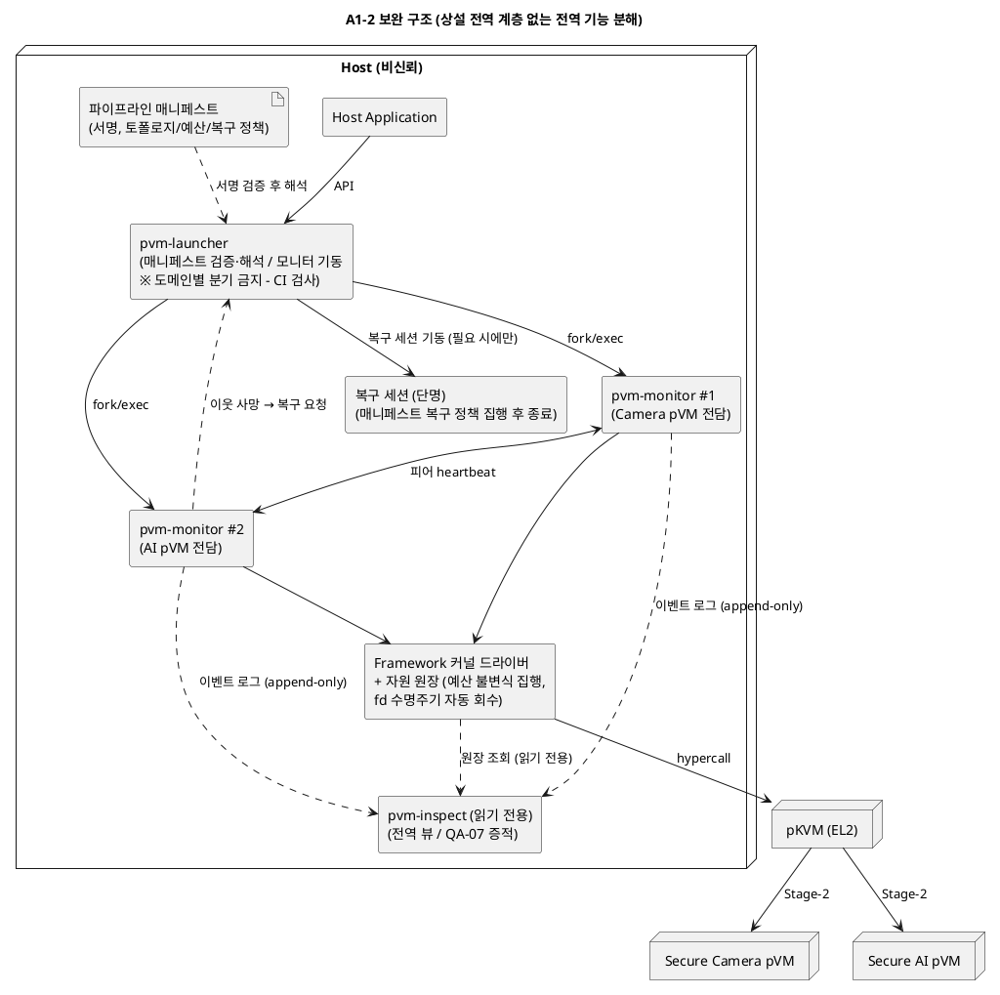

# DP-A1 후보 상세 비교 — A1-2 (pVM별 인스턴스 모니터) vs A1-4 (계층형 하이브리드)

> 본 문서는 `08_candidate_architectures.md`의 DP-A1(pVM 관리 골격/제어 평면 구조) 후보 중 2번째 후보 **A1-2. pVM별 위임형 인스턴스 모니터**와 4번째 후보 **A1-4. 계층형 하이브리드(중앙 코디네이터 + per-pVM 모니터)** 를 기능별/품질속성별로 상세 비교하고, A1-2 채택 시 약점을 보완하는 설계안을 제안한다.
>
> 근거 문서: `08_candidate_architectures.md` 1장(DP-A1), `06_qa_utility_tree_metrics.md`(SEC/AVL/EXT KPI), `02_requirements.md`(FR/QA), `99_reference_scenario_flow.md`(시나리오 1~13단계)

---

## 목차

1. [비교 대상 요약](#1-비교-대상-요약)
2. [기능별 비교](#2-기능별-비교)
3. [품질속성별 비교](#3-품질속성별-비교)
4. [비교 종합](#4-비교-종합)
5. [A1-2 선택 시 약점 보완 설계안](#5-a1-2-선택-시-약점-보완-설계안)

---

## 1. 비교 대상 요약

| 항목 | A1-2. pVM별 인스턴스 모니터 | A1-4. 계층형 하이브리드 |
|------|---------------------------|------------------------|
| 핵심 아이디어 | 중앙에는 최소 기능 런처만 두고, pVM마다 전용 모니터 프로세스가 생명주기를 전담 | 중앙 코디네이터가 전역 결정(정책·원장·오케스트레이션)을, pVM별 모니터가 개별 집행을 담당하는 2계층 감독 트리 |
| 구성요소 | `pvm-launcher` + `pvm-monitor[i]` + 커널 드라이버(fd 기반 자원 소유권) | `pvm-coordinator` + `pvm-monitor[i]` + 커널 드라이버 |
| 전역 상태 소유자 | 없음 (커널 fd 수명주기만이 사실상의 원장) | 코디네이터 (자원 예산·파이프라인 토폴로지 원장) |
| 선행 사례 | Android AVF의 `crosvm` per-instance 구조 (08 문서 1.5절) | Android AVF의 `VirtualizationService`/`virtmgr`가 결합된 형태에 근접 |

두 후보는 "pVM별 모니터 프로세스 격리"라는 하부 구조를 공유하며, 차이는 **모니터 위에 전역 조정 계층(코디네이터)을 상설로 두는가**에 있다. 따라서 비교의 실질은 "전역 조정 계층의 가치가 그 복잡도 비용을 정당화하는가"이다.

## 2. 기능별 비교

제어 평면이 수행해야 하는 기능(시나리오 1~6단계 + 장애 복구)을 기준으로, 각 기능을 어느 구성요소가 어떻게 담당하는지 비교한다.

| 기능 | A1-2. 인스턴스 모니터 | A1-4. 계층형 하이브리드 | 비고 |
|------|----------------------|------------------------|------|
| Framework API 수신 (시나리오 1) | `pvm-launcher`가 수신. 상태를 최소로 유지 | `pvm-coordinator`가 수신 | 동등 |
| 정책 결정 (PDP) | 런처가 기동 시점에 1회 확인. 전역 정책의 상설 소유자는 없음 | 코디네이터가 전역 PDP 상설 담당 | A1-4는 실행 중 정책 변경·재평가가 자연스러움 |
| 정책 집행 (PEP) | 각 모니터가 자체 집행 (seccomp/최소 권한) | 각 모니터가 집행 — PDP/PEP 분리가 명시적 | A1-4가 역할 경계 명확 |
| pVM 생성/시작/정지/종료 (FR-01) | 모니터 전담 | 모니터 집행 (코디네이터 승인 후) | 동등 (홉 1회 차이) |
| vCPU 실행 | 모니터 프로세스 내부 스레드 | 모니터 프로세스 내부 스레드 | 동등 |
| 자원 예산 관리 (전역 한도, QA-06) | **소유자 부재** — 커널 fd 단위 소유권만 존재, 전역 예산 불변식(총 메모리 한도 등)의 집행 지점이 없음 | 코디네이터가 자원 원장으로 중앙 관리 | A1-2의 대표 공백 |
| 다중 pVM 파이프라인 오케스트레이션 (FR-02, 시나리오 1~6) | **배치 애매** — 런처에 쌓이면 A1-1로 회귀 위험 | 코디네이터가 명시적 소유 | A1-2의 대표 공백 |
| 장애 감지·1차 처리 | 각 모니터가 자기 pVM만 감지·처리 | 모니터가 1차 처리 | 동등 |
| 모니터(관리 주체) 장애 복구 | 커널이 fd 수명주기로 자원 자동 회수. **재기동 조정자는 없음** | 코디네이터가 모니터 재기동 (감독 트리) | A1-4가 체계적 |
| 파이프라인 단위 복구 (Camera+AI 동시 재구성) | **상위 조정자 필요** — 구조 내 해답 없음 | 코디네이터가 파이프라인 단위로 오케스트레이션 | A1-2의 대표 공백 |
| 코디네이터/런처 자체 장애 시 | 런처는 무상태에 가까워 재기동 단순. 실행 중 파이프라인 영향 없음 | 모니터 독립 생존 후 재접속(reconciliation)으로 원장 재구성 — 프로토콜 부실 시 원장 불일치가 새 장애 모드 | A1-2가 단순·강건 |
| 자원 회수 (관리 주체 사망 시) | 커널 fd 수명주기 자동 회수 — 구조적 보장 | 동일 드라이버 사용 시 동일 보장 + 원장 정리 필요 | A1-2가 회수 경로 단일 |
| 신규 도메인 유형 추가 (QA-03, R-4) | 모니터 프로세스 추가로 흡수 | 모니터 추가 + 코디네이터 구성 등록 | 동등 (둘 다 코어 무수정 가능) |

**요약**: 개별 pVM 단위 기능(생성·실행·감지·회수)은 두 후보가 동등하다. 차이는 **전역 기능 3종(자원 예산, 오케스트레이션, 파이프라인 단위 복구)** 에서 발생하며, A1-2는 이 3종의 소유자가 구조에 없고, A1-4는 코디네이터가 소유하는 대신 reconciliation 프로토콜이라는 새 복잡도를 도입한다.

## 3. 품질속성별 비교

기존 비교표(08 문서 1.3절)의 3축(기밀성·확장성·구현 비용)에 더해, DP-A1 문제 정의(P-A1-1~3)와 QA 목록에서 도출한 추가 품질속성 5축(가용성, 자원 효율, 시험용이성, 운영성/관측성, 상태 일관성)을 포함해 8축으로 비교한다. 등급 판정은 08 문서 1.4절의 KPI 측정 기준(상 = 구조 자체로 게이트 충족, 중 = 부가 메커니즘 의존, 하 = 게이트 위반 위험)을 따른다.

| 품질속성 (참조 QA/KPI) | A1-2. 인스턴스 모니터 | A1-4. 계층형 하이브리드 | 판정 근거 |
|------------------------|----------------------|------------------------|-----------|
| **기밀성** (QA-01 / SEC-01) | **중** — 모니터별 최소 권한(seccomp, 별도 주소 공간)으로 개별 공격면이 작고 권한이 pVM 단위로 분산. 단 모니터가 담당 pVM의 메모리 구성 권한을 가지므로 모니터 침해 시 해당 pVM 격리는 hypercall 검증에 의존 | **중** — 모니터 계층은 A1-2와 동일하나, 코디네이터가 전역 정책·토폴로지 결정권을 보유해 코디네이터 침해 시 영향 범위가 전 pVM에 걸침(단일 고가치 표적). TCB 기여 KLoC도 코디네이터만큼 큼 | 두 후보 모두 관리 코드가 비신뢰 영역에 있어 "상"은 불가(그건 A1-5의 영역). 권한 분산 관점에서 A1-2가 미세 우위 |
| **가용성** (QA-05 / AVL-01, AVL-02) | **상(격벽) / 중(복구)** — 모니터 크래시가 타 pVM에 비전파(AVL-01 게이트 구조 충족). 단 파이프라인 단위 복구의 조정자가 없어 복구 시간 p99 3초(AVL-02)는 보완 설계 없이는 보장 곤란 | **상** — 격벽 + 감독 트리로 검출→회수→재기동이 체계화. 코디네이터 장애도 모니터 독립 생존으로 흡수. 단 reconciliation 실패 시 원장 불일치가 새 장애 모드 | 격벽은 동등, 복구 체계는 A1-4 우위. A1-2는 5절 보완으로 격차 축소 가능 |
| **확장성** (QA-03 / EXT-01, EXT-02) | **상** — 도메인 추가 = 모니터 프로세스 추가. 코어 diff 0 LoC 달성 용이 | **상** — 동일 + 코디네이터가 구성(manifest) 기반이면 등록도 데이터로 흡수 | 동등. 단 A1-4는 코디네이터에 도메인 유형별 분기가 생기기 시작하면 EXT-01 게이트 위반으로 미끄러질 위험 |
| **구현 비용** (EXT-03/06 공수 계측 원용) | **중간** — 신규 모듈 2~3개(런처, 모니터, 드라이버 확장). crosvm 등 선행 사례 재사용 폭이 큼 | **높음** — 신규 모듈 3~4개 + 감독/보고/재접속(reconciliation) 프로토콜 1종 신설. 프로토콜 정합성 검증 공수가 추가 | A1-2 우위. reconciliation은 설계·시험 모두에서 비용의 중심 |
| **자원 효율** (QA-06) | **중상** — pVM당 프로세스 1개. 런처는 유휴 시 상주 비용 극소 | **중** — pVM당 프로세스 1개 + 상설 코디네이터 1개 + 주기적 상태 보고 트래픽 | 절대 차이는 작으나(프로세스 1개 + IPC), QA-06 한도가 빡빡한 임베디드 프로파일에서는 유의미 |
| **시험용이성** (QA-07) | **상** — 구성요소 간 상호작용이 "런처→모니터 기동" 단방향뿐. 모니터 단위 격리 시험이 독립적. 장애 주입 시나리오(AVL-03) 조합 수가 작음 | **중** — reconciliation 프로토콜의 상태 조합(코디네이터 재시작 × 모니터 상태 × 진행 중 요청)이 시험 공간을 지배. 08 문서도 "정합성 검증이 채택의 필수 전제"로 명시 | A1-2 우위. A1-4는 시험 공수가 구현 공수에 비례해 증가 |
| **운영성/관측성** | **중하** — 전역 상태 조회 지점이 없어 "지금 파이프라인이 몇 개, 자원이 얼마" 질의에 각 모니터를 순회해야 함. 운영 도구가 별도 필요 | **상** — 코디네이터 원장이 단일 조회 지점(single pane). 감사 추적·증적(QA-07 증빙) 수집도 한곳에 모임 | A1-4 우위. A1-2의 대표 약점 |
| **상태 일관성** | **중** — 원장이 없어 "원장 불일치"라는 장애 모드 자체가 없음. 대신 전역 불변식(총 예산 초과 금지)을 사전 집행할 지점이 없어 사후 실패(자원 부족 시 기동 실패)로 나타남 | **중상** — 원장으로 사전 집행 가능. 단 원장-실상태 불일치 위험을 reconciliation 품질로 막아야 함(조건부) | 성격이 다른 트레이드오프: A1-2는 "집행 공백", A1-4는 "불일치 위험" |

### 3.1 품질속성별 우위 요약

| 품질속성 | 우위 | 격차 정도 |
|----------|------|----------|
| 기밀성 | A1-2 (미세) | 소 — 둘 다 "중", 권한 분산 vs 고가치 표적의 차이 |
| 가용성 (격벽) | 동등 | — |
| 가용성 (복구 체계) | A1-4 | 중 — A1-2는 보완 설계로 축소 가능 |
| 확장성 | 동등 | — |
| 구현 비용 | A1-2 | 대 — reconciliation 프로토콜 유무가 결정적 |
| 자원 효율 | A1-2 | 소 |
| 시험용이성 | A1-2 | 중 |
| 운영성/관측성 | A1-4 | 중 — A1-2는 보완 설계로 축소 가능 |
| 상태 일관성 | A1-4 (조건부) | 소 — reconciliation 품질이 전제 |

## 4. 비교 종합

- **A1-4가 이기는 축**(복구 체계, 운영성, 상태 일관성)은 모두 "전역 조정 계층의 존재"에서 나오고, **A1-2가 이기는 축**(구현 비용, 시험용이성, 자원 효율, 기밀성 미세 우위)은 모두 "그 계층의 부재"에서 나온다. 즉 이 비교는 개별 속성의 우열이 아니라 **상설 코디네이터 계층 하나를 살 것인가의 단일 결정**이다.
- 본 과제의 레퍼런스 범위(2-도메인 Camera→AI 파이프라인, 장시간 상시 실행, 생성 빈도 낮음)에서는 전역 조정이 필요한 순간이 "파이프라인 구성 시"와 "파이프라인 단위 복구 시"의 두 지점뿐이다. 상설 코디네이터가 상시 하는 일이 적다.
- 따라서 **A1-2를 기반으로 채택하되, A1-4가 우위인 3개 축(파이프라인 복구, 전역 예산, 관측성)을 상설 계층 신설 없이 보완하는 설계**가 비용 대비 효과가 가장 크다. 보완안은 5절에서 제안한다. 이는 Android AVF가 per-instance 구조(A1-2)에 경량 coordinator 성격을 점진 결합한 진화 경로(08 문서 1.5절)와도 정합한다.

## 5. A1-2 선택 시 약점 보완 설계안

### 5.1 보완 대상 약점 정리

3~4절 비교에서 확인된 A1-2의 약점은 다음 5건이다.

| ID | 약점 | 영향 품질속성 |
|----|------|---------------|
| W-1 | 파이프라인 단위 복구(Camera+AI 동시 재구성)의 조정자 부재 | 가용성 (QA-05 / AVL-02) |
| W-2 | 전역 자원 예산 불변식(총 메모리/CPU 한도)의 사전 집행 지점 부재 | 상태 일관성, 자원 한도 (QA-06) |
| W-3 | 다중 pVM 오케스트레이션 로직의 배치가 애매 — 런처에 쌓이면 A1-1(중앙집중형)로 회귀 | 확장성 (QA-03 / EXT-01), 기밀성 (TCB 재비대화) |
| W-4 | 전역 상태 조회 지점 부재 — 운영·감사·증적 수집이 모니터 순회에 의존 | 운영성/관측성, 검증성 (QA-07) |
| W-5 | pVM 수 증가 시 프로세스별 메모리 오버헤드 누적 | 자원 효율 (QA-06) |

### 5.2 보완 설계 원칙

**상설 전역 계층(코디네이터)을 신설하지 않고**, 전역 기능을 성격에 따라 네 가지 자리로 분해해 흡수한다. 이 원칙 자체가 W-3(A1-1 회귀)의 구조적 차단 장치다.

1. 전역 **결정**은 코드가 아닌 **데이터(서명된 매니페스트)** 로 표현한다.
2. 전역 **불변식**은 상주 데몬이 아닌 **커널 드라이버의 할당 경로**에서 집행한다.
3. 전역 **조정**이 정말 필요한 순간(복구)에만 **단명(ephemeral) 프로세스**를 띄운다.
4. 전역 **조회**는 쓰기 권한 없는 **읽기 전용 경로**로 분리한다.

### 5.3 보완안 상세

#### 보완 1. 서명된 파이프라인 매니페스트 + 해석기형 런처 (W-3)

- 파이프라인 토폴로지(구성 pVM 목록, 채널 배선, 자원 요구량, 복구 정책)를 선언적 매니페스트로 기술하고, 런처는 매니페스트 **해석·검증·모니터 기동**만 수행한다. 오케스트레이션 "로직"이 코드로 존재하지 않으므로 신규 파이프라인·도메인 추가가 매니페스트 추가로 끝난다(EXT-01의 코어 diff 0 LoC 유지).
- 런처의 책임 상한을 계약으로 고정한다: 런처 코드에 도메인 유형별 분기 금지 — EXT-01 CI diff 검사를 런처 디렉터리에도 적용해 회귀를 기계적으로 검출한다.
- Host는 비신뢰(R-1)이므로 매니페스트는 서명 검증 대상이다. 검증 주체는 1차로 런처(무결성 수준), 궁극적으로는 DP-A1의 A1-5(Control pVM)나 DP-E2 증빙 체계로 위임 가능한 접점을 남긴다.

#### 보완 2. 커널 드라이버 자원 원장 (W-2, W-4 일부)

- A1-2가 이미 가진 "fd 기반 자원 소유권"을 확장해, Framework 커널 드라이버가 **할당 시점에 전역 예산 불변식을 집행**하는 원장(ledger)을 유지한다(cgroup의 계층적 한도와 같은 방식).
- 원장이 커널에 있으므로 (a) 어떤 모니터/런처가 죽어도 원장은 유실되지 않고, (b) 사용자 공간 원장-실상태 불일치라는 A1-4형 장애 모드가 원천적으로 없으며(원장 갱신과 자원 할당이 커널 안에서 원자적), (c) reconciliation 프로토콜이 불필요하다.
- 비용: 드라이버 복잡도 증가. 단 "한도 검사 + 계정" 수준으로 로직을 제한하면 정책(얼마를 줄지)은 매니페스트에, 집행(초과 거부)만 커널에 남아 드라이버 비대화를 피할 수 있다.

#### 보완 3. 단명 복구 세션 + 피어 heartbeat (W-1)

- **감지**: 파이프라인을 구성하는 모니터들이 서로 heartbeat를 교환한다(파이프라인 멤버십은 매니페스트에서 옴). 이웃 사망 감지 목표 0.5초(AVL-02 분해 기준).
- **회수**: 죽은 모니터의 자원은 기존대로 커널 fd 수명주기가 자동 회수한다(1초).
- **재구성**: 생존 모니터가 런처에 복구를 요청하면, 런처가 **복구 세션 프로세스**(단명)를 기동한다. 복구 세션은 매니페스트의 복구 정책(예: "AI pVM만 재기동 후 채널 재배선" / "파이프라인 전체 재구성")을 읽어 집행하고 종료한다(1.5초).
- 상설 코디네이터와의 차이: 복구 세션은 상태를 소유하지 않고(매니페스트 + 커널 원장에서 읽음), 평시에 존재하지 않으므로 자원 점유·공격면·SPOF가 없다. 복구 세션 자체가 죽으면 런처가 재기동하면 된다 — 복구 대상 상태가 전부 세션 외부(커널/매니페스트)에 있기 때문에 재진입이 안전(idempotent)하다.

#### 보완 4. 읽기 전용 관측 경로 (W-4)

- 각 모니터가 상태 전이(생성/시작/장애/회수)를 append-only 이벤트 로그로 발행하고, 조회 도구(`pvm-inspect`)가 커널 원장(자원 현황) + 이벤트 로그(생명주기 이력)를 집계해 전역 뷰를 제공한다.
- 조회 경로는 제어·데이터 평면과 완전 분리된 읽기 전용이므로, 관측 도구의 장애·침해가 파이프라인에 전파되지 않고 TCB에도 편입되지 않는다. 이벤트 로그는 QA-07 증적(격리 증빙, 장애 주입 시험 기록) 수집 지점을 겸한다.

#### 보완 5. 모니터 템플릿 pre-fork (W-5)

- 런처가 모니터 공통 초기화까지 마친 템플릿 프로세스를 유지하고, pVM 기동 시 fork로 복제해 per-pVM 증분 메모리를 CoW 공유분만큼 축소한다. 모니터 로직은 공유 라이브러리로 두어 코드 페이지를 공유한다.
- 본 레퍼런스(2-도메인)에서는 효과가 작으므로 우선순위 최하위 — QA-06 실측(자원 한도 KPI)이 한도에 근접할 때만 도입한다.

### 5.4 보완 후 구조

### 5.5 약점-보완 대응과 잔여 위험

| 약점 | 보완안 | 대응 QA/KPI | 잔여 위험 |
|------|--------|-------------|-----------|
| W-1 파이프라인 복구 조정자 부재 | 보완 3 (단명 복구 세션 + heartbeat) | AVL-02 p99 3초 (0.5/1/1.5s 분해) | 복구 세션 기동 지연이 1.5초 예산을 초과하는지 실측 필요. heartbeat 주기와 오탐(false positive) 튜닝 |
| W-2 전역 예산 집행 지점 부재 | 보완 2 (커널 원장) | QA-06 자원 한도 | 드라이버 로직 증가분이 커널 공격면에 추가됨 — "한도 검사+계정"으로 범위 제한하고 SEC-01 KLoC 계측에 포함 |
| W-3 A1-1 회귀 위험 | 보완 1 (매니페스트 + 해석기 런처 + CI 계약) | EXT-01 코어 diff 0 LoC | 매니페스트 표현력 한계로 특수 파이프라인이 코드 분기를 요구할 가능성 — 스키마 버저닝(DP-E3)으로 흡수 |
| W-4 전역 관측 지점 부재 | 보완 4 (읽기 전용 관측 경로) + 보완 2의 원장 | QA-07 증적 | 이벤트 로그 유실 시 이력 공백 — 증적 용도라면 저장 내구성 요구를 별도 정의 필요 |
| W-5 프로세스 오버헤드 | 보완 5 (템플릿 pre-fork) | QA-06 | 템플릿 프로세스의 상태 오염(fork 이후 공유 상태) — 초기화 범위를 무상태 구간으로 한정 |

### 5.6 결론

- 보완 1~4를 적용한 A1-2는, A1-4가 우위였던 3개 축(복구 체계, 상태 일관성, 관측성)을 **상설 코디네이터와 reconciliation 프로토콜 없이** 회수한다. 특히 원장을 사용자 공간이 아닌 커널 할당 경로에 두는 보완 2는 A1-4의 잔여 위험(원장-실상태 불일치)까지 함께 제거하므로, 단순 절충이 아니라 A1-4 대비 우위 지점이 된다.
- 지불하는 비용은 (a) 커널 드라이버의 원장 로직 증가(SEC-01 KLoC 계측 대상), (b) 매니페스트 스키마 설계·서명 체계, (c) heartbeat/복구 세션의 실측 검증(AVL-02)이다. 이는 A1-4의 reconciliation 프로토콜 설계·검증 비용보다 작거나 같으면서 장애 모드는 더 단순하다.
- 채택 조건(관문): AVL-02 복구 시간 분해 예산의 PoC 실측, 보완 2 적용 후 드라이버 증분 KLoC의 SEC-01 반영 검토.
