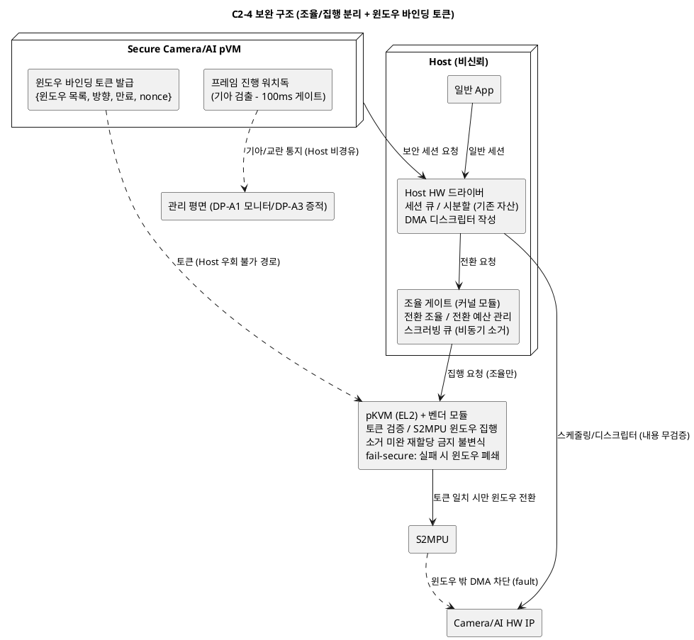

# DP-C2 후보 상세 비교 — C2-2 (Driver VM) vs C2-4 (2계층 분리) vs C2-5 (모드 스위칭)

> 본 문서는 `08_candidate_architectures.md`의 DP-C2(HW IP 중재 위치와 공유 방식) 후보 중 **C2-2. 전용 디바이스 소유 pVM(Driver VM)**, **C2-4. 2계층 분리형(Host 스케줄러 + 보안 컨텍스트 게이트)**, **C2-5. 보안 우선 점유 + 유휴 시분할(모드 스위칭)** 을 기능별/품질속성별/EL2 수정 난이도로 상세 비교하고, 채택 유력 후보의 약점을 보완하는 설계안을 제안한다.
>
> 근거 문서: `08_candidate_architectures.md` 3장(DP-C2), `06_qa_utility_tree_metrics.md`(SEC-02/03, PERF-04/01/06), `99_pvmfw.md`(AVF device assignment), `08_DP-C1_candidates.md`(pVM 간 채널 — C2-2의 의존성)

**비교 대상 선정 근거**: 5개 후보 중 C2-1(Host 드라이버 중재)은 비신뢰 Host가 DMA 디스크립터·레지스터를 직접 작성해 기밀성 판정이 "하"(SEC-02/03 게이트 위반 위험, 3.4절 판정 기준)이므로 제외했다. C2-3(배타 소유권 스위칭)은 전환 granularity만 다른 C2-5의 세분화 변형이며(08 문서 3.2절도 C2-5의 보안 모드를 "C2-3의 직접 할당과 동일"로 기술), 본 과제의 상시 실행 프로파일에서 두 후보의 쟁점(동시성 포기)이 동일하므로 계열 대표로 C2-5를 채택했다. 남는 3개가 각각 **기밀성 극단(C2-2), 균형(C2-4), 성능 극단(C2-5)** 을 대표한다.

---

## 목차

1. [비교 대상 요약](#1-비교-대상-요약)
2. [기능별 비교](#2-기능별-비교)
3. [품질속성별 비교](#3-품질속성별-비교)
4. [EL2 수정 난이도 비교](#4-el2-수정-난이도-비교)
5. [비교 종합](#5-비교-종합)
6. [C2-4 채택 시 약점 보완 설계안](#6-c2-4-채택-시-약점-보완-설계안)

---

## 1. 비교 대상 요약

| 항목 | C2-2. Driver VM | C2-4. 2계층 분리 | C2-5. 모드 스위칭 |
|------|-----------------|------------------|-------------------|
| 핵심 아이디어 | HW를 전용 pVM에 패스스루로 귀속 — Host도 일반 기능을 가상 디바이스로 요청 | 스케줄링(Host 드라이버)과 격리 집행(보안 컨텍스트 게이트)을 분리 | 파이프라인 실행 중 보안 도메인이 연속 점유, 유휴 시 Host 네이티브 사용 |
| 중재자 위치 | 격리 pVM | Host(스케줄) + 게이트(격리) 2계층 | 모드 관리자(전환 시에만 개입) |
| Host의 HW 접근 | 완전 차단 (프론트엔드로 강등) | 레지스터 접근 유지, 메모리 접근은 게이트가 차단 | 일반 모드에서만 네이티브 접근 |
| 전환 빈도 | 세션 교차와 무관 (Driver pVM 내부 스케줄링) | 세션 교차마다 게이트 개입 | 파이프라인 수명주기당 2회 |
| 대응 트레이드오프 | 기밀성 vs 호환성·공용 장애점 | 균형 vs 서비스 거부 잔존 | 반복 구간 성능 vs 동시성 포기 |

세 후보의 비교 실질은 **"비신뢰 Host를 HW 제어 경로에서 얼마나 배제할 것인가"와 "그 대가로 Host 일반 기능의 호환성·동시성을 얼마나 지불할 것인가"** 이다.

## 2. 기능별 비교

HW 중재가 수행해야 하는 기능(시나리오 7·10단계의 보안 세션 + R-2의 일반 세션 공존 + 장애 처리)을 기준으로 비교한다.

| 기능 | C2-2. Driver VM | C2-4. 2계층 분리 | C2-5. 모드 스위칭 | 비고 |
|------|-----------------|------------------|-------------------|------|
| 세션 수락/큐 관리 | Driver pVM이 양쪽(일반/보안) 요청 수락 | Host 드라이버(기존 자산) | 모드별 분리 — 보안 모드 중 일반 요청은 대기열 | C2-4가 기존 자산 재사용 최대 |
| 스케줄링 결정 (누가 언제) | Driver pVM — 보안 세션 우선순위 직접 보장 | Host 드라이버 — 침해 시 교란 가능(가용성만) | 모드가 곧 스케줄 — 결정 로직 최소 | C2-2만 Host 교란 차단 |
| 격리 집행 (어느 메모리에) | Driver pVM이 DMA 디스크립터 직접 작성 | 게이트 + hypercall이 S2MPU 윈도우 전환 | 모드 전환 시 S2MPU 일괄 전환, 모드 중 정적 | 셋 다 비신뢰 주체 위조 불가 위치 |
| HW 컨텍스트 저장/복원 | Driver pVM 내부 | Host 드라이버 수행, 게이트가 소거 확인 | 모드 전환 시 1회 | 빈도: C2-4 > C2-2 > C2-5 |
| 잔류 데이터 소거 (VOS-08) | Driver pVM 책임 (검증 경계 안) | 게이트가 전환 시 강제 | 모드 전환 시 강제 — 실행 중 소거 이슈 없음 | C2-5가 검증 가장 단순 |
| DMA 디스크립터 작성 주체 | Driver pVM (격리 도메인) | Host 드라이버 작성 + 게이트/EL2 검증 | 소유 도메인이 직접 작성 (모드 중 단일 주체) | C2-4만 "작성과 검증 분리" 패턴 |
| 보안 세션 우선순위/기아 방지 | Driver pVM 정책으로 보장 | 보장 불가 — Host 스케줄 조작 가능(검출로 보완) | 보안 모드 중 구조적 보장 (역으로 Host가 기아) | C2-4의 대표 공백 |
| Host 일반 경로 | 가상 디바이스 프론트엔드로 전면 교체 | 기존 드라이버 그대로 | 유휴 시 기존 드라이버 그대로 | C2-2의 대표 공백 |
| 장애 검출/복구 | Driver pVM 재기동 = 전 세션 동시 중단 후 재구성 | 게이트 모듈 crash는 Host 커널과 운명 공동체, HW 세션은 재협상 | 모드 관리자 crash 시 현재 모드 유지(정적) — 전환만 불능 | C2-5가 장애 시 안전 상태 유지 |
| 신규 HW IP 추가 (QA-03) | Driver pVM에 드라이버 이식 반복 (이식 공수) | IP별 게이트 윈도우 정의 추가 (드라이버는 기존 것) | IP별 모드 전환 목록 추가 | C2-4/C2-5는 데이터 추가에 가까움 |

**요약**: 격리 집행 기능은 셋 다 "비신뢰 주체가 위조 불가한 위치"라는 요건을 충족하며 위치만 다르다(pVM / 게이트+EL2 / 정적 모드). 차이는 주변 기능에서 갈린다 — C2-2는 스케줄링까지 격리 도메인으로 가져와 기아 방지를 얻는 대신 Host 경로 전면 교체를 지불하고, C2-4는 기존 자산을 유지하는 대신 기아 방지를 잃으며, C2-5는 기능 대부분을 "모드 전환 1회"로 흡수하는 대신 동시성 자체를 포기한다.

## 3. 품질속성별 비교

기존 비교표(08 문서 3.3절)의 4축(기밀성·성능·동시 사용·호환성/비용)에 더해, DP-C2 문제 정의(P-C2-1~3)와 QA/VOS 목록에서 도출한 추가 품질속성 5축(가용성/장애 반경, 잔류 데이터, 시험용이성, 확장성, 자원 효율)을 포함해 9축으로 비교한다.

| 품질속성 (참조 QA/KPI) | C2-2. Driver VM | C2-4. 2계층 분리 | C2-5. 모드 스위칭 | 판정 근거 |
|------------------------|-----------------|------------------|-------------------|-----------|
| **기밀성** (QA-01 / SEC-02·03) | **상** — Host가 레지스터·DMA 경로에서 완전 분리. 권한 중첩이 발생할 전환 자체가 Driver pVM 내부 | **중상** — 격리는 게이트+EL2에 국한되나, DMA 디스크립터를 Host가 작성하므로 "작성-검증 갭"의 커버리지가 논증 대상 | **상** — 모드 중 격리 상태가 정적(전환 10^6회 시험이 사실상 무의미할 만큼 전환이 드묾) | SEC-02의 "전환 시 권한 중첩"이 발생 가능한 빈도 자체가 다름 |
| **성능 — 보안 파이프라인** (QA-02/04, PERF-04·01) | **중** — 보안 세션도 Driver pVM 경유(요청 홉 + pVM 스케줄링 지연). 프레임당 경유 비용 실측 필요 | **중상** — 세션 교차 시에만 게이트 개입(전환 p99 10ms 관문). 교차 빈도가 성능을 결정 | **상** — 실행 중 전환 0회, 직접 제어로 네이티브 성능 | PERF-04(전환 지연)의 노출 빈도 차이 |
| **동시 사용** (R-2 / PERF-06 원용) | **상** — Driver pVM이 양쪽 세션을 인터리브 (경유 비용은 있음) | **상** — 시분할 인터리브, 기존 드라이버의 성숙한 스케줄링 재사용 | **하** — 보안 파이프라인 실행 중 Host는 해당 HW 사용 불가. 상시 실행 프로파일이면 R-2 미충족으로 탈락 | 본 과제 프로파일(상시 실행)에서 결정적 축 |
| **Host 호환성/개발 비용** (EXT-06·07 원용) | **하** — 프론트엔드 교체 + 드라이버 이식 대개편, breaking change 다수 | **상** — 기존 드라이버 확장 + 게이트 모듈 신설, 사용자 API 무변경 | **상** (유휴 시) — 일반 모드 경로 무수정 | C2-2만 "대개편" 등급 |
| **가용성/장애 반경** (QA-05, P-C2-3) | **하** — Driver pVM이 Host 일반 기능과 보안 파이프라인 공용 SPOF. 재기동 중 양쪽 HW 상실 | **중** — 게이트는 수동적 모듈(crash 시 전환만 거부 = 안전 방향 실패). 단 Host 드라이버 장애가 보안 세션 스케줄에 전파 | **중상** — 장애 시 현재 모드가 유지되는 정적 구조. 진행 중 파이프라인은 계속 동작 | C2-2의 대표 약점 (P-C2-3 악화) |
| **잔류 데이터** (VOS-08) | **중상** — Driver pVM 내부 규율에 의존 (검증 경계는 명확) | **상** — 게이트가 전환 경로에서 구조적으로 강제 | **상** — 모드 전환 시 일괄 소거, 지점 명확 | 세 후보 모두 C2-1보다 우위 |
| **시험용이성/격리 논증** (QA-07, VOS-13) | **상** — 검증 경계가 "Driver pVM 인터페이스"로 명확. 단 pVM 내부 드라이버 코드가 TCB에 편입되어 감사량은 큼 | **중상** — 논증 대상이 게이트 모듈로 국한. 단 Host 드라이버와의 상호작용(전환 통지 프로토콜) 상태 조합 시험 필요 | **상** — 모드 중 정적 상태라 스냅샷 검증으로 충분. SEC-02 스트레스 시험의 의미 자체가 축소 | 논증 범위: C2-5 < C2-4 < C2-2(양은 크되 경계 명확) |
| **확장성 — 신규 IP 추가** (QA-03) | **중하** — IP마다 Driver pVM에 드라이버 이식 (공수 반복, pVM 비대화) | **상** — 게이트 윈도우 정의(데이터) 추가, 드라이버는 기존 벤더 자산 | **상** — 모드 전환 대상 목록 추가 | C2-2는 이식 공수가 IP 수에 비례 |
| **자원 효율** (QA-06) | **하** — Driver pVM 상시 상주(메모리/vCPU) + 모든 세션의 경유 비용 | **상** — 상주 구성요소가 커널 모듈 1개 | **상** — 상주 구성요소 최소 | C2-2만 상시 점유 페널티 |

### 3.1 품질속성별 우위 요약

| 품질속성 | 우위 | 비고 |
|----------|------|------|
| 기밀성 | C2-2 = C2-5 | C2-4는 "작성-검증 갭" 논증 부담 |
| 성능 (보안 파이프라인) | **C2-5** | C2-4는 교차 빈도 조건부 |
| 동시 사용 (R-2) | C2-2 = C2-4 | **C2-5는 상시 실행 프로파일에서 탈락 축** |
| 호환성/개발 비용 | C2-4 = C2-5 | C2-2는 대개편 |
| 가용성/장애 반경 | **C2-5** | C2-2는 공용 SPOF |
| 잔류 데이터 | C2-4 = C2-5 | 모두 구조적 강제 |
| 시험용이성 | **C2-5** | 정적 상태의 힘 |
| 확장성 | C2-4 = C2-5 | C2-2는 이식 반복 |
| 자원 효율 | C2-4 = C2-5 | C2-2는 상주 비용 |

## 4. EL2 수정 난이도 비교

DP-C2는 DP-C1과 요구 프리미티브의 성격이 다르다. DP-C1이 "guest-guest 메모리 상태"라는 **소유권 모델 확장**을 요구했다면, DP-C2는 "HW DMA가 허가된 메모리만 향하게 하는" **DMA 격리(S2MPU/SMMU Stage-2) 집행**을 요구한다. 이 영역은 upstream pKVM에는 없지만, Android 커널 계열에는 **pKVM vendor EL2 module** 메커니즘과 S2MPU EL2 드라이버 선례(Pixel 계열)가 존재해, "core pKVM 수정" 없이 벤더 모듈로 수용될 여지가 DP-C1보다 넓다. 따라서 CS-02의 해석(코어 수정 금지인가, EL2 일체 수정 금지인가)이 판정을 좌우하며, 아래 난이도는 "벤더 EL2 모듈 허용" 해석 기준이다.

| 항목 | C2-2. Driver VM | C2-4. 2계층 분리 | C2-5. 모드 스위칭 |
|------|-----------------|------------------|-------------------|
| 필요한 EL2 측 능력 | (a) HW MMIO/인터럽트의 pVM 패스스루, (b) Driver pVM 대상 DMA 격리, (c) 보안 pVM↔Driver pVM 채널 — **DP-C1 프리미티브 재귀** | 세션 단위 S2MPU 윈도우 전환 hypercall + 전환 시 소거 확인 + 토큰 검증(위조 방지) | 모드 단위 S2MPU 일괄 전환 hypercall (2종: 보안/일반) |
| 기존 선례와의 거리 | 패스스루는 AVF device assignment(pvmfw entry 2 DA DTBO, `99_pvmfw.md`)가 선례. 단 (c)는 DP-C1의 guest-guest 채널 문제가 그대로 재등장 | S2MPU EL2 모듈 선례의 자연 확장. 단 "세션"이라는 동적 개념이 EL2에 등장 — 토큰 수명주기 관리 필요 | S2MPU EL2 모듈 선례에 가장 근접 — 정적 구성 2개의 스위치 |
| 호출 빈도/위치 | 구성 시점 위주 (런타임은 Driver pVM 내부에서 처리) | 세션 교차마다 — **중간 빈도 웜 패스** (프레임 주기와 결합 가능성) | 파이프라인 수명주기당 2회 — **콜드 패스** |
| 검증 부담 (TCB 증분) | EL2 증분은 작으나 Driver pVM 전체가 TCB에 편입 (KLoC 대폭 증가, SEC-01 계열) | 윈도우 전환 + 토큰 검증 로직 — 동적 상태(세션 테이블)의 불변식 검증 필요 | 모드 2개의 정적 구성 검증 — 감사 범위 최소 |
| **종합 난이도** | **상** — EL2 자체보다 "DP-C1 채널 + Driver pVM TCB + 이식"의 복합 | **중** — 웜 패스 hypercall + 동적 세션 상태 | **하** — 콜드 패스 정적 전환 |

**핵심 관찰**: EL2 수정 난이도는 C2-2 ≫ C2-4 > C2-5 이다. 특히 C2-2는 보안 pVM과의 프레임 채널이 결국 DP-C1의 guest-to-guest 프리미티브를 요구하므로, **DP-C1에서 EL2 수정을 승인받지 못하면 C2-2도 함께 무너지는 결정 의존성**이 있다. C2-4/C2-5는 S2MPU 벤더 모듈 선례의 연장선이라 승인 장벽이 상대적으로 낮다.

## 5. 비교 종합

- **C2-5가 이기는 축**(성능, 가용성, 시험용이성, 자원 효율)은 모두 "전환의 희소화 + 정적 상태"에서 나오지만, 본 과제의 상시 실행 프로파일에서는 **동시 사용(R-2) 축 하나가 탈락 사유**가 된다 — 보안 파이프라인이 항상 실행 중이면 Host는 해당 HW를 영구히 쓰지 못한다.
- **C2-2가 이기는 축**(기밀성, 기아 방지)은 "Host 완전 배제"에서 나오지만, 대가(호환성 대개편, 공용 SPOF, 상주 비용, DP-C1 의존)가 전 축에 걸쳐 있고 EL2 관점의 결정 의존성까지 있다.
- **C2-4**는 1위 축이 없는 대신 탈락 축도 없다. 남는 약점 3건(기아 방지 부재, 작성-검증 갭 논증, 세션 교차 오버헤드)이 모두 보완 설계로 축소 가능한 성격이다.
- 따라서 **C2-4를 기반으로 채택하되, C2-5의 강점(전환 희소화, 정적 검증)과 C2-2의 강점(기아 검출·대응)을 부분 차용해 보완하는 설계**를 6절에서 제안한다. 이는 08 문서 3.2절이 C2-4를 "서비스 거부를 감시로 보완하면 실용적 균형점"으로 평가한 방향의 구체화다.

## 6. C2-4 채택 시 약점 보완 설계안

### 6.1 보완 대상 약점 정리

2~4절 비교에서 확인된 C2-4의 약점은 다음 5건이다.

| ID | 약점 | 영향 품질속성 |
|----|------|---------------|
| W-1 | Host 스케줄 조작에 의한 보안 세션 서비스 거부/기아 — 구조적 방지 불가 | 가용성 (QA-05) |
| W-2 | DMA 디스크립터를 비신뢰 Host가 작성 — "작성-검증 갭"의 커버리지 논증 부담 (P-C2-1 잔재) | 기밀성 (QA-01 / SEC-03) |
| W-3 | 세션 교차마다 게이트 개입(S2MPU 전환 + 소거) — 교차가 잦으면 오버헤드가 프레임 주기와 결합 (P-C2-2) | 성능 (QA-02 / PERF-04) |
| W-4 | 게이트-드라이버 인터페이스의 상태 조합(전환 통지/완료/중단) 설계·시험 부담 | 시험용이성 (QA-07) |
| W-5 | 게이트 모듈 자체가 Host 커널 주소 공간에 상주 — Host 커널 침해 시 게이트도 함께 침해되어 "격리 집행 계층"의 신뢰 근거가 흔들림 | 기밀성 (QA-01) |

### 6.2 보완 설계 원칙

C2-4의 강점(기존 드라이버 자산 재사용, Host 일반 경로 무변경, R-2 동시 사용 유지)을 훼손하지 않는 것을 최우선 제약으로 둔다. 스케줄링 소유권을 격리 도메인으로 옮기는 보완(그것은 C2-2로의 전환)은 배제하고, **기밀성은 집행 위치 하강으로, 가용성은 검출·대응 SLO로, 성능은 전환 예산으로** 각각 해결한다.

### 6.3 보완안 상세

#### 보완 1. 집행의 EL2 하강 — 게이트를 "조율자"로 강등 (W-5, W-2)

- 게이트의 책임을 둘로 쪼갠다: **조율**(전환 시점 결정, 드라이버와의 프로토콜, 소거 스케줄링)은 Host 커널 모듈에 남기고, **최종 집행**(S2MPU 윈도우 프로그래밍, 토큰 검증, 소거 완료 확인)은 EL2 벤더 모듈로 내린다.
- 효과: Host 커널이 통째로 침해되어 게이트 모듈이 우회·조작되더라도, EL2 모듈이 "유효 토큰 없는 보안 윈도우 전환"을 거부하므로 **게이트 침해의 효과가 기밀성 침해에서 가용성 교란(전환 안 해줌)으로 강등**된다. W-5가 "게이트를 믿을 수 있는가"라는 논증 문제에서 "EL2 모듈 1개의 검증" 문제로 축소된다.
- 비용: 4절의 EL2 난이도 "중" 판정이 전제한 것이 바로 이 구조다(S2MPU 벤더 모듈 선례의 확장). EL2 모듈의 세션 테이블 불변식이 SEC 계열 감사 대상에 추가된다.

#### 보완 2. 윈도우 바인딩 토큰 — 디스크립터 검증을 구조로 환원 (W-2)

- 토큰을 단순 인가 플래그가 아니라 **세션 파라미터에 바인딩된 능력(capability)** 으로 설계한다: 토큰 = {허용 메모리 윈도우 목록(IPA 범위), 접근 방향(R/W), 세션 만료, 재전송 방지 nonce}를 pVM이 발급·서명하고 EL2 모듈이 검증한다.
- 핵심 전환: Host가 작성한 DMA 디스크립터를 **전수 파싱·검증하지 않는다**. 대신 EL2가 토큰의 윈도우 목록대로만 S2MPU를 여므로, 디스크립터가 무엇을 가리키든 **윈도우 밖 접근은 하드웨어(S2MPU fault)가 차단**한다. "작성-검증 갭"의 논증이 "검증 코드가 모든 경로를 커버하는가"(열거 불가)에서 "S2MPU 윈도우 설정이 토큰과 일치하는가"(단일 불변식)로 환원된다 — SEC-03의 DMA 공격 벡터 전수 시험이 곧 이 불변식의 시험이 된다.
- 비용: 보안 세션의 DMA 대상이 사전 선언된 윈도우로 제한된다 — DP-C1의 정적 풀(C1-1) 채택 시 풀 영역이 곧 윈도우이므로 자연 정합한다(`08_DP-C1_candidates.md` 보완 1과 합동 설계).

#### 보완 3. 전환 예산 관리자 + 소거 비동기화 (W-3)

- **전환 예산**: 파이프라인 실행 중 세션 전환 빈도에 상한을 두는 정책을 조율 게이트에 넣는다. Host 일반 요청을 즉시 인터리브하지 않고 N프레임 단위 배치 또는 프레임 갭(blanking 구간)에만 배치해, 전환 비용(PERF-04 p99 10ms)이 프레임 주기와 결합하는 빈도를 예산으로 관리한다. 예산 파라미터는 PERF-01 부하 매트릭스 실측으로 튜닝한다.
- **소거 비동기화**: 잔류 소거를 전환 크리티컬 패스에서 빼서 스크러빙 큐로 옮긴다. 전환 시에는 "소거 미완 윈도우의 재할당 금지"라는 불변식만 EL2가 지키고, 실제 0-fill은 유휴 시간에 수행한다 — 전환 지연에서 소거 시간이 빠지므로 10ms 예산 충족이 쉬워진다. 소거 완료 전 재할당 요청이 오면 그때만 동기 소거로 폴백한다.
- 이는 C2-5의 "전환 희소화" 강점을 동시성 포기 없이 부분 차용하는 것이다 — 전환을 없애는 대신(C2-5) 빈도와 비용을 통제한다.

#### 보완 4. 기아 검출·대응 SLO (W-1)

- 스케줄링 소유권이 Host에 있는 한 기아의 **방지**는 불가능하므로(그것이 C2-4의 존재 조건), 가용성 요구를 "보장"에서 **"검출 + 대응 시간 SLO"** 로 재정의한다:
  - **검출**: 보안 pVM이 프레임 진행 워치독(기대 주기 33ms 대비 타임아웃)을 자체 운용하고, 위반 시 관리 평면(DP-A1의 모니터/관리 데몬, DP-A3의 증적 체계)에 통지한다. Host를 거치지 않는 통지 경로(모니터의 pVM exit 관찰 등)를 사용해 Host가 검출 자체를 은폐하지 못하게 한다.
  - **대응**: 정책 단계화 — 재시도 → 저하 모드(프레임률 하향) → 파이프라인 상태 보존 후 사용자/상위 시스템 통지. "Host가 협조하지 않으면 기능은 멈추지만, 멈췄다는 사실은 반드시 드러난다"가 보장 수준이다.
- AVL 계열 KPI에 "기아 검출 시간 p99"를 추가하는 것을 제안한다(검출까지 3 프레임 주기 = 100ms 수준을 초안 게이트로).

#### 보완 5. 인터페이스 상태 기계 명세 + fail-secure 규칙 (W-4)

- 게이트-드라이버 인터페이스를 버전 있는 **상태 기계 명세**(요청→전환 중→활성→소거 중→반환, 각 상태의 타임아웃과 중단 전이 포함)로 고정하고, SEC-02의 10^6 전환 스트레스 하네스를 CI 상시 시험으로 편입한다.
- **fail-secure 규칙 명시**: 전환 프로토콜이 중간에 실패하면(드라이버 무응답, 토큰 만료 등) HW를 **정지 상태 + 윈도우 폐쇄**로 남긴다 — 어느 도메인에도 열어주지 않는다. 기밀성과 가용성이 충돌하는 실패 지점에서 항상 기밀성을 택한다는 규칙을 상태 기계에 내장해, 복구는 관리 평면의 명시적 재협상으로만 수행한다.

### 6.4 보완 후 구조

### 6.5 약점-보완 대응과 잔여 위험

| 약점 | 보완안 | 대응 QA/KPI | 잔여 위험 |
|------|--------|-------------|-----------|
| W-5 게이트의 신뢰 근거 | 보완 1 (조율/집행 분리, EL2 하강) | QA-01, SEC-02 | EL2 벤더 모듈 자체의 결함 — 모듈 KLoC를 SEC-01 계측에 편입하고 감사 대상 최소화(집행 로직만) |
| W-2 작성-검증 갭 | 보완 2 (윈도우 바인딩 토큰) | SEC-03 (DMA 공격 전수 차단) | 윈도우 안에서의 오용(허용 범위 내 잘못된 접근)은 차단 불가 — 윈도우를 DP-C1 풀과 일치시켜 피해 상한을 풀 노출 상한과 동일하게 유지 |
| W-3 전환 오버헤드 결합 | 보완 3 (전환 예산 + 소거 비동기화) | PERF-04 (p99 10ms), PERF-01 | 예산 정책이 Host 일반 요청의 대기 시간을 늘림 — R-2 해석(대기 p95)과의 균형점을 PERF-06 원용 시험으로 결정 |
| W-1 기아/서비스 거부 | 보완 4 (검출·대응 SLO) | QA-05, 신규 "기아 검출 p99" | 방지가 아닌 검출 — 이 잔여를 수용할 수 없는 제품 요구라면 답은 C2-2 전환(스케줄 소유권 이동)뿐임을 명시 |
| W-4 인터페이스 복잡성 | 보완 5 (상태 기계 명세 + fail-secure) | QA-07, SEC-02 하네스 | 상태 기계 밖의 미정의 동작(드라이버 버그) — fail-secure 기본값이 최종 방어선 |

### 6.6 결론

- 보완 1~5를 적용한 C2-4는, 비교에서 열세였던 축을 다음 수준까지 회수한다: 기밀성은 "게이트 모듈 검증 의존"에서 **"EL2 집행 + S2MPU 하드웨어 차단 + 단일 불변식"** 으로(C2-2와의 격차가 "Host 완전 배제 vs 윈도우 상한부 노출"로 좁혀짐), 성능은 전환 예산으로 C2-5의 희소화 이점을 부분 차용, 가용성은 "보장 불가"에서 "검출 SLO"로 재정의된다.
- 핵심 강점은 유지된다: 기존 Host 드라이버 자산과 일반 경로 무변경, R-2 동시 사용, EL2 수정은 S2MPU 벤더 모듈 선례의 연장(난이도 "중" 유지).
- **잔여 한계의 명시**: 기아의 구조적 방지와 "Host 완전 배제" 수준의 기밀성은 C2-4 계열에서는 도달 불가하며, 그 요구가 확정되면 답은 보완이 아니라 C2-2 전환이다. 다만 보완 2의 윈도우 개념과 보완 1의 EL2 집행 모듈은 C2-2로 전환해도 재사용되는 자산이므로 매몰 비용이 작다. 채택 관문: PERF-04 전환 지연 PoC 실측(소거 비동기화 적용 전후), EL2 벤더 모듈 허용 여부에 대한 CS-02 해석 확정, 기아 검출 SLO의 요구사항 합의.
