# 후보 구조 도출 — DP-A1, DP-C1, DP-C2, DP-D1

> 본 문서는 `07_decision_point_candidates.md`에서 도출한 Decision Point 중 우선 확정 가치가 높은 4건(DP-A1, DP-C1, DP-C2, DP-D1)에 대해, 각 결정 지점이 내포한 문제점을 품질속성 관점에서 정의하고, 그 문제를 해결하는 후보 구조를 5개씩 도출한 것이다.
>
> 근거 문서: `00_overview.md`(R-1~R-5), `02_requirements.md`(FR/QA/CS), `99_reference_scenario_flow.md`(시나리오 1~13단계), `06_qa_utility_tree_metrics.md`(SEC/PERF/EXT/AVL 게이트·KPI — 비교 축의 KPI 측정 기준)

---

## 목차

1. [DP-A1. pVM 관리 골격(제어 평면) 구조](#1-dp-a1-pvm-관리-골격제어-평면-구조)
2. [DP-C1. 도메인 간 프레임 전달 채널 구조](#2-dp-c1-도메인-간-프레임-전달-채널-구조)
3. [DP-C2. HW IP 중재(Mediation) 위치와 공유 방식](#3-dp-c2-hw-ip-중재mediation-위치와-공유-방식)
4. [DP-D1. TrustZone Secure OS 공존 토폴로지](#4-dp-d1-trustzone-secure-os-공존-토폴로지)

---

## 1. DP-A1. pVM 관리 골격(제어 평면) 구조

### 1.1 문제 정의

pVM 생명주기(생성/시작/정지/종료, FR-01)와 다중 pVM 동시 운용(FR-02)을 관장하는 관리 주체는 Host 사용자 공간에 위치할 수밖에 없다. 그러나 본 과제의 대전제는 "Host는 비신뢰 영역"(R-1)이라는 점이다. 여기서 다음 문제가 발생한다.

| ID | 문제점 | 관련 품질속성 |
|----|--------|--------------|
| P-A1-1 | **관리 주체의 권한 과잉과 TCB 팽창**: 관리 주체가 pVM 생성뿐 아니라 메모리 매핑, 데이터 채널 배선까지 모두 쥐고 있으면, Host 침해 시 관리 주체가 격리 우회의 발판이 된다. 관리 기능이 커질수록 "신뢰해야만 동작하는 코드"가 비신뢰 영역에 쌓인다. | 기밀성 (QA-01) |
| P-A1-2 | **단일 장애점(SPOF)**: 단일 중앙 데몬이 모든 pVM의 상태를 잡고 있으면, 데몬 크래시 한 번이 전체 파이프라인 장애로 전파된다. QA-05는 "장애 pVM 외 Host/타 pVM 다운타임 0"을 요구한다. | 가용성 (QA-05) |
| P-A1-3 | **도메인 추가 비용의 중앙 집중**: 신규 보안 도메인(pVM) 유형이 추가될 때마다 중앙 데몬의 코드 수정이 필요하면 QA-03("코어 수정 0 LoC")을 만족할 수 없다. 관리 골격이 도메인 개수·유형에 대해 닫혀 있어야 한다. | 확장성 (QA-03, R-4) |

**해결 방향**: 관리 골격은 (1) 격리 보장에 필요한 최소 권한만 갖고, (2) 장애 격벽(bulkhead)이 pVM 단위로 서고, (3) 도메인 추가가 코드가 아닌 데이터(구성/manifest)로 흡수되는 구조여야 한다.

### 1.2 후보 구조

#### A1-1. 중앙집중형 단일 Manager 데몬

- **개요**: 단일 사용자 공간 데몬(`pvm-managerd`)이 API 수신, 정책 확인, Workload 검증 요청, pVM 생성/종료, 채널 배선, 장애 복구까지 제어 평면 전체를 담당한다.
- **구성과 책임**:
  - `pvm-managerd`: Framework API 엔드포인트, 정책 결정(PDP)과 집행(PEP), pVM 상태 머신 관리, 자원 할당 원장(ledger) 유지
  - Framework 커널 드라이버: 데몬의 명령을 pKVM hypercall로 변환
  - pVM별 vCPU 실행 스레드: 데몬 프로세스 내부 스레드로 수용
- **동작 방식**: 시나리오 1~6단계의 모든 제어 흐름이 데몬 하나를 통과한다. 상태가 한곳에 모이므로 자원 원장과 정책의 일관성 유지가 단순하다.

**구조 다이어그램**

```drawio
<mxfile host="app.diagrams.net" modified="2026-07-09T00:00:00.000Z" agent="Codex" version="24.7.17" type="device">
  <diagram id="a1-1-centralized-manager" name="A1-1">
    <mxGraphModel dx="1280" dy="720" grid="1" gridSize="10" guides="1" tooltips="1" connect="1" arrows="1" fold="1" page="1" pageScale="1" pageWidth="1280" pageHeight="720" math="0" shadow="0">
      <root>
        <mxCell id="0"/>
        <mxCell id="1" parent="0"/>
        <mxCell id="title" value="A1-1. 중앙집중형 단일 Manager 데몬" style="text;html=1;strokeColor=none;fillColor=none;align=center;verticalAlign=middle;whiteSpace=wrap;rounded=0;fontSize=28;fontStyle=1" vertex="1" parent="1">
          <mxGeometry x="320" y="34" width="640" height="46" as="geometry"/>
        </mxCell>
        <mxCell id="host" value="Host (비신뢰, EL0/EL1)" style="swimlane;html=1;whiteSpace=wrap;rounded=0;startSize=38;horizontal=1;fillColor=#f8f9fa;strokeColor=#5f6368;fontSize=18;fontStyle=1" vertex="1" parent="1">
          <mxGeometry x="70" y="110" width="520" height="500" as="geometry"/>
        </mxCell>
        <mxCell id="app" value="Host Application" style="rounded=0;whiteSpace=wrap;html=1;fillColor=#e8f0fe;strokeColor=#1a73e8;fontSize=16;fontStyle=1" vertex="1" parent="host">
          <mxGeometry x="110" y="70" width="300" height="78" as="geometry"/>
        </mxCell>
        <mxCell id="mgr" value="pvm-managerd&lt;br&gt;(API / 정책 PDP+PEP / 생명주기&lt;br&gt;채널 배선 / 장애 복구 / 자원 원장)" style="rounded=0;whiteSpace=wrap;html=1;fillColor=#fce8e6;strokeColor=#d93025;fontSize=16;fontStyle=1" vertex="1" parent="host">
          <mxGeometry x="85" y="210" width="350" height="116" as="geometry"/>
        </mxCell>
        <mxCell id="drv" value="Framework 커널 드라이버" style="rounded=0;whiteSpace=wrap;html=1;fillColor=#fef7e0;strokeColor=#f9ab00;fontSize=16;fontStyle=1" vertex="1" parent="host">
          <mxGeometry x="110" y="400" width="300" height="78" as="geometry"/>
        </mxCell>
        <mxCell id="hv" value="pKVM (EL2)" style="rounded=0;whiteSpace=wrap;html=1;fillColor=#e6f4ea;strokeColor=#188038;fontSize=18;fontStyle=1" vertex="1" parent="1">
          <mxGeometry x="690" y="410" width="230" height="92" as="geometry"/>
        </mxCell>
        <mxCell id="cam" value="Secure Camera pVM" style="rounded=0;whiteSpace=wrap;html=1;fillColor=#e8eaed;strokeColor=#3c4043;fontSize=16;fontStyle=1" vertex="1" parent="1">
          <mxGeometry x="980" y="210" width="230" height="92" as="geometry"/>
        </mxCell>
        <mxCell id="ai" value="Secure AI pVM" style="rounded=0;whiteSpace=wrap;html=1;fillColor=#e8eaed;strokeColor=#3c4043;fontSize=16;fontStyle=1" vertex="1" parent="1">
          <mxGeometry x="980" y="470" width="230" height="92" as="geometry"/>
        </mxCell>
        <mxCell id="edge-app-mgr" value="Framework API" style="endArrow=block;html=1;rounded=0;strokeWidth=2;exitX=0.5;exitY=1;exitDx=0;exitDy=0;entryX=0.5;entryY=0;entryDx=0;entryDy=0;fontSize=14" edge="1" parent="host" source="app" target="mgr">
          <mxGeometry relative="1" as="geometry"/>
        </mxCell>
        <mxCell id="edge-mgr-drv" value="ioctl" style="endArrow=block;html=1;rounded=0;strokeWidth=2;exitX=0.5;exitY=1;exitDx=0;exitDy=0;entryX=0.5;entryY=0;entryDx=0;entryDy=0;fontSize=14" edge="1" parent="host" source="mgr" target="drv">
          <mxGeometry relative="1" as="geometry"/>
        </mxCell>
        <mxCell id="edge-drv-hv" value="hypercall" style="endArrow=block;html=1;rounded=0;strokeWidth=2;exitX=1;exitY=0.5;exitDx=0;exitDy=0;entryX=0;entryY=0.5;entryDx=0;entryDy=0;fontSize=14" edge="1" parent="1" source="drv" target="hv">
          <mxGeometry relative="1" as="geometry"/>
        </mxCell>
        <mxCell id="edge-mgr-cam" value="생성/채널/복구&lt;br&gt;(전 기능 관장)" style="endArrow=open;html=1;rounded=0;dashed=1;strokeWidth=2;exitX=1;exitY=0.3;exitDx=0;exitDy=0;entryX=0;entryY=0.5;entryDx=0;entryDy=0;fontSize=14" edge="1" parent="1" source="mgr" target="cam">
          <mxGeometry relative="1" as="geometry"/>
        </mxCell>
        <mxCell id="edge-mgr-ai" value="생성/채널/복구&lt;br&gt;(전 기능 관장)" style="endArrow=open;html=1;rounded=0;dashed=1;strokeWidth=2;exitX=1;exitY=0.7;exitDx=0;exitDy=0;entryX=0;entryY=0.5;entryDx=0;entryDy=0;fontSize=14" edge="1" parent="1" source="mgr" target="ai">
          <mxGeometry relative="1" as="geometry"/>
        </mxCell>
        <mxCell id="edge-hv-cam" value="Stage-2 격리" style="endArrow=open;html=1;rounded=0;dashed=1;strokeWidth=2;exitX=1;exitY=0.2;exitDx=0;exitDy=0;entryX=0;entryY=0.8;entryDx=0;entryDy=0;fontSize=14" edge="1" parent="1" source="hv" target="cam">
          <mxGeometry relative="1" as="geometry"/>
        </mxCell>
        <mxCell id="edge-hv-ai" value="Stage-2 격리" style="endArrow=open;html=1;rounded=0;dashed=1;strokeWidth=2;exitX=1;exitY=0.8;exitDx=0;exitDy=0;entryX=0;entryY=0.2;entryDx=0;entryDy=0;fontSize=14" edge="1" parent="1" source="hv" target="ai">
          <mxGeometry relative="1" as="geometry"/>
        </mxCell>
      </root>
    </mxGraphModel>
  </diagram>
</mxfile>
```

**장점 / 단점 / 트레이드오프**

- **장점**
  - 구현이 가장 단순하고 개발 속도가 빠르다. 상태와 자원 원장이 단일 지점에 모여 일관성 유지가 쉽다.
  - 정책 결정(PDP)과 집행(PEP)이 한곳에 있어 정책 추적과 디버깅이 용이하다.
- **단점**
  - 데몬이 단일 장애점(P-A1-2 미해결) — 데몬 크래시가 전체 파이프라인 장애로 전파되어 QA-05 위반 위험이 크다.
  - 데몬이 생성·매핑·배선 전 권한을 보유해 비신뢰 영역의 TCB가 가장 크다(P-A1-1).
  - 도메인 유형 추가가 데몬 코드 수정으로 이어지기 쉬워 QA-03(코어 수정 0 LoC)과 긴장 관계다(P-A1-3).
- **트레이드오프**: 단순성과 개발 속도를 얻는 대신 가용성·기밀성 위험을 짊어진다. 초기 레퍼런스 구현에는 빠르지만, QA-05·QA-03 충족이 후속 구조 변경에 의존하게 되어 늦게 바꿀수록 비용이 커진다.

#### A1-2. pVM별 위임형 인스턴스 모니터 (per-instance monitor)

- **개요**: 중앙에는 최소 기능의 런처(launcher)만 두고, pVM마다 전용 모니터 프로세스(VMM 인스턴스, crosvm 방식)를 기동한다. pVM의 생명주기·vCPU 실행·장애 처리는 각 모니터가 전담한다.
- **구성과 책임**:
  - `pvm-launcher`: API 수신, 정책 확인, 모니터 프로세스 기동만 담당 (상태 최소)
  - `pvm-monitor[i]`: pVM i의 메모리 구성, vCPU 실행, 종료/회수, 장애 감지 전담. 프로세스 격리(별도 주소 공간, seccomp/최소 권한)로 서로 간섭 불가
  - Framework 커널 드라이버: 모니터별 fd 기반 자원 소유권 관리 (모니터 사망 시 커널이 자동 회수)
- **동작 방식**: 모니터 하나가 죽어도 해당 pVM만 영향을 받고, 커널이 fd 수명주기로 자원을 회수한다. 신규 도메인은 "모니터 프로세스 하나 추가"로 수용된다.

**구조 다이어그램**

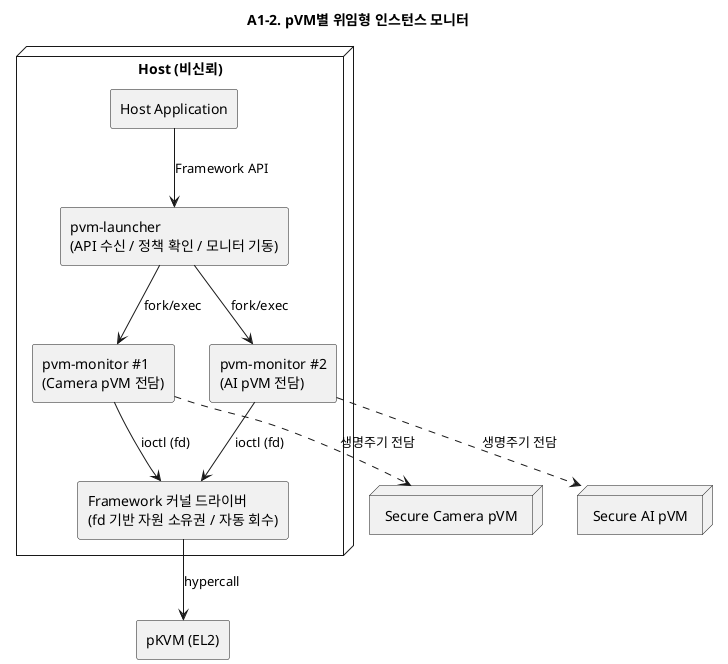

**장점 / 단점 / 트레이드오프**

- **장점**
  - 장애 격벽이 pVM 단위로 선다 — 모니터 하나의 크래시가 타 pVM에 비전파(QA-05 직접 지원).
  - 커널 fd 수명주기 기반 자원 자동 회수로 관리 주체 사망 시 자원 누수가 구조적으로 차단된다.
  - 모니터별 최소 권한(seccomp, 별도 주소 공간)으로 개별 공격면이 작다. 도메인 추가가 프로세스 추가로 흡수된다(QA-03).
- **단점**
  - 전역 상태(자원 예산, 파이프라인 토폴로지)의 소유자가 없어 다중 pVM 오케스트레이션(시나리오 1~6단계) 로직의 배치가 애매해진다.
  - pVM 수만큼 프로세스가 늘어나 메모리 오버헤드가 증가한다(QA-06 한도와 결합).
  - 파이프라인 단위 복구(Camera+AI 동시 재구성)는 모니터 상위의 별도 조정자가 필요하다.
- **트레이드오프**: 격벽과 확장성을 얻는 대신 전역 일관성과 파이프라인 수준 조정을 포기한다. 조정 로직이 런처에 다시 쌓이기 시작하면 사실상 A1-1로 회귀하므로, 런처의 책임 상한을 계약으로 고정해야 한다.

#### A1-3. 제어·데이터 평면 분리형

- **개요**: 제어 평면(생성/정책/수명주기)은 중앙 데몬이 담당하되, 데이터 평면(프레임 전달, HW 접근 경로)은 pVM 간 직접 채널로 완전히 분리한다. 관리 데몬은 채널의 "배선"만 하고 채널 내용에는 접근 불가능하게 한다.
- **구성과 책임**:
  - `pvm-managerd`(제어 평면): 시나리오 1~6단계(요청/검증/생성/배선)만 수행. 배선 후 데이터 경로에서 완전히 이탈
  - 데이터 평면: pVM↔pVM 공유 메모리/RPC 채널. Host 매핑 자체가 존재하지 않도록 커널 드라이버+hypercall로 구성
  - 장애 복구: 제어 평면이 데이터 평면 외부에서 감시(heartbeat)만 수행
- **동작 방식**: 반복 구간(시나리오 7~12단계)에 관리 데몬이 개입하지 않으므로, 데몬이 일시 정지해도 실행 중인 파이프라인은 계속 동작한다.

**구조 다이어그램**

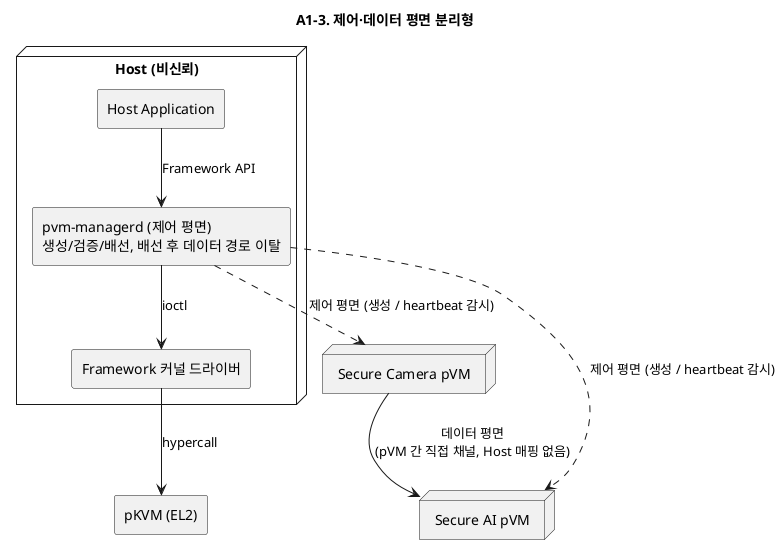

**장점 / 단점 / 트레이드오프**

- **장점**
  - 반복 구간(시나리오 7~12단계)에 관리 데몬이 개입하지 않아, 데몬 장애가 실행 중 파이프라인에 전파되지 않는다(QA-05).
  - 데이터 평면에 Host 매핑이 존재하지 않아 기밀성 논증이 단순하다(QA-01, VOS-09).
  - 성능 경로(데이터)와 제어 경로를 독립적으로 최적화·검증할 수 있다(QA-07에도 유리).
- **단점**
  - 제어 평면 자체는 여전히 중앙 데몬 — 생성/재구성 시점의 단일 장애점은 남는다.
  - 채널 "배선"을 비신뢰 영역의 데몬이 수행하므로, 배선 조작(잘못된 상대에 연결) 방어를 위한 배선 검증 메커니즘(예: pVM 쪽 상대 검증)이 추가로 필요하다.
  - 데몬 재시작 시 실행 중 파이프라인과의 상태 재동기화 로직이 복잡하다.
- **트레이드오프**: 런타임 가용성과 기밀성을 얻는 대신 배선 시점의 신뢰 문제와 재동기화 복잡성을 지불한다. 생성 빈도가 낮고 실행 시간이 긴 본 시나리오 프로파일(장시간 상시 파이프라인)에 잘 맞는 구조다.

#### A1-4. 계층형 하이브리드 (중앙 코디네이터 + per-pVM 모니터)

- **개요**: A1-1과 A1-2의 결합. 중앙 코디네이터는 정책·자원 원장·파이프라인 토폴로지 관리 같은 전역 결정만 담당하고, pVM별 모니터가 개별 생명주기를 실행한다. 2계층 감독(supervision) 트리 구조다.
- **구성과 책임**:
  - `pvm-coordinator`: 전역 정책(PDP), 자원 예산 관리, 파이프라인 단위 오케스트레이션, 모니터 감독(재기동)
  - `pvm-monitor[i]`: pVM i 생명주기 집행(PEP), vCPU 실행, 1차 장애 처리
  - 복구 정책: 모니터 장애는 코디네이터가 재기동, 코디네이터 장애는 모니터들이 독립 생존(파이프라인 유지) 후 재접속(reconciliation)
- **동작 방식**: 전역 일관성(중앙 원장)과 장애 격벽(모니터 프로세스 격리)을 동시에 취한다. 코디네이터 재시작 시 모니터들의 상태를 다시 수집해 원장을 재구성한다.

**구조 다이어그램**

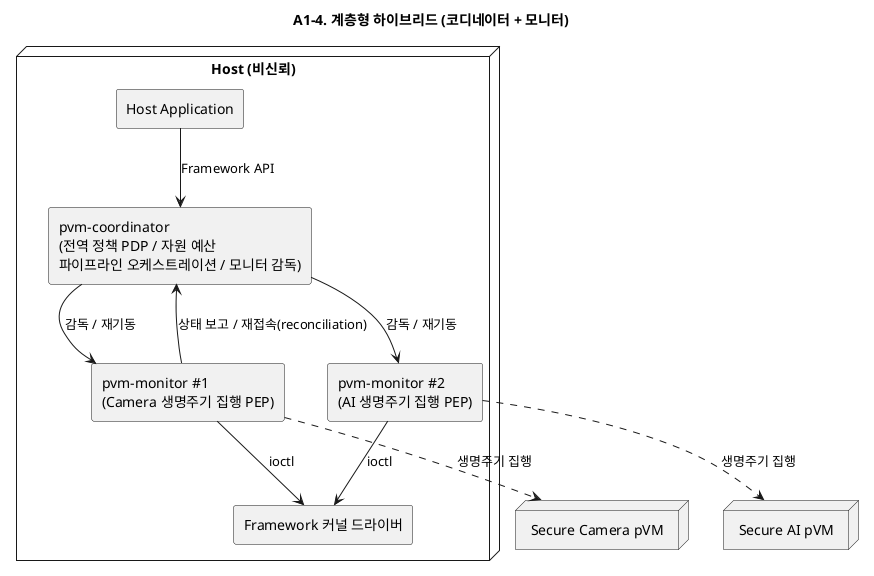

**장점 / 단점 / 트레이드오프**

- **장점**
  - 전역 일관성(코디네이터 원장)과 장애 격벽(모니터 프로세스 격리)을 동시에 확보한다(QA-05 + 오케스트레이션).
  - 감독 트리로 복구 정책이 체계화된다 — 모니터 장애는 코디네이터가, 코디네이터 장애는 모니터 독립 생존으로 흡수(DP-A3의 단계적 복구와 정합).
  - 파이프라인 오케스트레이션의 소유자(코디네이터)가 명확해 다중 pVM 시나리오(FR-02) 확장이 자연스럽다.
- **단점**
  - 구성요소가 2계층이라 구현·시험 복잡도가 후보 중 가장 높다.
  - 코디네이터-모니터 간 상태 보고/재접속(reconciliation) 프로토콜 설계 부담이 크고, 부실하면 원장 불일치가 새로운 장애 모드가 된다.
  - 프로세스 수 증가로 자원 오버헤드가 있다(QA-06).
- **트레이드오프**: 복잡도를 지불하고 가용성·일관성·확장성을 모두 취한다. 채택 시 reconciliation 프로토콜의 정합성 검증(QA-07 시험 시나리오 포함)이 필수 전제가 된다.

#### A1-5. 관리 평면 pVM 위임형 (Control pVM)

- **개요**: 관리 기능 중 보안 민감 결정(정책 판단, Workload 검증, 채널 키 관리)을 전용 관리 pVM(Control pVM)으로 옮기고, Host에는 자원 브로커(메모리/CPU 할당 대행) 역할의 얇은 스텁 데몬만 남긴다.
- **구성과 책임**:
  - Host `pvm-stub`: API 수신과 자원 할당 대행만 수행. 정책 판단 권한 없음
  - Control pVM: 정책 결정(PDP), Workload 서명 검증, 파이프라인 토폴로지 승인, 채널 설정값 서명. Host 스텁의 요청을 검증 후 승인 토큰 발급
  - Framework 커널 드라이버 + hypercall: 승인 토큰이 있는 요청만 pVM 생성/채널 배선 집행
- **동작 방식**: Host가 침해되어도 스텁이 위조할 수 있는 것은 "자원 요청"뿐이고, 격리에 영향을 주는 결정은 Control pVM의 서명 없이는 집행되지 않는다.

**구조 다이어그램**

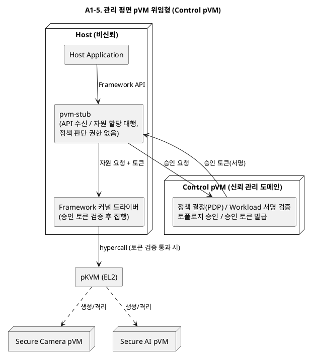

**장점 / 단점 / 트레이드오프**

- **장점**
  - 정책 결정이 Host 침해 영향권 밖에 있어 기밀성이 후보 중 가장 강하다(P-A1-1의 근본 해결). Host가 침해되어도 위조 가능한 것은 자원 요청뿐이다.
  - Host 쪽 비신뢰 코드(스텁)가 최소화되고, 승인 토큰으로 요청 위조가 차단된다.
  - Control pVM의 부팅 측정과 결합하면 격리 증빙(DP-E2, QA-07) 체계와 자연스럽게 연계된다.
- **단점**
  - Control pVM이 상시 자원을 점유한다(QA-06 한도와 경합).
  - 제어 경로 홉 증가(App → 스텁 → Control pVM → 커널)로 파이프라인 생성 지연이 늘어난다.
  - Control pVM 장애 시 신규 파이프라인 생성이 불가하다(실행 중 파이프라인은 유지). Control pVM 자체를 누가 검증·기동하는가 하는 부트스트랩 문제가 있다.
- **트레이드오프**: 기밀성과 검증성을 얻는 대신 자원·지연·부트스트랩 복잡성을 지불한다. "Host 비신뢰" 원칙을 제어 평면까지 일관 적용하는 구조지만, 과제 규모 대비 과잉 설계인지 여부를 판단해야 한다.

### 1.3 DP-A1 후보 비교 요약

| 후보 | 기밀성 (QA-01) | 가용성 (QA-05) | 확장성 (QA-03) | 구현 비용 | 핵심 트레이드오프 |
|------|---------------|---------------|---------------|----------|------------------|
| A1-1 중앙집중형 | 하 | 하 | 하 | 낮음 | 단순성 vs SPOF·TCB 팽창 |
| A1-2 인스턴스 모니터 | 중 | 상 | 상 | 중간 | 장애 격벽 vs 전역 조정 부재 |
| A1-3 제어·데이터 분리 | 상 (데이터 경로) | 중상 (런타임) | 중 | 중간 | 런타임 독립성 vs 배선 신뢰·재동기화 |
| A1-4 계층형 하이브리드 | 중 | 상 | 상 | 높음 | 전 품질 확보 vs 구현·시험 복잡도 |
| A1-5 Control pVM | 상 | 중 | 중 | 높음 | 제어 평면 기밀성 vs 자원·부트스트랩 |

### 1.4 DP-A1 품질속성 KPI 측정 기준

> **상/중/하 판정 공통 원칙**: `06_qa_utility_tree_metrics.md`의 게이트/KPI 2단계 원칙을 따른다. **상** = 게이트를 구조 자체로 충족(설계가 보장)하고 KPI에 마진 보유, **중** = 게이트 충족이 부가 메커니즘·검증에 의존하고 KPI가 목표선 부근, **하** = 게이트 위반 위험이 있거나 KPI 목표 미달이 구조적으로 예상. 경계 수치는 06 문서와 동일하게 가정치이며 PoC 결과로 보정한다. 1.3절의 등급은 설계 시점 예측치로, 아래 KPI의 실측으로 대체되어야 한다.

**측정 KPI와 방법**

| 비교 축 | 참조 KPI (06 문서) | 측정 지표 | 측정 방법 |
|---|---|---|---|
| 기밀성 (QA-01) | SEC-01 | 관리 계층의 TCB 기여 규모(KLoC)와 릴리스당 증가율, canary 노출 0건(게이트) | 관리 골격 중 "침해되면 격리가 무너지는 코드"(승인·배선·hypercall 경로)를 TCB로 계상해 LoC 집계. SEC-01 방식대로 pVM에 canary 마커 주입 후 root Host(관리 데몬 권한 탈취 상황 포함)가 전체 덤프하여 마커 검출 자동 판정 |
| 가용성 (QA-05) | AVL-01, AVL-02 | 관리 구성요소 장애 주입 시 실행 중 파이프라인 다운타임(게이트: 0), 관리 기능 복구 시간 p99 | 관리 데몬/모니터/코디네이터에 크래시·hang을 주입(AVL-03 장애 카탈로그 방식)하고 이웃 pVM과 실행 중 파이프라인의 지속 여부 확인(AVL-01 방법). watchdog 타임스탬프로 검출→회수→재기동 분해 계측(AVL-02 방법) |
| 확장성 (QA-03) | EXT-01, EXT-02 | 신규 도메인 유형 추가 시 관리 골격 코어 diff LoC(게이트: 0), 이질 런타임 수용 종수 | 신규 pVM 유형/파이프라인 추가 전후 코어 디렉터리 diff를 CI로 자동 검사(EXT-01 방법). 이질 파일럿 Workload 3종을 관리 골격이 동일 절차로 수용하는지 확인(EXT-02 방법) |
| 구현 비용 | EXT-03·EXT-06의 공수 계측 방식 원용 | 신규 개발 모듈 수, 신규 프로토콜 수, 추정 공수(인월) | 후보별 구성요소를 재사용/확장/신규로 분류하고 공수를 산정. EXT-03(온보딩 인일 실측)·EXT-06(교체 대응 공수)과 동일하게 공수를 연속 KPI로 관리 |

**상/중/하 판정 기준**

| 비교 축 | 상 | 중 | 하 |
|---|---|---|---|
| 기밀성 | 격리 영향 결정이 비신뢰 관리 코드에 없음 — 관리 데몬 전체가 TCB 밖이고 TCB 기여가 커널 드라이버·검증 로직 등 최소 경로로 한정 | 관리 코드 일부(배선·자원 원장 등)가 TCB에 편입되나 hypercall 검증으로 게이트 충족 가능 | 관리 데몬이 전권 보유해 데몬 전체가 사실상 TCB — canary 시험 통과가 데몬 무결성에 의존 |
| 가용성 | 관리 구성요소 어느 하나의 장애에도 실행 중 파이프라인 다운타임 0, 관리 기능 복구 p99 3초 이내(AVL-02 기준) | 실행 중 파이프라인은 유지되나 관리 구성요소 복구 전까지 신규 생성·장애 복구 불가(관리 SPOF 잔존) | 관리 구성요소 장애가 실행 중 파이프라인 중단으로 전파(AVL-01 게이트 위반) |
| 확장성 | 신규 도메인 유형이 구성/manifest 변경만으로 수용(코어 diff 0 LoC) | 코어 무수정이나 도메인별 프로세스·템플릿 등 부가 산출물 필요 | 도메인 유형 추가가 관리 골격 코어 수정을 유발(EXT-01 게이트 위반) |
| 구현 비용 | 낮음: 신규 핵심 모듈 1~2개, 기존 패턴 재사용 위주 | 중간: 신규 모듈 3~4개 또는 신규 IPC/프로토콜 1종 | 높음: 다계층 프로토콜(감독/승인/재동기화) 설계 + 신규 신뢰 도메인 구축 |

**KPI 선정 근거**

1. **기밀성 — SEC-01**: DP-A1 후보 간 차이는 "노출 0건" 게이트 자체가 아니라 그 게이트가 **어느 코드의 무결성에 의존하는가**이다. SEC-01이 이를 TCB 규모(KLoC)와 CEM 공격 잠재력으로 계량화하도록 이미 정의하고 있고(공격면이 신뢰 코드량에 비례한다는 CC/CEM 평가 방법 기반), canary 주입 시험이 관리 데몬 권한 탈취 시나리오에 그대로 적용된다.
2. **가용성 — AVL-01/02**: P-A1-2(단일 장애점)의 판정 조건이 AVL-01 게이트("장애 전파로 인한 다운타임 0")와 동일한 구조이며, 복구 시간 상한 3초는 AVL-02가 검출 0.5s/회수 1s/재기동 1.5s로 분해 근거를 제시한 문서 내 유일한 수치 기준이다.
3. **확장성 — EXT-01/02**: P-A1-3의 "코어 수정 0 LoC"는 EXT-01 게이트의 정의 그 자체이고, 측정 방법(코어 디렉터리 diff CI 자동 검사)이 관리 골격에 수정 없이 적용 가능해 별도 지표 신설이 불필요하다.
4. **구현 비용 — 공수 KPI**: 06 문서에 대응 QA가 없는 프로젝트 제약 축이므로 게이트 없이 KPI만 둔다. 공수(인일/인월) 계측은 EXT-03·EXT-06이 이미 채택한 측정 항목이어서 지표 체계의 일관성이 유지된다.

---

### 1.5 Android AVF 구조 매핑

Android AVF(Android Virtualization Framework)는 DP-A1 후보 중 **A1-2. pVM별 위임형 인스턴스 모니터**에 가장 가깝다. AVF에서는 `VirtualizationService`/`virtmgr`가 VM 생성 요청, 전역 자원 할당, `crosvm` 프로세스 기동·감시를 맡고, 각 VM은 별도 `crosvm` 인스턴스가 메모리 구성, vCPU 실행, virtio 백엔드 등 개별 실행 책임을 담당한다. 즉 단일 manager가 모든 pVM 실행을 내부 스레드로 직접 끌고 가는 A1-1 구조가 아니라, pVM별 monitor가 분리되는 per-instance 구조다.

다만 `VirtualizationService`/`virtmgr`가 CID 같은 전역 자원을 배분하고 `crosvm` child process를 감시하므로, 순수 A1-2라기보다는 **A1-2에 A1-4. 계층형 하이브리드의 경량 coordinator 성격이 일부 결합된 구조**로 보는 것이 정확하다. DP-A1 후보 평가 관점에서는 Android AVF를 "검증된 선행 사례는 A1-2 계열이며, 전역 조정이 필요한 경우 A1-4 방향으로 확장된다"는 근거로 활용할 수 있다.

참고: Android 공식 문서 `Android Virtualization Framework`, `VirtualizationService`.

---

## 2. DP-C1. 도메인 간 프레임 전달 채널 구조

### 2.1 문제 정의

시나리오 9단계에서 Camera pVM은 매 프레임(30fps 기준 33ms 주기)을 AI pVM으로 전달해야 한다(FR-04). 이 채널 구조가 다음 문제를 좌우한다.

| ID | 문제점 | 관련 품질속성 |
|----|--------|--------------|
| P-C1-1 | **프레임당 전달 비용이 실시간 예산을 잠식**: 복사 1회, map/unmap hypercall, VM exit가 프레임 주기마다 발생하면 QA-04(프레임당 전달 지연 5ms 이하)와 QA-02(E2E 100ms, 30fps)를 위협한다. 고해상도 프레임(수 MB)의 memcpy 1회만으로도 ms 단위 비용이다. | 성능 (QA-02, QA-04) |
| P-C1-2 | **전달 구간의 노출 창**: 전달 버퍼가 Host 커널에 매핑된 채 지나가면(예: 일반 virtio 백엔드 경유) Host 침해 시 프레임 원본이 노출된다(VOS-09, QA-01 위반). 공유 매핑을 넓고 오래 열수록 노출 창이 커진다. | 기밀성 (QA-01) |
| P-C1-3 | **도메인 수 증가 시 채널 토폴로지 폭발**: 도메인 쌍마다 전용 채널을 배선하면 N개 도메인에서 O(N^2) 채널이 되고, 채널 설정이 코어 수정을 유발하면 QA-03·R-4에 어긋난다. | 확장성 (QA-03, R-4) |

**해결 방향**: (1) 반복 구간의 프레임 전달 비용이 상수(복사 0~1회, hypercall 최소화)여야 하고, (2) 전달 버퍼는 어떤 시점에도 Host에 매핑되지 않아야 하며, (3) 채널 배선이 토폴로지 기술(구성)만으로 확장되어야 한다.

### 2.2 후보 구조

#### C1-1. 정적 공유 버퍼 풀 + zero-copy 링 (lend/share 상주 매핑)

- **개요**: 파이프라인 구성 시점(시나리오 6단계)에 프레임 버퍼 풀을 pKVM share로 Camera pVM과 AI pVM 양쪽 Stage-2에 상주 매핑하고, Host 매핑은 hypercall로 제거(unmap)한다. 이후 반복 구간에서는 링 디스크립터(인덱스)만 주고받는다.
- **구성과 책임**:
  - 버퍼 풀: 파이프라인 구성 시 1회 할당·매핑, 종료 시 1회 회수·소거
  - 프레임 링: 생산자(Camera)/소비자(AI) 인덱스만 담는 소형 공유 페이지
  - 알림: 도어벨(인터럽트 주입) 또는 폴링 — 데이터 이동 없음
- **동작 방식**: 프레임당 비용은 "인덱스 갱신 + 알림 1회"로 상수화된다. 매핑 전환 hypercall이 반복 구간에서 사라진다.

**구조 다이어그램**

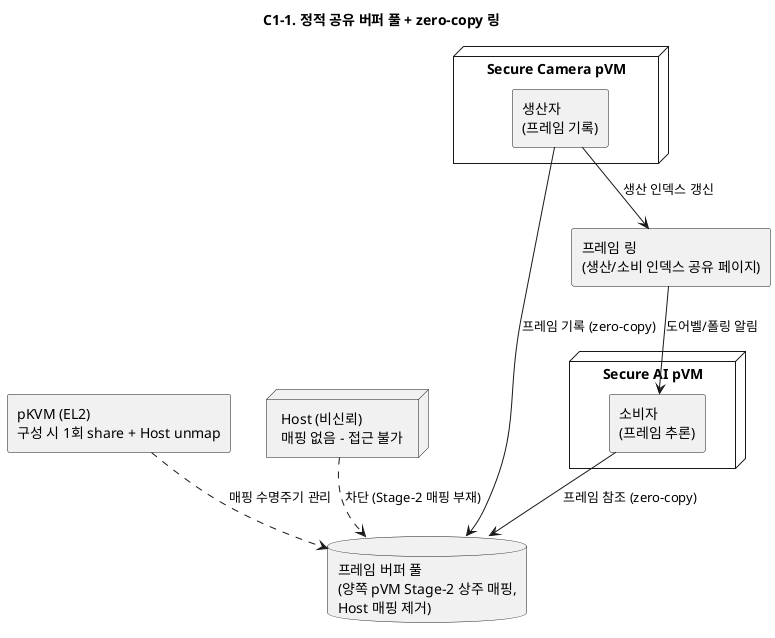

**장점 / 단점 / 트레이드오프**

- **장점**
  - 프레임당 비용이 "인덱스 갱신 + 알림 1회"로 최소 — QA-04(5ms) 여유가 가장 크고 QA-02(30fps) 달성에 유리하다.
  - 반복 구간에서 매핑 전환 hypercall이 사라져 지연 지터가 낮고 성능 예측이 가능하다.
  - Host 매핑이 구성 시점에 제거되어 Host 대상 기밀성 논증은 단순하다.
- **단점**
  - 버퍼 풀이 Camera·AI 양쪽 pVM에 상시 매핑 — 한쪽 pVM이 침해되면 풀 전체가 노출되는 등 도메인 간 격리가 약화된다(노출 창이 파이프라인 수명 전체).
  - 풀 크기·구성이 고정되어 해상도 변경 등 동적 재구성 시 재배선이 필요하다.
  - 잔류 데이터 소거 시점이 파이프라인 종료까지 지연된다(VOS-08과 긴장).
- **트레이드오프**: 성능을 얻는 대신 노출 창(공유 범위 × 시간)을 지불한다. 파이프라인을 구성하는 pVM 간 상호 신뢰가 전제 조건이며, "Host로부터의 격리"는 강하지만 "도메인 간 격리"는 가장 약한 안이다.

#### C1-2. virtio-vsock 스트림 채널 (표준 스택 복사 기반)

- **개요**: pVM 간 전달을 virtio-vsock 스트림으로 구현한다. 프레임은 vsock 소켓으로 직렬화 전송되며, 전달 구간 보호는 프레임 암호화(시나리오 8단계에서 이미 암호화된 프레임 전달)로 확보한다.
- **구성과 책임**:
  - Camera pVM: 프레임을 암호화 후 vsock 송신
  - Host vsock 백엔드/스위치: 암호문 스트림만 중계 (평문 접근 불가)
  - AI pVM: 수신 후 복호화하여 추론
- **동작 방식**: 표준 스택(virtio) 재사용으로 구현·이식 비용이 가장 낮다. Host가 스트림을 봐도 암호문이므로 기밀성은 암호화 강도에 위임된다.

**구조 다이어그램**

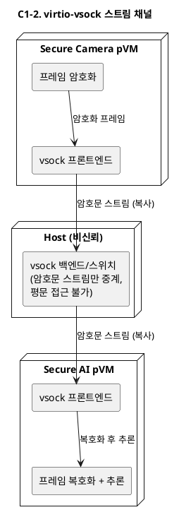

**장점 / 단점 / 트레이드오프**

- **장점**
  - 표준 스택(virtio-vsock) 재사용으로 구현·이식 비용이 후보 중 가장 낮고, 게스트 커널 드라이버가 기성품이다.
  - 채널 수립·흐름 제어·재연결 등 통신 관리를 스택이 제공한다. 도메인 추가 시 채널 구성이 유연하다.
- **단점**
  - 프레임당 복사 2회 + 암복호화 비용이 프레임 주기와 결합 — 고해상도에서 QA-04(5ms)·QA-02(30fps) 미달 위험이 후보 중 가장 크다.
  - Host vsock 백엔드가 데이터 경로에 상주 — 암호문이라도 트래픽 패턴·타이밍이 노출되고, Host가 채널을 끊는 서비스 거부가 가능하다.
  - 기밀성이 "구조적 비노출"이 아닌 "암호 강도 + 키 관리"에 의존하게 되어 QA-01 검증 방법 자체가 달라진다.
- **트레이드오프**: 개발 속도와 이식성을 얻는 대신 실시간 성능을 지불한다. 기밀성 보장의 성격이 구조 보장에서 암호학적 보장으로 바뀌는 것이 가장 큰 구조적 결정이다.

#### C1-3. 프레임 단위 소유권 이전 채널 (exclusive lend hand-off)

- **개요**: 프레임 버퍼를 동시 공유하지 않고, 매 프레임 "Camera pVM 소유 → hypercall로 AI pVM에 이전(lend) → 사용 후 반환"하는 단일 소유자(single-owner) 프로토콜로 전달한다.
- **구성과 책임**:
  - Framework 커널 드라이버: 소유권 이전 요청을 hypercall(donate/lend 계열)로 집행
  - pKVM: 이전 시점에 이전 소유자의 Stage-2 매핑 제거 — 어떤 시점에도 프레임의 소유자는 정확히 1개 도메인
  - 반환 경로: AI pVM 사용 완료 후 버퍼를 풀로 반환(재이전)
- **동작 방식**: 동시 매핑이 존재하지 않으므로 노출 창이 최소다. 대신 프레임마다 이전/반환 hypercall 2회와 TLB 무효화 비용을 지불한다.

**구조 다이어그램**

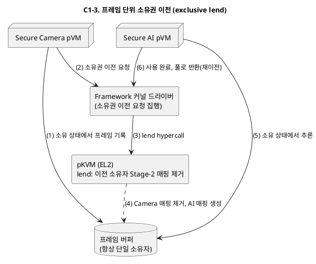

**장점 / 단점 / 트레이드오프**

- **장점**
  - 어떤 시점에도 프레임의 소유자가 정확히 1개 도메인 — 노출 창이 최소이고 도메인 간 상호 격리까지 유지된다(QA-01 관점 최강).
  - 소유권 이전 시점이 곧 매핑 제거 시점이라 잔류 데이터 관리(VOS-08)와 격리 검증(QA-07)이 명확하다.
- **단점**
  - 프레임마다 이전/반환 hypercall 2회 + TLB 무효화 비용 — 30fps × 버퍼 수만큼 누적되어 QA-04(5ms) 예산을 잠식할 수 있다.
  - 이중/삼중 버퍼링(파이프라이닝, DP-P2)과 결합하면 소유권 프로토콜이 복잡해진다.
  - 기존 pKVM hypercall(lend/donate 계열)의 의미론에 의존도가 가장 높아 CS-02(EL2 수정 불가) 범위 내 실현 가능성 확인이 선행되어야 한다.
- **트레이드오프**: 기밀성을 얻는 대신 프레임당 고정 비용을 지불한다. hypercall 왕복 + TLB 비용이 5ms 예산 안에 들어가는지 성능 실측이 채택의 관문이다.

#### C1-4. 제어·데이터 분리 하이브리드 채널 (vsock 제어 + 공유 풀 데이터)

- **개요**: 제어 메시지(프레임 메타데이터, 흐름 제어, 채널 협상)는 virtio-vsock으로, 벌크 프레임 데이터는 C1-1형 공유 버퍼 풀로 나눠 싣는 2중 채널 구조다.
- **구성과 책임**:
  - 제어 채널(vsock): 채널 수립/버전 협상/오류 통지 — 빈도 낮음, 표준 스택 재사용
  - 데이터 채널(공유 풀): 프레임 본문 zero-copy 전달 — Host 비매핑
  - 채널 관리자: 시나리오 6단계에서 두 채널을 함께 배선하고 수명주기를 일치시킴
- **동작 방식**: 성능 민감 경로(데이터)와 유연성이 필요한 경로(제어)를 각자 최적 메커니즘에 배정한다. 채널 종류가 2개라 배선·상태 관리는 복잡해진다.

**구조 다이어그램**

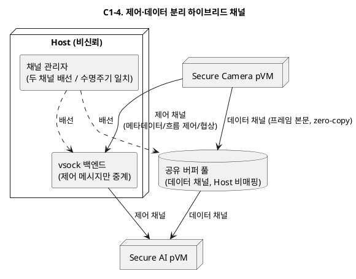

**장점 / 단점 / 트레이드오프**

- **장점**
  - 데이터 경로는 zero-copy(QA-04), 제어 경로는 표준 스택(개발 속도·유연성) — 각 경로를 최적 메커니즘에 배정한다.
  - 채널 협상·버전 관리·오류 통지가 제어 채널로 자연스럽게 수용된다(DP-E3 인터페이스 버저닝과 정합).
  - 제어/데이터 분리는 업계에서 검증된 패턴이라 설계 리스크가 예측 가능하다.
- **단점**
  - 채널 2종의 수명주기 동기화가 필요 — 한쪽만 끊긴 반개방(half-open) 상태의 검출·정리 로직이 추가된다.
  - 구현·시험 대상이 2배가 된다.
  - 제어 채널이 Host를 경유하므로 제어 메시지 위변조(잘못된 인덱스 주입 등) 방어가 데이터 채널 설계에 반영되어야 한다.
- **트레이드오프**: 두 메커니즘의 장점을 취하는 대신 상태 관리 복잡성을 지불한다. 제어 메시지를 "힌트"로만 취급하고 최종 검증을 공유 링 쪽에서 수행하는 방어적 설계가 병행되어야 한다.

#### C1-5. 브로커 pVM 경유 스타 토폴로지 (스위치 도메인)

- **개요**: 도메인 간 직접 채널 대신, 전용 브로커 pVM(스위치 도메인)이 모든 프레임 라우팅을 담당하는 스타(star) 토폴로지를 구성한다. 각 도메인은 브로커와의 채널 1개만 가진다.
- **구성과 책임**:
  - 브로커 pVM: 라우팅 테이블(토폴로지 기술 기반), 흐름 제어, 도메인 간 격리 유지(송신자별 버퍼 분리)
  - 각 pVM: 브로커와의 단일 채널(공유 풀 또는 이전 방식)만 유지
  - 토폴로지 변경: 브로커의 라우팅 테이블 갱신만으로 N개 도메인 파이프라인 구성
- **동작 방식**: 채널 수가 O(N)으로 억제되고 다단 파이프라인(R-4)이 구성 변경으로 수용된다. 대신 모든 프레임이 브로커를 경유(1홉 추가)한다.

**구조 다이어그램**

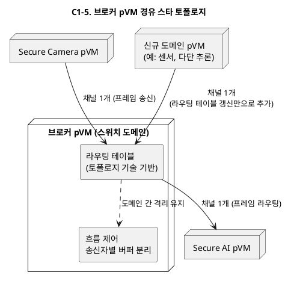

**장점 / 단점 / 트레이드오프**

- **장점**
  - 채널 수가 O(N)으로 억제되고(P-C1-3 해결), 토폴로지 변경이 라우팅 테이블 갱신만으로 수용된다(R-4, QA-03, DP-S2와 정합).
  - 흐름 제어·QoS·감사 지점이 브로커 한곳에 모여 운영·증적(QA-07)에 유리하다.
  - 도메인 쌍 간 직접 신뢰가 불필요 — 송신자별 버퍼 분리로 도메인 간 격리를 브로커가 유지한다.
- **단점**
  - 모든 프레임이 브로커를 경유(1홉 추가) — 지연과 복사(또는 재이전) 비용으로 QA-04 위험이 커진다.
  - 브로커 pVM이 성능 병목이자 데이터 평면의 단일 장애점이 된다(QA-05).
  - 브로커가 모든 프레임에 접근 가능해 브로커 자체가 큰 TCB가 된다 — 브로커 침해 시 전 도메인 데이터 노출.
- **트레이드오프**: 확장성과 운영성을 얻는 대신 성능과 새로운 신뢰 집중점을 지불한다. 2-도메인 레퍼런스에는 과잉이며, N-도메인 다단 파이프라인이 확정 로드맵일 때만 투자 가치가 있다.

### 2.3 DP-C1 후보 비교 요약

| 후보 | 성능 (QA-02/04) | 기밀성 (QA-01) | 확장성 (R-4) | 구현 비용 | 핵심 트레이드오프 |
|------|----------------|---------------|-------------|----------|------------------|
| C1-1 정적 공유 풀 | 상 | 중 (도메인 간 상시 공유) | 중 | 중간 | 성능 vs 노출 창 상시 개방 |
| C1-2 vsock 스트림 | 하 | 중 (암호 강도 의존) | 상 | 낮음 | 개발 속도 vs 실시간 성능 |
| C1-3 소유권 이전 | 중 (hypercall 비용) | 상 | 중 | 중간 | 기밀성 vs 프레임당 고정 비용 |
| C1-4 하이브리드 | 상 | 중상 | 상 | 높음 | 경로별 최적화 vs 상태 관리 복잡성 |
| C1-5 브로커 스타 | 중하 (1홉 추가) | 중 (브로커 TCB 집중) | 상 | 높음 | 토폴로지 확장성 vs 성능·신뢰 집중 |

### 2.4 DP-C1 품질속성 KPI 측정 기준

> 상/중/하 판정 공통 원칙은 1.4절과 동일하다(게이트 구조 충족 = 상, 조건부 충족 = 중, 위반 위험 = 하).

**측정 KPI와 방법**

| 비교 축 | 참조 KPI (06 문서) | 측정 지표 | 측정 방법 |
|---|---|---|---|
| 성능 (QA-02/04) | PERF-02, PERF-01 | 데이터 경로 memcpy 0회(게이트), 전달 지연 p99 5ms, 프레임당 전환 비용 1ms 이하, 30fps·드롭율 0.1% 이하, fps/W 저하 10% 이내 | 복사 계열 함수 프로파일 히트 0 확인, dma-buf fence 타임스탬프로 핸드오프 지연 계측, ftrace로 프레임당 hypercall 횟수 계측, PMIC 텔레메트리로 fps/W 측정(PERF-02 방법 그대로) |
| 기밀성 (QA-01) | SEC-01 (+SEC-02 원칙 확장) | canary 노출 0건(게이트), 노출 창 = 비소유 주체의 Stage-2 매핑 폭 × 유지 시간, 도메인 간 동시 매핑 유무 | 프레임 버퍼에 canary 마커를 넣고 전달 전 구간(기록→전달→추론→회수)에서 root Host 전체 덤프로 마커 검출 판정(SEC-01 방법). 전달 이벤트마다 매핑 상태를 로깅해 Host 매핑·도메인 간 동시 매핑을 오프라인 판정(SEC-02의 권한 비트맵 로깅 방식) |
| 확장성 (R-4) | EXT-01 (+자원 증가율) | 토폴로지 변경 시 코어 diff LoC(게이트: 0), 도메인 수 N에 대한 채널·버퍼 자원 증가율(O(N) vs O(N^2)) | 도메인 1개 추가 실험에서 코어 diff CI 검사(EXT-01 방법) + 채널 수·버퍼 풀 메모리 증가분 실측 |
| 구현 비용 | EXT-03·EXT-06의 공수 계측 방식 원용 | 신규 채널 메커니즘 수, 신규 도메인(브로커 등) 수, 추정 공수(인월) | 표준 스택 재사용/커스텀 개발 구분 후 공수 산정 |

**상/중/하 판정 기준**

| 비교 축 | 상 | 중 | 하 |
|---|---|---|---|
| 성능 | memcpy 0회 게이트를 구조로 충족 + 전달 지연 p99가 5ms의 절반 이하 + 프레임당 hypercall 0~1회 | memcpy 0회이나 프레임당 hypercall 2회 이상 또는 p99가 5ms 목표선 부근(전환 비용 1ms 기준 위협) | 데이터 경로 memcpy 1회 이상(게이트 위반) 또는 p99 5ms 초과 |
| 기밀성 | Host 매핑 0 + 도메인 간 동시 매핑 없음(단일 소유) — 전 구간 canary 미검출 | Host 매핑 0이나 도메인 간 상시 공유 창 존재, 또는 Host 경유 구간이 암호문으로 한정 | 평문 프레임이 Host 접근 가능 구간을 통과(SEC-01 게이트 위반 위험) |
| 확장성 | 토폴로지 선언 변경만으로 N-도메인 구성(코어 diff 0) + 채널 자원 O(N) | 코어 무수정이나 도메인 쌍별 배선으로 자원 O(N^2) 증가 | 신규 토폴로지 수용에 코어 수정 필요 |
| 구현 비용 | 낮음: 표준 스택·기성 드라이버 재사용 위주 | 중간: 커스텀 링/풀 관리자 1종 신규 개발 | 높음: 채널 메커니즘 2종 병행 또는 브로커 도메인 신설 |

**KPI 선정 근거**

1. **성능 — PERF-02/01**: QA-04("프레임당 전달 지연 5ms, zero-copy")는 06 문서에서 PERF-02로 재편되어 게이트(memcpy 0회)와 KPI(p99 5ms, 프레임당 전환 비용 1ms, fps/W)로 이미 구체화되어 있다. 특히 fps/W 항목은 "복사·전환 과다는 전력으로 드러남"이라는 측정 근거가 명시되어 있어, 채널 구조 간 차이를 소비 전력으로도 교차 검증할 수 있다.
2. **기밀성 — SEC-01 + SEC-02 원칙 확장**: canary 주입·전체 덤프 판정(SEC-01)은 전달 구간에 수정 없이 적용된다. 상/중을 가르는 "도메인 간 동시 매핑" 기준은 SEC-02의 "권한 중첩 0"(두 주체가 동시에 접근 권한을 갖는 구간을 위반으로 간주) 원칙을 채널 매핑에 확장한 것으로, 새 개념의 발명이 아니라 기존 게이트 원칙의 적용 범위 확대다.
3. **확장성 — EXT-01 + 자원 증가율**: 코어 diff CI 검사(EXT-01)가 직접 적용된다. 자원 증가율을 병기하는 근거는 06 문서 7절에서 자원 효율(원본 QA-07)이 독립 리프 대신 성능 예산 KPI로 흡수되었기 때문 — 채널·버퍼 자원이 도메인 수와 곱해지는 구조인지가 확장 시 예산 소모율을 결정한다.
4. **구현 비용 — 공수 KPI**: 1.4절 근거 4와 동일(EXT-03·EXT-06의 공수 계측 선례).

### 2.5 DP-C1 후보별 EL2(pKVM) 수정 필요 여부

CS-02(EL2 수정 불가, 기존 hypercall 범위 내 설계) 관점에서 5개 후보 각각이 요구하는 하이퍼바이저 프리미티브와 upstream pKVM의 제공 범위를 대조한다.

**판정 기준 — upstream pKVM이 제공하는 것**: (a) VM 생성 시 host→guest 메모리 기부(donate), (b) 게스트가 자신의 페이지를 **Host와** 공유/회수하는 `MEM_SHARE`/`MEM_UNSHARE`(virtio 버퍼용, `99_pvmfw.md` 3.4절), (c) 단일 소유자 + host-guest 공유 상태만 있는 페이지 소유권 모델. 즉 **pVM↔pVM 간 공유·이전 상태는 소유권 모델에 존재하지 않으며**, VM을 FF-A endpoint로 취급하는 guest-to-guest relayer도 없다(`99_ffa.md`). vsock은 구조적으로 guest↔host 전용이라 EL2와 무관하게 Host 릴레이로 동작한다(`99_virtio_vsock.md`).

| 후보 | EL2 수정 | 필요한 하이퍼바이저 프리미티브 | 판정 근거 | CS-02 범위 내 대안과 그 대가 |
|------|----------|------------------------------|-----------|------------------------------|
| C1-1 정적 공유 풀 | **필요** | 같은 물리 페이지를 두 pVM의 Stage-2에 동시 매핑하되 Host는 비매핑으로 유지하는 guest-guest 공유 상태 | upstream 소유권 모델에 guest-guest 공유 상태가 없음. FF-A relayer로 구현해도 그 relayer 추가가 곧 EL2 수정 | 풀을 Host 소유로 두고 양쪽 pVM과 host-guest 공유하면 무수정 가능하나, Host가 풀에 상시 매핑되어 QA-01(SEC-01 게이트) 위반 — 사실상 대안 아님 |
| C1-2 vsock 스트림 | **불필요** | 기존 guest↔host `MEM_SHARE`(virtio 큐/버퍼)만 사용 | virtio-vsock은 upstream pKVM + 표준 스택 그대로 동작. Host 릴레이 경유가 전제이며 기밀성은 애초에 암호화로 확보하는 설계 | — (이 후보의 존재 이유가 곧 "EL2 무수정 + 표준 스택") |
| C1-3 소유권 이전 | **필요 (가능성 높음)** | 프레임 단위 guest→guest lend/donate: 이전 소유자 Stage-2 매핑 제거 + 새 소유자 매핑 생성을 원자적으로 수행 | upstream의 lend/donate 계열은 host↔guest 방향만 존재. 본문 단점에 명시한 "CS-02 범위 내 실현 가능성 확인"의 실체가 이것 | Host를 경유하는 소유권 바운스(A→Host→B)는 무수정 가능하나 Host 매핑이 생기는 순간 평문 노출 — 기밀성 최강이라는 이 후보의 존재 이유가 소멸 |
| C1-4 하이브리드 | **필요** | 제어 채널(vsock)은 불필요하나, 데이터 채널이 C1-1의 공유 풀 프리미티브를 그대로 요구 | 데이터 채널이 C1-1과 동일 — 판정은 데이터 채널이 결정 | 제어 채널만 먼저 구축하고 데이터 채널을 임시로 C1-2(암호화 vsock)로 대체하는 단계적 경로는 가능(성능 게이트 미충족 상태로 운용) |
| C1-5 브로커 스타 | **채널 방식에 종속** | pVM↔브로커 pVM 채널도 결국 guest-to-guest — 공유 풀 기반이면 C1-1, 이전 기반이면 C1-3의 프리미티브를 그대로 요구 | 브로커가 pVM인 이상 채널 프리미티브 문제는 소멸하지 않고 브로커와의 채널로 이동할 뿐 | 채널을 vsock(Host 릴레이)으로 구성하면 무수정 가능하나, 모든 프레임이 Host를 지나므로 브로커 도입의 격리 이점이 사라지고 홉은 2배(pVM→Host→브로커→Host→pVM) |

**시사점**

1. **성능 게이트(memcpy 0회)를 충족하는 후보(C1-1/C1-3/C1-4)는 전부 EL2 수정이 필요하고, EL2 무수정 후보(C1-2)는 성능 게이트를 위반한다.** 즉 DP-C1에서 CS-02와 PERF-02 게이트는 upstream pKVM 기준으로 동시 충족이 불가능하며, 이 충돌의 해소가 후보 선택보다 먼저 결정되어야 할 상위 결정이다.
2. 해소 경로는 셋 중 하나다: (a) 대상 SoC 벤더의 pKVM이 guest-to-guest 공유/이전 hypercall을 이미 제공하는지 확인(제공 시 "수정"이 아니라 "기존 hypercall 사용"이 되어 CS-02 충족), (b) CS-02의 재협상(EL2 수정 범위를 명시적으로 승인받음), (c) 성능 게이트의 단계적 유예(C1-2로 시작하는 C1-4의 단계적 경로).
3. 따라서 아키텍처 평가(ATAM 등) 전에 **벤더 pKVM의 hypercall 목록 확보가 최우선 확인 항목**이며, 이는 `99_ffa.md`의 "relayer 제공 여부 선확인" 결론과 동일한 관문이다.

---

## 3. DP-C2. HW IP 중재(Mediation) 위치와 공유 방식

### 3.1 문제 정의

Camera/AI HW는 다중 Context를 하드웨어로 제공하지 않는 단일 Context IP이며(CS-05), Host의 일반 기능과 pVM의 보안 파이프라인이 같은 IP를 동시에 사용해야 한다(R-2, FR-03, 시나리오 7·10단계). 중재자를 어디에 두는가가 다음 문제를 좌우한다.

| ID | 문제점 | 관련 품질속성 |
|----|--------|--------------|
| P-C2-1 | **중재자의 보안 프레임 접근 가능성**: 중재자가 Host 커널 드라이버라면, 비신뢰 주체가 HW 레지스터·DMA 디스크립터를 만진다. 중재자가 보안 세션의 DMA 대상 메모리에 접근하거나 DMA를 비보호 메모리로 돌릴 수 있으면 QA-01이 무너진다. | 기밀성 (QA-01) |
| P-C2-2 | **사용 주체 전환 비용**: Host 세션과 pVM 세션이 교차할 때마다 HW 컨텍스트 저장/복원, S2MPU 재프로그래밍, 잔류 데이터 소거(VOS-08)가 발생한다. 이 전환이 프레임 주기(33ms)와 결합하면 fps와 E2E 지연(QA-02)을 직접 잠식한다. | 성능 (QA-02) |
| P-C2-3 | **중재자 장애의 양방향 전파**: 중재자가 죽으면 Host 일반 기능과 pVM 보안 파이프라인이 동시에 HW를 잃는다. 중재자가 어느 도메인에 있느냐에 따라 장애 반경이 달라진다(QA-05). | 가용성 (QA-05) |

**제약**: EL2(pKVM)는 수정 불가, 기존 hypercall 범위 내에서 설계한다(CS-02).

**해결 방향**: (1) 중재의 "스케줄링 결정"과 "격리 집행"을 구분해 격리 집행은 비신뢰 주체가 위조할 수 없는 위치에 두고, (2) 전환 비용이 보안 파이프라인 실행 중에는 프레임 주기와 결합하지 않게 하며, (3) 중재자 장애가 최소 반경으로 갇히는 구조여야 한다.

### 3.2 후보 구조

#### C2-1. Host 커널 드라이버 시분할 중재 + 보호 DMA 검증

- **개요**: 기존 Host 커널 드라이버를 확장해 Host/pVM 세션을 시분할 스케줄링한다. 단, 보안 세션의 DMA 대상은 pVM 소유 보호 메모리로 한정하고, S2MPU 설정과 잔류 소거는 hypercall 검증을 거치게 해 "제어는 Host, 데이터 격리는 하이퍼바이저 검증"으로 나눈다.
- **구성과 책임**:
  - Host HW 드라이버(확장): 세션 큐 관리, 시분할 스케줄링, HW 컨텍스트 저장/복원
  - Framework 커널 드라이버: 보안 세션 전환 시 S2MPU 프로그래밍을 hypercall로 요청, 소거 확인
  - pKVM(기존 hypercall): 보안 세션 중 HW DMA가 보호 메모리만 향하도록 매핑 검증
- **동작 방식**: 기존 드라이버 자산을 최대한 재사용한다. Host가 스케줄을 조작해도(서비스 거부는 가능) 보안 프레임 데이터에는 접근할 수 없다는 것을 hypercall 검증에 의존해 보장한다.

**구조 다이어그램**

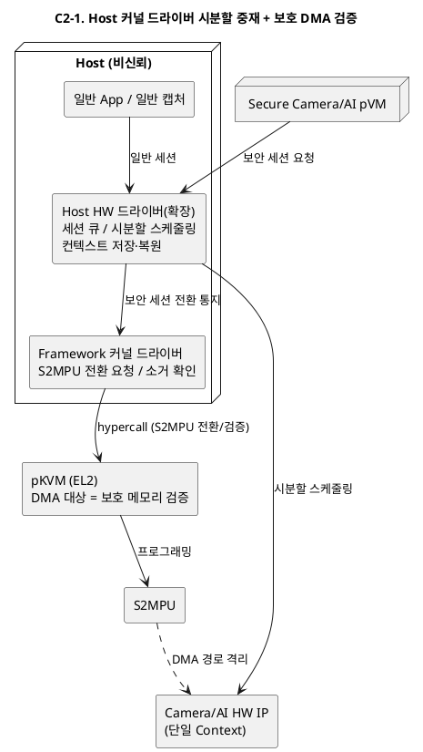

**장점 / 단점 / 트레이드오프**

- **장점**
  - 기존 Host 드라이버 자산을 최대 재사용해 개발 비용이 가장 낮고, Host 일반 경로가 무변경이라 호환성 위험이 없다.
  - 시분할 스케줄링·전원 관리 등 성숙한 드라이버 기능을 그대로 활용한다.
- **단점**
  - 비신뢰 Host가 HW 제어 경로(레지스터, DMA 디스크립터)를 보유 — 기밀성이 hypercall 검증의 커버리지에 전적으로 의존하며, 검증에서 빠진 경로 하나가 곧 격리 구멍이 된다(P-C2-1).
  - 공격면이 Host 드라이버 전체로 넓어 QA-01의 객관적 검증(VOS-13, QA-07) 부담이 후보 중 가장 크다.
  - Host가 보안 세션을 스케줄에서 배제하는 서비스 거부가 가능하다(가용성 보장 불가).
- **트레이드오프**: 개발 비용과 호환성을 얻는 대신 "격리 논증"의 난이도를 지불한다. 검증 부서·규제 대응 관점에서 격리 증명이 가장 어려운 안이라는 점이 본질적 약점이다.

#### C2-2. 전용 디바이스 소유 pVM (Driver VM)

- **개요**: Camera/AI HW의 MMIO·인터럽트를 전용 Driver pVM에 패스스루로 귀속시킨다. Host의 일반 기능도, 보안 pVM의 보안 세션도 모두 Driver pVM에 가상 디바이스 인터페이스로 요청한다.
- **구성과 책임**:
  - Driver pVM: HW 독점 소유, 세션 스케줄링, 컨텍스트 전환, DMA 디스크립터 작성 — 보안 프레임을 다루는 유일한 중재자
  - Host: 일반 기능용 프론트엔드 드라이버(가상 디바이스 클라이언트)로 강등
  - 보안 pVM: Driver pVM과의 보안 채널로 캡처/추론 요청
- **동작 방식**: 비신뢰 Host가 HW 레지스터에서 완전히 분리되어 기밀성 관점에서 가장 강하다. 대신 Host 일반 경로도 pVM 경유가 되어 일반 기능의 성능·호환성 비용이 생기고, Driver pVM이 새로운 공용 장애점이 된다.

**구조 다이어그램**

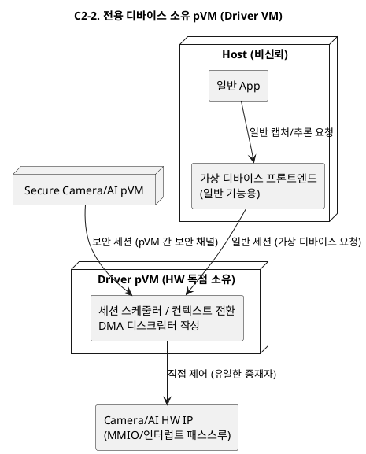

**장점 / 단점 / 트레이드오프**

- **장점**
  - 비신뢰 Host가 HW 레지스터·DMA 경로에서 완전히 분리 — 기밀성이 후보 중 가장 강하고(P-C2-1 근본 해결), 중재 로직이 격리 도메인 안에 있어 검증 경계가 명확하다(QA-07).
  - 보안 세션 우선순위 보장을 Driver pVM이 직접 수행할 수 있어 Host의 스케줄 교란이 차단된다.
- **단점**
  - Host 일반 기능도 가상 디바이스 경유로 강등 — 일반 경로 성능 저하와 기존 드라이버 스택 대개편(호환성 비용)이 후보 중 가장 크다.
  - Driver pVM 장애 시 Host 일반 기능과 보안 파이프라인이 동시에 HW를 잃는다(P-C2-3 악화, QA-05).
  - Driver pVM이 상시 자원을 점유하고(QA-06), 드라이버 이식 공수가 크다.
- **트레이드오프**: 기밀성을 얻는 대신 호환성·개발 공수·공용 장애점을 지불한다. "Host 일반 기능 무회귀"가 강한 요구라면 채택이 어렵고, 보안이 최우선인 제품 라인이라면 최선이 되는 극단적 프로파일의 안이다.

#### C2-3. 요청별 직접 할당 + 배타적 소유권 스위칭

- **개요**: HW를 상시 중재하지 않고, 사용 주체(Host 또는 특정 pVM)에게 IP 전체를 기간 단위로 배타 할당한다. 전환 시 Framework 커널 드라이버가 HW 정지→컨텍스트 소거→S2MPU 재프로그래밍→재할당의 hand-off 프로토콜을 집행한다.
- **구성과 책임**:
  - Framework 커널 드라이버: 소유권 원장, hand-off 프로토콜 집행(hypercall로 S2MPU 전환)
  - 사용 주체(Host 드라이버 / pVM 드라이버): 할당 기간 동안 HW를 직접(네이티브 성능으로) 제어
  - 정책: 파이프라인 실행 중에는 보안 소유 고정, 유휴 시 Host 반환
- **동작 방식**: 사용 중에는 중재 오버헤드가 0(직접 제어)이다. 대신 Host와 pVM의 "동시 사용"은 시간 다중화 granularity(전환 빈도)로만 제공되며, 잦은 전환은 소거 비용 때문에 비싸다.

**구조 다이어그램**

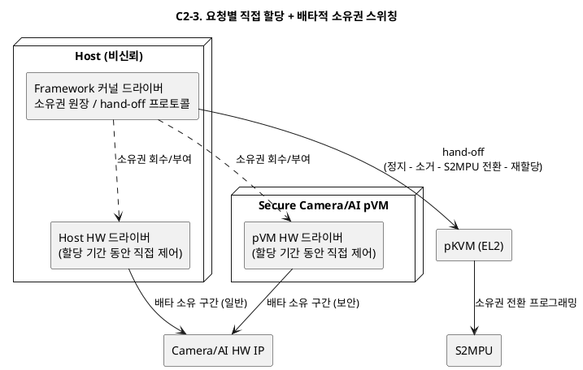

**장점 / 단점 / 트레이드오프**

- **장점**
  - 할당 기간 동안 사용 주체가 HW를 직접 제어 — 중재 오버헤드 0으로 QA-02에 가장 유리하다.
  - hand-off 프로토콜에 컨텍스트 소거가 강제로 내장되어 잔류 데이터 요구(VOS-08)가 구조적으로 충족된다.
  - 소유권 원장으로 "지금 누가 HW를 갖고 있는가"의 상태가 항상 명확하다.
- **단점**
  - 진정한 동시 사용이 불가 — Host와 pVM의 사용이 겹치면 전환이 빈번해지고, 전환마다 정지+소거+S2MPU 재프로그래밍 비용을 지불한다(P-C2-2).
  - 보안 파이프라인 실행 중 Host 일반 요청이 장시간 대기 — R-2 "동시 사용"의 해석 논쟁이 생긴다.
  - 전환 프로토콜 중간 실패 시 HW가 어느 쪽에도 속하지 않는 고아 상태가 될 수 있어 복구 경로 설계가 필요하다(QA-05).
- **트레이드오프**: 사용 중 성능을 얻는 대신 동시성(전환 granularity)을 지불한다. Host와 pVM의 HW 사용 패턴이 시간적으로 겹치지 않는 제품 프로파일에서만 성립한다.

#### C2-4. 2계층 분리형 — Host 스케줄러 + 보안 컨텍스트 게이트

- **개요**: 중재를 두 계층으로 분리한다. "누가 언제 쓰는가"(스케줄링)는 Host 커널 드라이버가 결정하고, "그 세션이 어느 메모리에 닿을 수 있는가"(격리 집행)는 Framework 커널 드라이버+hypercall 기반 보안 컨텍스트 게이트가 집행한다. 게이트는 세션 토큰 없이는 보안 컨텍스트로의 전환을 거부한다.
- **구성과 책임**:
  - Host HW 드라이버: 세션 큐/시분할 정책(기존 자산 재사용) — 성능·공정성 책임
  - 보안 컨텍스트 게이트(Framework 커널 드라이버 + hypercall): 세션별 S2MPU 윈도우 전환, 전환 시 잔류 소거 강제, pVM이 발급한 세션 토큰 검증 — 기밀성 책임
  - pVM: 보안 세션 시작 시 토큰 발급(요청 위조 방지)
- **동작 방식**: Host가 침해되어도 스케줄링(가용성)만 교란할 수 있고 격리(기밀성)는 게이트가 지킨다. C2-1과의 차이는 격리 집행 경로를 Host 드라이버 내부 협조가 아닌 독립 게이트 모듈로 분리해 검증 경계를 명확히 한다는 점이다.

**구조 다이어그램**

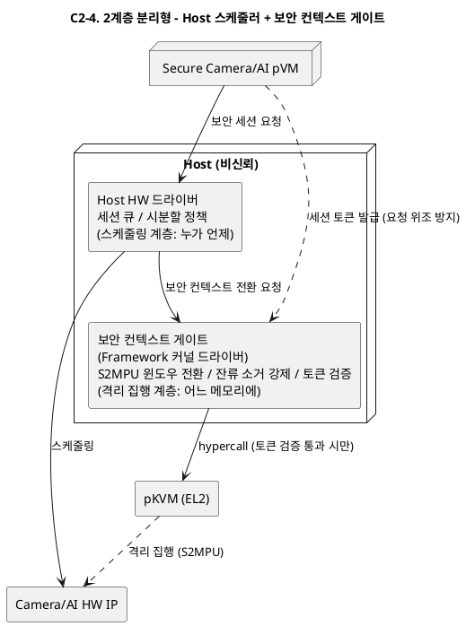

**장점 / 단점 / 트레이드오프**

- **장점**
  - 스케줄링(기존 Host 드라이버 재사용)과 격리 집행(독립 게이트)을 분리 — 기밀성 논증 대상이 게이트 모듈로 국한되어 검증(QA-07)이 현실적이 된다.
  - Host 침해의 영향이 가용성(스케줄 교란)으로 한정되고 기밀성은 게이트가 지킨다 — "기밀성은 구조로, 가용성은 정책으로"의 명확한 책임 분리.
  - 기존 드라이버 재사용으로 개발 비용이 중간 수준이고 Host 일반 경로 호환성이 유지된다. 세션 토큰으로 요청 위조가 차단된다.
- **단점**
  - 세션 전환마다 게이트 개입(S2MPU 전환 + 소거) — Host/pVM 세션 교차가 잦으면 오버헤드가 프레임 주기와 결합한다(P-C2-2).
  - 게이트-드라이버 간 인터페이스(전환 통지, 완료 확인) 설계·유지보수 부담이 있다.
  - Host의 스케줄 조작에 의한 보안 세션 서비스 거부는 여전히 가능하다.
- **트레이드오프**: 기밀성 보장과 기존 자산 재사용의 균형을 취하는 대신 완전한 가용성 보장을 포기한다. 서비스 거부를 감시로 검출(DP-A3 연계)하는 보완이 전제되면 실용적 균형점이 된다.

#### C2-5. 파이프라인 실행 중 보안 우선 점유 + 유휴 시분할 (모드 스위칭)

- **개요**: 시간축을 "보안 파이프라인 실행 구간"과 "유휴 구간"으로 나눈다. 파이프라인 실행 중에는 HW를 보안 도메인이 연속 점유(전환 없음)하고, Host 일반 요청은 큐잉하거나 저하 모드로 처리한다. 파이프라인이 없을 때는 Host가 네이티브로 사용한다.
- **구성과 책임**:
  - 모드 관리자(Framework): 파이프라인 시작/종료(시나리오 4·13단계)에 맞춰 HW를 보안 모드/일반 모드로 전환 — 전환은 파이프라인 수명주기당 2회
  - 보안 모드: pVM이 HW 직접 사용(C2-3의 직접 할당과 동일), Host 요청은 대기열
  - 일반 모드: 기존 Host 드라이버 경로 그대로
- **동작 방식**: 전환 비용이 프레임 주기가 아닌 파이프라인 수명주기와 결합하므로 QA-02에 유리하다. 대신 파이프라인 실행 중 Host 일반 기능의 해당 HW 사용이 지연(동시성 저하)되어 R-2의 "동시 사용"을 시간 단위가 아닌 작업 단위로 재해석하게 된다.

**구조 다이어그램**

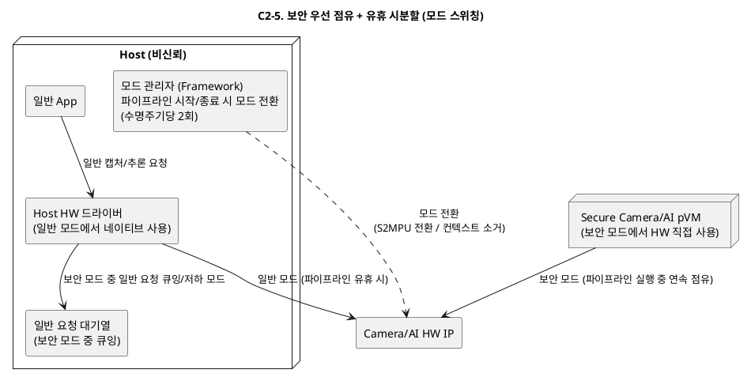

**장점 / 단점 / 트레이드오프**

- **장점**
  - 전환 비용이 파이프라인 수명주기당 2회로 고정 — 반복 구간(프레임 주기) 오버헤드가 0이라 QA-02·QA-04에 최적이다(P-C2-2 해결).
  - 중재 로직이 최소라 구현이 단순하고, 보안 모드 중 격리 상태가 정적이라 검증(QA-07)이 쉽다.
  - 유휴 시 Host는 기존 드라이버로 네이티브 사용 — 일반 경로 무변경.
- **단점**
  - 파이프라인 실행 중 Host 일반 기능의 해당 HW 사용이 불가하거나 지연 — R-2 "동시 사용"의 가장 약한 해석(P-C2-3의 변형).
  - 로봇의 상시 감시처럼 보안 파이프라인이 항상 실행되는 프로파일이면 Host가 사실상 영구 대기 상태가 된다.
  - 모드 전환 시점에 진행 중이던 요청의 경합 처리(드레인, 타임아웃)가 필요하다.
- **트레이드오프**: 성능과 단순성을 얻는 대신 동시성을 가장 크게 포기한다. 보안 파이프라인이 간헐 실행되는 제품에서만 성립하며, 상시 실행 프로파일이면 R-2 미충족으로 탈락하는 안이다.

### 3.3 DP-C2 후보 비교 요약

| 후보 | 기밀성 (QA-01) | 성능 (QA-02) | 동시 사용 (R-2) | Host 호환성/개발 비용 | 핵심 트레이드오프 |
|------|---------------|-------------|----------------|---------------------|------------------|
| C2-1 Host 드라이버 중재 | 하중 (검증 의존) | 중 | 상 | 상 (재사용 최대) | 개발 비용 vs 격리 논증 난이도 |
| C2-2 Driver VM | 상 | 중 | 상 (경유 비용) | 하 (대개편) | 기밀성 vs 호환성·공용 장애점 |
| C2-3 배타 소유권 | 상 (사용 중) | 상 (사용 중) | 하 | 중 | 네이티브 성능 vs 동시성 |
| C2-4 2계층 분리 | 중상 (게이트 국한) | 중상 | 상 | 상 | 균형 vs 서비스 거부 잔존 |
| C2-5 모드 스위칭 | 상 (모드 중 정적) | 상 | 하 (작업 단위) | 상 (유휴 시) | 반복 구간 성능 vs 동시성 포기 |

### 3.4 DP-C2 품질속성 KPI 측정 기준

> 상/중/하 판정 공통 원칙은 1.4절과 동일하다(게이트 구조 충족 = 상, 조건부 충족 = 중, 위반 위험 = 하).

**측정 KPI와 방법**

| 비교 축 | 참조 KPI (06 문서) | 측정 지표 | 측정 방법 |
|---|---|---|---|
| 기밀성 (QA-01) | SEC-02, SEC-03 | S2MPU 권한 중첩 0(게이트), 무위반 누적 전환 10^6회, 잔류 스캔 커버리지 100%, DMA 비할당 도메인 접근 0(게이트)·공격 벡터 구현율 100% | 사용 주체 전환 이벤트마다 권한 비트맵을 로깅해 오프라인으로 중첩 구간 판정, 경합 스트레스 하네스로 고빈도 강제 전환(SEC-02 방법). Thunderclap형 DMA 공격으로 비할당 메모리 접근을 시도하고 SMMU/S2MPU 설정 조합 카탈로그를 전수 시험(SEC-03 방법) |
| 성능 (QA-02) | PERF-04, PERF-01 | HW 주체 전환 지연 p99 10ms 이하, 프레임당 전환 발생 빈도, 비격리 대비 저하 10% 이내·30fps·드롭율 0.1% 이하 | 전환 구간(권한 회수→소거→부여) 타임스탬프 계측(PERF-04 방법, DP4 조기 PoC 합격 기준). 격리/비격리 fps 병행 측정을 Host idle/통상/스트레스 부하 매트릭스로 수행(PERF-01 방법) |
| 동시 사용 (R-2) | PERF-06 원용 | Host 일반 스트림 + pVM 보안 스트림 동시 인가 시 양쪽 fps·드롭율, Host 일반 요청 대기 시간 p95 | PERF-06의 다중 스트림 동시 인가 시험 구성을 "보안 1스트림 + 일반 1스트림 혼합"으로 확장해 프레임별 지속 처리량·드롭율을 양쪽에서 병행 측정 |
| Host 호환성/개발 비용 | EXT-06·EXT-07 방식 원용 | 기존 Host 드라이버 스택 수정 파일 수, 사용자 API breaking change 건수, 추정 공수(인월) | 후보 적용 전후 Host 드라이버 디렉터리 diff로 수정 파일 수 카운트(EXT-06 방법 원용), 공개 API 표면 diff로 호환성 파괴 변경 계수(EXT-07 방법) |

**상/중/하 판정 기준**

| 비교 축 | 상 | 중 | 하 |
|---|---|---|---|
| 기밀성 | 격리 집행(S2MPU 프로그래밍·DMA 매핑)이 비신뢰 주체가 위조 불가한 위치에 있고, 10^6회 무위반 + DMA 공격 벡터 전수 차단을 구조로 뒷받침 | 스케줄링은 Host에 있으나 격리 집행 경로는 독립 — 게이트 충족이 게이트 모듈 하나의 검증에 의존 | 비신뢰 Host가 DMA 디스크립터·HW 레지스터를 직접 작성 — 권한 중첩 0 판정이 Host 드라이버 전 경로 검증에 의존 |
| 성능 | 전환이 반복 구간 밖(파이프라인 수명주기당 상수 회)이거나 전환 p99가 10ms의 절반 이하 | 전환 p99 10ms 이내이나 세션 교차마다 발생 — 부하 매트릭스의 스트레스 조건에서 드롭율 상승 위험 | 전환 p99 10ms 초과 또는 전환이 프레임 주기마다 발생해 30fps·드롭율 0.1% 미달 |
| 동시 사용 | 보안 파이프라인 실행 중에도 Host 일반 스트림 동시 유지(1080p30 2스트림 동시 처리, PERF-06 기준) | 시분할 인터리브로 양쪽 진행되나 Host 쪽 처리량이 단독 사용 대비 유의미하게 저하 | 보안 파이프라인 실행 중 Host의 해당 HW 사용 불가(작업 단위 대기) |
| Host 호환성/개발 비용 | 기존 드라이버 경로 무수정 또는 확장에 국한(수정 파일 최소, breaking change 0) | 드라이버 수정이 있으나 사용자 API 무변경 | 드라이버 스택 대개편(프론트엔드 교체) 또는 대규모 이식 발생 |

**KPI 선정 근거**

1. **기밀성 — SEC-02/03**: DP-C2가 결정하는 지점이 곧 SEC-02가 계측하는 "사용 주체 전환 시 권한 중첩"의 발생 지점이며, 06 문서가 SEC-02·SEC-03의 연관 항목에 DP4(HW 공유 결정)를 명시하고 있다. KPI인 무위반 누적 전환 10^6회는 프레임 주기마다 전환이 일어나는 최악 구조 기준 30fps로 약 9시간 연속 운용에 해당하는 규모로, 상시 운용 로봇이 하루 안에 도달하는 현실적인 반복 수라는 점에서 후보 간 차등을 드러내는 데 적절하다.
2. **성능 — PERF-04/01**: 06 문서가 PERF-04를 "DP4 조기 PoC 합격 기준으로 사용"이라고 명시해 이 Decision Point 전용 KPI임을 이미 선언했고, 상한 10ms는 프레임 주기 33ms의 1/3이라는 산정 근거가 문서에 기재되어 있다. PERF-01의 부하 매트릭스(Host idle/통상/스트레스)는 중재 구조별로 Host 부하가 보안 세션 성능에 미치는 간섭을 분리 관측하게 해 준다.
3. **동시 사용 — PERF-06 원용**: R-2는 06 문서에 독립 리프가 없다. "동시성"을 계량화한 유일한 KPI가 PERF-06(다중 카메라 스트림 동시 처리량)이므로, 그 시험 구성을 보안+일반 혼합 스트림으로 확장해 원용한다. R-2의 본질이 "두 사용 주체의 스트림이 동시에 진행되는가"로 PERF-06의 측정 대상과 동형이라는 점이 원용의 근거다.
4. **Host 호환성 — EXT-06/07 방식 원용**: "변경 파일 수 diff"(EXT-06 게이트)와 "breaking change 계수"(EXT-07 KPI)는 06 문서가 호환성을 정량화하기 위해 채택한 선례 지표로, 대상을 Secure OS 경계에서 Host 드라이버 경계로 바꾸기만 하면 측정 절차가 동일하다.

---

## 4. DP-D1. TrustZone Secure OS 공존 토폴로지

### 4.1 문제 정의

고객사는 이미 TrustZone Secure OS 위의 GP TEE API(TA 자산)를 운용 중이며(R-5, CS-03), 새 Framework는 이를 폐기하지 않고 공존·연동해야 한다. 동시에 pVM 도메인은 ENC/DEC 등 Secure OS 기능을 사용해야 한다(FR-06, 시나리오 8·11단계). 공존 토폴로지가 다음 문제를 좌우한다.

| ID | 문제점 | 관련 품질속성 |
|----|--------|--------------|
| P-D1-1 | **기존 GP 경로 회귀**: 새 구조가 SMC 경로나 Secure OS 내부를 건드려 기존 REE GP Client(libteec)→TA 경로가 깨지면 VOS-12("기존 TrustZone 기능 무회귀")와 CS-03을 위반한다. | 상호운용성 (CS-03, VOS-12) |
| P-D1-2 | **두 보안 세계 간 신뢰 경계 불명확**: pVM 세계(pKVM 격리)와 TZ 세계(Secure World)를 잇는 경로가 새로 생기며, 이 경로의 중재자가 비신뢰 Host이면 요청 위변조·재전송이 가능해진다. 두 세계 중 한쪽 침해가 다른 쪽으로 전이되는 경로가 되어서도 안 된다. | 기밀성 (QA-01) |
| P-D1-3 | **Secure OS 이식 인터페이스 불안정**: Secure OS를 pVM에 이식하는 방식이 Secure OS 내부 구조에 결합되면, Secure OS/Framework 버전 변경 시마다 재이식이 필요해 QA-08("Secure OS 외 모듈 수정 파일 0개")과 VOS-11을 위반한다. | 변경 용이성 (QA-08), 확장성 |
| P-D1-4 | **보안 서비스 경로의 성능 결합**: pVM의 프레임당 ENC/DEC 요청이 매번 TZ 왕복(SMC, 세계 전환)을 타면 반복 구간(시나리오 8·11단계) 지연이 누적되어 QA-02와 결합한다. | 성능 (QA-02) |

**해결 방향**: (1) 기존 REE→TZ 경로는 바이트 하나 바꾸지 않고 보존하고, (2) pVM→Secure OS 경로는 Host가 위변조할 수 없는 채널로 수립하며, (3) Secure OS와의 결합은 안정된 어댑터 인터페이스 뒤로 숨기고, (4) 고빈도 암복호 경로가 세계 전환 비용과 결합하지 않는 구조여야 한다.

### 4.2 후보 구조

#### D1-1. pVM→TrustZone 프록시형 (TZ 단일 TEE 유지)

- **개요**: Secure OS는 TrustZone에 그대로 두고, pVM은 GP Client API 프록시로 동작한다. pVM 내부의 GP API 호출은 Framework의 중계 채널을 거쳐 TZ Secure OS로 전달된다(SMC는 기존 경로 재사용).
- **구성과 책임**:
  - pVM 내 GP Client 라이브러리(libteec 호환): TA 호출을 프록시 채널로 직렬화
  - Framework 중계 드라이버: pVM↔TZ 간 요청 전달, 공유 버퍼 중계. 요청 원문은 pVM-TZ 간 세션 키로 보호(Host는 중계만)
  - TZ Secure OS: 무수정 유지 — REE GP 경로와 pVM 경로를 동일 TA로 서비스
- **동작 방식**: Secure OS 이식이 전혀 없어 R-5·CS-03 리스크가 최소다. 모든 pVM 보안 서비스 요청이 세계 전환(SMC)을 동반한다.

**구조 다이어그램**

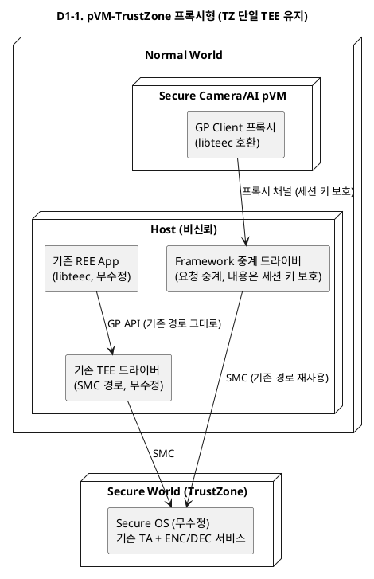

**장점 / 단점 / 트레이드오프**

- **장점**
  - Secure OS 이식이 전혀 없어(무수정) R-5·CS-03·VOS-12의 회귀 위험이 최소이고 개발 공수가 가장 낮다.
  - 키 자산이 TZ 한곳에서 단일 관리되고, 기존 검증·인증(TEE 인증) 결과가 그대로 유지된다.
- **단점**
  - 모든 pVM 보안 서비스 요청이 SMC 세계 전환을 동반 — 프레임당 ENC/DEC(시나리오 8·11단계)가 반복 구간에 놓이면 성능 병목이 된다(P-D1-4, QA-02).
  - 벌크 crypto 부하가 TZ(S-EL1)에 집중 — 과제가 지적한 "TEE 자원 제약"(00_overview 4절) 문제로 되돌아간다.
  - 프록시 채널의 Host 경유 구간에 대해 세션 키 보호·재전송 방어가 추가로 필요하다(P-D1-2).
- **트레이드오프**: 상호운용성·안정성을 얻는 대신 성능 확장성을 지불한다. TrustZone 단독 구조의 한계를 해소하려는 과제 취지와 정면으로 긴장하는, 보수적 기준선(baseline) 성격의 안이다.

#### D1-2. pVM 병렬 TEE형 (Secure OS pVM 이식)

- **개요**: 기존 Secure OS를 pVM에 이식해 pKVM 세계 안의 독립 TEE(Secure OS pVM)로 운용한다. TrustZone TEE는 기존 REE GP 경로 전용으로 유지된다. 두 TEE는 병렬로 존재하며 서로 독립이다.
- **구성과 책임**:
  - Secure OS pVM: 이식된 Secure OS + 신규 Vision AI용 crypto TA. Camera/AI pVM의 ENC/DEC 요청 서비스(FR-06)
  - TZ Secure OS: 기존 TA(키 관리/인증) 전용, 무수정
  - Framework: pVM↔Secure OS pVM 보안 채널 배선(SMC 아닌 pVM 간 채널 — 세계 전환 없음)
- **동작 방식**: 반복 구간의 ENC/DEC가 SMC 없이 pVM 간 채널로 처리되어 성능에 유리하다. 대신 Secure OS 이식 작업과, 두 TEE 간 키 자산 분리/동기화 문제가 생긴다.

**구조 다이어그램**

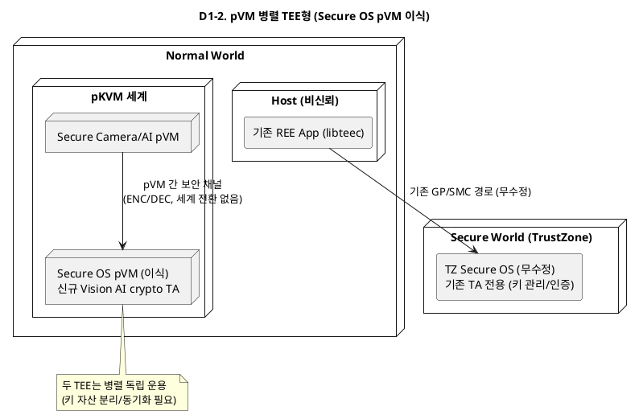

**장점 / 단점 / 트레이드오프**

- **장점**
  - 반복 구간의 ENC/DEC가 세계 전환(SMC) 없이 pVM 간 채널로 처리 — 성능이 후보 중 가장 유리하다(P-D1-4 해결).
  - 신규 보안 기능이 TZ의 자원 제약(S-EL1)에서 해방되어 고성능 crypto·대용량 처리가 가능하다.
  - 기존 TZ 경로를 전혀 건드리지 않아 회귀 위험이 0이고, "기존 Secure OS를 pVM에서 동작/확장"이라는 과제 범위와 직결된다.
- **단점**
  - Secure OS 이식 공수가 후보 중 가장 크다(과제 범위 내이나 일정 리스크).
  - 두 TEE의 키 자산이 이원화 — sealing·attestation·키 백업 정책을 이중으로 관리해야 하고 루트 신뢰가 갈라진다(P-D1-2).
  - 이식 인터페이스가 불안정하면 Secure OS 버전 변경마다 재이식이 발생한다(P-D1-3, QA-08 위반 위험). Secure OS pVM이 상시 자원을 점유한다(QA-06).
- **트레이드오프**: 성능과 독립성을 얻는 대신 이식 공수와 신뢰 루트 이원화를 지불한다. VOS-11(이식 인터페이스 명확화)과 DP-E3(버저닝 전략)의 확정이 이 안의 성립 전제 조건이다.

#### D1-3. 역할 분담형 (신규 기능 pVM TEE, 기존 기능 TZ 유지 + 라우팅)

- **개요**: 보안 서비스를 성격으로 분할한다 — 고빈도·대용량 벌크 crypto(영상/모델 ENC/DEC)는 pVM 세계의 경량 보안 서비스 pVM이 담당하고, 저빈도·고신뢰 기능(장치 키, 인증, sealing)은 기존 TZ Secure OS가 유지한다. Framework의 서비스 라우터가 GP API 요청을 기능별로 두 백엔드에 라우팅한다.
- **구성과 책임**:
  - 보안 서비스 pVM: 벌크 ENC/DEC, 세션 키 보관(작업 키). Secure OS 전체 이식이 아닌 crypto 서비스 모듈만 탑재
  - TZ Secure OS: 루트 키·sealing·기존 TA 무수정 유지. 작업 키는 TZ에서 파생되어 보안 서비스 pVM에 주입
  - 서비스 라우터(Framework): GP API uuid/기능 기준 라우팅 테이블 — 기존 TA uuid는 무조건 TZ로
- **동작 방식**: "루트 신뢰는 TZ, 성능 경로는 pVM"으로 키 계층을 나눈다. 라우팅 계층이 새로 생기지만 기존 경로는 라우터의 default 경로로 무수정 보존된다.

**구조 다이어그램**

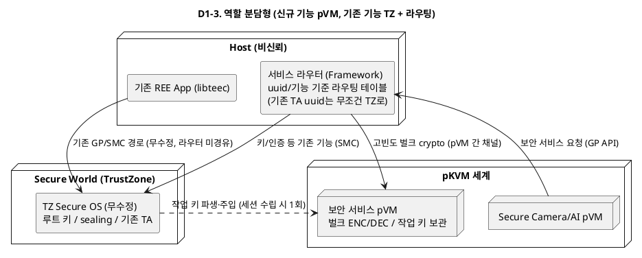

**장점 / 단점 / 트레이드오프**

- **장점**
  - 고빈도 벌크 crypto는 pVM(성능, P-D1-4 해결), 루트 키·sealing은 TZ(단일 신뢰 루트 유지, P-D1-2 완화) — 두 문제를 균형 있게 해결한다.
  - Secure OS 전체가 아닌 crypto 서비스 모듈만 pVM에 탑재 — 이식 공수가 D1-2보다 크게 줄어든다.
  - 루트 키/작업 키의 키 계층 분리는 업계 표준 관행이라 보안 심사 대응이 용이하다.
- **단점**
  - 서비스 라우터라는 새 계층이 생기고, 기능 분류 기준(어느 요청이 어느 백엔드로)의 유지보수가 필요하다.
  - 작업 키 주입 경로(TZ에서 보안 서비스 pVM으로)가 새로운 공격면이 되어 보호 채널 설계가 필요하다.
  - 두 백엔드에 걸치는 트랜잭션(예: TZ sealing된 모델을 pVM에서 복호화)의 처리 흐름이 복잡해진다.
- **트레이드오프**: 성능과 신뢰 루트 단일성을 모두 취하는 대신 시스템 분할 복잡성을 지불한다. 기능 경계가 명확히 나뉘는 동안은 실용적이지만, 경계에 걸친 기능이 늘수록 라우팅·트랜잭션 복잡도가 증가한다.

#### D1-4. 단일 Secure OS 이중 프론트엔드형 (TZ 상주 + pVM 전용 통로)

- **개요**: Secure OS는 TZ에 하나만 두되, Secure OS에 pVM 세계 전용 프론트엔드(통신 인터페이스)를 추가한다. REE GP 경로(기존 SMC dispatcher)와 pVM 경로(전용 메일박스/공유 버퍼 + SMC)를 Secure OS가 별도 세션 도메인으로 구분해 서비스한다.
- **구성과 책임**:
  - TZ Secure OS(+pVM 프론트엔드 확장): 요청 출처(REE vs pVM)를 세션 수준에서 구분, pVM 세션은 pVM과의 종단 간 보호 버퍼만 사용
  - Framework 커널 드라이버: pVM 요청을 SMC로 전달하는 통로 역할(내용 접근 불가 — 보호 버퍼는 TZ와 pVM만 매핑)
  - 기존 REE 경로: 기존 dispatcher 그대로
- **동작 방식**: TEE가 하나이므로 키 자산 분리 문제가 없고 관리가 단순하다. 대신 Secure OS 자체에 프론트엔드 수정이 들어가고(QA-08의 "Secure OS 외 모듈"은 지키지만 Secure OS 수정 발생), 모든 pVM 요청이 여전히 SMC 왕복을 탄다.

**구조 다이어그램**

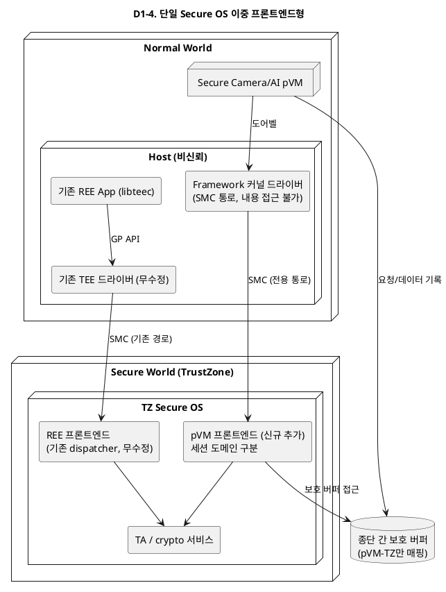

**장점 / 단점 / 트레이드오프**

- **장점**
  - TEE가 하나뿐 — 키 자산·정책·감사가 단일 지점에서 관리되어 운영이 가장 단순하다(P-D1-2의 신뢰 경계 문제 축소).
  - pVM 세션은 pVM-TZ만 매핑된 종단 간 보호 버퍼를 사용 — Host는 통로일 뿐 내용에 접근 불가.
  - Secure OS "이식"이 없다(프론트엔드 추가만).
- **단점**
  - Secure OS 자체 수정이 발생 — 벤더 협의, 기존 TEE 인증 재취득 비용, 그리고 Secure OS 버전마다 프론트엔드 유지보수가 뒤따른다(P-D1-3 부분 위반).
  - 모든 pVM 요청이 여전히 SMC 왕복을 타고 벌크 crypto가 TZ 자원 제약에 집중된다(P-D1-4 미해결).
  - 요청 출처 구분(REE vs pVM) 로직의 결함이 곧 두 세계 간 권한 혼동으로 이어질 수 있다.
- **트레이드오프**: 관리 단순성을 얻는 대신 "Secure OS 수정"이라는 가장 민감한 비용을 지불한다. Secure OS가 자사 자산이고 수정 권한이 있으면 유효하지만, 서드파티 Secure OS 전제라면 사실상 탈락하는 안이다.

#### D1-5. Secure OS Adapter 계층 + 보안 게이트웨이 pVM

- **개요**: pVM 세계와 TZ 세계 사이에 전용 게이트웨이 pVM(TEE Gateway pVM)을 두고, 모든 pVM 보안 서비스 요청은 게이트웨이를 경유해 TZ로 전달된다. 게이트웨이 내부에 Secure OS Adapter 계층(버전·프로토콜 변환)을 집중시켜, Secure OS/Framework 버전 차이를 이 계층 하나가 흡수한다.
- **구성과 책임**:
  - TEE Gateway pVM: GP API 종단(pVM 쪽 서버), 요청 검증·감사 로깅, 세션 다중화(멀티 pVM→단일 SMC 채널), Adapter(버전 협상·형식 변환)
  - Adapter 계층: Secure OS 버전별 프로토콜 차이를 캡슐화 — QA-08의 "정의된 인터페이스만으로 대응"의 실현 지점
  - TZ Secure OS: 무수정. 기존 REE 경로도 무수정
- **동작 방식**: 신뢰 경계(pVM 세계의 TZ 접점)가 게이트웨이 한 곳에 모여 검증·증적(QA-07)이 쉬워지고, 버전 변화 흡수 지점이 단일화된다. 대신 요청 경로가 2홉(pVM→게이트웨이→TZ)이 되어 지연이 추가된다.

**구조 다이어그램**

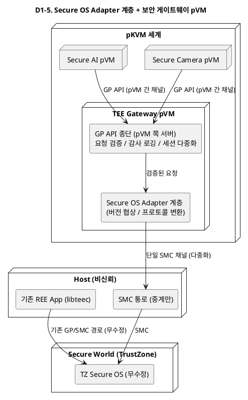

**장점 / 단점 / 트레이드오프**

- **장점**
  - Secure OS 버전·프로토콜 차이의 흡수 지점이 Adapter 한 곳으로 단일화 — QA-08("Secure OS 외 모듈 수정 파일 0개")·VOS-11을 구조적으로 직접 지원한다(P-D1-3 해결).
  - pVM 세계의 TZ 접점(신뢰 경계)이 게이트웨이 하나로 모여 요청 검증·감사 로깅·증적이 집중된다(QA-07, DP-E2와 정합).
  - Secure OS와 기존 REE 경로 모두 무수정이고, 세션 다중화로 다수 pVM의 SMC 채널 관리가 단순해진다.
- **단점**
  - 요청 경로가 2홉(pVM → 게이트웨이 → TZ) — 지연이 추가되어 고빈도 경로 문제(P-D1-4)는 오히려 악화된다.
  - 게이트웨이 pVM이 상시 자원을 점유하고(QA-06), 신규 보안 서비스 요청 기준의 단일 장애점이 된다.
  - 모든 보안 서비스 요청이 게이트웨이를 지나므로 게이트웨이 자체가 큰 TCB가 된다.
- **트레이드오프**: 변경 용이성과 검증성을 얻는 대신 성능과 자원을 지불한다. 단독으로는 고빈도 crypto 경로를 해결하지 못하므로, D1-3(역할 분담)과 조합해 게이트웨이에 라우터+어댑터를 통합하는 변형이 현실적 조합이 된다.

### 4.3 DP-D1 후보 비교 요약

| 후보 | 상호운용성 (R-5/CS-03) | 성능 (고빈도 crypto) | 변경 용이성 (QA-08) | 이식·개발 공수 | 핵심 트레이드오프 |
|------|----------------------|--------------------|--------------------|---------------|------------------|
| D1-1 TZ 프록시 | 상 | 하 | 중 | 낮음 | 안정성 vs TEE 자원 제약 회귀 |
| D1-2 병렬 TEE | 상 (TZ 무접촉) | 상 | 중 (이식 인터페이스 의존) | 높음 | 성능·독립성 vs 신뢰 루트 이원화 |
| D1-3 역할 분담 | 상 | 상 | 중 | 중간 | 균형 해법 vs 분할·라우팅 복잡성 |
| D1-4 이중 프론트엔드 | 중 (Secure OS 수정) | 하중 | 하 | 중간 | 단일 TEE 관리 vs Secure OS 수정 |
| D1-5 게이트웨이 pVM | 상 | 하중 (2홉) | 상 | 중간 | 변경 용이성·증적 vs 성능·자원 |

### 4.4 DP-D1 품질속성 KPI 측정 기준

> 상/중/하 판정 공통 원칙은 1.4절과 동일하다(게이트 구조 충족 = 상, 조건부 충족 = 중, 위반 위험 = 하).

**측정 KPI와 방법**

| 비교 축 | 참조 KPI (06 문서) | 측정 지표 | 측정 방법 |
|---|---|---|---|
| 상호운용성 (R-5/CS-03) | SEC-06, EXT-06 | 비인가 주체 TEE 호출 성립 0건(게이트), 기존 Host→TEE 경로 회귀 시험 통과율, 기존 GP 경로 수정 파일 수 | pVM→TEE RPC에 위조 신원 호출을 주입해 차단 여부 확인 + 기존 Host→TEE 경로 후방호환 검증(SEC-06 방법 그대로). 후보 적용 전후 기존 REE GP 스택(libteec, TEE 드라이버, dispatcher) diff로 수정 파일 수 카운트(EXT-06 방법 원용) |
| 성능 (고빈도 crypto) | PERF-03 (+PERF-02 계측 방식 원용) | E2E 지연 p99 100ms 이하 중 crypto 구간(시나리오 8·11단계) 기여분, 프레임당 세계 전환(SMC) 횟수 | 캡처 HW 타임스탬프(PTS)를 파이프라인 끝까지 전파해 단계별 지연을 분해하고 crypto 구간 기여를 분리 계측(PERF-03 방법). 프레임당 SMC 횟수는 ftrace 기반 프레임당 hypercall 계측(PERF-02 방법)을 SMC 트랩으로 확장해 계수 |
| 변경 용이성 (QA-08) | EXT-06, EXT-07 | Secure OS 교체 시 인터페이스 외 재이식 파일 0개(게이트), 교체 대응 공수, API breaking change 건수 | Secure OS 버전 교체 전후 diff에서 GP 표준 인터페이스 외 변경 파일 수 카운트(EXT-06 방법 그대로), 릴리스마다 경계 인터페이스 표면 diff로 호환성 파괴 변경 계수(EXT-07 방법) |
| 이식·개발 공수 | EXT-03·EXT-06의 공수 계측 방식 원용 | 이식 대상 모듈 수·LoC, 신규 개발 구성요소 수, 추정 공수(인월) | 후보별 이식 범위(전체 Secure OS / 부분 모듈 / 없음)를 분류하고 공수 산정, 파일럿 실측으로 보정(EXT-03 방식) |

**상/중/하 판정 기준**

| 비교 축 | 상 | 중 | 하 |
|---|---|---|---|
| 상호운용성 | 기존 REE GP 경로 수정 파일 0 + 기존 TA 회귀 시험 100% 통과 + Secure OS 무수정 | 기존 경로는 유지되나 라우팅/중재 계층 삽입으로 회귀 재검증 필요 | Secure OS 또는 기존 SMC dispatcher 수정 발생 — 기존 TEE 인증 재취득 리스크 |
| 성능 | 반복 구간(시나리오 8·11단계) crypto가 세계 전환 없이 처리(프레임당 SMC 0회) — E2E 100ms 예산 내 crypto 기여에 마진 | 프레임당 SMC 1~2회이나 E2E p99 100ms 충족 | crypto 경로가 직렬 SMC 병목이 되어 E2E p99 100ms 또는 30fps 위협 |
| 변경 용이성 | Secure OS 교체·버전 변경 시 어댑터/구성만 변경(인터페이스 외 파일 0 + 대응 공수 소) | 인터페이스 외 파일 0은 지키나 어댑터 개정·협상 로직 재시험 공수 큼 | Secure OS 외 모듈 수정 발생(EXT-06 게이트 위반) 또는 Secure OS 자체 수정이 필수인 구조 |
| 이식·개발 공수 | 낮음: 이식 없음(기존 Secure OS 무수정 활용) | 중간: 부분 모듈(crypto 서비스·프론트엔드·게이트웨이) 개발/이식 | 높음: Secure OS 전체 이식 |

**KPI 선정 근거**

1. **상호운용성 — SEC-06 + EXT-06**: SEC-06의 측정 방법에 "기존 Host→TEE 경로 후방호환 검증"이 명시되어 있어, 06 문서의 28개 KPI 중 R-5/CS-03/VOS-12의 무회귀를 직접 판정하는 유일한 항목이다. 게이트(비인가 주체 TEE 호출 성립 0건)는 P-D1-2(두 세계 간 경로의 요청 위변조)의 판정 조건과 동일하다. 수정 파일 수 diff는 EXT-06 게이트의 측정 절차를 기존 REE 경계에 적용한 것이다.
2. **성능 — PERF-03 + PERF-02 방식 원용**: PERF-03의 PTS 전파 기반 단계별 지연 분해가 06 문서에서 시나리오 8·11단계(crypto 구간)의 기여를 분리 계측할 수 있는 유일한 정의된 방법이다. 프레임당 SMC 횟수는 06에 직접 KPI가 없으나, PERF-02의 "ftrace로 프레임당 hypercall 계측"과 측정 대상(트랩에 의한 세계/특권 전환 비용)이 기술적으로 동형이므로 같은 도구·절차로 확장 계측하는 것이 타당하다.
3. **변경 용이성 — EXT-06/07**: QA-08의 응답 측정치("Secure OS 외 모듈의 수정 파일 0개")가 06 문서에서 EXT-06 게이트("인터페이스 외 재이식 파일 0개")로 재편되어 있어 문서 간 정의가 이미 일치한다. EXT-07(breaking change 0/릴리스)은 D1 후보들이 만드는 경계 인터페이스(프록시/라우터/어댑터)의 안정성을 릴리스 축으로 추적하는 보조 KPI다.
4. **이식·개발 공수 — 공수 KPI**: 1.4절 근거 4와 동일하며, 특히 EXT-06이 "교체 대응 공수"를 KPI로 이미 정의하고 있어 D1 후보 간 이식 범위 차이(전체/부분/없음)를 같은 단위(인월)로 비교할 수 있다.

---

## 5. 다음 단계

- `06_qa_quality_scenarios.md`의 응답 측정치를 평가 기준으로 후보 구조 평가(ATAM 방식) 진행
- DP 간 결합 관계 검토: DP-C1의 채널 선택은 DP-P1(버퍼 풀·매핑 수명주기)·DP-P2(파이프라인 실행 모델)의 상위 결정이고, DP-D1의 토폴로지 선택은 DP-C4(암복호화 위치)의 전제가 되므로 함께 평가한다.
- 평가 결과에 따라 후보 조합(예: A1-3 + C1-4 + C2-4 + D1-3)의 정합성 확인 후 아키텍처 결정 기록(ADR) 작성

---

## 6. DP별 FR/품질속성 추적표

아래 표는 각 DP의 문제 정의와 품질속성 KPI 절에서 직접 평가 축으로 사용한 FR/QA를 기준으로 정리했다. 후보별 장단점에서 부수적으로 언급된 자원 효율(QA-06), 시험 용이성(QA-07) 등은 핵심 추적성에서 벗어나므로 보조 고려사항으로만 표시한다.

| DP | 결정 지점 | 관련 FR | 관련 품질속성 | 보조 고려사항 |
|----|-----------|---------|---------------|--------------|
| DP-A1 | pVM 관리 골격(제어 평면) 구조 | FR-01 **pVM 생성/시작/정지/종료**<br>FR-02 **다중 pVM 동시 운용** | QA-01 **보안 (기밀성)**<br>QA-03 **확장성**<br>QA-05 **가용성** | 관리 주체·Control pVM의 상시 자원 점유는 QA-06 **자원 효율**, 재접속·격리 검증은 QA-07 **시험 용이성**과 결합된다. |
| DP-C1 | 도메인 간 프레임 전달 채널 구조 | FR-04 **도메인 간 보안 데이터 전송** | QA-01 **보안 (기밀성)**<br>QA-02 **성능 (실시간 처리)**<br>QA-03 **확장성**<br>QA-04 **성능 (통신 오버헤드)** | 소유권 이전·잔류 데이터 검증은 QA-07 **시험 용이성**, 브로커 pVM 장애 반경은 QA-05 **가용성**과 추가로 연결된다. |
| DP-C2 | HW IP 중재(Mediation) 위치와 공유 방식 | FR-03 **Camera/AI HW 공유 사용** | QA-01 **보안 (기밀성)**<br>QA-02 **성능 (실시간 처리)**<br>QA-05 **가용성** | Driver pVM·게이트의 자원 점유는 QA-06 **자원 효율**, S2MPU/DMA 격리 자동 검증은 QA-07 **시험 용이성**과 결합된다. |
| DP-D1 | TrustZone Secure OS 공존 토폴로지 | FR-06 **Secure OS ENC/DEC 명령 전송** | QA-01 **보안 (기밀성)**<br>QA-02 **성능 (실시간 처리)**<br>QA-08 **변경 용이성 (Secure OS 이식)** | 기존 GP TEE 경로 무회귀는 QA 번호가 아닌 CS-03 **기존 TrustZone Secure OS 유지** 및 VOS-12 **기존 TrustZone 기능 무회귀**와 직접 연결된다. 게이트웨이 pVM 자원 점유는 QA-06 **자원 효율**, 감사·증적 집중은 QA-07 **시험 용이성**과 관련된다. |
