# 후보 구조 도출 — DP-A1, DP-C1, DP-C2, DP-D1

> 본 문서는 `07_decision_point_candidates.md`에서 도출한 Decision Point 중 우선 확정 가치가 높은 4건(DP-A1, DP-C1, DP-C2, DP-D1)에 대해, 각 결정 지점이 내포한 문제점을 품질속성 관점에서 정의하고, 그 문제를 해결하는 후보 구조를 5개씩 도출한 것이다.
>
> 근거 문서: `00_overview.md`(R-1~R-5), `02_requirements.md`(FR/QA/CS), `99_reference_scenario_flow.md`(시나리오 1~13단계)

---

## 목차

1. [DP-A1. pVM 관리 골격(제어 평면) 구조](#1-dp-a1-pvm-관리-골격제어-평면-구조)
2. [DP-C1. 도메인 간 프레임 전달 채널 구조](#2-dp-c1-도메인-간-프레임-전달-채널-구조)
3. [DP-C2. HW IP 중재(Mediation) 위치와 공유 방식](#3-dp-c2-hw-ip-중재mediation-위치와-공유-방식)
4. [DP-D1. TrustZone Secure OS 공존 토폴로지](#4-dp-d1-trustzone-secure-os-공존-토폴로지)

---

## 1. DP-A1. pVM 관리 골격(제어 평면) 구조

### 1.1 문제 정의

pVM 생명주기(생성/시작/정지/종료, FR-01)와 다중 pVM 동시 운용(FR-02)을 관장하는 관리 주체는 Host 사용자 공간에 위치할 수밖에 없다. 그러나 본 과제의 대전제는 "Host는 비신뢰 영역"(R-1)이라는 점이다. 여기서 다음 문제가 발생한다.

| ID | 문제점 | 관련 품질속성 |
|----|--------|--------------|
| P-A1-1 | **관리 주체의 권한 과잉과 TCB 팽창**: 관리 주체가 pVM 생성뿐 아니라 메모리 매핑, 데이터 채널 배선까지 모두 쥐고 있으면, Host 침해 시 관리 주체가 격리 우회의 발판이 된다. 관리 기능이 커질수록 "신뢰해야만 동작하는 코드"가 비신뢰 영역에 쌓인다. | 기밀성 (QA-01) |
| P-A1-2 | **단일 장애점(SPOF)**: 단일 중앙 데몬이 모든 pVM의 상태를 잡고 있으면, 데몬 크래시 한 번이 전체 파이프라인 장애로 전파된다. QA-05는 "장애 pVM 외 Host/타 pVM 다운타임 0"을 요구한다. | 가용성 (QA-05) |
| P-A1-3 | **도메인 추가 비용의 중앙 집중**: 신규 보안 도메인(pVM) 유형이 추가될 때마다 중앙 데몬의 코드 수정이 필요하면 QA-03("코어 수정 0 LoC")을 만족할 수 없다. 관리 골격이 도메인 개수·유형에 대해 닫혀 있어야 한다. | 확장성 (QA-03, R-4) |

**해결 방향**: 관리 골격은 (1) 격리 보장에 필요한 최소 권한만 갖고, (2) 장애 격벽(bulkhead)이 pVM 단위로 서고, (3) 도메인 추가가 코드가 아닌 데이터(구성/manifest)로 흡수되는 구조여야 한다.

### 1.2 후보 구조

#### A1-1. 중앙집중형 단일 Manager 데몬

- **개요**: 단일 사용자 공간 데몬(`pvm-managerd`)이 API 수신, 정책 확인, Workload 검증 요청, pVM 생성/종료, 채널 배선, 장애 복구까지 제어 평면 전체를 담당한다.
- **구성과 책임**:
  - `pvm-managerd`: Framework API 엔드포인트, 정책 결정(PDP)과 집행(PEP), pVM 상태 머신 관리, 자원 할당 원장(ledger) 유지
  - Framework 커널 드라이버: 데몬의 명령을 pKVM hypercall로 변환
  - pVM별 vCPU 실행 스레드: 데몬 프로세스 내부 스레드로 수용
- **동작 방식**: 시나리오 1~6단계의 모든 제어 흐름이 데몬 하나를 통과한다. 상태가 한곳에 모이므로 자원 원장과 정책의 일관성 유지가 단순하다.

**구조 다이어그램**

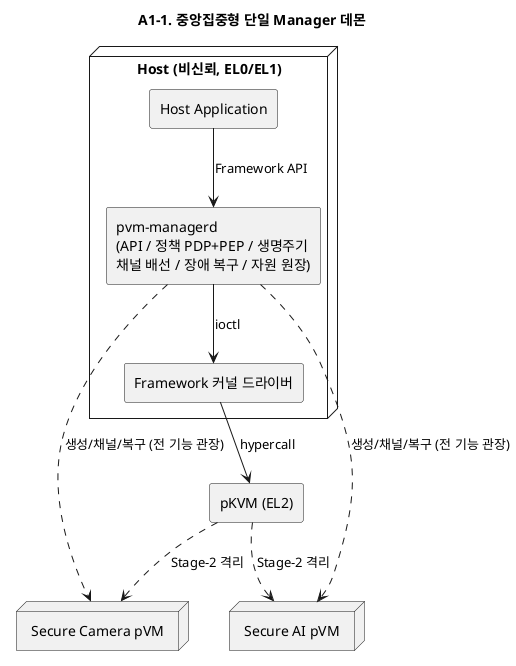

#### A1-2. pVM별 위임형 인스턴스 모니터 (per-instance monitor)

- **개요**: 중앙에는 최소 기능의 런처(launcher)만 두고, pVM마다 전용 모니터 프로세스(VMM 인스턴스, crosvm 방식)를 기동한다. pVM의 생명주기·vCPU 실행·장애 처리는 각 모니터가 전담한다.
- **구성과 책임**:
  - `pvm-launcher`: API 수신, 정책 확인, 모니터 프로세스 기동만 담당 (상태 최소)
  - `pvm-monitor[i]`: pVM i의 메모리 구성, vCPU 실행, 종료/회수, 장애 감지 전담. 프로세스 격리(별도 주소 공간, seccomp/최소 권한)로 서로 간섭 불가
  - Framework 커널 드라이버: 모니터별 fd 기반 자원 소유권 관리 (모니터 사망 시 커널이 자동 회수)
- **동작 방식**: 모니터 하나가 죽어도 해당 pVM만 영향을 받고, 커널이 fd 수명주기로 자원을 회수한다. 신규 도메인은 "모니터 프로세스 하나 추가"로 수용된다.

**구조 다이어그램**

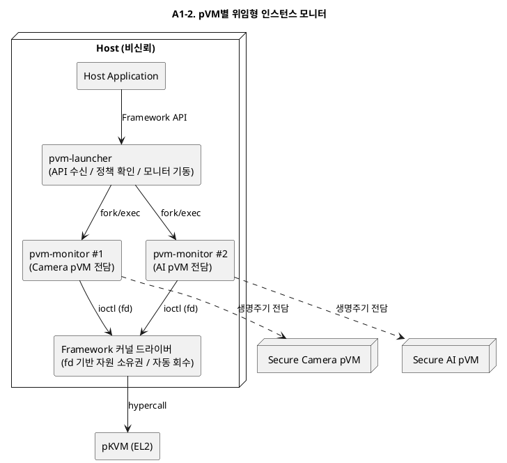

#### A1-3. 제어·데이터 평면 분리형

- **개요**: 제어 평면(생성/정책/수명주기)은 중앙 데몬이 담당하되, 데이터 평면(프레임 전달, HW 접근 경로)은 pVM 간 직접 채널로 완전히 분리한다. 관리 데몬은 채널의 "배선"만 하고 채널 내용에는 접근 불가능하게 한다.
- **구성과 책임**:
  - `pvm-managerd`(제어 평면): 시나리오 1~6단계(요청/검증/생성/배선)만 수행. 배선 후 데이터 경로에서 완전히 이탈
  - 데이터 평면: pVM↔pVM 공유 메모리/RPC 채널. Host 매핑 자체가 존재하지 않도록 커널 드라이버+hypercall로 구성
  - 장애 복구: 제어 평면이 데이터 평면 외부에서 감시(heartbeat)만 수행
- **동작 방식**: 반복 구간(시나리오 7~12단계)에 관리 데몬이 개입하지 않으므로, 데몬이 일시 정지해도 실행 중인 파이프라인은 계속 동작한다.

**구조 다이어그램**

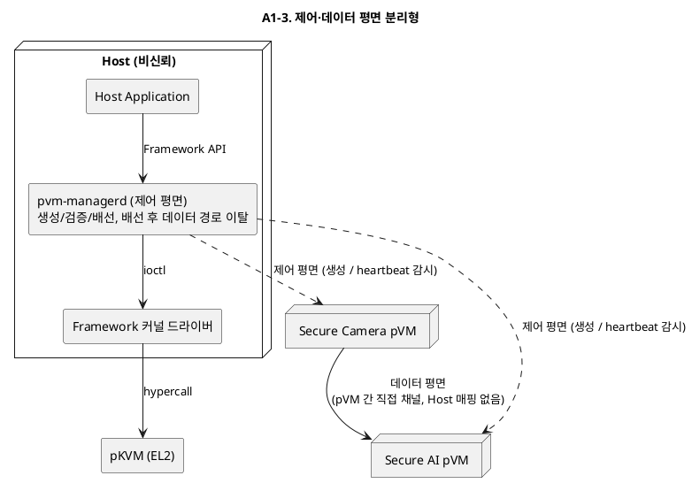

#### A1-4. 계층형 하이브리드 (중앙 코디네이터 + per-pVM 모니터)

- **개요**: A1-1과 A1-2의 결합. 중앙 코디네이터는 정책·자원 원장·파이프라인 토폴로지 관리 같은 전역 결정만 담당하고, pVM별 모니터가 개별 생명주기를 실행한다. 2계층 감독(supervision) 트리 구조다.
- **구성과 책임**:
  - `pvm-coordinator`: 전역 정책(PDP), 자원 예산 관리, 파이프라인 단위 오케스트레이션, 모니터 감독(재기동)
  - `pvm-monitor[i]`: pVM i 생명주기 집행(PEP), vCPU 실행, 1차 장애 처리
  - 복구 정책: 모니터 장애는 코디네이터가 재기동, 코디네이터 장애는 모니터들이 독립 생존(파이프라인 유지) 후 재접속(reconciliation)
- **동작 방식**: 전역 일관성(중앙 원장)과 장애 격벽(모니터 프로세스 격리)을 동시에 취한다. 코디네이터 재시작 시 모니터들의 상태를 다시 수집해 원장을 재구성한다.

**구조 다이어그램**

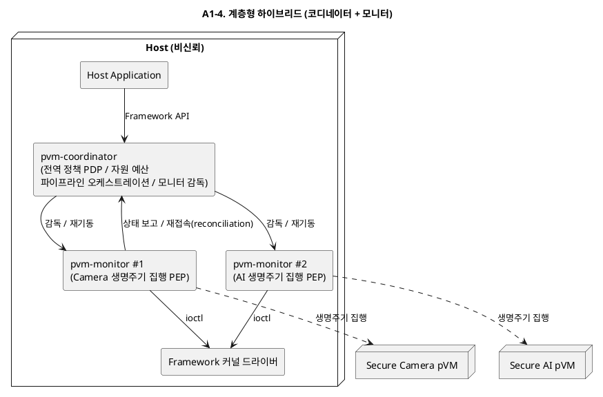

#### A1-5. 관리 평면 pVM 위임형 (Control pVM)

- **개요**: 관리 기능 중 보안 민감 결정(정책 판단, Workload 검증, 채널 키 관리)을 전용 관리 pVM(Control pVM)으로 옮기고, Host에는 자원 브로커(메모리/CPU 할당 대행) 역할의 얇은 스텁 데몬만 남긴다.
- **구성과 책임**:
  - Host `pvm-stub`: API 수신과 자원 할당 대행만 수행. 정책 판단 권한 없음
  - Control pVM: 정책 결정(PDP), Workload 서명 검증, 파이프라인 토폴로지 승인, 채널 설정값 서명. Host 스텁의 요청을 검증 후 승인 토큰 발급
  - Framework 커널 드라이버 + hypercall: 승인 토큰이 있는 요청만 pVM 생성/채널 배선 집행
- **동작 방식**: Host가 침해되어도 스텁이 위조할 수 있는 것은 "자원 요청"뿐이고, 격리에 영향을 주는 결정은 Control pVM의 서명 없이는 집행되지 않는다.

**구조 다이어그램**

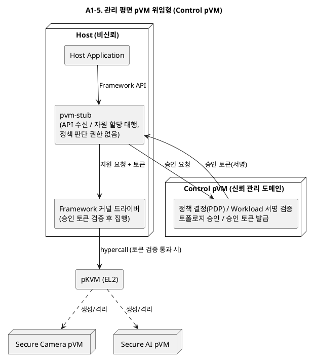

---

## 2. DP-C1. 도메인 간 프레임 전달 채널 구조

### 2.1 문제 정의

시나리오 9단계에서 Camera pVM은 매 프레임(30fps 기준 33ms 주기)을 AI pVM으로 전달해야 한다(FR-04). 이 채널 구조가 다음 문제를 좌우한다.

| ID | 문제점 | 관련 품질속성 |
|----|--------|--------------|
| P-C1-1 | **프레임당 전달 비용이 실시간 예산을 잠식**: 복사 1회, map/unmap hypercall, VM exit가 프레임 주기마다 발생하면 QA-04(프레임당 전달 지연 5ms 이하)와 QA-02(E2E 100ms, 30fps)를 위협한다. 고해상도 프레임(수 MB)의 memcpy 1회만으로도 ms 단위 비용이다. | 성능 (QA-02, QA-04) |
| P-C1-2 | **전달 구간의 노출 창**: 전달 버퍼가 Host 커널에 매핑된 채 지나가면(예: 일반 virtio 백엔드 경유) Host 침해 시 프레임 원본이 노출된다(VOS-09, QA-01 위반). 공유 매핑을 넓고 오래 열수록 노출 창이 커진다. | 기밀성 (QA-01) |
| P-C1-3 | **도메인 수 증가 시 채널 토폴로지 폭발**: 도메인 쌍마다 전용 채널을 배선하면 N개 도메인에서 O(N^2) 채널이 되고, 채널 설정이 코어 수정을 유발하면 QA-03·R-4에 어긋난다. | 확장성 (QA-03, R-4) |

**해결 방향**: (1) 반복 구간의 프레임 전달 비용이 상수(복사 0~1회, hypercall 최소화)여야 하고, (2) 전달 버퍼는 어떤 시점에도 Host에 매핑되지 않아야 하며, (3) 채널 배선이 토폴로지 기술(구성)만으로 확장되어야 한다.

### 2.2 후보 구조

#### C1-1. 정적 공유 버퍼 풀 + zero-copy 링 (lend/share 상주 매핑)

- **개요**: 파이프라인 구성 시점(시나리오 6단계)에 프레임 버퍼 풀을 pKVM share로 Camera pVM과 AI pVM 양쪽 Stage-2에 상주 매핑하고, Host 매핑은 hypercall로 제거(unmap)한다. 이후 반복 구간에서는 링 디스크립터(인덱스)만 주고받는다.
- **구성과 책임**:
  - 버퍼 풀: 파이프라인 구성 시 1회 할당·매핑, 종료 시 1회 회수·소거
  - 프레임 링: 생산자(Camera)/소비자(AI) 인덱스만 담는 소형 공유 페이지
  - 알림: 도어벨(인터럽트 주입) 또는 폴링 — 데이터 이동 없음
- **동작 방식**: 프레임당 비용은 "인덱스 갱신 + 알림 1회"로 상수화된다. 매핑 전환 hypercall이 반복 구간에서 사라진다.

**구조 다이어그램**

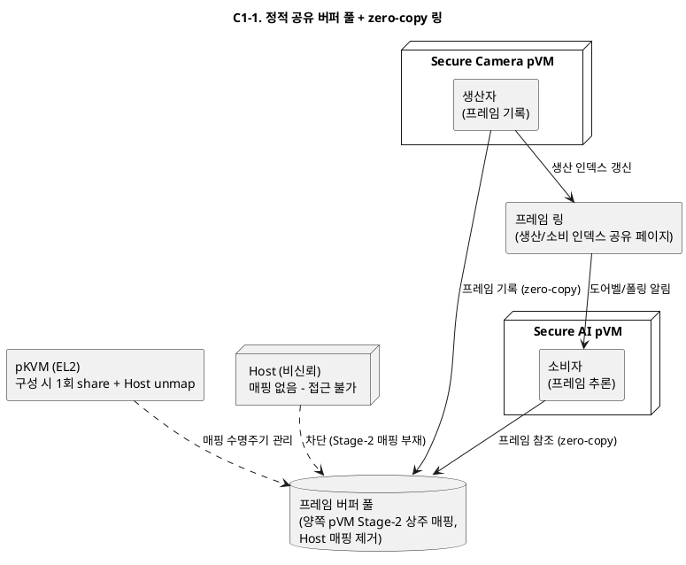

#### C1-2. virtio-vsock 스트림 채널 (표준 스택 복사 기반)

- **개요**: pVM 간 전달을 virtio-vsock 스트림으로 구현한다. 프레임은 vsock 소켓으로 직렬화 전송되며, 전달 구간 보호는 프레임 암호화(시나리오 8단계에서 이미 암호화된 프레임 전달)로 확보한다.
- **구성과 책임**:
  - Camera pVM: 프레임을 암호화 후 vsock 송신
  - Host vsock 백엔드/스위치: 암호문 스트림만 중계 (평문 접근 불가)
  - AI pVM: 수신 후 복호화하여 추론
- **동작 방식**: 표준 스택(virtio) 재사용으로 구현·이식 비용이 가장 낮다. Host가 스트림을 봐도 암호문이므로 기밀성은 암호화 강도에 위임된다.

**구조 다이어그램**

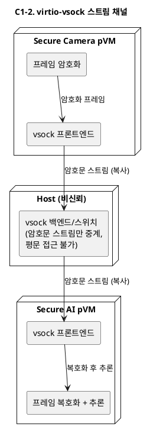

#### C1-3. 프레임 단위 소유권 이전 채널 (exclusive lend hand-off)

- **개요**: 프레임 버퍼를 동시 공유하지 않고, 매 프레임 "Camera pVM 소유 → hypercall로 AI pVM에 이전(lend) → 사용 후 반환"하는 단일 소유자(single-owner) 프로토콜로 전달한다.
- **구성과 책임**:
  - Framework 커널 드라이버: 소유권 이전 요청을 hypercall(donate/lend 계열)로 집행
  - pKVM: 이전 시점에 이전 소유자의 Stage-2 매핑 제거 — 어떤 시점에도 프레임의 소유자는 정확히 1개 도메인
  - 반환 경로: AI pVM 사용 완료 후 버퍼를 풀로 반환(재이전)
- **동작 방식**: 동시 매핑이 존재하지 않으므로 노출 창이 최소다. 대신 프레임마다 이전/반환 hypercall 2회와 TLB 무효화 비용을 지불한다.

**구조 다이어그램**

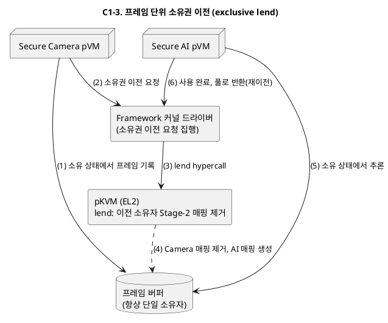

#### C1-4. 제어·데이터 분리 하이브리드 채널 (vsock 제어 + 공유 풀 데이터)

- **개요**: 제어 메시지(프레임 메타데이터, 흐름 제어, 채널 협상)는 virtio-vsock으로, 벌크 프레임 데이터는 C1-1형 공유 버퍼 풀로 나눠 싣는 2중 채널 구조다.
- **구성과 책임**:
  - 제어 채널(vsock): 채널 수립/버전 협상/오류 통지 — 빈도 낮음, 표준 스택 재사용
  - 데이터 채널(공유 풀): 프레임 본문 zero-copy 전달 — Host 비매핑
  - 채널 관리자: 시나리오 6단계에서 두 채널을 함께 배선하고 수명주기를 일치시킴
- **동작 방식**: 성능 민감 경로(데이터)와 유연성이 필요한 경로(제어)를 각자 최적 메커니즘에 배정한다. 채널 종류가 2개라 배선·상태 관리는 복잡해진다.

**구조 다이어그램**

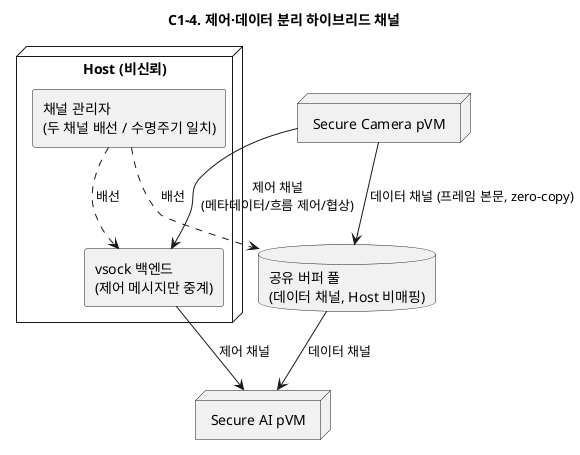

#### C1-5. 브로커 pVM 경유 스타 토폴로지 (스위치 도메인)

- **개요**: 도메인 간 직접 채널 대신, 전용 브로커 pVM(스위치 도메인)이 모든 프레임 라우팅을 담당하는 스타(star) 토폴로지를 구성한다. 각 도메인은 브로커와의 채널 1개만 가진다.
- **구성과 책임**:
  - 브로커 pVM: 라우팅 테이블(토폴로지 기술 기반), 흐름 제어, 도메인 간 격리 유지(송신자별 버퍼 분리)
  - 각 pVM: 브로커와의 단일 채널(공유 풀 또는 이전 방식)만 유지
  - 토폴로지 변경: 브로커의 라우팅 테이블 갱신만으로 N개 도메인 파이프라인 구성
- **동작 방식**: 채널 수가 O(N)으로 억제되고 다단 파이프라인(R-4)이 구성 변경으로 수용된다. 대신 모든 프레임이 브로커를 경유(1홉 추가)한다.

**구조 다이어그램**

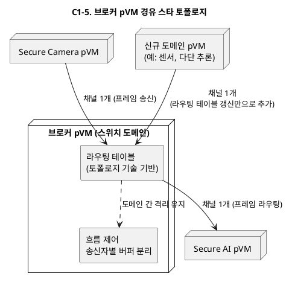

---

## 3. DP-C2. HW IP 중재(Mediation) 위치와 공유 방식

### 3.1 문제 정의

Camera/AI HW는 다중 Context를 하드웨어로 제공하지 않는 단일 Context IP이며(CS-05), Host의 일반 기능과 pVM의 보안 파이프라인이 같은 IP를 동시에 사용해야 한다(R-2, FR-03, 시나리오 7·10단계). 중재자를 어디에 두는가가 다음 문제를 좌우한다.

| ID | 문제점 | 관련 품질속성 |
|----|--------|--------------|
| P-C2-1 | **중재자의 보안 프레임 접근 가능성**: 중재자가 Host 커널 드라이버라면, 비신뢰 주체가 HW 레지스터·DMA 디스크립터를 만진다. 중재자가 보안 세션의 DMA 대상 메모리에 접근하거나 DMA를 비보호 메모리로 돌릴 수 있으면 QA-01이 무너진다. | 기밀성 (QA-01) |
| P-C2-2 | **사용 주체 전환 비용**: Host 세션과 pVM 세션이 교차할 때마다 HW 컨텍스트 저장/복원, S2MPU 재프로그래밍, 잔류 데이터 소거(VOS-08)가 발생한다. 이 전환이 프레임 주기(33ms)와 결합하면 fps와 E2E 지연(QA-02)을 직접 잠식한다. | 성능 (QA-02) |
| P-C2-3 | **중재자 장애의 양방향 전파**: 중재자가 죽으면 Host 일반 기능과 pVM 보안 파이프라인이 동시에 HW를 잃는다. 중재자가 어느 도메인에 있느냐에 따라 장애 반경이 달라진다(QA-05). | 가용성 (QA-05) |

**제약**: EL2(pKVM)는 수정 불가, 기존 hypercall 범위 내에서 설계한다(CS-02).

**해결 방향**: (1) 중재의 "스케줄링 결정"과 "격리 집행"을 구분해 격리 집행은 비신뢰 주체가 위조할 수 없는 위치에 두고, (2) 전환 비용이 보안 파이프라인 실행 중에는 프레임 주기와 결합하지 않게 하며, (3) 중재자 장애가 최소 반경으로 갇히는 구조여야 한다.

### 3.2 후보 구조

#### C2-1. Host 커널 드라이버 시분할 중재 + 보호 DMA 검증

- **개요**: 기존 Host 커널 드라이버를 확장해 Host/pVM 세션을 시분할 스케줄링한다. 단, 보안 세션의 DMA 대상은 pVM 소유 보호 메모리로 한정하고, S2MPU 설정과 잔류 소거는 hypercall 검증을 거치게 해 "제어는 Host, 데이터 격리는 하이퍼바이저 검증"으로 나눈다.
- **구성과 책임**:
  - Host HW 드라이버(확장): 세션 큐 관리, 시분할 스케줄링, HW 컨텍스트 저장/복원
  - Framework 커널 드라이버: 보안 세션 전환 시 S2MPU 프로그래밍을 hypercall로 요청, 소거 확인
  - pKVM(기존 hypercall): 보안 세션 중 HW DMA가 보호 메모리만 향하도록 매핑 검증
- **동작 방식**: 기존 드라이버 자산을 최대한 재사용한다. Host가 스케줄을 조작해도(서비스 거부는 가능) 보안 프레임 데이터에는 접근할 수 없다는 것을 hypercall 검증에 의존해 보장한다.

**구조 다이어그램**

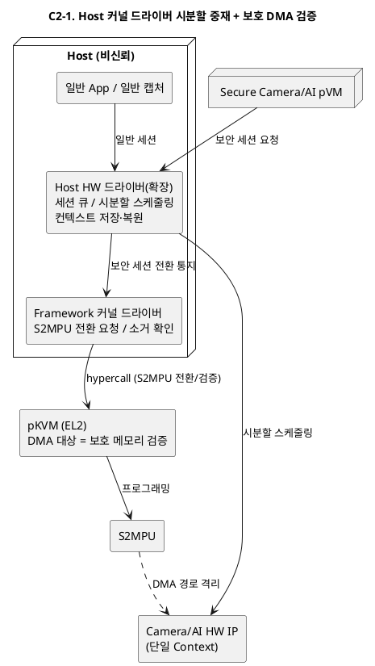

#### C2-2. 전용 디바이스 소유 pVM (Driver VM)

- **개요**: Camera/AI HW의 MMIO·인터럽트를 전용 Driver pVM에 패스스루로 귀속시킨다. Host의 일반 기능도, 보안 pVM의 보안 세션도 모두 Driver pVM에 가상 디바이스 인터페이스로 요청한다.
- **구성과 책임**:
  - Driver pVM: HW 독점 소유, 세션 스케줄링, 컨텍스트 전환, DMA 디스크립터 작성 — 보안 프레임을 다루는 유일한 중재자
  - Host: 일반 기능용 프론트엔드 드라이버(가상 디바이스 클라이언트)로 강등
  - 보안 pVM: Driver pVM과의 보안 채널로 캡처/추론 요청
- **동작 방식**: 비신뢰 Host가 HW 레지스터에서 완전히 분리되어 기밀성 관점에서 가장 강하다. 대신 Host 일반 경로도 pVM 경유가 되어 일반 기능의 성능·호환성 비용이 생기고, Driver pVM이 새로운 공용 장애점이 된다.

**구조 다이어그램**

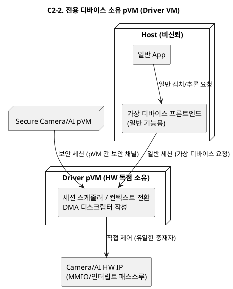

#### C2-3. 요청별 직접 할당 + 배타적 소유권 스위칭

- **개요**: HW를 상시 중재하지 않고, 사용 주체(Host 또는 특정 pVM)에게 IP 전체를 기간 단위로 배타 할당한다. 전환 시 Framework 커널 드라이버가 HW 정지→컨텍스트 소거→S2MPU 재프로그래밍→재할당의 hand-off 프로토콜을 집행한다.
- **구성과 책임**:
  - Framework 커널 드라이버: 소유권 원장, hand-off 프로토콜 집행(hypercall로 S2MPU 전환)
  - 사용 주체(Host 드라이버 / pVM 드라이버): 할당 기간 동안 HW를 직접(네이티브 성능으로) 제어
  - 정책: 파이프라인 실행 중에는 보안 소유 고정, 유휴 시 Host 반환
- **동작 방식**: 사용 중에는 중재 오버헤드가 0(직접 제어)이다. 대신 Host와 pVM의 "동시 사용"은 시간 다중화 granularity(전환 빈도)로만 제공되며, 잦은 전환은 소거 비용 때문에 비싸다.

**구조 다이어그램**

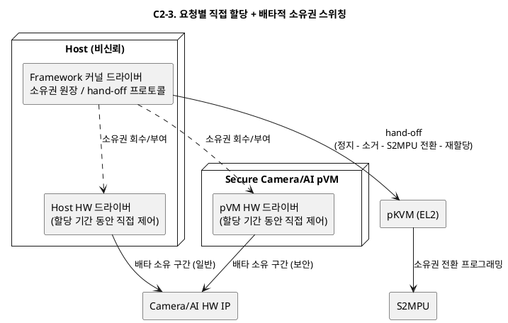

#### C2-4. 2계층 분리형 — Host 스케줄러 + 보안 컨텍스트 게이트

- **개요**: 중재를 두 계층으로 분리한다. "누가 언제 쓰는가"(스케줄링)는 Host 커널 드라이버가 결정하고, "그 세션이 어느 메모리에 닿을 수 있는가"(격리 집행)는 Framework 커널 드라이버+hypercall 기반 보안 컨텍스트 게이트가 집행한다. 게이트는 세션 토큰 없이는 보안 컨텍스트로의 전환을 거부한다.
- **구성과 책임**:
  - Host HW 드라이버: 세션 큐/시분할 정책(기존 자산 재사용) — 성능·공정성 책임
  - 보안 컨텍스트 게이트(Framework 커널 드라이버 + hypercall): 세션별 S2MPU 윈도우 전환, 전환 시 잔류 소거 강제, pVM이 발급한 세션 토큰 검증 — 기밀성 책임
  - pVM: 보안 세션 시작 시 토큰 발급(요청 위조 방지)
- **동작 방식**: Host가 침해되어도 스케줄링(가용성)만 교란할 수 있고 격리(기밀성)는 게이트가 지킨다. C2-1과의 차이는 격리 집행 경로를 Host 드라이버 내부 협조가 아닌 독립 게이트 모듈로 분리해 검증 경계를 명확히 한다는 점이다.

**구조 다이어그램**

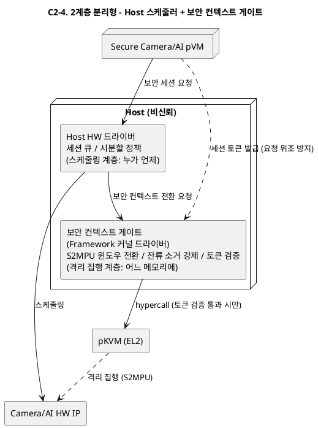

#### C2-5. 파이프라인 실행 중 보안 우선 점유 + 유휴 시분할 (모드 스위칭)

- **개요**: 시간축을 "보안 파이프라인 실행 구간"과 "유휴 구간"으로 나눈다. 파이프라인 실행 중에는 HW를 보안 도메인이 연속 점유(전환 없음)하고, Host 일반 요청은 큐잉하거나 저하 모드로 처리한다. 파이프라인이 없을 때는 Host가 네이티브로 사용한다.
- **구성과 책임**:
  - 모드 관리자(Framework): 파이프라인 시작/종료(시나리오 4·13단계)에 맞춰 HW를 보안 모드/일반 모드로 전환 — 전환은 파이프라인 수명주기당 2회
  - 보안 모드: pVM이 HW 직접 사용(C2-3의 직접 할당과 동일), Host 요청은 대기열
  - 일반 모드: 기존 Host 드라이버 경로 그대로
- **동작 방식**: 전환 비용이 프레임 주기가 아닌 파이프라인 수명주기와 결합하므로 QA-02에 유리하다. 대신 파이프라인 실행 중 Host 일반 기능의 해당 HW 사용이 지연(동시성 저하)되어 R-2의 "동시 사용"을 시간 단위가 아닌 작업 단위로 재해석하게 된다.

**구조 다이어그램**

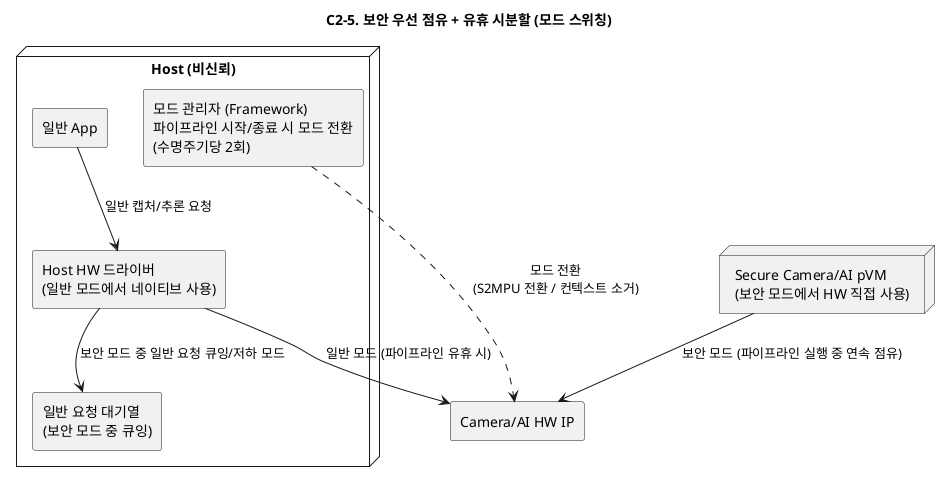

---

## 4. DP-D1. TrustZone Secure OS 공존 토폴로지

### 4.1 문제 정의

고객사는 이미 TrustZone Secure OS 위의 GP TEE API(TA 자산)를 운용 중이며(R-5, CS-03), 새 Framework는 이를 폐기하지 않고 공존·연동해야 한다. 동시에 pVM 도메인은 ENC/DEC 등 Secure OS 기능을 사용해야 한다(FR-06, 시나리오 8·11단계). 공존 토폴로지가 다음 문제를 좌우한다.

| ID | 문제점 | 관련 품질속성 |
|----|--------|--------------|
| P-D1-1 | **기존 GP 경로 회귀**: 새 구조가 SMC 경로나 Secure OS 내부를 건드려 기존 REE GP Client(libteec)→TA 경로가 깨지면 VOS-12("기존 TrustZone 기능 무회귀")와 CS-03을 위반한다. | 상호운용성 (CS-03, VOS-12) |
| P-D1-2 | **두 보안 세계 간 신뢰 경계 불명확**: pVM 세계(pKVM 격리)와 TZ 세계(Secure World)를 잇는 경로가 새로 생기며, 이 경로의 중재자가 비신뢰 Host이면 요청 위변조·재전송이 가능해진다. 두 세계 중 한쪽 침해가 다른 쪽으로 전이되는 경로가 되어서도 안 된다. | 기밀성 (QA-01) |
| P-D1-3 | **Secure OS 이식 인터페이스 불안정**: Secure OS를 pVM에 이식하는 방식이 Secure OS 내부 구조에 결합되면, Secure OS/Framework 버전 변경 시마다 재이식이 필요해 QA-08("Secure OS 외 모듈 수정 파일 0개")과 VOS-11을 위반한다. | 변경 용이성 (QA-08), 확장성 |
| P-D1-4 | **보안 서비스 경로의 성능 결합**: pVM의 프레임당 ENC/DEC 요청이 매번 TZ 왕복(SMC, 세계 전환)을 타면 반복 구간(시나리오 8·11단계) 지연이 누적되어 QA-02와 결합한다. | 성능 (QA-02) |

**해결 방향**: (1) 기존 REE→TZ 경로는 바이트 하나 바꾸지 않고 보존하고, (2) pVM→Secure OS 경로는 Host가 위변조할 수 없는 채널로 수립하며, (3) Secure OS와의 결합은 안정된 어댑터 인터페이스 뒤로 숨기고, (4) 고빈도 암복호 경로가 세계 전환 비용과 결합하지 않는 구조여야 한다.

### 4.2 후보 구조

#### D1-1. pVM→TrustZone 프록시형 (TZ 단일 TEE 유지)

- **개요**: Secure OS는 TrustZone에 그대로 두고, pVM은 GP Client API 프록시로 동작한다. pVM 내부의 GP API 호출은 Framework의 중계 채널을 거쳐 TZ Secure OS로 전달된다(SMC는 기존 경로 재사용).
- **구성과 책임**:
  - pVM 내 GP Client 라이브러리(libteec 호환): TA 호출을 프록시 채널로 직렬화
  - Framework 중계 드라이버: pVM↔TZ 간 요청 전달, 공유 버퍼 중계. 요청 원문은 pVM-TZ 간 세션 키로 보호(Host는 중계만)
  - TZ Secure OS: 무수정 유지 — REE GP 경로와 pVM 경로를 동일 TA로 서비스
- **동작 방식**: Secure OS 이식이 전혀 없어 R-5·CS-03 리스크가 최소다. 모든 pVM 보안 서비스 요청이 세계 전환(SMC)을 동반한다.

**구조 다이어그램**

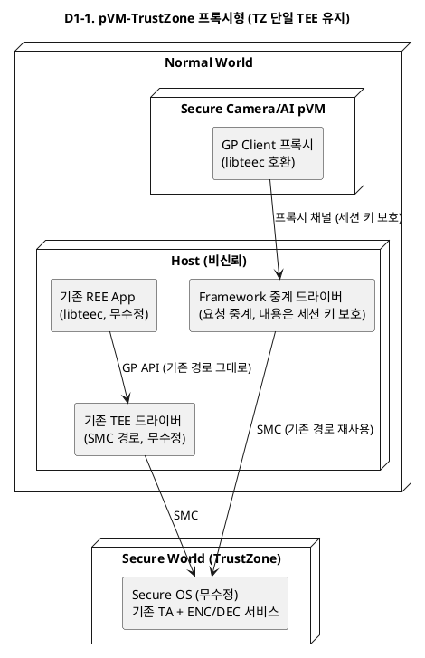

#### D1-2. pVM 병렬 TEE형 (Secure OS pVM 이식)

- **개요**: 기존 Secure OS를 pVM에 이식해 pKVM 세계 안의 독립 TEE(Secure OS pVM)로 운용한다. TrustZone TEE는 기존 REE GP 경로 전용으로 유지된다. 두 TEE는 병렬로 존재하며 서로 독립이다.
- **구성과 책임**:
  - Secure OS pVM: 이식된 Secure OS + 신규 Vision AI용 crypto TA. Camera/AI pVM의 ENC/DEC 요청 서비스(FR-06)
  - TZ Secure OS: 기존 TA(키 관리/인증) 전용, 무수정
  - Framework: pVM↔Secure OS pVM 보안 채널 배선(SMC 아닌 pVM 간 채널 — 세계 전환 없음)
- **동작 방식**: 반복 구간의 ENC/DEC가 SMC 없이 pVM 간 채널로 처리되어 성능에 유리하다. 대신 Secure OS 이식 작업과, 두 TEE 간 키 자산 분리/동기화 문제가 생긴다.

**구조 다이어그램**

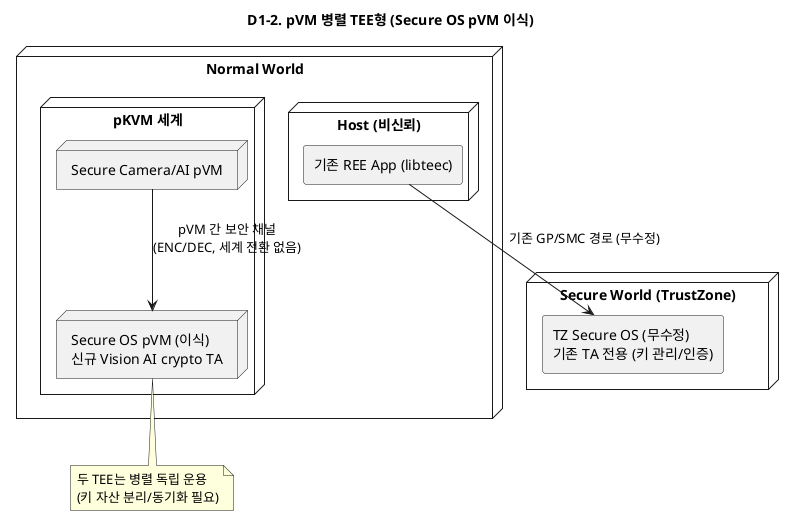

#### D1-3. 역할 분담형 (신규 기능 pVM TEE, 기존 기능 TZ 유지 + 라우팅)

- **개요**: 보안 서비스를 성격으로 분할한다 — 고빈도·대용량 벌크 crypto(영상/모델 ENC/DEC)는 pVM 세계의 경량 보안 서비스 pVM이 담당하고, 저빈도·고신뢰 기능(장치 키, 인증, sealing)은 기존 TZ Secure OS가 유지한다. Framework의 서비스 라우터가 GP API 요청을 기능별로 두 백엔드에 라우팅한다.
- **구성과 책임**:
  - 보안 서비스 pVM: 벌크 ENC/DEC, 세션 키 보관(작업 키). Secure OS 전체 이식이 아닌 crypto 서비스 모듈만 탑재
  - TZ Secure OS: 루트 키·sealing·기존 TA 무수정 유지. 작업 키는 TZ에서 파생되어 보안 서비스 pVM에 주입
  - 서비스 라우터(Framework): GP API uuid/기능 기준 라우팅 테이블 — 기존 TA uuid는 무조건 TZ로
- **동작 방식**: "루트 신뢰는 TZ, 성능 경로는 pVM"으로 키 계층을 나눈다. 라우팅 계층이 새로 생기지만 기존 경로는 라우터의 default 경로로 무수정 보존된다.

**구조 다이어그램**

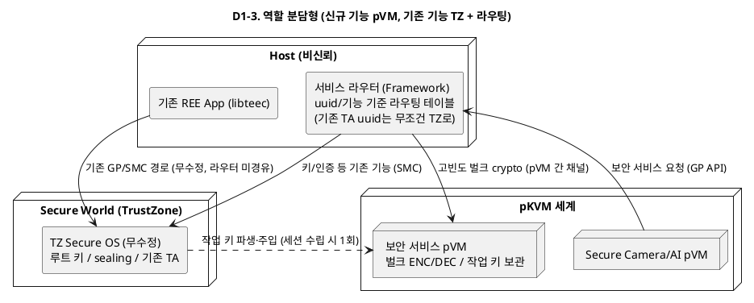

#### D1-4. 단일 Secure OS 이중 프론트엔드형 (TZ 상주 + pVM 전용 통로)

- **개요**: Secure OS는 TZ에 하나만 두되, Secure OS에 pVM 세계 전용 프론트엔드(통신 인터페이스)를 추가한다. REE GP 경로(기존 SMC dispatcher)와 pVM 경로(전용 메일박스/공유 버퍼 + SMC)를 Secure OS가 별도 세션 도메인으로 구분해 서비스한다.
- **구성과 책임**:
  - TZ Secure OS(+pVM 프론트엔드 확장): 요청 출처(REE vs pVM)를 세션 수준에서 구분, pVM 세션은 pVM과의 종단 간 보호 버퍼만 사용
  - Framework 커널 드라이버: pVM 요청을 SMC로 전달하는 통로 역할(내용 접근 불가 — 보호 버퍼는 TZ와 pVM만 매핑)
  - 기존 REE 경로: 기존 dispatcher 그대로
- **동작 방식**: TEE가 하나이므로 키 자산 분리 문제가 없고 관리가 단순하다. 대신 Secure OS 자체에 프론트엔드 수정이 들어가고(QA-08의 "Secure OS 외 모듈"은 지키지만 Secure OS 수정 발생), 모든 pVM 요청이 여전히 SMC 왕복을 탄다.

**구조 다이어그램**

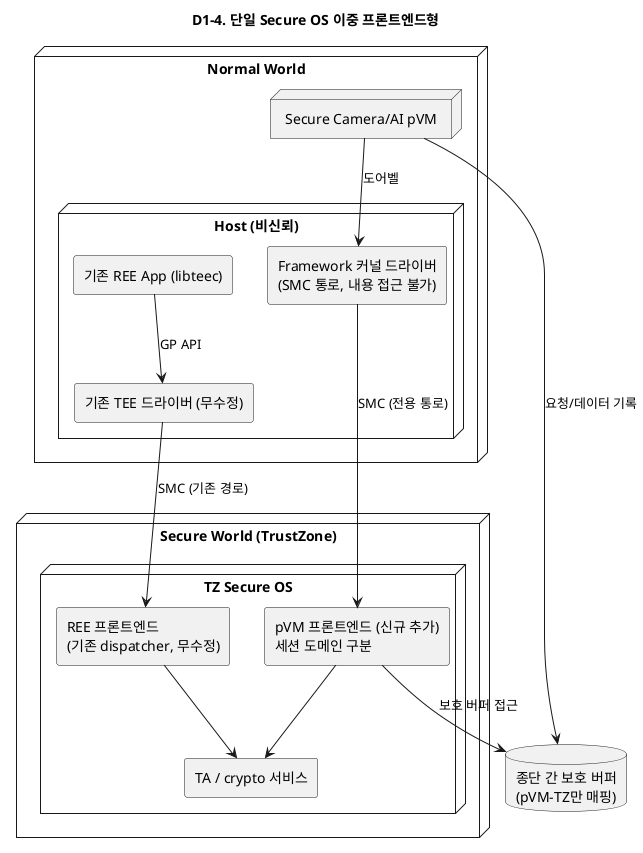

#### D1-5. Secure OS Adapter 계층 + 보안 게이트웨이 pVM

- **개요**: pVM 세계와 TZ 세계 사이에 전용 게이트웨이 pVM(TEE Gateway pVM)을 두고, 모든 pVM 보안 서비스 요청은 게이트웨이를 경유해 TZ로 전달된다. 게이트웨이 내부에 Secure OS Adapter 계층(버전·프로토콜 변환)을 집중시켜, Secure OS/Framework 버전 차이를 이 계층 하나가 흡수한다.
- **구성과 책임**:
  - TEE Gateway pVM: GP API 종단(pVM 쪽 서버), 요청 검증·감사 로깅, 세션 다중화(멀티 pVM→단일 SMC 채널), Adapter(버전 협상·형식 변환)
  - Adapter 계층: Secure OS 버전별 프로토콜 차이를 캡슐화 — QA-08의 "정의된 인터페이스만으로 대응"의 실현 지점
  - TZ Secure OS: 무수정. 기존 REE 경로도 무수정
- **동작 방식**: 신뢰 경계(pVM 세계의 TZ 접점)가 게이트웨이 한 곳에 모여 검증·증적(QA-07)이 쉬워지고, 버전 변화 흡수 지점이 단일화된다. 대신 요청 경로가 2홉(pVM→게이트웨이→TZ)이 되어 지연이 추가된다.

**구조 다이어그램**

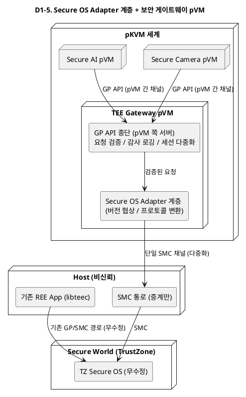

---

## 5. 다음 단계

- 각 후보 구조의 PlantUML 구조 다이어그램 추가 (스텝 2)
- 각 후보 구조의 장점/단점/트레이드오프 정리 및 DP별 비교표 작성 (스텝 3)
- 이후 `06_qa_quality_scenarios.md`의 응답 측정치를 평가 기준으로 후보 구조 평가(ATAM 방식) 진행 예정
