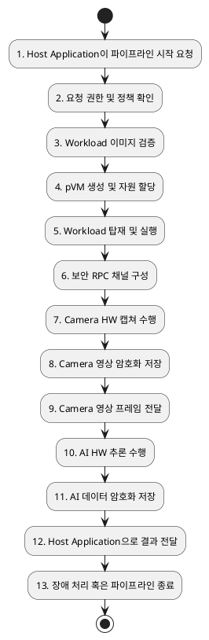

# Reference Scenario Flow

본 문서는 Secure Vision AI 파이프라인의 레퍼런스 시나리오 실행 순서를 정리한다. 실행 흐름은 Host Application의 파이프라인 시작 요청부터 Camera 캡처, 영상 암호화 저장, AI 추론, AI 데이터 암호화 저장, 결과 전달, 장애 처리 또는 종료까지를 대상으로 한다.

## 1. 실행 순서

| 단계 | 요청/동작 | 주요 처리 |
|---:|---|---|
| 1 | Host Application이 파이프라인 시작 요청 | Host Application이 Framework API를 통해 Secure Camera pVM과 Secure AI pVM 기반 파이프라인 시작을 요청한다. |
| 2 | 요청 권한 및 정책 확인 | 요청 주체가 허용된 애플리케이션인지, 요청한 파이프라인과 Workload가 정책상 허용되는지 확인한다. |
| 3 | Workload 이미지 검증 | Camera Workload와 AI Workload 이미지의 서명, manifest, 버전, 무결성을 검증하고 실패 시 이후 단계를 진행하지 않는다. |
| 4 | pVM 생성 및 자원 할당 | Secure Camera pVM과 Secure AI pVM을 생성하고 실행에 필요한 CPU, 메모리, 격리 자원을 할당한다. |
| 5 | Workload 탑재 및 실행 | 검증된 Camera Workload와 AI Workload를 각 pVM에 탑재하고 초기화한 뒤 실행 상태로 전환한다. |
| 6 | 보안 RPC 채널 구성 | Secure Camera pVM, Secure AI pVM, Framework, Secure OS 연동에 필요한 보안 RPC 채널을 구성한다. |
| 7 | Camera HW 캡쳐 수행 | Camera Workload가 Camera HW 사용을 요청하고, 권한 부여 후 영상 프레임을 캡처하여 pVM 소유 메모리에 유지한다. |
| 8 | Camera 영상 암호화 저장 | 저장이 필요한 Camera 영상 데이터는 Secure OS 기능을 통해 암호화하고, 권한 없는 요청이나 잘못된 명령은 거부한다. |
| 9 | Camera 영상 프레임 전달 | 암호화 또는 보호된 영상 프레임을 보안 RPC 채널을 통해 Secure AI pVM으로 전달하고 Host에는 민감 원본을 노출하지 않는다. |
| 10 | AI HW 추론 수행 | AI Workload가 AI HW 사용을 요청하고, 권한 부여 후 영상 프레임과 모델을 이용해 추론을 수행한다. |
| 11 | AI 데이터 암호화 저장 | 저장이 필요한 모델 관련 데이터, 중간 데이터, 추론 결과는 Secure OS 기능을 통해 암호화하여 저장한다. |
| 12 | Host Application으로 결과 전달 | 민감 원본 영상, 모델, 중간 데이터는 제외하고 Host Application에 필요한 추론 결과 또는 판단 결과만 전달한다. |
| 13 | 장애 처리 혹은 파이프라인 종료 | 장애 발생 시 해당 pVM에 영향을 한정하고 자원을 회수하거나 재시작하며, 정상 종료 시 Workload 중지, pVM 종료, HW 권한 회수, 채널 정리를 수행한다. |

## 2. Flow Chart

