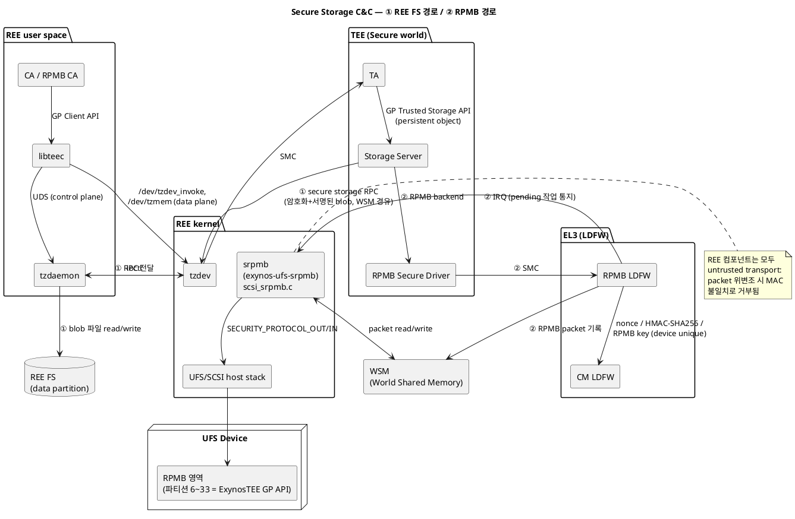
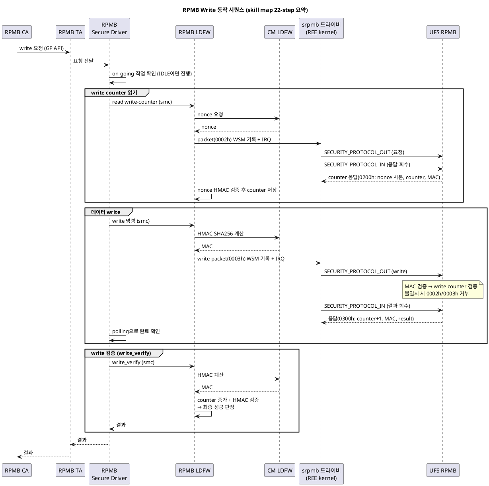

# Secure Storage 정리 — 역할, 동작 방식, REE 측 컴포넌트

> **출처**: RPMB skill map (page 1422842807), RPMB feature (page 988831481), RPMB partitions (page 988831486), [ExynosTEE] RPMB (page 988831792), [Security] Secure OS comparison (page 3476748772), Secure OS : App-Maker (page 2510235743), ExynosTEE REE SW skill map (page 1857270820), CC 검증 범위 문서 (page 988831627)
> **기준 스택**: ExynosTEE (일부 흐름은 PnR/Trustonic 사례 포함 — RPMB LDFW 이하 공통 계층은 TEE 종류와 무관)
> **관련 문서**: [tzdaemon 정리](99_tzdaemon.md)

---

## 1. Secure Storage의 역할

TA(Trusted Application)에 **GP Trusted Storage API**(persistent object)를 제공하여, TEE 밖(non-secure storage)에 저장되더라도 다음을 보장하는 저장소이다:

- **기밀성** — TEE가 암호화한 뒤 내보냄 (REE는 평문을 볼 수 없음)
- **무결성/진위성** — 서명(MAC) 검증으로 위변조 탐지
- **Replay(rollback) 방지** — 이전 버전 데이터로 되돌리는 공격 차단
- **디바이스 바인딩** — Secure Object binding on device (다른 기기로 복사해도 복호화 불가)

주요 use case: 키/인증서 저장(factory keybox provisioning), DRM(Widevine/PlayReady), SW 버전 anti-rollback, AVB lock state, secure payment 키.

CC 인증 관점에서 TEE 쪽 담당 주체는 **Storage Server**다 (`FDP_ACC.1/Trusted Storage`, `O.TEE_DATA_PROTECTION` 등이 Kernel/Root Server/Storage Server 모듈에 매핑).

---

## 2. 두 가지 저장 백엔드

ExynosTEE secure storage는 저장 위치 기준으로 두 경로가 있다.

### (a) REE 파일시스템 기반 — Trusted Storage (용량 큰 데이터)

> Secure OS comparison: "**Trusted Storage**: Encrypted & signed data stored on a non-secure world"

- TEE Storage Server가 데이터를 **암호화 + 서명**하여 world shared memory(WSM)에 넣고 RPC 발행
- REE에서 tzdev가 RPC를 수신하고, REE 파일시스템에 파일로 저장 (skill map 기준 FS 작업 주체는 tzdaemon — 단, 같은 문서의 다른 절은 "tzdev finally save data into REE file system"이라고도 기술하므로 실제 코드에서 확인 필요, [tzdaemon 정리](99_tzdaemon.md) 참고)
- 장점: 용량 제약이 사실상 없음 / 한계: REE가 파일을 지우거나 옛 버전으로 되돌릴 수 있으므로(가용성·rollback), rollback 방지는 RPMB의 카운터와 결합해야 완성됨

### (b) RPMB 기반 — HW replay 방지 (작고 중요한 데이터)

RPMB(Replay Protected Memory Block)는 UFS/eMMC 내의 인증된 접근 전용 영역이다.

- 블록(256B) 단위 접근, 512블록 = 1 논리 파티션(128KB)
- **인증**: RPMB key(HMAC-SHA256 shared secret)를 디바이스에 **평생 1회만** 프로그래밍. 이후 SW에서 키는 비가시. 모든 read/write에 MAC 서명
- **Replay 방지**: READ는 nonce, WRITE는 단조 증가하는 write counter로 방어
- ExynosTEE의 RPMB key programming은 **LDFW에 위임**되고, key는 unique device key에서 파생됨

**RPMB 파티션 할당** ([ExynosTEE] RPMB, 16MB 기준):

| 파티션 | 용도 |
|---|---|
| 1~5 | 시스템 (2 = AVB, 5 = RPMB 테스트, 나머지 reserved) |
| 6~33 | **ExynosTEE 예약 — GP (Trusted Storage) API 제공용** |
| 34~128 | Customer 사용 가능 |

### 전체 구조 C&C 다이어그램

두 백엔드 경로를 한눈에 볼 수 있는 component & connector 다이어그램. ①은 REE FS 경로, ②는 RPMB 경로다.



---

## 3. 동작 방식 — RPMB 경로 상세

### 전체 계층

```
[REE user]   RPMB CA (rpmb_test_app 등)
                │ GP Client API
[TEE]        RPMB TA (CA에 대한 service portal)
                │
[TEE]        RPMB Secure Driver (파티션 구성, access control 등 상위 서비스)
                │ smc
[EL3]        RPMB LDFW (RPMB packet 구성, write counter 관리, HMAC 검증)
             CM LDFW  (nonce 생성, HMAC-SHA256 계산, RPMB key 공급)
                │ WSM + IRQ
[REE kernel] srpmb 드라이버 (exynos-ufs-srpmb, scsi_srpmb.c)
                │ SECURITY_PROTOCOL_OUT/IN (SCSI security protocol command)
[HW]         UFS RPMB 영역
```

핵심 포인트: **RPMB 경로는 tzdev/tzdaemon을 경유하지 않는다.** LDFW가 WSM에 packet을 쓰고 IRQ로 REE의 전용 커널 드라이버(srpmb)를 직접 깨우는 별도 채널이다.

### Write 흐름 (skill map 22-step 요약)

1. CA → TA → RPMB Secure Driver로 write 요청 전달
2. Secure Driver가 진행 중인 RPMB 작업이 없는지(IDLE) 확인 후 진행
3. 먼저 write counter를 읽음: LDFW가 nonce 포함 read-counter packet을 WSM에 구성 → IRQ → srpmb가 SECURITY_PROTOCOL_OUT/IN 수행 → LDFW가 응답의 nonce·HMAC 검증 후 counter 저장
4. Secure Driver가 write 명령을 smc로 LDFW에 전달
5. LDFW가 CM LDFW에서 HMAC을 받아 write packet(Request 0003h: Block Count, Address, Write Counter, Data, MAC)을 구성, WSM에 복사, IRQ 발생
6. srpmb 드라이버가 SECURITY_PROTOCOL_OUT(쓰기) / SECURITY_PROTOCOL_IN(결과 회수, Response 0300h) 수행
7. Secure Driver는 polling으로 완료 확인 후 **write_verify**를 LDFW에 요청
8. LDFW가 응답의 write counter 증가와 HMAC을 검증하여 최종 성공 판정

디바이스 쪽에서도 MAC → write counter 순으로 검증하며, 불일치 시 Authentication failure(0002h) / Counter failure(0003h)로 거부하고 데이터를 쓰지 않는다.



### Read 흐름

Host가 nonce를 포함해 요청(0004h) → 디바이스가 데이터 + nonce 사본 + MAC으로 응답 → **MAC과 nonce가 모두 일치할 때만** 유효한 데이터로 인정.

### 보안 원리 — REE 드라이버는 untrusted transport

srpmb 드라이버와 UFS 스택은 packet을 **전달만** 하며 내용을 만들거나 검증하지 않는다. REE가 packet을 위변조하면 MAC 불일치로 디바이스 또는 LDFW가 거부한다. tzdaemon과 마찬가지로 "REE 컴포넌트가 뚫려도 기밀성·무결성은 유지, 가용성(DoS)만 영향"이라는 설계 원칙이 동일하게 적용된다.

---

## 4. 사용되는 REE 측 컴포넌트 (tzdev/tzdaemon 외)

| 컴포넌트 | 위치 | 역할 |
|---|---|---|
| **srpmb 커널 드라이버** (`exynos-ufs-srpmb`) | `kernel/drivers/scsi/scsi_srpmb.c` | RPMB 전용 REE 드라이버. LDFW의 IRQ를 받아 workqueue(`srpmb_worker`)에서 WSM의 packet을 SECURITY_PROTOCOL_OUT/IN으로 UFS에 전달 |
| **UFS/SCSI host stack** | kernel | SCSI security protocol command의 실제 전송 계층 |
| **WSM (World Shared Memory)** | REE/TEE 공유 메모리 | RPMB packet 및 secure storage RPC 데이터 교환 버퍼 |
| **REE 파일시스템 + 스토리지 파티션** | data partition | Trusted Storage 암호화 blob의 실제 저장소 (FS 경로 백엔드) |
| **RPMB CA / test app** | user space | RPMB 서비스를 요청하는 애플리케이션 (`rpmb_test_app`, `rpmb_test` 등) |
| **LK-boot RPMB 드라이버** | `lk-boot/dev/exynosauto-rpmb/` | 부팅 단계(REE 커널 이전)의 RPMB 접근: key programming (`rpmb key`, `CONFIG_RPMB_AUTO_KEY_PROGRAMMING`), AVB lock state, bootmode 저장 |

REE는 아니지만 경로를 완성하는 EL3 펌웨어:

- **RPMB LDFW** (`ldfw/rpmb/code/`) — RPMB packet 구성, write counter 관리, 응답 HMAC/nonce 검증
- **CM LDFW** (CryptoManager) — nonce 생성, HMAC-SHA256 계산, RPMB key 공급 (unique device key 파생, SW 비노출)

TEE 종류(ExynosTEE/PnR/Trustonic)가 바뀌어도 **LDFW ↔ srpmb ↔ UFS 하위 계층은 공통**이고, CA/TA/Secure Driver 코드만 TEE별로 다르다. sys-domain OS(QNX/Linux)가 바뀌면 device driver 코드가 달라진다 (RPMB skill map).

---

## 5. 경로별 비교 요약

| 구분 | REE FS 기반 (Trusted Storage) | RPMB 기반 |
|---|---|---|
| REE 경유 컴포넌트 | tzdev → tzdaemon → REE FS | LDFW → (WSM+IRQ) → srpmb → UFS |
| 저장 위치 | REE data partition의 암호화 blob | UFS RPMB 영역 (파티션 6~33) |
| 용량 | 사실상 무제한 | 총 16MB 수준, 파티션당 128KB |
| 기밀성/무결성 | TEE 암호화+서명 | MAC 인증 (데이터 암호화는 TEE가 추가 수행 가능) |
| Replay 방지 | 자체적으론 없음 (REE가 파일 롤백 가능) → RPMB 카운터와 결합 필요 | **HW 보장** (write counter + nonce) |
| REE 컴포넌트 신뢰 요구 | 불필요 (untrusted servant) | 불필요 (untrusted transport) |
| 적합 데이터 | 크기가 큰 일반 persistent object | rollback counter, 키, lock state 등 작고 중요한 데이터 |

---

## 한 줄 요약

> Secure storage는 "TEE가 암호화·서명·카운터로 보호한 데이터를 untrusted REE 저장소에 맡기는" 구조로, REE FS 경로는 tzdev/tzdaemon이, RPMB 경로는 **전용 커널 드라이버 srpmb(scsi_srpmb.c) + UFS 스택 + WSM**이 전달자 역할을 하며, 어느 REE 컴포넌트도 신뢰 대상이 아니다 — replay 방지의 뿌리는 RPMB HW(write counter/nonce)와 LDFW에 있다.
