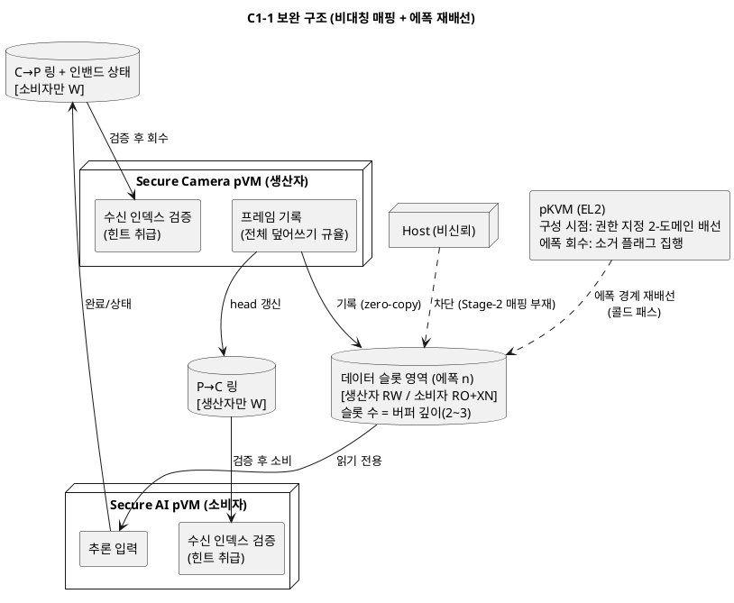
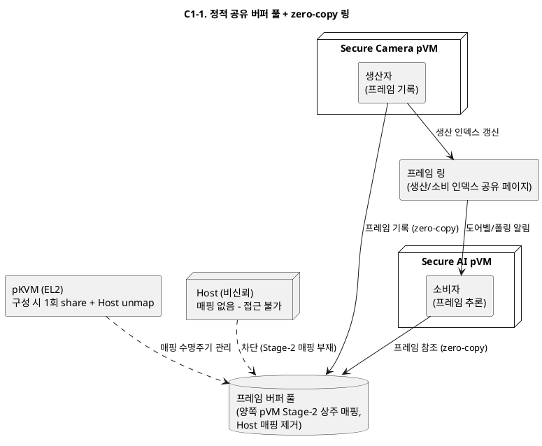
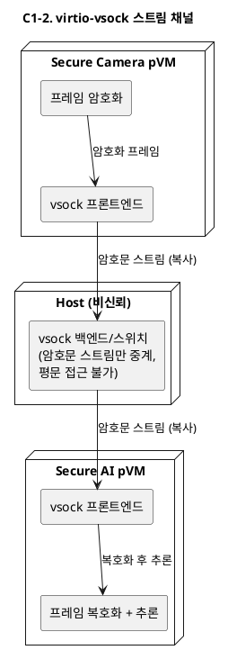
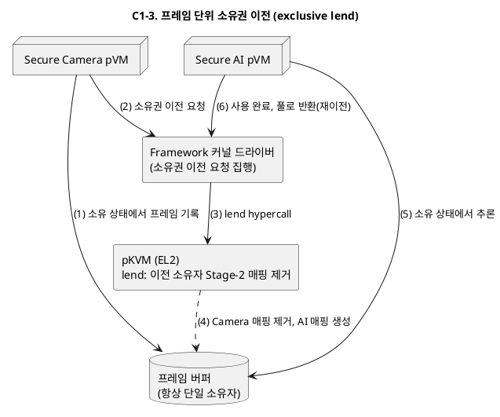
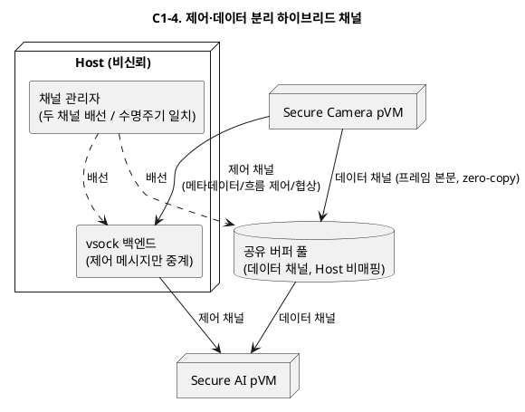
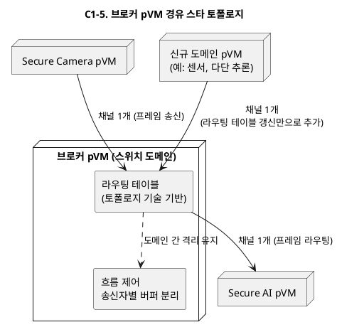

# DP-C1 후보 상세 비교 — C1-1 (정적 공유 풀) vs C1-3 (소유권 이전) vs C1-4 (하이브리드)

> 본 문서는 `08_candidate_architectures.md`의 DP-C1(도메인 간 프레임 전달 채널 구조) 후보 중 1번째 **C1-1. 정적 공유 버퍼 풀(zero-copy)**, 3번째 **C1-3. 프레임 단위 소유권 이전(exclusive lend)**, 4번째 **C1-4. 제어·데이터 분리 하이브리드(vsock 제어 + 공유 풀 데이터)** 를 기능별/품질속성별/EL2 수정 난이도로 상세 비교하고, C1-1 채택 시 약점을 보완하는 설계안을 제안한다.
>
> 근거 문서: `08_candidate_architectures.md` 2장(DP-C1, 특히 2.5절 EL2 수정 필요 여부), `06_qa_utility_tree_metrics.md`(PERF/SEC KPI), `99_ffa.md`(FF-A 기반 구현 경로), `99_virtio_vsock.md`(vsock 구조적 제약)

---

## 목차

1. [비교 대상 요약](#1-비교-대상-요약)
2. [기능별 비교](#2-기능별-비교)
3. [품질속성별 비교](#3-품질속성별-비교)
4. [EL2 수정 난이도 비교](#4-el2-수정-난이도-비교)
5. [비교 종합](#5-비교-종합)
6. [C1-1 채택 시 약점 보완 설계안](#6-c1-1-채택-시-약점-보완-설계안)

---

## 1. 비교 대상 요약

| 항목 | C1-1. 정적 공유 풀 | C1-3. 소유권 이전 | C1-4. 하이브리드 |
|------|-------------------|-------------------|------------------|
| 핵심 아이디어 | 파이프라인 구성 시 버퍼 풀을 양쪽 pVM에 상시 매핑(Host 비매핑), 반복 구간은 링 인덱스 갱신만 | 매 프레임 소유권을 hypercall로 이전 — 어떤 시점에도 접근자는 정확히 1개 도메인 | 제어(메타데이터/협상)는 vsock, 벌크 데이터는 C1-1형 공유 풀로 2중 채널 |
| 반복 구간 hypercall | 0회 | 프레임당 2회(이전+반환) + TLB 무효화 | 0회 (데이터 채널 기준) |
| 노출 창 | 파이프라인 수명 전체 | 프레임 처리 시간만 | 데이터 채널은 C1-1과 동일 |
| FF-A 대응 (`99_ffa.md`) | `FFA_MEM_SHARE` 1회 + notification | `FFA_MEM_LEND`/`RELINQUISH`/`RECLAIM` 왕복 | SHARE 풀 + 제어는 vsock |
| 대응 트레이드오프 | 성능 vs 노출 창 상시 개방 | 기밀성 vs 프레임당 고정 비용 | 경로별 최적화 vs 상태 관리 복잡성 |

세 후보는 "Host 비매핑 공유 메모리로 zero-copy를 달성한다"(C1-1/C1-4) 또는 "매핑 자체를 순간화한다"(C1-3)는 점에서 모두 구조적 기밀성을 지향하며, C1-2(vsock 복사+암호화)와 달리 셋 다 EL2 수준의 guest-to-guest 프리미티브를 요구한다(2.5절). 따라서 비교의 실질은 **"노출 창을 얼마나 좁힐 것인가"와 "그 대가로 반복 구간에 얼마의 고정 비용과 상태 복잡성을 지불할 것인가"** 이다.

## 2. 기능별 비교

프레임 전달 채널이 수행해야 하는 기능(시나리오 6단계 배선 + 7~12단계 반복 + 종료/장애 처리)을 기준으로 비교한다.

| 기능 | C1-1. 정적 공유 풀 | C1-3. 소유권 이전 | C1-4. 하이브리드 | 비고 |
|------|-------------------|-------------------|------------------|------|
| 채널 수립/배선 (시나리오 6) | 풀 할당 + 양쪽 매핑 hypercall 1회 | 버퍼 풀 할당 + 초기 소유자 지정 (매핑은 프레임마다) | 공유 풀 배선 + vsock 연결 수립 — 2종 채널의 수명주기 일치 필요 | C1-4만 채널 2종 |
| 프레임 전달 (반복 구간) | 링 인덱스 갱신 + 알림 1회 | 이전 hypercall → 소비 → 반환 hypercall | 데이터는 링 갱신, 메타데이터는 vsock 메시지 | C1-1/C1-4 동등, C1-3만 hypercall 상주 |
| 흐름 제어/배압 | 링 자체(full/empty)로 암묵적 | 소유권 프로토콜에 내장(반환 전 재이전 불가) | vsock 제어 채널로 명시적 협상 | C1-4가 가장 유연 |
| 메타데이터 전달 (타임스탬프, 포맷) | 공유 링의 슬롯 헤더에 인라인 | 이전되는 버퍼에 인라인 | vsock 제어 메시지로 분리 | C1-4는 메타데이터 스키마 진화가 자유로움 |
| 동적 재구성 (해상도 변경 등) | **재배선 필요** — 풀 크기 고정 | 버퍼 단위라 상대적으로 유연(새 크기 버퍼를 풀에 추가) | 제어 채널로 협상 후 데이터 풀 재배선 — 협상은 쉬우나 재배선 자체는 C1-1과 동일 | C1-1의 대표 공백 |
| 오류 통지/재연결 | 별도 경로 없음 — 링에 인밴드로 넣거나 관리 데몬 경유 | hypercall 실패 코드로 즉시 검출 | vsock 제어 채널이 자연스러운 통로 (DP-E3 버저닝과 정합) | C1-4의 대표 강점 |
| 채널 해체/자원 회수 | 매핑 해제 + 풀 전체 소거 후 회수 | 마지막 소유자 기준 회수 — 소유권이 명확해 회수 로직 단순 | 채널 2종 해체 순서 관리 필요(반개방 상태 정리) | C1-3이 가장 명확 |
| 잔류 데이터 소거 (VOS-08) | **파이프라인 종료까지 지연** | 이전 시점 = 매핑 제거 시점이라 관리 명확 | C1-1과 동일 (데이터 풀) | C1-3의 대표 강점 |
| 한쪽 pVM 장애 시 | 생존 측이 풀에 계속 접근 가능 — 풀 상태(인덱스) 오염 가능성, 외부 감시로 검출 | 소유권 상태로 하이퍼바이저가 즉시 파악 — 진행 중 프레임 소유자만 손실 | 데이터는 C1-1과 동일 + vsock 단절로 검출은 빠름 | 검출은 C1-4, 상태 명확성은 C1-3 |
| 다단 파이프라인 확장 (R-4) | 도메인 쌍마다 풀 배선 — O(N²) 위험(P-C1-3) | 쌍마다 프로토콜 수립 — 동일하게 O(N²)이나 버퍼는 재사용 가능 | 제어 채널에서 토폴로지 협상 수용 — 데이터 풀 배선은 여전히 쌍 단위 | 셋 다 근본 해결은 아님(그건 C1-5) |

**요약**: 반복 구간 성능 기능은 C1-1과 C1-4가 동등하게 우수하고, 소거·회수·상태 명확성 기능은 C1-3이 우수하다. C1-4는 오류 통지·협상·진화 기능을 제어 채널로 흡수하는 대신 채널 2종의 수명주기 동기화라는 새 기능 부담을 진다. C1-1은 "구성 후 반복"만 있는 단순한 프로파일에서는 기능 공백이 없지만, 재구성·오류 통지·소거에서 공백이 드러난다.

## 3. 품질속성별 비교

기존 비교표(08 문서 2.3절)의 4축(성능·기밀성·확장성·구현 비용)에 더해, DP-C1 문제 정의(P-C1-1~3)와 QA/VOS 목록에서 도출한 추가 품질속성 5축(도메인 간 격리, 가용성, 잔류 데이터 처리, 시험용이성, 변경용이성)을 포함해 9축으로 비교한다. 등급 판정 원칙은 08 문서 1.4절과 동일하다(구조 자체로 게이트 충족 = 상, 부가 메커니즘 의존 = 중, 게이트 위반 위험 = 하).

| 품질속성 (참조 QA/KPI) | C1-1. 정적 공유 풀 | C1-3. 소유권 이전 | C1-4. 하이브리드 | 판정 근거 |
|------------------------|--------------------|-------------------|------------------|-----------|
| **성능** (QA-02/04, PERF KPI) | **상** — 프레임당 비용이 인덱스 갱신+알림으로 상수. 지터 최소, 예측 가능 | **중** — 프레임당 hypercall 2회 + TLB 무효화가 고정 비용. 5ms 예산 내 수렴 여부는 실측 관문 | **상** — 데이터 경로는 C1-1과 동일. 제어 메시지는 빈도 낮아 영향 미미 | C1-3만 성능이 "실측 조건부" |
| **기밀성 — 대 Host** (QA-01/SEC-01) | **상** — 구성 시점에 Host 매핑 제거, 반복 구간 Host 접근 경로 없음 | **상** — 동일 (Host는 어느 시점에도 비매핑) | **중상** — 데이터는 상, 단 제어 메시지가 Host 릴레이(vsock)를 경유해 트래픽 패턴·타이밍 노출(`99_virtio_vsock.md`) | 셋 다 프레임 본문은 구조적 비노출 |
| **기밀성 — 도메인 간** (QA-01 세분) | **하** — 풀 전체가 양쪽에 상시 매핑. 한쪽 pVM 침해 시 풀 내 전 프레임 노출, 노출 창 = 파이프라인 수명 | **상** — 어떤 시점에도 소유자 1개 도메인. 침해 도메인이 보는 것은 자기 소유 프레임뿐 | **하** — 데이터 풀이 C1-1과 동일 | 이 축이 C1-1과 C1-3을 가르는 결정 축 |
| **확장성** (QA-03/R-4) | **중** — 쌍 단위 배선, 재구성 경직 | **중** — 쌍 단위 프로토콜, 버퍼 재사용은 유연 | **상** — 협상·버전 관리가 제어 채널로 흡수돼 도메인 추가 시 변경이 데이터로 수용 | 토폴로지 폭발(P-C1-3)은 셋 다 미해결 |
| **구현 비용** | **중간** — 링 프로토콜 + 배선 1종. 선행 사례(공유 링) 풍부 | **중간** — 소유권 프로토콜 + 이중/삼중 버퍼링 결합 시 복잡(DP-P2) | **높음** — 채널 2종 구현·시험 + 수명주기 동기화(반개방 검출) | 08 문서 2.3절 판정 유지 |
| **도메인 간 격리 복원력** (침해 확산 억제) | **하** — 풀이 공동 신뢰 영역. 소비자가 링 인덱스를 오염시켜 생산자 동작 교란 가능 | **상** — 프로토콜 위반이 hypercall 실패로 즉시 차단, 오염 표면이 현재 프레임 1개로 한정 | **중하** — 풀 약점 동일하나 제어 채널 검증으로 인덱스 오염 일부 방어 가능 | P-C1-2의 "노출 창" 문제의 도메인 간 버전 |
| **가용성** (QA-05) | **중상** — 채널에 능동 구성요소 없음(공유 메모리는 죽지 않음). 단 상대 pVM 장애 검출 경로가 별도 필요 | **중상** — 하이퍼바이저가 소유권 상태를 가져 장애 후 회수·재구성이 명확 | **중** — vsock 제어 채널이 Host 릴레이 의존 — Host가 제어 채널을 끊으면 협상·오류 통지 불능(데이터는 지속) | C1-4만 Host 의존 요소 보유 |
| **잔류 데이터 처리** (VOS-08) | **하** — 소거 시점이 파이프라인 종료까지 지연, 유휴 슬롯에 과거 프레임 잔존 | **상** — 이전/반환 시점이 곧 소거 관리 지점, 검증 용이 | **하** — C1-1과 동일 | C1-1의 대표 약점 |
| **시험용이성/검증성** (QA-07) | **중** — 격리 증빙은 "구성 시점 매핑 상태" 스냅샷 1회로 단순하나, 링 프로토콜의 동시성 버그는 재현 어려움 | **상** — FF-A/소유권 상태 기계의 전이표를 시험 시나리오로 그대로 재사용, 매 프레임이 검증 지점 | **중하** — 채널 2종 조합 상태(반개방 등)가 시험 공간을 지배 | C1-3은 상태 기계가 곧 명세 |
| **변경용이성** (해상도/포맷/프로토콜 진화) | **하** — 슬롯 크기·수 고정, 변경 = 재배선. 메타데이터 스키마도 링 헤더에 고정 | **중** — 버퍼 단위 유연성은 있으나 프로토콜 자체 변경은 어려움 | **상** — 협상·버저닝이 제어 채널의 본래 기능(DP-E3 정합) | C1-4의 존재 이유 |

### 3.1 품질속성별 우위 요약

| 품질속성 | 우위 | 비고 |
|----------|------|------|
| 성능 | C1-1 = C1-4 | C1-3은 실측 조건부 |
| 기밀성 (대 Host) | C1-1 = C1-3 | C1-4는 제어 채널 패턴 노출만 감점 |
| 기밀성 (도메인 간) | **C1-3** | C1-1/C1-4의 결정적 약점 |
| 확장성/변경용이성 | **C1-4** | 제어 채널의 협상 기능 |
| 구현 비용 | C1-1 = C1-3 | C1-4만 높음 |
| 격리 복원력 | **C1-3** | hypercall이 프로토콜 위반 차단 |
| 가용성 | C1-1 = C1-3 | C1-4는 Host 릴레이 의존 |
| 잔류 데이터 | **C1-3** | C1-1/C1-4는 보완 설계 필요 |
| 시험용이성 | **C1-3** | 상태 기계 = 명세 |

## 4. EL2 수정 난이도 비교

08 문서 2.5절에서 세 후보 모두 EL2 수정이 "필요"로 판정되었다. 여기서는 필요 여부를 넘어 **수정의 크기·성격·검증 부담**을 비교한다.

| 항목 | C1-1. 정적 공유 풀 | C1-3. 소유권 이전 | C1-4. 하이브리드 |
|------|--------------------|-------------------|------------------|
| 추가할 프리미티브 | guest-guest 공유 상태 1개 + 구성 시점 배선/해제 hypercall | guest→guest 원자적 이전(lend/relinquish/reclaim) hypercall 세트 | C1-1과 동일 (제어 채널은 EL2 무관) |
| 호출 빈도/위치 | **구성·해체 시점만** — 런타임 데이터 경로에 EL2 코드 없음 | **매 프레임** — EL2가 성능 크리티컬 경로에 편입 | C1-1과 동일 |
| 소유권 모델 변경 폭 | 상태 1개 추가(2-owner shared), 전이는 배선/해제 2개 | 상태 전이 다수(이전/반환/장애 회수) + 원자성 보장 + 반환 경로의 재진입 처리 | C1-1과 동일 |
| 성능 최적화 부담 | 없음 (콜드 패스) | TLB 무효화 최소화(범위 무효화, batching), 5ms 예산 내 수렴 튜닝 | 없음 |
| 검증 부담 (SEC-01 TCB 증분) | 공유 상태 불변식("이 페이지는 정확히 지정된 2개 도메인에만 매핑") 검증 — 정적 성격이라 감사 용이 | 상태 기계 전체 + 동시성(멀티 vCPU에서의 이전 경합) + 장애 중단 시 소유권 고아 방지 — 감사 범위 넓음 | C1-1과 동일 |
| FF-A 표준 정합 (`99_ffa.md`) | `FFA_MEM_SHARE` 의미론 부분 구현으로 충족 가능 | `FFA_MEM_LEND`+`RETRIEVE`+`RELINQUISH`+`RECLAIM` 전체 세트 필요 | C1-1과 동일 |
| **종합 난이도** | **중하** — 수정 표면이 작고 콜드 패스 한정 | **상** — 핫 패스 편입 + 상태 기계 + 동시성 검증 | **중하** (EL2 관점) — 단 게스트/호스트 측 구현은 최다 |

**핵심 관찰**: EL2 수정 난이도는 C1-3 ≫ C1-1 ≈ C1-4 이다. C1-1/C1-4의 수정은 "구성 시점 1회, 정적 성격"이라 벤더 협상(CS-02 예외 승인)과 보안 감사가 상대적으로 쉽고, C1-3은 EL2를 30fps 핫 패스에 편입시키므로 수정 승인·검증·성능 튜닝의 3중 부담이 있다. 이는 3절에서 C1-3이 다수 축에서 우위임에도 채택 장벽이 가장 높은 이유다.

## 5. 비교 종합

- **C1-3이 이기는 축**(도메인 간 기밀성, 격리 복원력, 잔류 데이터, 시험용이성)은 모두 "매핑의 순간화"에서 나오고, 그 대가가 성능 실측 관문과 **가장 높은 EL2 수정 난이도**다.
- **C1-1이 이기는 축**(성능 확정성, 구현 비용, EL2 수정 최소)은 모두 "구성 후 불변"에서 나오고, 그 대가가 도메인 간 노출 창·잔류 데이터·재구성 경직이다.
- **C1-4**는 C1-1의 데이터 평면에 진화·협상 능력을 더한 변형이므로, C1-1 대비 순수 추가 비용(채널 2종 관리, Host 릴레이 의존)과 순수 이득(변경용이성, 오류 통지)의 교환이다.
- 본 레퍼런스 프로파일(2-도메인, 장시간 상시 30fps, 재구성 빈도 낮음)에서는 반복 구간 성능 확정성과 EL2 수정 표면 최소화의 가치가 크므로 **C1-1을 기반으로 채택하되, C1-3이 우위인 축(도메인 간 노출, 잔류 데이터)과 C1-4가 우위인 축(재구성, 오류 통지)을 부분 차용해 보완하는 설계**가 비용 대비 효과가 가장 크다. 보완안은 6절에서 제안한다.

## 6. C1-1 채택 시 약점 보완 설계안

### 6.1 보완 대상 약점 정리

3~4절 비교에서 확인된 C1-1의 약점은 다음 5건이다.

| ID | 약점 | 영향 품질속성 |
|----|------|---------------|
| W-1 | 풀 전체가 양쪽 pVM에 상시 매핑 — 한쪽 침해 시 풀 내 전 프레임 노출, 노출 창 = 파이프라인 수명 | 기밀성 — 도메인 간 (QA-01) |
| W-2 | 소비자가 공유 링의 인덱스·제어 영역을 오염시켜 생산자 동작을 교란 가능 | 격리 복원력 |
| W-3 | 잔류 데이터 소거가 파이프라인 종료까지 지연, 유휴 슬롯에 과거 프레임 잔존 | 잔류 데이터 (VOS-08) |
| W-4 | 풀 크기·슬롯 구성 고정 — 해상도 변경 등 동적 재구성 시 전면 재배선 | 변경용이성 |
| W-5 | 오류 통지·협상·버전 관리 경로 부재 | 변경용이성, 가용성(장애 검출) |

### 6.2 보완 설계 원칙

C1-1의 강점(반복 구간 hypercall 0회, EL2 수정은 콜드 패스 한정)을 훼손하지 않는 것을 최우선 제약으로 둔다. 즉 **모든 보완은 (a) 구성 시점의 매핑 속성, (b) 게스트 내부 프로토콜 규율, (c) 저빈도 콜드 패스**에만 손을 대고, 프레임당 hypercall을 추가하는 보완(그것은 C1-3으로의 전환)은 배제한다.

### 6.3 보완안 상세

#### 보완 1. 방향별 비대칭 매핑 + 링 분리 (W-1, W-2)

- 풀을 단일 RW 공유 영역으로 열지 않고, 구성 시점에 **역할별 권한을 비대칭**으로 배선한다:
  - **데이터 슬롯 영역**: 생산자(Camera) RW / 소비자(AI) **RO(+XN)**. 소비자 pVM이 침해되어도 프레임 위변조(모델 입력 오염 공격)가 Stage-2 수준에서 불가.
  - **링 제어 영역을 방향별로 2개 분리**: 생산자→소비자 링(head 갱신)은 생산자만 쓰기 가능, 소비자→생산자 링(tail/완료 통지)은 소비자만 쓰기 가능. 각자 상대의 쓰기 영역을 읽기만 한다.
- 효과: 침해된 쪽이 오염시킬 수 있는 것이 "자기 방향 인덱스"로 한정되고, 그 오염은 상대측 검증(보완 5)으로 무해화된다. W-1의 "노출"은 읽기 노출로 남지만(그건 보완 2·3이 다룸), **쓰기 기반 교란은 구조적으로 차단**된다.
- 비용: EL2에 요구하는 프리미티브가 "2-도메인 공유"에서 "2-도메인 + 권한 속성 지정 공유"로 확장된다. FF-A 메모리 트랜잭션 디스크립터가 수신자별 접근 권한(RO/RW/XN) 필드를 이미 갖고 있으므로(`99_ffa.md`), FFA_MEM_SHARE 의미론을 따르면 자연스럽게 수용된다.

#### 보완 2. 버퍼 깊이 최소화로 노출 폭 상한 설정 (W-1)

- 슬롯 수를 파이프라이닝에 필요한 최소(이중~삼중 버퍼, DP-P2와 합동 결정)로 고정한다. 한쪽 침해 시 노출되는 프레임 수의 **상한이 버퍼 깊이**가 된다 — "풀 전체"가 수십 프레임이 아니라 2~3프레임으로 계량된다.
- 이는 SEC-01 계열 논증을 "노출 없음"에서 "노출 상한 N프레임 × 에폭 길이(보완 3)"라는 **정량 표현**으로 바꿔 주며, 침해 시 피해 범위를 위협 모델에 명시할 수 있게 한다.

#### 보완 3. 에폭(epoch) 기반 주기 재배선 (W-1, W-4)

- 파이프라인 수명을 에폭으로 분할하고, 에폭 경계마다 콜드 패스에서 풀을 재배선한다: 새 풀 배선 → 링 전환(더블 버퍼링된 풀 스위치) → 구 풀 소거 → 구 풀 회수.
- 효과 2가지:
  - **노출 창의 시간 축 단축**: "파이프라인 수명 전체" → "에폭 길이". 장시간 상시 실행 프로파일에서 침해 지속 가치를 떨어뜨린다.
  - **동적 재구성의 일반화(W-4 해결)**: 해상도/포맷 변경을 "특별한 재배선"이 아니라 "파라미터가 다른 에폭 전환"으로 수용 — 재구성 경로가 평시에 주기적으로 검증되는 경로가 되므로 신뢰성도 높아진다(드물게 실행되는 코드가 가장 위험하다는 원칙).
- 비용: 에폭 전환 중 프레임 드랍 없는 스위치오버 프로토콜 필요. 전환 주기는 성능 영향(콜드 패스 빈도)과 노출 창의 트레이드오프로 튜닝 파라미터화한다.

#### 보완 4. 슬롯 생명주기 소거 규율 (W-3)

- 세 지점에서 소거를 규율로 강제한다:
  1. **재사용 전 전체 덮어쓰기 보장**: 생산자는 슬롯에 부분 기록을 금지(프레임 크기 < 슬롯 크기면 잔여 구간 0-fill). "이전 프레임 잔존" 구간이 생기지 않는다.
  2. **유휴 슬롯 소거**: 파이프라인 일시정지 등으로 슬롯이 유휴 상태로 전환되면 생산자 측이 즉시 0-fill(콜드 패스).
  3. **회수 시 하이퍼바이저 소거**: 풀 해제/에폭 회수 hypercall에 소거 플래그를 포함해, 게스트가 죽어도 EL2가 회수 전 소거를 보장한다(FF-A의 zero-memory 플래그 의미론과 정합).
- 1·2는 게스트 규율(코드 리뷰 + 시험 항목), 3만 EL2 프리미티브에 플래그 1개를 추가한다.

#### 보완 5. 방어적 링 프로토콜 + 인밴드 오류 통지 (W-2, W-5)

- 상대가 쓴 인덱스·메타데이터를 **힌트로만** 취급한다: 수신 측은 범위 검사(슬롯 번호 유효성), 단조성 검사(시퀀스 역행 금지), 프레임 헤더 무결성 태그 확인 후에만 사용한다. 위반 검출 시 채널을 오류 상태로 천이하고 관리 평면에 통지한다.
- 오류 통지·에폭 협상은 **링 내 인밴드 상태 슬롯**(제어 영역의 예약 워드)으로 처리한다 — C1-4처럼 vsock 채널을 추가하지 않으므로 Host 릴레이 의존(`99_virtio_vsock.md`)과 채널 2종 동기화 비용을 피한다. 복잡한 협상(스키마 버전 등)은 빈도가 극히 낮으므로 관리 평면(DP-A1의 매니페스트/제어 경로) 경유로 승격한다.
- W-5를 C1-4 방식(전용 제어 채널)이 아닌 최소 방식으로 해결하는 선택이다. 협상 요구가 커지면 그때 C1-4로 증축하는 경로를 남긴다.

### 6.4 보완 후 구조

### 6.5 약점-보완 대응과 잔여 위험

| 약점 | 보완안 | 대응 QA/KPI | 잔여 위험 |
|------|--------|-------------|-----------|
| W-1 도메인 간 상시 노출 | 보완 1(RO 매핑) + 2(깊이 상한) + 3(에폭) | QA-01 세분(도메인 간), SEC-01 논증의 정량화 | 침해 도메인의 "읽기" 노출은 에폭 내 상한(2~3프레임)까지 잔존 — 완전 제거는 C1-3 전환으로만 가능. 이 잔여를 위협 모델에 수용 가능한지가 채택 판단점 |
| W-2 링 오염 교란 | 보완 1(방향별 쓰기 분리) + 5(힌트 검증) | 격리 복원력, QA-07 시험 시나리오 | 검증 로직 자체의 버그 — 링 프로토콜 퍼징을 QA-07 시험 카탈로그에 포함 필요 |
| W-3 잔류 데이터 | 보완 4(3지점 소거 규율) | VOS-08 | 게스트 규율(1·2번)은 코드 결함 시 무너짐 — 회수 시 EL2 소거(3번)가 최종 방어선임을 명시 |
| W-4 재구성 경직 | 보완 3(에폭 전환으로 일반화) | 변경용이성, EXT 계열 | 스위치오버 중 프레임 드랍 — 30fps 기준 전환 소요 실측 필요(1 프레임 주기 33ms 내 완료 목표) |
| W-5 오류 통지 부재 | 보완 5(인밴드 상태 + 관리 평면 승격) | 가용성(검출), DP-E3 정합 | 인밴드 채널은 표현력 한계 — 협상 요구 증가 시 C1-4로 증축하는 마이그레이션 경로를 인터페이스에 예약 |

### 6.6 결론

- 보완 1~5를 적용한 C1-1은, C1-3이 우위였던 축을 다음 수준까지 회수한다: 도메인 간 기밀성은 "무제한 노출"에서 **"버퍼 깊이 × 에폭 길이로 계량되는 상한부 노출"** 로, 잔류 데이터는 "종료 시 일괄"에서 "3지점 규율 + EL2 최종 방어선"으로, 격리 복원력은 "상호 오염 가능"에서 "쓰기 분리 + 힌트 검증"으로. W-4·W-5는 C1-4의 이점을 채널 추가 없이 부분 차용(에폭 일반화, 인밴드 통지)했다.
- 핵심 강점은 유지된다: 반복 구간 hypercall 0회, EL2 수정은 여전히 콜드 패스 한정(권한 지정 배선 + 소거 플래그로 소폭 확장 — 4절의 "중하" 난이도 유지).
- **잔여 한계의 명시**: 에폭 내 버퍼 깊이만큼의 읽기 노출은 구조적으로 남는다. 이 잔여가 위협 모델에서 수용 불가로 판정되면 답은 보완이 아니라 C1-3 전환이며, 보완 1의 FF-A 정합 설계(권한 필드, SHARE 의미론) 덕분에 **C1-1 → C1-3 전환은 동일 ABI 기반 위의 구성 변경**으로 남는다(`99_ffa.md`의 late-binding 결론과 동일). 채택 관문: 에폭 스위치오버 실측(33ms 내), 링 퍼징 시험의 QA-07 카탈로그 반영.

---

## 발췌: `08_DP_problem.md` — 2. DP-C1. 도메인 간 프레임 전달 채널 — C1-1, C1-3 제안 배경

C1-1(정적 공유 풀)과 C1-3(소유권 이전)은 둘 다 "Host 매핑 없는 구조적 기밀성"을 노리는 후보로, 기밀성 문제가 두 후보의 공통 동기이고 확장성 문제는 채널 배선 방식의 한계에서 나온다.

### 2.1 (기밀성) 전달 구간에서 프레임 원본이 비신뢰 영역에 노출되지 않아야 함.

- 표준 채널(virtio-vsock)은 전달 버퍼가 Host 커널에 매핑된 채 경유함 — Host 침해 시 프레임 원본이 그대로 노출됨 (VOS-09, QA-01 위반)
- 노출 창 = 비소유 주체의 매핑 폭 × 유지 시간. 상시 감시 파이프라인은 OO시간 연속 운용되므로, 매핑이 열려 있는 구조에서는 노출 창이 파이프라인 수명 전체로 커짐
- 보안 인증(SEC-01 게이트)은 root 권한 Host가 전체 메모리를 덤프해도 canary 노출 0건을 요구함 — 암호화로 가리는 방식은 기밀성이 "구조적 비노출"이 아닌 "키 관리 강도"에 의존하게 되어 격리 논증·인증 대응이 어려움
- 도메인 간에도 동시 매핑이 있으면 한쪽 pVM 침해 시 상대 도메인 프레임까지 노출됨 (권한 중첩 0 원칙, SEC-02 위반)

**→ 그래서**: 구성 시 Host 매핑을 제거하고 pVM끼리만 공유하는 **C1-1**, 나아가 어떤 시점에도 소유자가 정확히 1개 도메인인 **C1-3**이 필요함.

### 2.2 (확장성) 도메인 추가가 코어 수정 없이 구성 변경만으로 흡수되어야 함.

- 도메인 쌍마다 전용 채널을 배선하면 N개 도메인에서 O(N^2)개 채널 — 도메인 OO개 기준 채널 OO개, 채널당 버퍼 풀 OO MB로 자원이 곱으로 증가함
- 신규 도메인(센서, 다단 추론 등) 추가 시 채널 설정이 코어 수정을 유발하면 QA-03 "코어 수정 0 LoC" 게이트 위반 (R-4의 다단 파이프라인 로드맵과 충돌)
- upstream pKVM은 guest-guest 공유/이전 프리미티브가 없고 FF-A guest-to-guest relayer 표준화·개발이 느림 — 채널 메커니즘을 늦게 바꿀수록 재배선 비용이 커지므로, 버퍼 풀/소유권 프로토콜을 토폴로지 기술(구성)로 선언하는 구조를 지금 확정해야 함

**→ 그래서**: 채널을 코드가 아닌 구성(풀 배선 1회 / 소유권 프로토콜)으로 수용하는 C1-1·C1-3 계열이 필요함.

### 2.3 유의 사항

1. "FF-A 기술 개발이 느림" 같은 외부 제약 포인트는 확장성 절에 포함했으나, `08_candidate_architectures.md` 2.5절 취지대로라면 C1-1/C1-3 모두 EL2(guest-guest 프리미티브) 확보가 선행 관문이라는 리스크 언급이므로, 발표 흐름상 "문제점"이 아니라 "채택 조건"으로 분리하는 것도 방법이다.
2. 엄밀히는 확장성(P-C1-3) 문제의 정면 해법은 C1-5(브로커 스타)이고 C1-1/C1-3은 부분 대응(비교표 "중")이다. C1-1/C1-3 제안 맥락이라면 기밀성 문제를 주 동기로, 확장성은 보조 동기로 배치하는 편이 논리가 매끄럽다.

---

## 발췌: `08_candidate_architectures.md` — 2. DP-C1. 도메인 간 프레임 전달 채널 구조

### 2.1 문제 정의

시나리오 9단계에서 Camera pVM은 매 프레임(30fps 기준 33ms 주기)을 AI pVM으로 전달해야 한다(FR-04). 이 채널 구조가 다음 문제를 좌우한다.

| ID | 문제점 | 관련 품질속성 |
|----|--------|--------------|
| P-C1-1 | **프레임당 전달 비용이 실시간 예산을 잠식**: 복사 1회, map/unmap hypercall, VM exit가 프레임 주기마다 발생하면 QA-04(프레임당 전달 지연 5ms 이하)와 QA-02(E2E 100ms, 30fps)를 위협한다. 고해상도 프레임(수 MB)의 memcpy 1회만으로도 ms 단위 비용이다. | 성능 (QA-02, QA-04) |
| P-C1-2 | **전달 구간의 노출 창**: 전달 버퍼가 Host 커널에 매핑된 채 지나가면(예: 일반 virtio 백엔드 경유) Host 침해 시 프레임 원본이 노출된다(VOS-09, QA-01 위반). 공유 매핑을 넓고 오래 열수록 노출 창이 커진다. | 기밀성 (QA-01) |
| P-C1-3 | **도메인 수 증가 시 채널 토폴로지 폭발**: 도메인 쌍마다 전용 채널을 배선하면 N개 도메인에서 O(N^2) 채널이 되고, 채널 설정이 코어 수정을 유발하면 QA-03·R-4에 어긋난다. | 확장성 (QA-03, R-4) |

**해결 방향**: (1) 반복 구간의 프레임 전달 비용이 상수(복사 0~1회, hypercall 최소화)여야 하고, (2) 전달 버퍼는 어떤 시점에도 Host에 매핑되지 않아야 하며, (3) 채널 배선이 토폴로지 기술(구성)만으로 확장되어야 한다.

### 2.2 후보 구조

#### C1-1. 정적 공유 버퍼 풀 + zero-copy 링 (lend/share 상주 매핑)

- **개요**: 파이프라인 구성 시점(시나리오 6단계)에 프레임 버퍼 풀을 pKVM share로 Camera pVM과 AI pVM 양쪽 Stage-2에 상주 매핑하고, Host 매핑은 hypercall로 제거(unmap)한다. 이후 반복 구간에서는 링 디스크립터(인덱스)만 주고받는다.
- **구성과 책임**:
  - 버퍼 풀: 파이프라인 구성 시 1회 할당·매핑, 종료 시 1회 회수·소거
  - 프레임 링: 생산자(Camera)/소비자(AI) 인덱스만 담는 소형 공유 페이지
  - 알림: 도어벨(인터럽트 주입) 또는 폴링 — 데이터 이동 없음
- **동작 방식**: 프레임당 비용은 "인덱스 갱신 + 알림 1회"로 상수화된다. 매핑 전환 hypercall이 반복 구간에서 사라진다.

**구조 다이어그램**

**장점 / 단점 / 트레이드오프**

- **장점**
  - 프레임당 비용이 "인덱스 갱신 + 알림 1회"로 최소 — QA-04(5ms) 여유가 가장 크고 QA-02(30fps) 달성에 유리하다.
  - 반복 구간에서 매핑 전환 hypercall이 사라져 지연 지터가 낮고 성능 예측이 가능하다.
  - Host 매핑이 구성 시점에 제거되어 Host 대상 기밀성 논증은 단순하다.
- **단점**
  - 버퍼 풀이 Camera·AI 양쪽 pVM에 상시 매핑 — 한쪽 pVM이 침해되면 풀 전체가 노출되는 등 도메인 간 격리가 약화된다(노출 창이 파이프라인 수명 전체).
  - 풀 크기·구성이 고정되어 해상도 변경 등 동적 재구성 시 재배선이 필요하다.
  - 잔류 데이터 소거 시점이 파이프라인 종료까지 지연된다(VOS-08과 긴장).
- **트레이드오프**: 성능을 얻는 대신 노출 창(공유 범위 × 시간)을 지불한다. 파이프라인을 구성하는 pVM 간 상호 신뢰가 전제 조건이며, "Host로부터의 격리"는 강하지만 "도메인 간 격리"는 가장 약한 안이다.

#### C1-2. virtio-vsock 스트림 채널 (표준 스택 복사 기반)

- **개요**: pVM 간 전달을 virtio-vsock 스트림으로 구현한다. 프레임은 vsock 소켓으로 직렬화 전송되며, 전달 구간 보호는 프레임 암호화(시나리오 8단계에서 이미 암호화된 프레임 전달)로 확보한다.
- **구성과 책임**:
  - Camera pVM: 프레임을 암호화 후 vsock 송신
  - Host vsock 백엔드/스위치: 암호문 스트림만 중계 (평문 접근 불가)
  - AI pVM: 수신 후 복호화하여 추론
- **동작 방식**: 표준 스택(virtio) 재사용으로 구현·이식 비용이 가장 낮다. Host가 스트림을 봐도 암호문이므로 기밀성은 암호화 강도에 위임된다.

**구조 다이어그램**

**장점 / 단점 / 트레이드오프**

- **장점**
  - 표준 스택(virtio-vsock) 재사용으로 구현·이식 비용이 후보 중 가장 낮고, 게스트 커널 드라이버가 기성품이다.
  - 채널 수립·흐름 제어·재연결 등 통신 관리를 스택이 제공한다. 도메인 추가 시 채널 구성이 유연하다.
- **단점**
  - 프레임당 복사 2회 + 암복호화 비용이 프레임 주기와 결합 — 고해상도에서 QA-04(5ms)·QA-02(30fps) 미달 위험이 후보 중 가장 크다.
  - Host vsock 백엔드가 데이터 경로에 상주 — 암호문이라도 트래픽 패턴·타이밍이 노출되고, Host가 채널을 끊는 서비스 거부가 가능하다.
  - 기밀성이 "구조적 비노출"이 아닌 "암호 강도 + 키 관리"에 의존하게 되어 QA-01 검증 방법 자체가 달라진다.
- **트레이드오프**: 개발 속도와 이식성을 얻는 대신 실시간 성능을 지불한다. 기밀성 보장의 성격이 구조 보장에서 암호학적 보장으로 바뀌는 것이 가장 큰 구조적 결정이다.

#### C1-3. 프레임 단위 소유권 이전 채널 (exclusive lend hand-off)

- **개요**: 프레임 버퍼를 동시 공유하지 않고, 매 프레임 "Camera pVM 소유 → hypercall로 AI pVM에 이전(lend) → 사용 후 반환"하는 단일 소유자(single-owner) 프로토콜로 전달한다.
- **구성과 책임**:
  - Framework 커널 드라이버: 소유권 이전 요청을 hypercall(donate/lend 계열)로 집행
  - pKVM: 이전 시점에 이전 소유자의 Stage-2 매핑 제거 — 어떤 시점에도 프레임의 소유자는 정확히 1개 도메인
  - 반환 경로: AI pVM 사용 완료 후 버퍼를 풀로 반환(재이전)
- **동작 방식**: 동시 매핑이 존재하지 않으므로 노출 창이 최소다. 대신 프레임마다 이전/반환 hypercall 2회와 TLB 무효화 비용을 지불한다.

**구조 다이어그램**

**장점 / 단점 / 트레이드오프**

- **장점**
  - 어떤 시점에도 프레임의 소유자가 정확히 1개 도메인 — 노출 창이 최소이고 도메인 간 상호 격리까지 유지된다(QA-01 관점 최강).
  - 소유권 이전 시점이 곧 매핑 제거 시점이라 잔류 데이터 관리(VOS-08)와 격리 검증(QA-07)이 명확하다.
- **단점**
  - 프레임마다 이전/반환 hypercall 2회 + TLB 무효화 비용 — 30fps × 버퍼 수만큼 누적되어 QA-04(5ms) 예산을 잠식할 수 있다.
  - 이중/삼중 버퍼링(파이프라이닝, DP-P2)과 결합하면 소유권 프로토콜이 복잡해진다.
  - 기존 pKVM hypercall(lend/donate 계열)의 의미론에 의존도가 가장 높아 CS-02(EL2 수정 불가) 범위 내 실현 가능성 확인이 선행되어야 한다.
- **트레이드오프**: 기밀성을 얻는 대신 프레임당 고정 비용을 지불한다. hypercall 왕복 + TLB 비용이 5ms 예산 안에 들어가는지 성능 실측이 채택의 관문이다.

#### C1-4. 제어·데이터 분리 하이브리드 채널 (vsock 제어 + 공유 풀 데이터)

- **개요**: 제어 메시지(프레임 메타데이터, 흐름 제어, 채널 협상)는 virtio-vsock으로, 벌크 프레임 데이터는 C1-1형 공유 버퍼 풀로 나눠 싣는 2중 채널 구조다.
- **구성과 책임**:
  - 제어 채널(vsock): 채널 수립/버전 협상/오류 통지 — 빈도 낮음, 표준 스택 재사용
  - 데이터 채널(공유 풀): 프레임 본문 zero-copy 전달 — Host 비매핑
  - 채널 관리자: 시나리오 6단계에서 두 채널을 함께 배선하고 수명주기를 일치시킴
- **동작 방식**: 성능 민감 경로(데이터)와 유연성이 필요한 경로(제어)를 각자 최적 메커니즘에 배정한다. 채널 종류가 2개라 배선·상태 관리는 복잡해진다.

**구조 다이어그램**

**장점 / 단점 / 트레이드오프**

- **장점**
  - 데이터 경로는 zero-copy(QA-04), 제어 경로는 표준 스택(개발 속도·유연성) — 각 경로를 최적 메커니즘에 배정한다.
  - 채널 협상·버전 관리·오류 통지가 제어 채널로 자연스럽게 수용된다(DP-E3 인터페이스 버저닝과 정합).
  - 제어/데이터 분리는 업계에서 검증된 패턴이라 설계 리스크가 예측 가능하다.
- **단점**
  - 채널 2종의 수명주기 동기화가 필요 — 한쪽만 끊긴 반개방(half-open) 상태의 검출·정리 로직이 추가된다.
  - 구현·시험 대상이 2배가 된다.
  - 제어 채널이 Host를 경유하므로 제어 메시지 위변조(잘못된 인덱스 주입 등) 방어가 데이터 채널 설계에 반영되어야 한다.
- **트레이드오프**: 두 메커니즘의 장점을 취하는 대신 상태 관리 복잡성을 지불한다. 제어 메시지를 "힌트"로만 취급하고 최종 검증을 공유 링 쪽에서 수행하는 방어적 설계가 병행되어야 한다.

#### C1-5. 브로커 pVM 경유 스타 토폴로지 (스위치 도메인)

- **개요**: 도메인 간 직접 채널 대신, 전용 브로커 pVM(스위치 도메인)이 모든 프레임 라우팅을 담당하는 스타(star) 토폴로지를 구성한다. 각 도메인은 브로커와의 채널 1개만 가진다.
- **구성과 책임**:
  - 브로커 pVM: 라우팅 테이블(토폴로지 기술 기반), 흐름 제어, 도메인 간 격리 유지(송신자별 버퍼 분리)
  - 각 pVM: 브로커와의 단일 채널(공유 풀 또는 이전 방식)만 유지
  - 토폴로지 변경: 브로커의 라우팅 테이블 갱신만으로 N개 도메인 파이프라인 구성
- **동작 방식**: 채널 수가 O(N)으로 억제되고 다단 파이프라인(R-4)이 구성 변경으로 수용된다. 대신 모든 프레임이 브로커를 경유(1홉 추가)한다.

**구조 다이어그램**

**장점 / 단점 / 트레이드오프**

- **장점**
  - 채널 수가 O(N)으로 억제되고(P-C1-3 해결), 토폴로지 변경이 라우팅 테이블 갱신만으로 수용된다(R-4, QA-03, DP-S2와 정합).
  - 흐름 제어·QoS·감사 지점이 브로커 한곳에 모여 운영·증적(QA-07)에 유리하다.
  - 도메인 쌍 간 직접 신뢰가 불필요 — 송신자별 버퍼 분리로 도메인 간 격리를 브로커가 유지한다.
- **단점**
  - 모든 프레임이 브로커를 경유(1홉 추가) — 지연과 복사(또는 재이전) 비용으로 QA-04 위험이 커진다.
  - 브로커 pVM이 성능 병목이자 데이터 평면의 단일 장애점이 된다(QA-05).
  - 브로커가 모든 프레임에 접근 가능해 브로커 자체가 큰 TCB가 된다 — 브로커 침해 시 전 도메인 데이터 노출.
- **트레이드오프**: 확장성과 운영성을 얻는 대신 성능과 새로운 신뢰 집중점을 지불한다. 2-도메인 레퍼런스에는 과잉이며, N-도메인 다단 파이프라인이 확정 로드맵일 때만 투자 가치가 있다.

### 2.3 DP-C1 후보 비교 요약

| 후보 | 성능 (QA-02/04) | 기밀성 (QA-01) | 확장성 (R-4) | 구현 비용 | 핵심 트레이드오프 |
|------|----------------|---------------|-------------|----------|------------------|
| C1-1 정적 공유 풀 | 상 | 중 (도메인 간 상시 공유) | 중 | 중간 | 성능 vs 노출 창 상시 개방 |
| C1-2 vsock 스트림 | 하 | 중 (암호 강도 의존) | 상 | 낮음 | 개발 속도 vs 실시간 성능 |
| C1-3 소유권 이전 | 중 (hypercall 비용) | 상 | 중 | 중간 | 기밀성 vs 프레임당 고정 비용 |
| C1-4 하이브리드 | 상 | 중상 | 상 | 높음 | 경로별 최적화 vs 상태 관리 복잡성 |
| C1-5 브로커 스타 | 중하 (1홉 추가) | 중 (브로커 TCB 집중) | 상 | 높음 | 토폴로지 확장성 vs 성능·신뢰 집중 |

### 2.4 DP-C1 품질속성 KPI 측정 기준

> 상/중/하 판정 공통 원칙은 1.4절과 동일하다(게이트 구조 충족 = 상, 조건부 충족 = 중, 위반 위험 = 하).

**측정 KPI와 방법**

| 비교 축 | 참조 KPI (06 문서) | 측정 지표 | 측정 방법 |
|---|---|---|---|
| 성능 (QA-02/04) | PERF-02, PERF-01 | 데이터 경로 memcpy 0회(게이트), 전달 지연 p99 5ms, 프레임당 전환 비용 1ms 이하, 30fps·드롭율 0.1% 이하, fps/W 저하 10% 이내 | 복사 계열 함수 프로파일 히트 0 확인, dma-buf fence 타임스탬프로 핸드오프 지연 계측, ftrace로 프레임당 hypercall 횟수 계측, PMIC 텔레메트리로 fps/W 측정(PERF-02 방법 그대로) |
| 기밀성 (QA-01) | SEC-01 (+SEC-02 원칙 확장) | canary 노출 0건(게이트), 노출 창 = 비소유 주체의 Stage-2 매핑 폭 × 유지 시간, 도메인 간 동시 매핑 유무 | 프레임 버퍼에 canary 마커를 넣고 전달 전 구간(기록→전달→추론→회수)에서 root Host 전체 덤프로 마커 검출 판정(SEC-01 방법). 전달 이벤트마다 매핑 상태를 로깅해 Host 매핑·도메인 간 동시 매핑을 오프라인 판정(SEC-02의 권한 비트맵 로깅 방식) |
| 확장성 (R-4) | EXT-01 (+자원 증가율) | 토폴로지 변경 시 코어 diff LoC(게이트: 0), 도메인 수 N에 대한 채널·버퍼 자원 증가율(O(N) vs O(N^2)) | 도메인 1개 추가 실험에서 코어 diff CI 검사(EXT-01 방법) + 채널 수·버퍼 풀 메모리 증가분 실측 |
| 구현 비용 | EXT-03·EXT-06의 공수 계측 방식 원용 | 신규 채널 메커니즘 수, 신규 도메인(브로커 등) 수, 추정 공수(인월) | 표준 스택 재사용/커스텀 개발 구분 후 공수 산정 |

**상/중/하 판정 기준**

| 비교 축 | 상 | 중 | 하 |
|---|---|---|---|
| 성능 | memcpy 0회 게이트를 구조로 충족 + 전달 지연 p99가 5ms의 절반 이하 + 프레임당 hypercall 0~1회 | memcpy 0회이나 프레임당 hypercall 2회 이상 또는 p99가 5ms 목표선 부근(전환 비용 1ms 기준 위협) | 데이터 경로 memcpy 1회 이상(게이트 위반) 또는 p99 5ms 초과 |
| 기밀성 | Host 매핑 0 + 도메인 간 동시 매핑 없음(단일 소유) — 전 구간 canary 미검출 | Host 매핑 0이나 도메인 간 상시 공유 창 존재, 또는 Host 경유 구간이 암호문으로 한정 | 평문 프레임이 Host 접근 가능 구간을 통과(SEC-01 게이트 위반 위험) |
| 확장성 | 토폴로지 선언 변경만으로 N-도메인 구성(코어 diff 0) + 채널 자원 O(N) | 코어 무수정이나 도메인 쌍별 배선으로 자원 O(N^2) 증가 | 신규 토폴로지 수용에 코어 수정 필요 |
| 구현 비용 | 낮음: 표준 스택·기성 드라이버 재사용 위주 | 중간: 커스텀 링/풀 관리자 1종 신규 개발 | 높음: 채널 메커니즘 2종 병행 또는 브로커 도메인 신설 |

**KPI 선정 근거**

1. **성능 — PERF-02/01**: QA-04("프레임당 전달 지연 5ms, zero-copy")는 06 문서에서 PERF-02로 재편되어 게이트(memcpy 0회)와 KPI(p99 5ms, 프레임당 전환 비용 1ms, fps/W)로 이미 구체화되어 있다. 특히 fps/W 항목은 "복사·전환 과다는 전력으로 드러난다"는 측정 근거가 명시되어 있어, 채널 구조 간 차이를 소비 전력으로도 교차 검증할 수 있다.
2. **기밀성 — SEC-01 + SEC-02 원칙 확장**: canary 주입·전체 덤프 판정(SEC-01)은 전달 구간에 수정 없이 적용된다. 상/중을 가르는 "도메인 간 동시 매핑" 기준은 SEC-02의 "권한 중첩 0"(두 주체가 동시에 접근 권한을 갖는 구간을 위반으로 간주) 원칙을 채널 매핑에 확장한 것으로, 새 개념의 발명이 아니라 기존 게이트 원칙의 적용 범위 확대다.
3. **확장성 — EXT-01 + 자원 증가율**: 코어 diff CI 검사(EXT-01)가 직접 적용된다. 자원 증가율을 병기하는 근거는 06 문서 7절에서 자원 효율(원본 QA-07)이 독립 리프 대신 성능 예산 KPI로 흡수되었기 때문 — 채널·버퍼 자원이 도메인 수와 곱해지는 구조인지가 확장 시 예산 소모율을 결정한다.
4. **구현 비용 — 공수 KPI**: 1.4절 근거 4와 동일(EXT-03·EXT-06의 공수 계측 선례).

### 2.5 DP-C1 후보별 EL2(pKVM) 수정 필요 여부

CS-02(EL2 수정 불가, 기존 hypercall 범위 내 설계) 관점에서 5개 후보 각각이 요구하는 하이퍼바이저 프리미티브와 upstream pKVM의 제공 범위를 대조한다.

**판정 기준 — upstream pKVM이 제공하는 것**: (a) VM 생성 시 host→guest 메모리 기부(donate), (b) 게스트가 자신의 페이지를 **Host와** 공유/회수하는 `MEM_SHARE`/`MEM_UNSHARE`(virtio 버퍼용, `99_pvmfw.md` 3.4절), (c) 단일 소유자 + host-guest 공유 상태만 있는 페이지 소유권 모델. 즉 **pVM↔pVM 간 공유·이전 상태는 소유권 모델에 존재하지 않으며**, VM을 FF-A endpoint로 취급하는 guest-to-guest relayer도 없다(`99_ffa.md`). vsock은 구조적으로 guest↔host 전용이라 EL2와 무관하게 Host 릴레이로 동작한다(`99_virtio_vsock.md`).

| 후보 | EL2 수정 | 필요한 하이퍼바이저 프리미티브 | 판정 근거 | CS-02 범위 내 대안과 그 대가 |
|------|----------|------------------------------|-----------|------------------------------|
| C1-1 정적 공유 풀 | **필요** | 같은 물리 페이지를 두 pVM의 Stage-2에 동시 매핑하되 Host는 비매핑으로 유지하는 guest-guest 공유 상태 | upstream 소유권 모델에 guest-guest 공유 상태가 없음. FF-A relayer로 구현해도 그 relayer 추가가 곧 EL2 수정 | 풀을 Host 소유로 두고 양쪽 pVM과 host-guest 공유하면 무수정 가능하나, Host가 풀에 상시 매핑되어 QA-01(SEC-01 게이트) 위반 — 사실상 대안 아님 |
| C1-2 vsock 스트림 | **불필요** | 기존 guest↔host `MEM_SHARE`(virtio 큐/버퍼)만 사용 | virtio-vsock은 upstream pKVM + 표준 스택 그대로 동작. Host 릴레이 경유가 전제이며 기밀성은 애초에 암호화로 확보하는 설계 | — (이 후보의 존재 이유가 곧 "EL2 무수정 + 표준 스택") |
| C1-3 소유권 이전 | **필요 (가능성 높음)** | 프레임 단위 guest→guest lend/donate: 이전 소유자 Stage-2 매핑 제거 + 새 소유자 매핑 생성을 원자적으로 수행 | upstream의 lend/donate 계열은 host↔guest 방향만 존재. 본문 단점에 명시한 "CS-02 범위 내 실현 가능성 확인"의 실체가 이것 | Host를 경유하는 소유권 바운스(A→Host→B)는 무수정 가능하나 Host 매핑이 생기는 순간 평문 노출 — 기밀성 최강이라는 이 후보의 존재 이유가 소멸 |
| C1-4 하이브리드 | **필요** | 제어 채널(vsock)은 불필요하나, 데이터 채널이 C1-1의 공유 풀 프리미티브를 그대로 요구 | 데이터 채널이 C1-1과 동일 — 판정은 데이터 채널이 결정 | 제어 채널만 먼저 구축하고 데이터 채널을 임시로 C1-2(암호화 vsock)로 대체하는 단계적 경로는 가능(성능 게이트 미충족 상태로 운용) |
| C1-5 브로커 스타 | **채널 방식에 종속** | pVM↔브로커 pVM 채널도 결국 guest-to-guest — 공유 풀 기반이면 C1-1, 이전 기반이면 C1-3의 프리미티브를 그대로 요구 | 브로커가 pVM인 이상 채널 프리미티브 문제는 소멸하지 않고 브로커와의 채널로 이동할 뿐 | 채널을 vsock(Host 릴레이)으로 구성하면 무수정 가능하나, 모든 프레임이 Host를 지나므로 브로커 도입의 격리 이점이 사라지고 홉은 2배(pVM→Host→브로커→Host→pVM) |

**시사점**

1. **성능 게이트(memcpy 0회)를 충족하는 후보(C1-1/C1-3/C1-4)는 전부 EL2 수정이 필요하고, EL2 무수정 후보(C1-2)는 성능 게이트를 위반한다.** 즉 DP-C1에서 CS-02와 PERF-02 게이트는 upstream pKVM 기준으로 동시 충족이 불가능하며, 이 충돌의 해소가 후보 선택보다 먼저 결정되어야 할 상위 결정이다.
2. 해소 경로는 셋 중 하나다: (a) 대상 SoC 벤더의 pKVM이 guest-to-guest 공유/이전 hypercall을 이미 제공하는지 확인(제공 시 "수정"이 아니라 "기존 hypercall 사용"이 되어 CS-02 충족), (b) CS-02의 재협상(EL2 수정 범위를 명시적으로 승인받음), (c) 성능 게이트의 단계적 유예(C1-2로 시작하는 C1-4의 단계적 경로).
3. 따라서 아키텍처 평가(ATAM 등) 전에 **벤더 pKVM의 hypercall 목록 확보가 최우선 확인 항목**이며, 이는 `99_ffa.md`의 "relayer 제공 여부 선확인" 결론과 동일한 관문이다.

---

## 발췌: `08_candidate_architectures.md` — 6. DP별 FR/품질속성 추적표 (DP-C1 행)

| DP | 결정 지점 | 관련 FR | 관련 품질속성 | 보조 고려사항 |
|----|-----------|---------|---------------|--------------|
| DP-C1 | 도메인 간 프레임 전달 채널 구조 | FR-04 **도메인 간 보안 데이터 전송** | QA-01 **보안 (기밀성)** QA-02 **성능 (실시간 처리)** QA-03 **확장성** QA-04 **성능 (통신 오버헤드)** | 소유권 이전·잔류 데이터 검증은 QA-07 **시험 용이성**, 브로커 pVM 장애 반경은 QA-05 **가용성**과 추가로 연결된다. |
