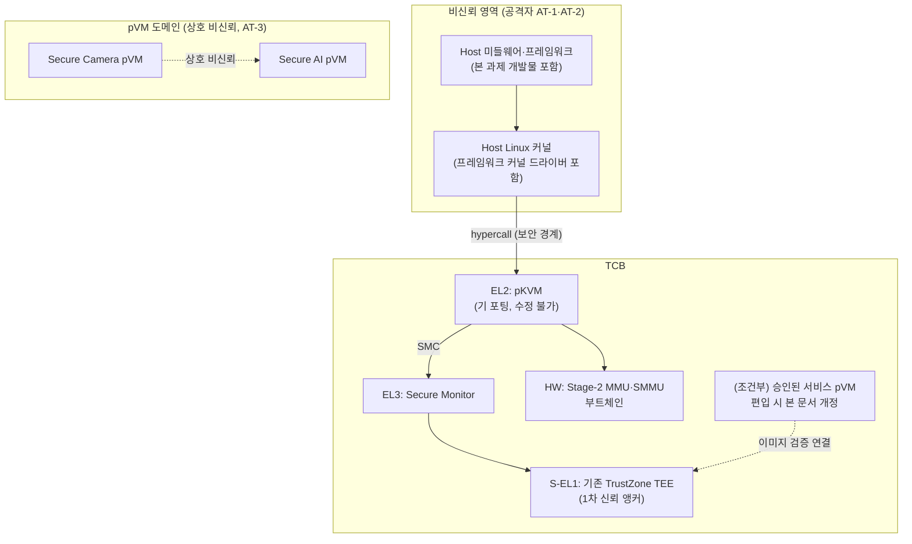

# DP-C-01 결정 과정: 신뢰 모델 확정

## 1. 신뢰 모델의 중요성

- 보안 아키텍쳐에서 신뢰 모델(Trusted Model)을 결정하는 것은 보안 전략의 **'근간'을 설계하는 작업**.

- 신뢰 모델 결정이 중요한 이유
  * 보호해야할 **자산의 범위와 공격 표면**을 효과적으로 통제
  * 침해 발생시 **피해 영향 범위**를 최소화
  * **보안 자원(인증 인프라 등)**을 효율적으로 집중
  * 범주를 벗어난 행위는 **즉각적인 '위협 탐지'**의 근거

핵심: 신뢰 모델은 보호 자산의 범위, 공격 표면, 피해 영향의 범위, 보안 자원, 위협 탐지의 **'근간'**이 되므로 제일 먼저 설계를 진행

## 2. 신뢰 모델 결정 과정 개요

| 단계 | 작업 | 산출물 |
|:----:|------|--------|
| 1 | 결정해야할 범위 정의 | 결정 항목 목록 |
| 2 | 공격자 모델 정의 | 공격자 능력 수준별 포함 및 제외 결정표 |
| 3 | 보호 속성 × 공격자 보장 매트릭스 작성 | 속성별 보장 수준 결정표 |
| 4 | TCB 후보 구성안 작성과 평가 | 후보 2~3안, 평가표, 채택 결정 |
| 5 | 신뢰 모델 산출 | TCB 목록, 공격자 모델, 속성별 의존 메커니즘 매핑, 후속 DP 전제 |

---

## 3. 1단계: 결정해야할 범위 정의

| ID | 결정 항목 |
|----|----------|
| D-1 | Host 측 프레임워크(미들웨어·커널 드라이버)의 TCB 포함 여부 |
| D-2 | 공격자 능력 범위 (Host 커널 권한, pVM 내부 권한, 물리 접근 등) |
| D-3 | 보호 속성 범위 (기밀성·무결성·가용성·추적성의 보장 여부) |
| D-4 | 신뢰 주체로 삼을 컴포넌트 (EL2, TrustZone EL3·S-EL1, 별도 서비스 pVM) |

---

## 4. 2단계: 공격자 모델 정의

공격자 능력을 6개 수준으로 열거하고 포함·제외를 결정한다.

| ID | 공격자 능력 | 결정 | 근거 |
|----|------------|:----:|------|
| AT-1 | **Host 사용자 공간 권한** — 미들웨어 및 앱 권한 탈취, 프레임워크 API 오용 | **포함** | AT-2에 포섭되는 하위 수준이나, 프레임워크 API가 1차 공격 표면이므로 별도 명시 |
| AT-2 | **Host 커널 권한** — 악성 커널 모듈, KVM 인터페이스 오용, 페이지 테이블 조작, DMA 조작 시도 | **포함** | QS-01의 자극원 그 자체. R-1(Host 비신뢰)이 과제의 존재 이유이므로 협상 불가 |
| AT-3 | **pVM 내부 권한** — 취약점이 악용된 보안 워크로드(예: 침해된 Secure Camera)가 타 pVM·Host·HW IP를 공격 | **포함** | QS-02의 자극원. 다중 도메인 구조(R-3)에서 도메인 상호 비신뢰는 QA-02의 전제 |
| AT-4 | **물리 접근** — DRAM 칩 추출(cold boot), 버스 프로빙, 디버그 포트 접근 | **제외** | 방어에 메모리 암호화 등 HW 메커니즘이 필요하나 CONST-05(HW 변경 불가)로 추가 불가. 로봇이 가정·공장에 배치되므로 위협 자체는 실재함 — 제외를 명시적 한계로 기록하고 제품 차원 대응(케이스 봉인, 디버그 포트 비활성화)을 권고 |
| AT-5 | **부채널** — 캐시 타이밍, 추측 실행(Spectre류), 전력 분석 | **제외** | SW 완화는 EL2·커널 수준 패치가 필요하여 CONST-02(EL2 수정 불가) 제약과 충돌. 기 포팅된 pKVM 커널이 제공하는 완화 수준을 그대로 수용하고, 그 이상은 보장하지 않음을 명시 |
| AT-6 | **부트체인·공급망 침해** — 부트 ROM·부트로더·pKVM 이미지 자체의 변조 | **제외** | 부트체인은 신뢰 모델의 출발점(Root Of Trust)으로, 침해를 가정하면 어떤 보장도 성립하지 않음. Secure Boot 체인의 무결성을 전제 조건으로 둠 |

**요약**: 본 과제의 공격자는 **AT-1(Host 사용자 공간 권한 침해) + AT-2(Host 커널 권한 침해) + AT-3(pVM 내부 권한 침해)의 합집합**이다. 즉 "Host 전체(커널 포함)와 일부 pVM이 동시에 침해된 상태"까지를 방어 대상으로 한다.

---

## 5. 3단계: 보호 속성 × 공격자 보장 매트릭스

Architectural Driver에서 TCB범위에 영향을 주는 ASR에 대해서 3가지 보호 속성(기밀성, 무결성, 가용성)으로 분류하고, 이에 대해 공격(AT-1~3)별 보장 수준을 결정한다.

| 보호 속성 | 보호 대상 | AT-1 (Host 사용자) | AT-2 (Host 커널) | AT-3 (침해 pVM) |
|----------|----------|:----------------:|:----------------:|:----------------:|
| 기밀성 | pVM 이미지·워크로드 평문, pVM 내 영상·모델·추론 데이터 | 전면 보장 | 전면 보장 | 전면 보장 (타 pVM 자산) |
| 무결성 | pVM 이미지·워크로드 변조 방지, pVM 메모리, 권한 정책 | 전면 보장 | 전면 보장 | 전면 보장 (타 pVM 자산) |
| 가용성 (a) | Host·타 pVM·로봇 기본 동작 (자극원: 장애/침해 pVM) | 해당 없음 | 해당 없음 | 보장 (격리 + FR-09 자원 회수·재시작) |
| 가용성 (b) | 대상 pVM의 실행·스케줄링·생명주기 지속성 (자극원: 침해 Host) | 보장 안 함 | **보장 안 함** | 해당 없음 |

**가용성 (b)를 보장하지 않는 결정의 근거** (`99_trust_boundary_qna.md` 논거 1):

- 가용성(b)의 보호 대상인 pVM 생성·메모리 할당·CPU 스케줄링·전원 관리는 Host가 담당한다. 따라서 이를 보장하려면 Host가 TCB에 들어와야 하지만, Host 비신뢰는 본 과제의 기밀성 보장의 전제 조건이므로 가용성(b)는 과제 범위에서 제외한다.
- 침해된 Host의 서비스 거부(pVM 생성 거부, 스케줄링 기아, 강제 종료)는 **방어하지 않되, 탐지·기록 대상**(책임 추적성)으로만 포함한다.

---

## 6. 4단계: TCB 후보 구성안 작성과 평가

### 6.1 후보 정의

| 후보 | 구성 | 설명 |
|------|------|------|
| **A. 최소 TCB안** | TCB = {HW 메커니즘, 부트체인, EL3, S-EL1(기존 TEE), EL2(pKVM)} | Host 측 프레임워크 전부 비신뢰. 보안 보장은 Stage-2·SMMU 메커니즘에만 의존. 신규 신뢰 컴포넌트 추가 없음 |
| **B. 서비스 pVM 확장안** | A + 검증자·로거·키 중개 등을 담는 전용 서비스 pVM | 신뢰가 필요한 기능을 Linux 네이티브 게스트로 구현한 서비스 pVM에 배치하고 해당 pVM을 TCB에 편입 |
| **C. TrustZone 앵커안** | A + 기존 TEE에 신규 기능(이미지 검증, 로그 봉인, pVM용 키 관리) 추가 | 기존 Secure OS TEE를 신규 구조의 신뢰 앵커로 적극 활용 |

EL2 확장안(EL2에 검증·로깅 기능 추가)은 CONST-02(EL2 수정 불가)에 의해 후보에서 원천 배제된다.

### 6.2 평가

평가 기준은 TCB 최소화 원칙, 제약 준수, 검증 가능성, 성능, 신뢰 기능 수용력, 부트스트랩 건전성으로 둔다.

| 평가 기준 | A. 최소 TCB | B. 서비스 pVM 확장 | C. TrustZone 앵커 |
|----------|:-----------:|:------------------:|:------------------:|
| TCB 최소화 | **상** (추가 없음) | 하 (게스트 OS 포함 TCB 증가) | 중 (기존 TCB 재사용, TA 코드만 증가) |
| CONST-02 (EL2 수정 불가) | 상 | 중 (서비스 pVM 보호에 추가 hypercall 필요 가능 — HV 파트 협의 필요) | 상 (기존 SMC 경로 사용) |
| CONST-03 (기존 TEE 무회귀) | 상 (TEE 무변경) | 상 (TEE 무변경) | **중 (기존 TEE에 기능 추가 시 회귀 위험)** |
| 검증 가능성 (QA-10) | 상 | 중 | 중 (TEE 내부는 시험 접근 제약) |
| 성능 (QA-04·05·11) | 상 (경로 추가 없음) | 중 (pVM 전환·통신 비용) | 중 (SMC 왕복 비용, TEE 자원 제약) |
| 신뢰 기능 수용력 (DP-C-05·C-08 요구) | **불가 (신뢰 주체 없음)** | 상 (자유도 높음) | 중 (키 관리·인증은 기존 보유, 대용량·고빈도 처리는 부적합) |
| 부트스트랩 건전성 | 해당 없음 | **하 (서비스 pVM 자신의 이미지 검증 주체가 다시 필요 — DP-C-05와 순환)** | 상 (Secure Boot 체인 안에서 이미 검증됨) |

### 6.3 평가 결과 분석

- **A 단독으로는 불충분하다.** 저장 보호(DP-C-08), 부팅 무결성 검증(DP-C-05), 변조 불가 로깅(탐지·로깅)은 모두 "Host가 아닌 누군가"가 수행해야 하는데 A에는 그 주체가 없다.
- **B 단독은 부트스트랩 순환에 빠진다.** 서비스 pVM을 신뢰하려면 그 이미지의 진위를 누군가 검증해야 하는데, 검증 주체가 다시 필요해진다.
- **C는 부트스트랩이 건전하고 기존 자산(키 관리·인증, FR-08)을 재사용하지만**, TEE 자원 제약(`00_overview.md` 3.1절)으로 대용량·고빈도 작업에 부적합하고, 기존 TEE 수정량이 커질수록 CONST-03 무회귀 위험이 커진다.

### 6.4 결정

**A를 기본 골격으로 채택하고, 신뢰 앵커가 필요한 기능에는 다음 우선순위 규칙을 적용한다.**

1. **EL2(pKVM)**: 기 제공되는 hypercall·fault 메커니즘 범위 안에서만 사용한다(수정 불가). Stage-2·SMMU 격리와 fault 이벤트의 원천으로서 모든 속성의 1차 메커니즘이다.
2. **TrustZone TEE (C 요소) — 1차 신뢰 앵커**: 키 관리·인증 등 기존 보유 기능의 재사용을 우선하고, 신규 TA 추가는 저빈도·소용량 작업(키 봉인, 측정값 보관, 로그 앵커링)으로 한정한다. 기존 TEE 기능의 회귀 시험을 전제 조건으로 한다(CONST-03).
3. **서비스 pVM (B 요소) — 조건부 2차 앵커**: TEE 자원 제약 또는 무회귀 위험이 큰 기능(예: 고빈도 로그 수집, HW IP 중재)에 한해 도입한다. 단 두 가지 편입 조건을 만족해야 한다: (i) 해당 pVM 이미지의 검증이 TEE 앵커(또는 Secure Boot 체인)에 연결될 것, (ii) TCB 편입을 본 문서의 개정으로 기록하고 영향 평가를 거칠 것.

기능별 앵커의 최종 확정은 해당 DP(DP-C-02·C-03·C-05·C-08)에서 이 규칙을 적용하여 수행한다.

---

## 7. 5단계: 신뢰 모델 (산출물)

### 7.1 TCB 구성 요소 목록

| 구분 | 구성 요소 | 신뢰 근거 | 비고 |
|------|----------|----------|------|
| HW | Stage-2 MMU, SMMU/IOMMU | HW 메커니즘 (CONST-05 전제) | 기밀성·무결성의 집행 지점 |
| HW·FW | 부트 ROM, 부트로더 체인(Secure Boot) | 신뢰 앵커 (AT-6 제외 전제) | pKVM·TEE 이미지 무결성의 출발점 |
| EL3 | Secure Monitor (Secure OS EL3 SPD) | Secure Boot로 검증, 최소 코드 | 세계 전환, SMC 라우팅 |
| S-EL1 | 기존 TrustZone Secure OS (TEE) | 제품 검증 이력, Secure Boot 체인 내 | 1차 신뢰 앵커. 신규 TA는 저빈도·소용량 한정 |
| EL2 | pKVM hypervisor (기 포팅, 수정 불가) | 소형 코드, HV 파트 제공 | Stage-2 독점 제어. hypercall 계약이 보안 경계 |
| (조건부) | 승인된 서비스 pVM | 이미지 검증의 TEE 앵커 연결 + 본 문서 개정 | 도입 시점에 TCB 편입을 명시적으로 기록 |

**비신뢰(TCB 밖)**: Host EL1·EL0 전부 — Linux 커널, 본 과제가 개발하는 커널 드라이버·미들웨어·프레임워크 포함. pVM들은 서로에 대해 비신뢰.

### 7.2 공격자 모델 요약

- 공격자 = AT-1(Host 사용자) + AT-2(Host 커널) + AT-3(침해 pVM)의 합집합.
- 제외 = AT-4(물리), AT-5(부채널), AT-6(부트체인). 제외 항목은 보안 주장(QA-10 시험 범위, CONST-04 증빙 문서)에 한계로 명시한다.

### 7.3 보호 속성별 의존 메커니즘 매핑

| 보호 속성 | 의존 메커니즘 (TCB 요소) | 관련 후속 DP |
|----------|------------------------|-------------|
| 기밀성 (실행 중) | Stage-2 변환(EL2), SMMU DMA 격리 | DP-C-06, DP-C-07 |
| 기밀성 (저장 시) | 저장 암호화 + TEE 키 관리 | DP-C-08 |
| 무결성 (실행 중) | Stage-2 쓰기 차단(EL2) | DP-C-06, DP-C-07 |
| 무결성 (부팅·로딩) | 이미지 서명 검증·측정 — TEE 앵커 우선 | DP-C-05, DP-C-05 |
| 무결성 (정책·아이덴티티) | manifest 서명 + 집행 주체(비Host) | DP-C-02, 채널 상대 인증 |
| 가용성 (a) | Stage-2 격리 + 생명주기 자원 회수·재시작(FR-09) | DP-C-04 |
| 가용성 (b) | 보장 안 함 — 거부 시도를 추적성 경로로 기록 | 탐지·로깅 |
| 책임 추적성 | EL2 fault 이벤트 + 변조 불가 로그 저장소 | 탐지·로깅, 격리 증빙 |

### 7.4 신뢰 경계 다이어그램

### 7.5 후속 DP에 주는 전제

| 후속 DP | 본 신뢰 모델이 고정하는 전제 |
|---------|------------------------------|
| DP-C-04 (생명주기 골격) | 프레임워크는 비신뢰이므로 생명주기 관리자는 "가용성·관리 기능 제공자"일 뿐 보안 보장 주체가 아니다. 보안이 걸리는 동작은 hypercall 계약을 경계로 EL2 메커니즘에 위임된다 |
| DP-C-06 (HW IP 중재) | 중재자를 Host 커널에 둘 경우 스케줄링 역할만 갖는다. 격리(SMMU 설정·잔류 소거 보증)는 TCB 요소가 보장해야 한다 |
| DP-C-07 (보안 채널) | 채널 기밀성은 Stage-2 정책으로 보장하며, Host는 채널 수립의 전달자일 뿐 내용 접근·검증 권한이 없다 |
| DP-C-03 (TrustZone 연동) | TEE는 1차 신뢰 앵커다. 단 신규 TA는 저빈도·소용량 작업으로 한정하고 기존 기능 회귀 시험을 전제한다 |
| DP-C-05·C-08 (저장·부팅) | 신뢰 앵커 선택 시 5.4절의 우선순위 규칙(EL2 메커니즘 → TEE → 조건부 서비스 pVM)을 적용한다 |
| 탐지·로깅 (탐지·로깅) | 가용성(b) 거부 시도를 포함한 비정상 이벤트를 기록한다. 로그 저장소는 TCB 요소여야 한다 |
| DP-C-02 (권한 집행) | Host 프레임워크의 단독 권한 집행은 불가하다. 집행 지점은 TCB 요소(EL2 메커니즘, TEE, 승인된 서비스 pVM) 중에서 선택한다 |

---

## 8. 결정 요약

| ID | 결정 항목 | 결정 |
|----|----------|------|
| D-1 | Host 측 프레임워크의 TCB 포함 여부 | **비신뢰(TCB 제외)**. 보안 보장은 Stage-2·SMMU 메커니즘에만 의존 |
| D-2 | 공격자 능력 범위 | AT-1(Host 사용자) + AT-2(Host 커널) + AT-3(침해 pVM) 포함. 물리·부채널·부트체인 침해 제외(한계 명시) |
| D-3 | 보호 속성 범위 | 기밀성·무결성·책임 추적성 전면 보장. 가용성은 (a) 장애/침해 pVM으로부터 Host·타 pVM·로봇 기본 동작 보호만 보장, (b) Host 침해 시 대상 pVM의 실행 지속성은 비보장(탐지·기록만) |
| D-4 | 신뢰 주체 | 기본 TCB = {HW, 부트체인, EL3, 기존 TEE, EL2}. 신뢰 앵커 우선순위: EL2 기 제공 메커니즘 → TEE(1차) → 조건부 서비스 pVM(2차) |

## 검토 결과

- 가용성(b) 비보장 결정(D-3): **수용 확인**. Host 침해 시나리오의 우선 목표를 "데이터 보호"로 두고, pVM 가용성은 탐지·기록 대상으로만 다룬다.
- D-1, D-2, D-4: 이견 없이 확정.

## 다음 단계

본 신뢰 모델을 전제로 착수 단계 2(DP-C-03, 탐지·로깅, DP-C-02)를 착수한다. 확정 결정을 변경하지 않는 잔여 협의 사항은 해당 후속 DP에서 다룬다.

| 협의 사항 | 협의 대상 | 다루는 DP |
|----------|----------|----------|
| 서비스 pVM 보호용 추가 hypercall 필요 여부 (도입 검토 시) | HV 파트 | DP-C-06, DP-C-05, 탐지·로깅 |
| 신규 TA 수용 여력과 기존 TEE 회귀 시험 계획 | SRCX | DP-C-03 |
| AT 제외 항목(물리·부채널·부트체인)의 증빙 문서 처리 | 품질·검증 조직 | 격리 증빙 |
