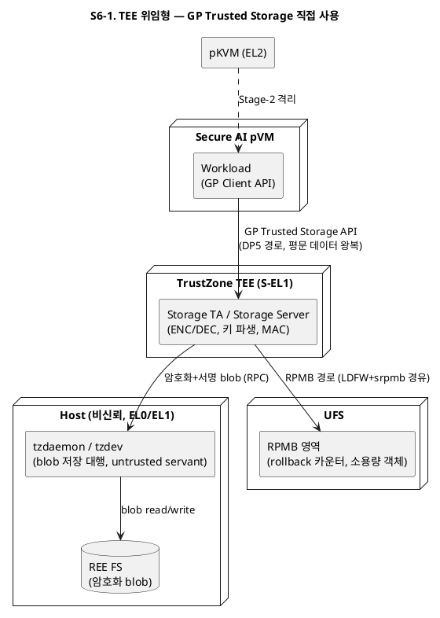
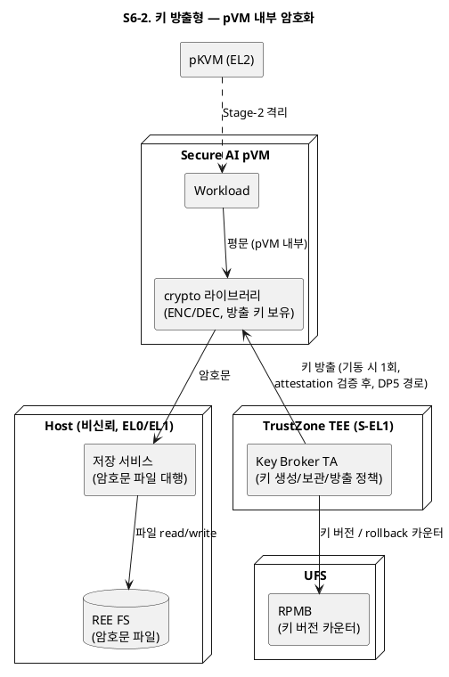
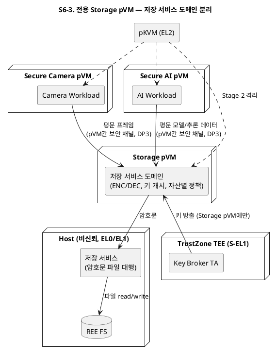
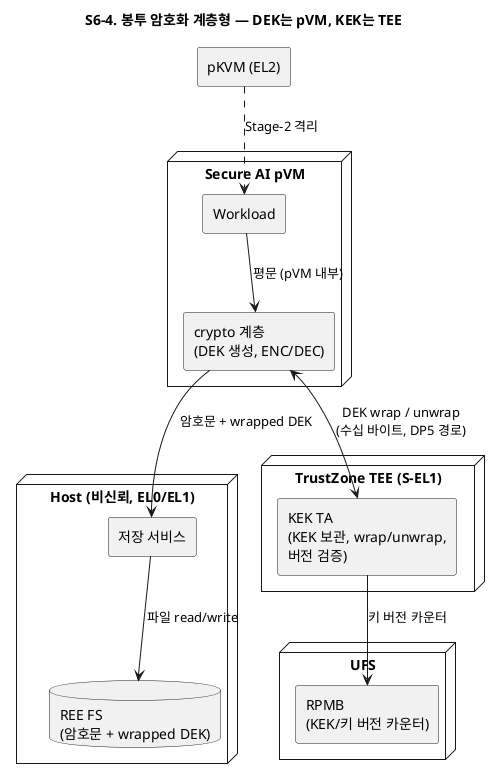
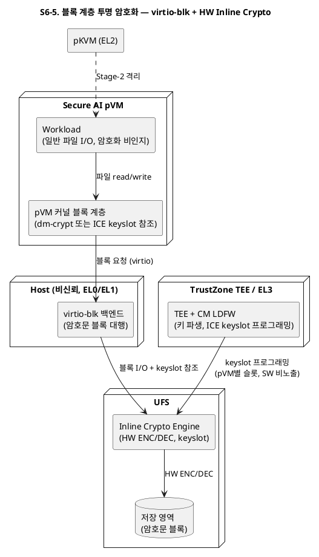

# DP6. 보안(기밀성)을 위한 Secure Storage 구조 — 문제 정의와 후보 구조

> 본 문서는 `05_decision_points.md`의 DP6(Secure Storage 구조 설계)에 대해, 후보 구조 도출에 앞서 문제를 정의하고 후보 구조 5개를 제안한다.
> 산출근거 Driver: FR-06(저장/복구 시 ENC/DEC을 Secure OS 기능과 연동), QA-01(저장 상태 기밀성), QA-02(실시간 파이프라인 성능), CS-03(GP 표준/TrustZone 자산 호환)
> 선행 DP: DP5(TrustZone 연동 구조 — pVM→TEE 경로), DP2(보안 Workload 실행 방식 — 복호화 시점)
> 배경 기술 정리: `99_secure_storage.md`(GP Trusted Storage / RPMB 동작 방식)

---

## 목차

1. [문제 정의](#1-문제-정의)
2. [후보 구조](#2-후보-구조)
   - [S6-1. TEE 위임형 — GP Trusted Storage 직접 사용](#s6-1-tee-위임형--gp-trusted-storage-직접-사용)
   - [S6-2. 키 방출형 — pVM 내부 암호화](#s6-2-키-방출형--pvm-내부-암호화)
   - [S6-3. 전용 Storage pVM — 저장 서비스 도메인 분리](#s6-3-전용-storage-pvm--저장-서비스-도메인-분리)
   - [S6-4. 봉투 암호화 계층형 — DEK는 pVM, KEK는 TEE](#s6-4-봉투-암호화-계층형--dek는-pvm-kek는-tee)
   - [S6-5. 블록 계층 투명 암호화 — 가상 블록 디바이스 + HW Inline Crypto](#s6-5-블록-계층-투명-암호화--가상-블록-디바이스--hw-inline-crypto)
3. [후보 비교 요약](#3-후보-비교-요약)
4. [설계질문별 후보 대응](#4-설계질문별-후보-대응)

---

## 1. 문제 정의

### 1.1 전제

Secure Vision AI 파이프라인의 보호 자산(캡처 영상, AI 모델 가중치, 추론 결과, Workload 패키지)은 실행 중에는 pKVM Stage-2 격리로 보호된다. 그러나 저장 매체(UFS/eMMC)와 파일시스템은 **비신뢰 Host가 관리**하므로, 자산이 평문으로 저장되는 순간 Host 침해 한 번으로 전체가 노출된다(QA-01). 저장 상태(data at rest)의 기밀성은 메모리 격리와 별개로 확보해야 하며, 이때 다음이 성립해야 한다.

- **암호문 저장은 Host에 맡기되, 키와 평문은 Host에 닿지 않는다.** Host의 저장 서비스는 신뢰 대상이 아닌 전달자(untrusted servant)여야 한다 — 이는 기존 TrustZone Trusted Storage/RPMB 구조가 이미 따르는 원칙이다(`99_secure_storage.md` 3절).
- 키의 신뢰 뿌리는 고객사가 이미 운용 중인 **TrustZone TEE의 GP 키 관리 자산**과 호환되어야 하며(CS-03), pVM이 키/암호 서비스에 접근하는 경로는 DP5에서 확정되는 pVM→TEE 연동 구조에 종속된다.

### 1.2 문제점

| ID | 문제점 | 관련 품질속성 |
|----|--------|--------------|
| P-S6-1 | **평문·키의 Host 노출 경로**: 저장 매체와 파일시스템이 비신뢰 Host 소유이므로, (a) 평문 데이터가 저장 경로 어딘가에서 Host 메모리를 경유하거나, (b) 암호화 키가 Host를 경유해 pVM으로 전달되거나, (c) 복호화 직후의 평문이 Host 가시 버퍼에 놓이면 전체 보호가 무너진다. 암호화 수행 지점과 키 전달 경로가 Host 비가시로 설계되어야 한다. | 기밀성 (QA-01, R-1) |
| P-S6-2 | **ENC/DEC 처리량의 파이프라인 잠식**: 프레임 단위 영상 암호화 저장(시나리오 8단계)과 기동 시 대용량 모델(수백 MB급) 복호화가 파이프라인 경로에 놓인다. TEE(S-EL1)는 메모리/연산 자원이 제약되어(과제 배경 4절) 대용량 데이터를 TEE로 왕복시키면 실시간 예산을 잠식하고, pVM 내 SW 암호화도 vCPU 예산을 소모한다. 암호화 수행 지점 선택이 곧 성능 예산 배분이다. | 성능 (QA-02) |
| P-S6-3 | **키 관리 신뢰 주체의 이원화 위험**: 키 생성/보관을 기존 TrustZone TEE(GP 키 관리 자산)에 두지 않고 별도 신뢰 주체를 신설하면, 키 계층의 신뢰 뿌리가 이원화되어 CC/GP 인증 자산을 재사용할 수 없고 device-unique key·RPMB 기반 rollback 방지 등 기존 HW 지원도 다시 구축해야 한다. 반대로 TEE에 모두 위임하면 P-S6-2의 성능 제약과 정면 충돌한다. | 호환성 (CS-03), 기밀성 |
| P-S6-4 | **키 수명주기와 자산 무효화**: 키를 pVM에 방출한다면 "어떤 조건(Workload 무결성 검증 결과, pVM 신원 확인)에서 방출하는가"가 정의되어야 하고, Workload 삭제/키 회전 시 이미 저장된 암호문이 확실히 무효화되어야 한다. 또한 Host가 옛 암호문으로 되돌리는 rollback 공격은 FS 암호화만으로는 막을 수 없어 RPMB 단조 카운터 같은 HW 근거와 결합해야 한다. | 기밀성 (QA-01), 운용성 |

### 1.3 해결 방향

Secure Storage 구조는 (1) 평문과 키가 Host에 닿지 않는 경계를 명시하고, (2) 대용량 데이터의 ENC/DEC 지점을 TEE 밖(pVM 또는 HW)에 두어 실시간 예산을 지키되, (3) 키의 신뢰 뿌리와 rollback 방지 근거는 기존 TEE/RPMB 자산에 두고, (4) 키 방출 조건과 폐기 절차를 Workload 수명주기(DP2)와 계약으로 묶는 구조여야 한다.

후보 구조는 **암호화 수행 지점**(TEE / Workload pVM / 전용 pVM / 블록 계층·HW)과 **키 노출 범위**(TEE 내부 유지 / pVM 방출 / 계층 분리)의 조합으로 도출한다.

---

## 2. 후보 구조

### S6-1. TEE 위임형 — GP Trusted Storage 직접 사용

- **개요**: 암호화/복호화와 키 관리를 전부 기존 TrustZone TEE에 위임한다. pVM Workload는 DP5에서 확정된 pVM→TEE 경로로 GP Trusted Storage API(persistent object)를 호출하고, TEE Storage Server가 데이터를 암호화+서명하여 REE FS(대용량) 또는 RPMB(소용량·rollback 민감 데이터)에 저장한다.
- **구성과 책임**:
  - pVM Workload: GP Client API(`libteec` 호환 표면)로 저장/복구 요청. 키·암호 연산 없음
  - TEE Storage Server: ENC/DEC, MAC 서명, 키 파생(device-unique key 기반) 전담 — 기존 자산 그대로
  - Host tzdaemon/tzdev: 암호화 blob의 REE FS 저장 대행(untrusted servant), RPMB 경로는 srpmb 드라이버가 전달자
- **동작 방식**: 저장 시 평문이 pVM→TEE로 전달되고(WSM 또는 DP5 채널), TEE가 암호화해 REE에 blob으로 내보낸다. 복구는 역방향. 키는 TEE 밖으로 한 번도 나오지 않는다.

**구조 다이어그램**

**장점 / 단점 / 트레이드오프**

- **장점**
  - 키가 TEE 밖으로 나오지 않아 키 노출면이 최소다. pVM이 침해되어도 키는 안전하고, 해당 세션의 평문만 위험 범위다(P-S6-1 최강 대응).
  - 기존 GP Trusted Storage/RPMB 자산(Storage Server, LDFW, CC 인증 범위)을 무수정 재사용한다(P-S6-3, CS-03 직접 충족). rollback 방지도 기존 RPMB 결합을 그대로 상속한다(P-S6-4).
  - Workload 개발자는 표준 GP API만 사용하므로 기존 TA/CA 자산의 후방호환이 보장된다.
- **단점**
  - 프레임 단위 영상과 대용량 모델의 평문 전체가 pVM→TEE로 왕복한다. TEE의 자원 제약(S-EL1)과 world switch 비용이 곱해져 처리량 병목이 구조에 내장된다(P-S6-2 정면 위반 위험).
  - 저장 트래픽이 모두 DP5 경로에 실리므로, DP5에서 선택된 연동 구조의 대역폭이 곧 저장 성능 상한이 된다.
- **트레이드오프**: 기밀성과 호환성의 최강 안을 얻는 대신 성능을 TEE 경로에 저당잡힌다. 설정/키/소용량 메타데이터에는 최적이지만, 영상/모델 같은 대용량 자산의 주 경로로 쓰면 QA-02와 정면 충돌한다.

### S6-2. 키 방출형 — pVM 내부 암호화

- **개요**: 키의 생성/보관은 TEE가 담당하되, pVM의 신원·무결성 검증을 조건으로 **키를 pVM에 방출(key release)** 한다. ENC/DEC은 pVM 내부에서 수행하고, 암호문 파일만 Host FS에 맡긴다. 대용량 데이터가 TEE에 닿지 않는다.
- **구성과 책임**:
  - TEE Key Broker TA: 키 생성/보관/방출 정책. pVM attestation 증거(DP2의 Workload 이미지 검증 결과, DP5의 호출 주체 확인)를 검증한 뒤에만 세션 키 방출
  - pVM 내 crypto 라이브러리: 방출받은 키로 파일/프레임 단위 ENC/DEC 수행 (vCPU의 ARMv8 Crypto Extension 활용)
  - Host 저장 서비스: 암호문 파일의 read/write만 대행 (내용 비가시)
  - RPMB: 키 버전·rollback 카운터 저장 (TEE 경유)
- **동작 방식**: pVM 기동 시 1회 키 방출(소량 데이터, DP5 경로) 후, 저장/복구의 반복 구간에는 TEE 개입이 없다. 키 회전 시 TEE가 새 키를 방출하고 구 키 버전을 RPMB 카운터로 무효화한다.

**구조 다이어그램**

**장점 / 단점 / 트레이드오프**

- **장점**
  - 반복 구간(프레임 저장, 모델 복호화)에 TEE 왕복이 없어 성능이 좋다. ENC/DEC이 pVM vCPU의 Crypto Extension으로 수행되어 처리량이 코어 성능에 비례한다(P-S6-2 해소).
  - 키 관리의 신뢰 뿌리는 여전히 TEE의 GP 자산이다(P-S6-3). DP5 경로에는 소량의 키 자료만 실리므로 DP5 대역폭 요구가 낮다.
  - 키 방출 조건이 "무결성 검증 통과"로 명시되어, DP2의 Workload 검증과 자연스럽게 계약이 맺어진다(P-S6-4).
- **단점**
  - 평문 키가 pVM 메모리에 상주한다. pVM 자체가 침해되면(Workload 취약점) 키가 노출되어 해당 키로 저장된 자산 전체가 위험해진다 — 노출 반경이 S6-1보다 넓다.
  - 키 회전/폐기가 pVM의 협조에 의존한다. pVM이 오동작하면 구 키 소거를 강제할 수단이 약해, 회전 시 재암호화 절차 설계가 추가로 필요하다.
  - attestation 근거(무엇으로 pVM 신원을 증명하는가)가 DP5·DP2 결정에 강하게 종속된다.
- **트레이드오프**: 성능을 얻는 대신 키 노출 반경을 pVM까지 넓힌다. "pVM은 Host보다 훨씬 작은 공격면"이라는 전제가 성립할 때만 정당화되므로, Workload 최소화(DP2)와 키의 수명 최소화(세션 키, 짧은 회전 주기)가 전제 조건이다.

### S6-3. 전용 Storage pVM — 저장 서비스 도메인 분리

- **개요**: 암호화 저장을 전담하는 **별도 pVM(Storage pVM)** 을 신설한다. Workload pVM들은 pVM 간 보안 채널(DP3 구조 재사용)로 저장/복구를 요청하고, Storage pVM만 TEE와 키를 교환한다. 키와 암호 연산이 Workload pVM에 들어가지 않는다.
- **구성과 책임**:
  - Storage pVM: ENC/DEC 수행, 키 캐시 보유, 자산별 저장 정책(어떤 자산을 어떤 키로) 집행, Host 저장 서비스와의 파일 입출력 창구
  - Workload pVM: 평문을 pVM 간 채널로 Storage pVM에 전달만 함. 키·암호 연산 없음
  - TEE Key Broker TA: Storage pVM에만 키 방출 (Workload pVM 대비 검증된 단일 신원)
  - Host 저장 서비스: 암호문 파일 대행
- **동작 방식**: 저장 요청 시 평문이 Workload pVM→Storage pVM으로 전달되고(공유 메모리 채널, DP3), Storage pVM이 암호화해 Host에 내보낸다. 신규 Workload 도메인이 추가되어도 키 방출 대상은 Storage pVM 하나로 고정된다.

**구조 다이어그램**

**장점 / 단점 / 트레이드오프**

- **장점**
  - 키가 Workload pVM에 들어가지 않는다. Workload가 침해되어도 키는 안전하고, 키 노출면이 "검증된 단일 도메인"으로 고정된다(P-S6-1을 S6-2보다 강하게 대응).
  - 자산별 암호화 정책·키 수명주기·폐기 절차가 한 도메인에 집중되어 감사와 회전 강제가 쉽다(P-S6-4). Workload 삭제 시 Storage pVM이 해당 자산 키를 일방적으로 폐기할 수 있다.
  - 신규 Workload 도메인 추가가 "채널 배선 추가"로 흡수되어 확장에 닫혀 있다(R-4). TEE 입장에서 키 방출 상대가 하나라 attestation 정책이 단순하다.
- **단점**
  - 평문이 pVM 간 채널을 한 홉 더 지난다. 프레임 단위 저장마다 도메인 간 복사/전환 비용이 붙어 성능이 S6-2보다 불리하다(P-S6-2 부분 위반 위험 — DP3의 zero-copy 채널 성능에 종속).
  - Storage pVM이 저장 경로의 단일 장애점이자 상주 자원(메모리/vCPU) 오버헤드다.
  - 신설 도메인이므로 기존 GP 자산 재사용 범위가 키 관리에 한정되고, Storage pVM 자체는 신규 개발이다.
- **트레이드오프**: 키 격리와 정책 집중을 얻는 대신 데이터 경로 홉과 상주 도메인 비용을 지불한다. 도메인 수가 늘수록 유리해지는 구조이므로, 레퍼런스 시나리오(2개 도메인)만 보면 과투자이고 확장 로드맵을 근거로 정당화해야 한다.

### S6-4. 봉투 암호화 계층형 — DEK는 pVM, KEK는 TEE

- **개요**: 키를 2계층으로 나눈다. 데이터 암호화 키(DEK)는 pVM이 자산/세션 단위로 생성해 ENC/DEC에 사용하고, DEK 자체는 TEE가 보관하는 키 암호화 키(KEK)로 감싸(wrap) 암호문과 함께 Host에 저장한다. 복구 시 pVM은 wrapped DEK를 TEE에 보내 검증 조건 하에 unwrap 받는다(봉투 암호화, envelope encryption).
- **구성과 책임**:
  - pVM crypto 계층: DEK 생성(자산 단위), 데이터 ENC/DEC, wrapped DEK를 암호문 헤더에 포함
  - TEE KEK TA: KEK 보관(디바이스 바인딩, TEE 밖 비노출), wrap/unwrap 서비스 제공. unwrap 시 pVM attestation과 키 버전(RPMB 카운터) 검증
  - Host 저장 서비스: "암호문 + wrapped DEK" 파일 대행
- **동작 방식**: 저장 반복 구간은 pVM 내부에서 완결되고(S6-2와 동일한 성능), TEE에는 자산 열람 시점마다 wrapped DEK(수십 바이트)의 unwrap 요청만 간다. **KEK 하나를 폐기하면 그 KEK로 감싼 모든 DEK가 일괄 무효화**되어, Workload 삭제/폐기 시 저장 자산 전체를 즉시 무효화할 수 있다.

**구조 다이어그램**

**장점 / 단점 / 트레이드오프**

- **장점**
  - 성능은 S6-2와 동급(반복 구간 TEE 미개입)이면서, 장기 키(KEK)는 TEE 밖으로 나오지 않는다. pVM 침해 시 노출 범위가 "현재 unwrap된 DEK가 가리는 자산"으로 국한된다(P-S6-1과 P-S6-2의 균형점).
  - 키 폐기가 구조적으로 강력하다 — KEK 폐기 한 번으로 관련 저장 자산 전체가 복구 불능이 되어, Workload 삭제 시 자산 무효화 요구(P-S6-4)를 pVM 협조 없이 TEE가 단독 보장한다.
  - wrapped DEK 열람마다 TEE 검증(버전 카운터 포함)이 개입하므로 키 회전·rollback 방지가 자연스럽게 경로에 내장된다. AVF/업계의 secure storage 관행(계층 키)과도 부합한다.
- **단점**
  - 키 계층·wrap 포맷·버전 관리라는 신규 설계 요소가 추가되어 5개 후보 중 프로토콜 복잡도가 가장 높다. 기존 GP Trusted Storage API 표면과는 다른 커스텀 계약이므로 Workload 측 라이브러리 제공이 필요하다.
  - 자산 열람 시점마다 unwrap 왕복이 발생한다(소량이지만 DP5 경로 지연에 종속). DEK가 unwrap된 동안은 S6-2와 동일한 pVM 내 키 상주 위험이 있다.
- **트레이드오프**: 복잡도를 지불하고 성능·기밀성·폐기 보장의 균형을 산다. S6-2의 정교화 버전이므로, 키 폐기/회전 요구가 강할수록(고객 자산 회수 계약 등) 추가 복잡도가 정당화된다.

### S6-5. 블록 계층 투명 암호화 — 가상 블록 디바이스 + HW Inline Crypto

- **개요**: 파일 단위가 아니라 **블록 계층에서 투명하게** 암호화한다. pVM에 전용 가상 블록 디바이스(virtio-blk)를 제공하고, 그 파티션의 모든 블록을 pVM 커널의 dm-crypt 또는 스토리지 컨트롤러의 HW Inline Crypto Engine(ICE)으로 암호화한다. ICE 사용 시 키는 TEE/LDFW가 HW keyslot에 직접 프로그래밍하여 SW 어디에도 노출되지 않는다.
- **구성과 책임**:
  - pVM 커널 블록 계층: 가상 블록 디바이스 위 파일시스템. dm-crypt 모드에서는 pVM 커널이 ENC/DEC, ICE 모드에서는 keyslot 참조만 전달
  - TEE/LDFW: 디바이스 바인딩 키 파생, ICE keyslot 프로그래밍(pVM별 슬롯 격리), 키 버전 관리
  - Host virtio 백엔드: 암호문 블록의 실 매체 입출력 대행 (내용 비가시)
- **동작 방식**: Workload는 일반 파일 입출력만 수행하고 암호화를 인지하지 않는다(수정 0). 블록이 pVM을 떠나는 시점에 이미 암호문이므로 Host 백엔드는 자동으로 untrusted servant가 된다.

**구조 다이어그램**

**장점 / 단점 / 트레이드오프**

- **장점**
  - Workload 수정이 0이다 — 기존 파일 I/O 코드가 그대로 동작하므로 도메인 추가 수용 비용이 가장 낮다(R-4).
  - ICE 모드에서는 ENC/DEC이 스토리지 HW 라인 속도로 수행되고 CPU를 소모하지 않아 성능이 5개 후보 중 최고이며(P-S6-2 최강 대응), 키가 SW 어디에도 평문으로 존재하지 않는다(keyslot은 커스텀 SoC의 HW 자산 — CS-05 활용).
  - 블록 전체가 일괄 암호화되어 "암호화 대상 누락"이라는 운용 실수가 원천 차단된다.
- **단점**
  - 파티션/디바이스 단위 키여서 자산별(모델 vs 영상 vs 추론 결과) 키 분리·개별 폐기가 어렵다. 세분화하려면 pVM별·용도별 가상 디스크를 늘려야 한다(P-S6-4 부분 미해결).
  - 블록 암호화는 기밀성 중심이라 무결성·rollback 방지가 없다 — Host가 옛 블록 이미지로 되돌리는 공격은 별도 계층(dm-verity/해시 트리 + RPMB 카운터)을 얹어야 막힌다.
  - ICE keyslot 관리(pVM별 슬롯 격리, virtio 경유 keyslot 참조 전달)는 SoC HW와 hypervisor 협조가 필요한 신규 설계이며 HW 종속성이 가장 크다. dm-crypt 폴백 시 성능 이점이 사라진다.
- **트레이드오프**: 투명성과 HW 성능을 얻는 대신 자산 단위 키 정책과 rollback 방지를 별도로 보강해야 한다. "커스텀 SoC이므로 ICE/keyslot을 설계에 반영할 수 있다"는 본 과제의 HW 협조 여지가 성립할 때 가장 강력해지는 안이다.

---

## 3. 후보 비교 요약

| 구분 | S6-1 TEE 위임 | S6-2 키 방출 | S6-3 Storage pVM | S6-4 봉투 암호화 | S6-5 블록 투명 암호화 |
|------|-------------|-------------|-----------------|----------------|---------------------|
| ENC/DEC 수행 지점 | TEE | Workload pVM | 전용 pVM | Workload pVM | pVM 커널 또는 HW(ICE) |
| 키 노출 범위 | TEE 내부만 | pVM에 raw 키 | Storage pVM만 | pVM에 DEK만(KEK는 TEE) | SW 비노출(ICE) / pVM 커널(dm-crypt) |
| 기밀성 (P-S6-1) | 상 | 중 | 상 | 중상 | 상(ICE) |
| 성능 (P-S6-2) | 하 (TEE 왕복) | 상 | 중 (pVM간 홉) | 상 | 최상 (HW 라인 속도) |
| GP/TEE 자산 재사용 (P-S6-3) | 최상 (무수정) | 상 (키 관리) | 중 (키 관리만) | 중 (커스텀 계약) | 중 (키 파생/LDFW) |
| 키 폐기·rollback (P-S6-4) | 상 (기존 상속) | 중 (pVM 협조 필요) | 상 (정책 집중) | 최상 (KEK 일괄 폐기) | 하 (별도 보강 필요) |
| 자산별 키 세분화 | 객체 단위 | 파일/세션 단위 | 자산 단위(정책 집중) | 자산 단위(DEK) | 파티션 단위 |
| Workload 수정 부담 | GP API 사용 | crypto 라이브러리 | 채널 클라이언트 | crypto 라이브러리 | 없음 |
| 신규 개발 규모 | 소 (경로만) | 중 | 대 (도메인 신설) | 중대 (키 계층) | 대 (HW 협조) |
| DP5 경로 부하 | 대용량 데이터 전체 | 키 자료(기동 시) | 키 자료(Storage pVM) | wrapped DEK(열람 시) | keyslot 제어 |

## 4. 설계질문별 후보 대응

`05_decision_points.md` DP6의 설계질문 3개에 대한 각 후보의 답을 정리한다.

| 설계질문 | S6-1 | S6-2 | S6-3 | S6-4 | S6-5 |
|---------|------|------|------|------|------|
| 암호화 대상과 수행 지점 | 자산별 객체를 TEE에서 | 자산별 파일을 pVM에서 | 자산별로 Storage pVM에서 | 자산별 DEK로 pVM에서 | 파티션 전체를 블록 계층에서 |
| 키 생성/보관 주체와 방출 조건 | TEE 보관, 방출 없음 | TEE 생성, 무결성 검증 후 pVM 방출 | TEE 생성, Storage pVM에만 방출 | KEK는 TEE 고정, DEK는 검증 후 unwrap | TEE/LDFW가 keyslot에 직접 주입, SW 방출 없음 |
| 키 폐기·자산 무효화 | GP 객체 삭제 + RPMB | 키 버전 카운터 + 재암호화 | Storage pVM 정책으로 일괄 | KEK 폐기로 일괄 무효화 | 파티션 키 폐기(전체 단위) |

### 후보 조합 여지

후보들은 자산 유형별로 상호 배타적이지 않다. 실무적으로 유력한 조합은 다음과 같으며, 조합 선택은 후속 비교평가에서 다룬다.

- **소용량·고민감 데이터**(키 자료, 설정, rollback 카운터)는 S6-1(GP Trusted Storage + RPMB)로, **대용량 스트림/모델**은 S6-4 또는 S6-5로 나누는 2-트랙 구성
- S6-5(블록 투명 암호화)를 기본 방어선으로 깔고, 자산별 폐기가 필요한 데이터만 S6-4(봉투 암호화)를 중첩하는 심층 방어 구성
