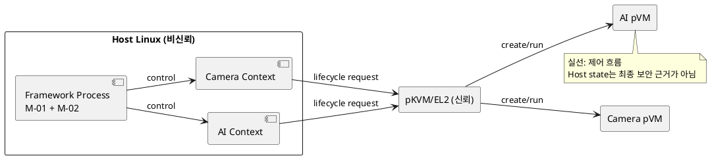
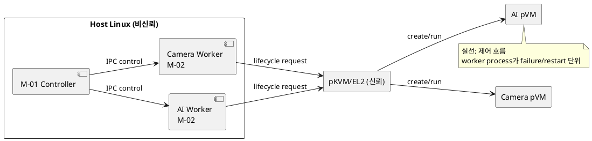

# DP-01. pVM 실행 failure containment 경계

## 1. 상태

**후보 작성**

## 2. 결정 목적

비신뢰 Host의 관리 process에서 한 pVM의 hang이나 crash가 다른 pVM의 제어 흐름을
같이 멈추지 않도록 M-01과 M-02의 실행 격리 단위를 정한다.

## 3. 문제 상황

01 문서 §2.2는 Camera와 AI pVM의 독립적 동시 운용을 요구한다. §4.3은 한 pVM의
장애가 다른 pVM이나 Host로 전파되지 않아야 한다고 규정한다. M-01과 M-02는 Host
EL0 process에 배치될 수 있지만 process 구조는 정하지 않았다.

여러 pVM 제어 흐름을 하나의 event loop와 heap에서 실행하면 한 context의 무한
대기, memory corruption 또는 blocking I/O가 다른 context를 지연시킬 수 있다.
반대로 pVM별 process를 두면 failure boundary는 선명해지지만 process, IPC와 시작
비용이 증가한다. Host kernel 자체의 악의적 서비스 거부는 두 후보 모두 막지 못하며,
이번 결정은 guest 또는 Framework 결함의 전파 범위를 다룬다.

- 요구 추적: 01 §2.2, §4.3, §5
- 관련 모듈: M-01, M-02
- baseline: Host와 Host kernel은 비신뢰다. 실제 pVM memory 격리는 EL2가 집행한다.
- project-custom: Host 관리 process의 failure containment 구조

## 4. 결정 질문

pVM별 제어 실행을 하나의 process 안에서 context로 분리할 것인가, controller와
pVM별 worker process로 분리할 것인가?

## 5. 후보 구조

### 5.1 후보 A: 단일 process의 pVM별 context

M-01과 M-02를 하나의 Host process에 두고 pVM별 queue, state와 timeout context를
분리한다. process가 lifecycle handle을 소유하며 EL2의 generation 검증 결과를
따른다.

- 장점: IPC와 process 생성 비용이 작고 공통 상태 조회가 단순하다.
- 단점: process-level crash와 공용 event loop 정체가 모든 pVM 제어에 전파된다.

### 5.2 후보 B: controller와 pVM별 worker process

M-01 controller는 요청 route만 담당하고 M-02 worker를 pVM별 process로 실행한다.
각 worker가 자기 pVM handle과 queue를 소유하며 controller는 worker 재시작을
조정한다.

- 장점: worker crash와 blocking이 다른 pVM worker에 직접 전파되지 않는다.
- 단점: IPC, process 수, memory와 cold-start 비용이 증가한다.

## 6. 후보별 구조 다이어그램

### 6.1 후보 A

### 6.2 후보 B

## 7. 후보별 동작 구조

### 7.1 후보 A

1. M-01이 요청을 대상 pVM context queue에 넣는다.
2. 공통 process가 queue를 실행하고 lifecycle request를 EL2로 보낸다.
3. context 오류는 timeout과 state machine으로 격리한다.
4. process가 crash하면 모든 context를 중단하고 protected actual state와 대조한다.

### 7.2 후보 B

1. M-01이 대상 worker에 IPC request를 보낸다.
2. worker가 자기 lifecycle handle로 EL2 request를 수행한다.
3. worker가 crash하면 controller는 해당 worker만 재생성한다.
4. 재생성 worker는 protected actual state와 generation을 대조한 뒤 재개한다.

## 8. 품질속성 비교

승인된 QAS와 수치 예산이 없으므로 별점은 작성하지 않는다. 이후 같은 pVM 수,
동일 부하와 동일 fault injection으로 장애 격리, 시작 지연과 memory 사용량을
비교해야 한다.

## 9. 핵심 트레이드오프

process를 분리하면 Framework 결함의 전파 범위가 줄어 가용성이 높아질 수 있다.
대신 IPC, process memory와 pVM 시작 경로가 늘어 성능과 자원 효율이 낮아질 수 있다.

## 10. 검증 기준

- 한 worker/context hang과 crash를 주입하고 다른 pVM 제어 지연을 측정한다.
- cold start와 steady-state CPU/memory 사용량을 같은 조건에서 측정한다.
- 재시작 뒤 stale handle과 generation이 거부되는지 확인한다.
- Host process 전체 종료 뒤 protected resource가 회수되는지 확인한다.

## 11. 검토 결과

사용자 검토 전이다.

## 12. 최종 결정

