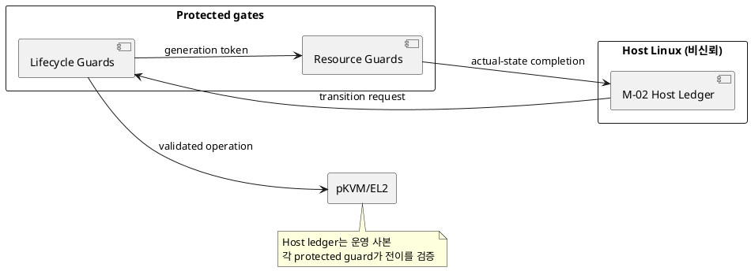
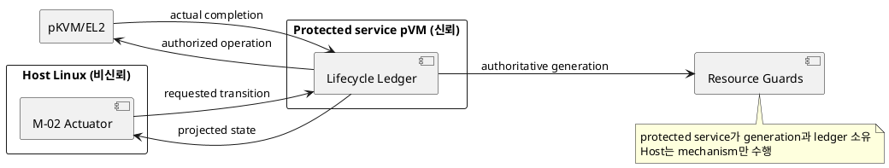

# DP-02. pVM lifecycle ledger 소유권

## 1. 상태

**후보 작성**

## 2. 결정 목적

pVM identity와 generation의 authoritative lifecycle state를 비신뢰 Host와 보호
경계 사이 어디에 둘지 정한다.

## 3. 문제 상황

01 문서 §3은 pVM identity와 generation을 모든 권한과 자원 수명에 결합하도록
요구한다. M-02는 lifecycle ledger를 관리하고 M-06, M-07, M-08, M-10, M-11,
M-12는 그 identity를 권한 판단과 회수에 사용한다. 그러나 M-02의 Host controller가
보관한 state는 Host 침해 시 위조, 재생 또는 순서 변경될 수 있다.

Host ledger를 운영 상태의 중심으로 유지하면 조회와 기존 Linux 연동은 단순하다.
대신 모든 protected gate가 transition token과 actual state를 독립 검증해야 한다.
protected lifecycle service가 ledger를 소유하면 generation 일관성은 높아지지만
bootstrap, 가용성, 메모리와 TCB가 늘어난다.

- 요구 추적: 01 §2.2, §3, §4.3, §5
- 관련 모듈: M-02, M-06 및 모든 generation 소비 모듈
- baseline: Host state만으로 실제 권한을 확정하지 않는다.
- project-custom: lifecycle ledger의 authoritative owner와 transition protocol
- 선행 DP: DP-01

## 4. 결정 질문

Host가 lifecycle ledger를 관리하고 protected gate가 각 전이를 검증할 것인가,
protected lifecycle service가 ledger와 generation 발급을 소유할 것인가?

## 5. 후보 구조

### 5.1 후보 A: Host ledger와 분산 protected transition guard

M-02 Host controller가 상태 원장을 관리한다. 각 protected resource gate는 이전
generation, 허용 전이와 실제 상태를 확인하고 non-forgeable completion을 반환한다.

- 장점: 조회와 Linux lifecycle mechanism 연결이 단순하고 추가 protected service가 없다.
- 단점: guard 간 state reconciliation이 복잡하며 Host가 상태를 누락시킬 수 있다.

### 5.2 후보 B: protected lifecycle service ledger

별도 protected service pVM이 generation을 발급하고 lifecycle ledger를 소유한다.
Host M-02는 create/run/stop mechanism을 수행하는 actuator이며 결과를 service에
보고한다.

- 장점: 모든 자원이 같은 protected generation source를 참조한다.
- 단점: service bootstrap과 장애 복구가 필요하고 protected TCB와 호출 경로가 늘어난다.

## 6. 후보별 구조 다이어그램

### 6.1 후보 A

### 6.2 후보 B

## 7. 후보별 동작 구조

### 7.1 후보 A

1. Host ledger가 현재 generation을 포함한 전이를 요청한다.
2. 대상 protected guard가 이전 completion과 actual state를 검증한다.
3. guard가 전이를 집행하고 새 generation completion을 반환한다.
4. 장애 시 M-04가 모든 guard completion을 모아 Host ledger를 재구성한다.

### 7.2 후보 B

1. lifecycle service가 새 generation과 transition transaction을 연다.
2. Host actuator가 pKVM mechanism을 호출한다.
3. service는 EL2 completion을 받은 뒤에만 ledger를 commit한다.
4. 장애 시 service ledger와 resource actual state를 대조해 미완료 전이를 닫는다.

## 8. 품질속성 비교

승인된 수치가 없어 평가를 보류한다. 보안성, lifecycle 조회/전이 지연, protected
memory, bootstrap 실패 영향과 reconciliation 복잡도를 같은 시나리오에서 측정한다.

## 9. 핵심 트레이드오프

protected service가 ledger를 소유하면 Host state 위조에 대한 일관성이 높아진다.
대신 새로운 보호 서비스의 bootstrap, 장애 반경과 TCB가 증가한다.

## 10. 검증 기준

- lifecycle request 재생, 순서 변경과 generation 위조를 주입한다.
- 각 resource가 동일 generation만 승인하는지 확인한다.
- ledger/service 장애 뒤 actual state 재구성 가능 여부를 검증한다.
- protected lifecycle service의 부팅 순환 의존성과 fail-closed 동작을 PoC로 확인한다.

## 11. 검토 결과

사용자 검토 전이다.

## 12. 최종 결정

