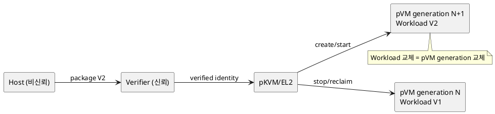
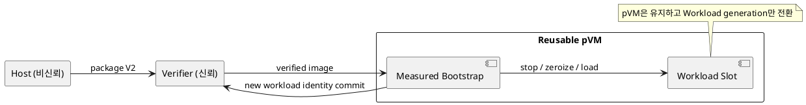

# DP-03. Workload와 pVM 수명 결합

## 1. 상태

**후보 작성**

## 2. 결정 목적

Workload identity와 version이 바뀔 때 pVM generation을 함께 교체할지, 검증된
bootstrap을 유지한 채 Workload만 교체할지 정한다.

## 3. 문제 상황

01 문서 §2.2와 §4.1은 검증된 Workload의 동적 탑재를 요구한다. 동시에 identity와
generation을 모든 권한, 저장소와 자원 수명에 결합해야 한다. Workload/version마다
새 pVM을 만들면 격리와 상태 소거는 명확하지만 cold start와 memory 비용이 커진다.
장수 pVM에서 Workload를 hot-load하면 시작 비용은 줄지만 이전 Workload의 memory,
session, key와 device state를 완전히 끊는 measured transition이 필요하다.

- 요구 추적: 01 §2.2, §3, §4.1-9, §4.3, §5
- 관련 모듈: M-02, M-05, M-10, M-11, M-12
- baseline: 검증 실패 또는 freshness 미확인 Workload는 실행하지 않는다.
- project-custom: Workload identity와 pVM generation의 수명 결합 방식
- 선행 DP: DP-01, DP-02

## 4. 결정 질문

Workload 또는 version마다 새 pVM generation을 만들 것인가, 재사용 pVM 안에서
measured hot-load transition으로 Workload를 교체할 것인가?

## 5. 후보 구조

### 5.1 후보 A: Workload/version별 ephemeral pVM

package identity마다 새 pVM generation을 생성한다. 종료 시 memory, channel,
session과 HW lease를 회수한 뒤 persistent ciphertext만 새 generation에 재연결한다.

- 장점: Workload 사이 상태 잔류와 권한 혼동을 pVM 경계로 차단한다.
- 단점: 생성, 부팅, 검증과 자원 예약 비용이 반복된다.

### 5.2 후보 B: reusable pVM과 measured hot-load

검증된 bootstrap pVM을 유지하고 Workload slot을 교체한다. bootstrap이 이전 slot을
zeroize하고 새 image measurement와 identity를 protected authority에 commit한 뒤
실행한다.

- 장점: pVM cold start와 guest 초기화 비용을 줄일 수 있다.
- 단점: 완전한 상태 소거, session 재결합과 transition rollback 처리가 복잡하다.

## 6. 후보별 구조 다이어그램

### 6.1 후보 A

### 6.2 후보 B

## 7. 후보별 동작 구조

### 7.1 후보 A

1. package를 검증하고 새 pVM generation을 예약한다.
2. 이전 generation의 자원 회수를 완료한다.
3. 새 pVM을 부팅하고 persistent namespace를 identity로 attach한다.
4. 부팅 또는 attach 실패 시 새 generation을 폐기한다.

### 7.2 후보 B

1. bootstrap이 현재 Workload를 정지하고 모든 adapter를 quiesce한다.
2. memory, key handle과 session을 zeroize/revoke한다.
3. 새 package를 검증하고 Workload generation을 commit한다.
4. 어느 단계든 실패하면 이전 Workload를 재개하지 않고 fail-closed한다.

## 8. 품질속성 비교

평가 수치와 별점은 보류한다. 시작 지연, protected memory, 잔류 상태 0건, 실패 시
복구 범위와 신규 package 탑재 시 core 변경량을 공통 조건에서 비교해야 한다.

## 9. 핵심 트레이드오프

ephemeral pVM은 Workload 간 상태 경계를 단순하게 만들지만 시작 시간과 자원 비용을
늘린다. reusable pVM은 시작 비용을 줄일 수 있지만 measured transition과 완전한
상태 소거의 검증 범위를 늘린다.

## 10. 검증 기준

- Workload 교체 뒤 이전 memory, key, session과 device handle 접근을 시험한다.
- cold/warm 교체 지연과 peak memory를 같은 package로 측정한다.
- 교체 단계마다 전원 차단과 crash를 주입하고 fail-closed 여부를 확인한다.
- 저장 namespace가 새 identity에 잘못 연결되지 않는지 검증한다.

## 11. 검토 결과

사용자 검토 전이다.

## 12. 최종 결정

