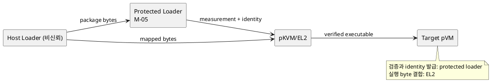
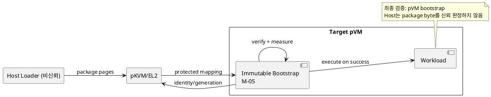

# DP-04. Workload 최종 검증 경계

## 1. 상태

**후보 작성**

## 2. 결정 목적

Host가 전달한 package의 image, manifest, signature, version과 freshness를 어느
보호 경계가 최종 검증하고 실행 가능한 identity로 만들지 정한다.

## 3. 문제 상황

01 문서 §4.1-9는 검증 실패 또는 freshness 미확인 Workload의 실행을 금지한다.
M-05는 Host loader, pVM bootstrap, protected service 또는 EL2에 분해될 수 있다.
비신뢰 Host가 검증 결과와 실행 byte를 바꿀 수 있으므로 검증한 byte, measurement,
identity와 generation이 최종 실행 시점까지 결합되어야 한다.

공통 protected loader는 정책과 검증 구현을 한곳에 모을 수 있지만 큰 parser와
crypto code가 공통 TCB에 들어간다. pVM 내부 검증은 Workload 종류별 확장에 유리하지만
각 pVM의 immutable bootstrap과 결과 binding을 검증해야 한다.

- 요구 추적: 01 §2.2, §4.1-4/9, §4.3, §5
- 관련 모듈: M-05, M-06, M-02
- baseline: Host 검증 결과만으로 실행을 승인하지 않는다.
- project-custom: 최종 verifier의 실행 위치와 executable identity 생성 책임
- 선행 DP: DP-01, DP-02

## 4. 결정 질문

공통 protected loader가 pVM 밖에서 최종 검증할 것인가, immutable measured
bootstrap이 각 pVM 안에서 최종 검증할 것인가?

## 5. 후보 구조

### 5.1 후보 A: 공통 protected loader의 사전 검증

protected service pVM의 loader가 package를 검증하고 executable measurement와
identity capability를 발급한다. EL2는 같은 byte가 대상 pVM에 매핑됐는지 확인한다.

- 장점: 정책과 verifier를 한곳에서 갱신하고 중복 구현을 줄인다.
- 단점: parser와 package별 로직이 공통 protected TCB와 장애 반경에 들어간다.

### 5.2 후보 B: pVM measured bootstrap의 내부 검증

각 pVM의 immutable bootstrap이 package byte를 받은 뒤 검증하고, 측정 결과를
generation과 결합한다. Host는 byte 운반만 담당한다.

- 장점: verifier 결함을 해당 pVM에 격리하고 Workload별 adapter를 수용하기 쉽다.
- 단점: bootstrap 중복, 시작 비용과 verifier 일관성 관리가 증가한다.

## 6. 후보별 구조 다이어그램

### 6.1 후보 A

### 6.2 후보 B

## 7. 후보별 동작 구조

### 7.1 후보 A

1. Host가 package byte와 metadata를 protected loader에 전달한다.
2. loader가 signature, manifest, version과 freshness를 검증한다.
3. loader와 EL2가 measurement를 실제 매핑 byte와 결합한다.
4. 불일치 또는 timeout 시 매핑을 회수하고 실행을 거부한다.

### 7.2 후보 B

1. EL2가 package page를 대상 pVM bootstrap에만 매핑한다.
2. bootstrap이 package 전체를 검증하고 measurement를 만든다.
3. 검증 성공을 generation과 결합한 뒤 Workload entry로 이동한다.
4. 실패 시 page와 임시 key를 zeroize하고 pVM을 중단한다.

## 8. 품질속성 비교

승인된 threshold가 없어 평가를 보류한다. 동일 package corpus로 검증 지연, parser
TCB, verifier update 범위, 실패 격리와 byte-swap 공격 차단 여부를 비교한다.

## 9. 핵심 트레이드오프

공통 loader는 검증 정책의 일관성과 중복 감소에 유리하지만 공통 protected TCB를
늘린다. pVM 내부 verifier는 결함 격리와 확장에 유리하지만 시작 비용과 구현 중복을
늘린다.

## 10. 검증 기준

- 검증 뒤 실행 전 byte swap, manifest mismatch와 version rollback을 주입한다.
- 같은 package corpus의 검증 시간과 peak protected memory를 측정한다.
- malformed package fuzzing으로 fault containment 범위를 확인한다.
- pKVM의 protected loading/measurement 연동 가능성을 platform PoC로 확인한다.

## 11. 검토 결과

사용자 검토 전이다.

## 12. 최종 결정

