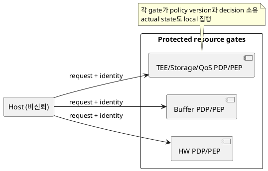
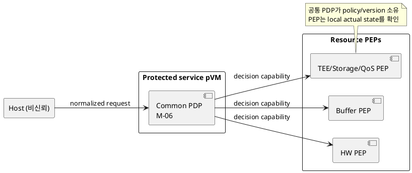

# DP-05. 보호 권한 정책 소유권

## 1. 상태

**후보 작성**

## 2. 결정 목적

pVM lifecycle, Workload, buffer, HW, TEE, storage와 runtime resource 요청의 최종
allow/deny 정책을 분산할지 공통 protected authority에 모을지 정한다.

## 3. 문제 상황

01 문서 §3은 Host 판단만으로 최종 보안 허가를 확정하지 않도록 요구한다. M-06은
verified subject, action, resource, context와 policy version으로 판정해야 하지만
실행 위치는 EL2, TEE 또는 protected service pVM 후보로 열려 있다.

각 resource gate가 자기 정책을 소유하면 local state와 가까워 호출 지연과 장애
전파를 줄일 수 있다. 그러나 policy version과 identity 해석이 달라지면 침해된
Host가 가장 약한 경로를 선택할 수 있다. 공통 PDP는 일관성을 높이지만 중앙 장애
지점과 protected service TCB를 만든다.

- 요구 추적: 01 §2.2, §3, §4.3, §5
- 관련 모듈: M-06, M-07, M-08, M-09, M-10, M-11, M-12
- baseline: 모든 실제 resource gate는 protected PEP로 최종 상태를 집행한다.
- project-custom: policy decision과 version의 authoritative owner
- 선행 DP: DP-02, DP-04

## 4. 결정 질문

각 protected resource gate가 자기 정책을 분산 소유할 것인가, 공통 protected
PDP가 전체 resource policy를 소유할 것인가?

## 5. 후보 구조

### 5.1 후보 A: resource gate별 분산 PDP

buffer, HW, TEE, storage와 QoS gate가 공통 identity contract를 사용하되 각자의
policy, version과 decision cache를 소유한다.

- 장점: local actual state를 바로 사용하고 한 PDP 장애의 전역 영향을 줄인다.
- 단점: policy 배포, version 정렬과 cross-resource transaction 일관성이 복잡하다.

### 5.2 후보 B: 공통 protected PDP

protected service pVM의 M-06이 전체 policy와 version을 소유한다. 각 resource PEP는
signed/capability decision과 local actual state를 함께 확인해 집행한다.

- 장점: 동일 subject와 policy version으로 cross-resource 결정을 일관되게 만든다.
- 단점: PDP 호출 지연, 가용성 의존과 공통 protected TCB가 증가한다.

## 6. 후보별 구조 다이어그램

### 6.1 후보 A

### 6.2 후보 B

## 7. 후보별 동작 구조

### 7.1 후보 A

1. request가 대상 resource gate로 전달된다.
2. gate가 verified identity, local context와 자기 policy version을 확인한다.
3. 같은 gate가 allow/deny와 실제 변경을 수행한다.
4. 장애 시 resource별 ledger와 policy version을 독립 복구한다.

### 7.2 후보 B

1. request를 공통 형식으로 PDP에 전달한다.
2. PDP가 policy version과 context로 decision capability를 발급한다.
3. PEP가 capability와 actual resource state를 확인하고 집행한다.
4. PDP 장애 또는 stale version이면 새 권한 부여를 fail-closed한다.

## 8. 품질속성 비교

수치 평가는 보류한다. policy divergence 공격, decision 지연, PDP 장애 영향,
protected code/memory와 신규 resource 추가 변경량을 공통 조건에서 비교한다.

## 9. 핵심 트레이드오프

공통 PDP는 정책 일관성과 감사 가능성을 높이지만 중앙 장애 의존과 TCB를 늘린다.
분산 PDP는 local latency와 장애 격리에 유리하지만 policy drift와 cross-resource
불일치 위험을 늘린다.

## 10. 검증 기준

- 서로 다른 policy version과 identity encoding을 resource별로 주입한다.
- PDP/gate 장애 시 기존 lease와 신규 grant의 fail-closed 동작을 확인한다.
- decision latency와 protected memory/code 증가량을 측정한다.
- 신규 resource policy 추가 시 변경되는 component 수를 비교한다.

## 11. 검토 결과

사용자 검토 전이다.

## 12. 최종 결정
