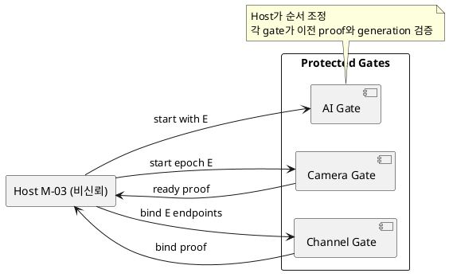
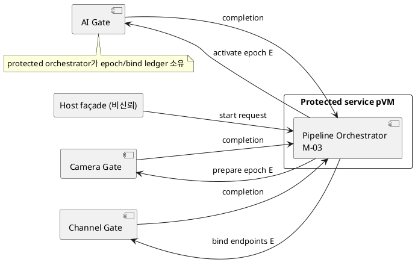

# DP-06. pipeline epoch와 endpoint bind authority

## 1. 상태

**후보 작성**

## 2. 결정 목적

Camera와 AI pVM의 service-ready 순서, pipeline epoch와 endpoint bind/rebind 상태를
Host가 조정할지 보호 경계가 소유할지 정한다.

## 3. 문제 상황

01 문서 §2.3은 검증된 Camera와 AI Workload를 시작하고 frame을 승인된 AI
domain에 전달하도록 요구한다. M-03은 dependency, pipeline epoch, endpoint
bind/rebind와 service-ready 순서를 관리한다. 비신뢰 Host가 정상 순서를 바꾸거나
이전 endpoint를 새 generation에 연결하면 데이터가 잘못된 domain으로 전달될 수 있다.

Host가 순서를 조정하고 각 protected gate가 전환을 검증하면 Linux 연동과 장애
처리가 단순하다. protected orchestrator가 epoch 전체를 소유하면 multi-resource
commit은 명확하지만 공통 보호 서비스와 추가 control hop이 생긴다.

- 요구 추적: 01 §2.2, §2.3, §3, §4.3, §5
- 관련 모듈: M-03, M-06, M-07, M-02
- baseline: Camera→AI의 2-domain topology만 다룬다.
- project-custom: 정상 pipeline epoch와 endpoint binding의 authoritative owner
- 선행 DP: DP-02, DP-04, DP-05

## 4. 결정 질문

Host orchestrator가 순서와 binding을 조정하고 protected gate가 각 전이를 검증할
것인가, protected pipeline orchestrator가 epoch와 binding을 소유할 것인가?

## 5. 후보 구조

### 5.1 후보 A: Host 조정과 protected 단계별 검증

Host M-03이 Camera-ready, channel bind, AI-ready 순서를 실행한다. 각 protected
authority는 generation과 이전 단계 completion을 확인한 뒤 자기 전이만 승인한다.

- 장점: 기존 관리 API와 Linux event 처리가 단순하고 중앙 protected service가 없다.
- 단점: 단계 사이 원자성이 약하고 reconciliation protocol이 복잡하다.

### 5.2 후보 B: protected pipeline orchestrator

protected service pVM의 M-03이 epoch state와 endpoint binding을 소유한다. Host는
외부 request와 mechanism completion을 전달한다.

- 장점: 동일 epoch 안에서 dependency와 bind/rebind를 원자적으로 관리하기 쉽다.
- 단점: 보호 서비스 장애가 pipeline 전체에 영향을 주고 control hop과 TCB가 늘어난다.

## 6. 후보별 구조 다이어그램

### 6.1 후보 A

### 6.2 후보 B

## 7. 후보별 동작 구조

### 7.1 후보 A

1. Host가 새 epoch를 제안하고 Camera gate를 준비한다.
2. Host는 protected ready proof를 channel gate에 전달한다.
3. channel proof가 확인된 뒤 AI endpoint를 활성화한다.
4. 순서 누락 또는 stale proof가 있으면 해당 gate가 전이를 거부한다.

### 7.2 후보 B

1. protected orchestrator가 epoch transaction을 연다.
2. Camera, channel과 AI gate를 dependency 순서로 준비한다.
3. 모든 actual completion을 받은 뒤 epoch를 active로 commit한다.
4. 실패 시 같은 transaction에서 준비된 endpoint를 역순 회수한다.

## 8. 품질속성 비교

평가를 보류한다. reorder/replay 차단, pipeline 시작 지연, partial failure 복구,
protected memory와 orchestrator 장애 영향을 동일 trace로 측정한다.

## 9. 핵심 트레이드오프

protected orchestrator는 epoch와 endpoint의 원자성 및 Host 변조 저항을 높이지만
공통 보호 서비스 의존과 control overhead를 늘린다. Host 조정은 단순하지만 모든
단계가 독립 proof를 정확히 검증해야 한다.

## 10. 검증 기준

- ready/bind message 재생, 순서 변경과 generation 교체를 주입한다.
- 중간 단계 crash 뒤 부분 endpoint가 남지 않는지 확인한다.
- start request부터 두 service-ready까지의 동일 trace를 측정한다.
- protected orchestrator bootstrap과 장애 복구 가능성을 PoC로 확인한다.

## 11. 검토 결과

사용자 검토 전이다.

## 12. 최종 결정

