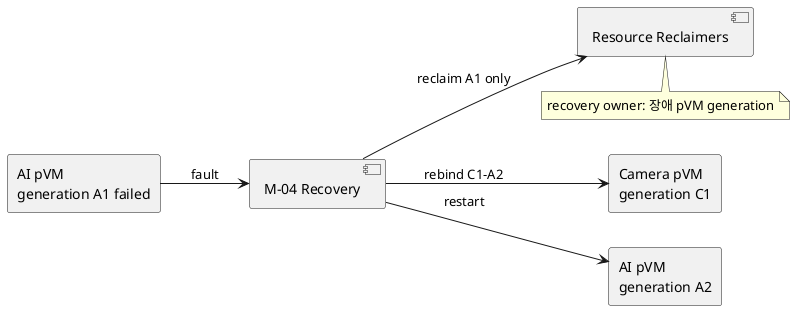
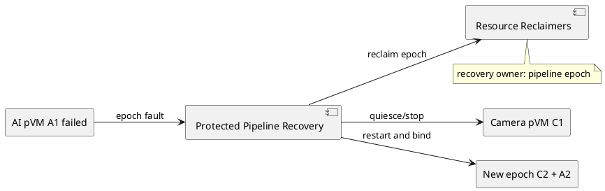

# DP-07. recovery transaction 범위

## 1. 상태

**후보 작성**

## 2. 결정 목적

Camera 또는 AI pVM 장애 시 recovery 완료를 장애 pVM generation 단위로 판정할지
pipeline epoch 전체 단위로 판정할지 정한다.

## 3. 문제 상황

01 문서 §2.3과 §4.3은 장애 뒤 channel, HW, TEE session, memory와 CPU를 회수하고
재시작하거나 fail-closed하도록 요구한다. M-04는 resource별 완료를 모으지만 어느
범위가 authoritative recovery transaction인지는 정하지 않았다.

장애 pVM만 복구하면 정상 pVM의 가용성을 유지할 수 있지만 상대 endpoint와 공유
resource를 새 generation에 안전하게 rebind해야 한다. pipeline 전체를 재구성하면
상태 일관성은 단순해지지만 정상 domain도 중단된다.

- 요구 추적: 01 §2.3, §4.3, §5
- 관련 모듈: M-02, M-03, M-04, M-07~M-12
- baseline: 실제 회수는 resource별 protected module이 수행한다.
- project-custom: recovery transaction과 restart/fail-closed 판정 범위
- 선행 DP: DP-01, DP-02, DP-06

## 4. 결정 질문

장애 pVM generation만 recovery transaction으로 복구할 것인가, Camera와 AI를 묶은
pipeline epoch 전체를 recovery transaction으로 재구성할 것인가?

## 5. 후보 구조

### 5.1 후보 A: pVM generation별 recovery

M-04가 장애 generation에 연결된 resource만 회수하고 새 generation을 기존 pipeline
상대편에 rebind한다. 정상 pVM은 quiesce 또는 제한 모드로 대기한다.

- 장점: 정상 pVM 재시작과 Workload state 손실을 줄인다.
- 단점: stale endpoint 탐지와 partial rebind 검증이 복잡하다.

### 5.2 후보 B: pipeline epoch recovery

한 pVM 장애를 현재 epoch의 실패로 처리한다. Camera와 AI 양쪽 endpoint와 공유
resource를 모두 회수한 뒤 새 epoch로 재시작한다.

- 장점: recovery 전후 상태와 resource ownership을 하나의 transaction으로 정리한다.
- 단점: 정상 pVM까지 중단되어 가용성과 복구 시간이 불리할 수 있다.

## 6. 후보별 구조 다이어그램

### 6.1 후보 A

### 6.2 후보 B

## 7. 후보별 동작 구조

### 7.1 후보 A

1. fault를 pVM identity와 generation에 결합한다.
2. 해당 generation의 lease, session, buffer와 entitlement를 회수한다.
3. 정상 상대 pVM의 endpoint를 quiesce하고 새 generation을 시작한다.
4. 새 bind completion 뒤 pipeline을 재개한다.

### 7.2 후보 B

1. fault를 current pipeline epoch failure로 승격한다.
2. 양쪽 pVM과 모든 공유 resource를 회수한다.
3. 새 Camera/AI generation과 endpoint를 새 epoch에 결합한다.
4. 전체 ready가 확인된 뒤 pipeline을 재개한다.

## 8. 품질속성 비교

수치 평가는 보류한다. 동일 fault injection에서 recovery time, 정상 pVM 중단 시간,
stale resource 0건과 recovery protocol 복잡도를 비교한다.

## 9. 핵심 트레이드오프

pVM 단위 복구는 정상 domain의 가용성을 유지하지만 generation 간 rebind와 stale
resource 검증이 복잡하다. pipeline 단위 복구는 일관성을 단순화하지만 장애 반경과
중단 시간을 늘린다.

## 10. 검증 기준

- Camera와 AI 각각의 crash, hang과 timeout을 같은 부하에서 주입한다.
- buffer, HW, TEE session, storage attach와 QoS lease 회수 증거를 같은 fault ID로 모은다.
- 정상 pVM 중단 시간과 end-to-end service recovery를 측정한다.
- recovery 도중 두 번째 fault를 주입해 idempotence와 fail-closed를 확인한다.

## 11. 검토 결과

사용자 검토 전이다.

## 12. 최종 결정

