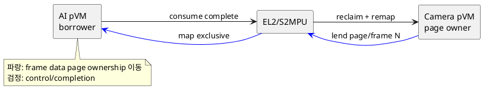
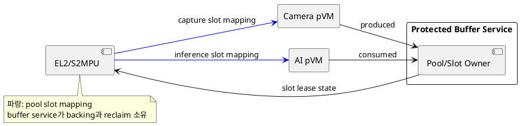

# DP-08. frame backing memory 소유 모델

## 1. 상태

**후보 작성**

## 2. 결정 목적

Camera→AI frame의 backing page를 producer pVM이 소유할지, 별도 protected buffer
service가 pool로 소유할지 정한다.

## 3. 문제 상황

01 문서 §2.2와 §4.3은 원본 frame을 Host에 노출하지 않으면서 불필요한 copy 없이
전달하도록 요구한다. M-07은 buffer ownership, mapping lifetime과 reclaim을 관리하고
M-09는 Stage-2와 DMA mapping을 집행한다.

producer-owned page를 frame마다 lend하면 사용량에 맞춰 memory를 쓸 수 있지만
ownership/mapping 전환이 critical path에 반복된다. protected pool을 사전 확보하면
slot을 재사용할 수 있지만 사용하지 않는 memory도 예약하며 buffer service가 새로운
보호 자원 owner가 된다. 이 결정은 grant ledger를 EL2와 service 중 어디에 둘지와
독립적인 2×2 결정이다.

- 요구 추적: 01 §2.2, §2.3, §4.1-8, §4.3, §5
- 관련 모듈: M-07, M-09, M-12
- baseline: 한 slot/page의 CPU와 DMA 접근 주체가 동시에 중첩되지 않는다.
- project-custom: frame backing의 physical owner와 reclaim boundary
- 선행 DP: DP-05

## 4. 결정 질문

frame backing을 producer pVM이 소유하고 receiver에 동적으로 lend할 것인가,
protected buffer service가 preallocated pool을 소유하고 양쪽에 slot을 lease할 것인가?

## 5. 후보 구조

### 5.1 후보 A: producer-owned dynamic lend

Camera pVM이 frame page를 소유한다. capture가 끝나면 Camera mapping과 DMA 권한을
회수하고 AI pVM에 page를 lend한다. 소비 후 같은 page를 producer가 reclaim한다.

- 장점: 실제 stream 수와 frame 크기에 맞춰 memory를 동적으로 사용한다.
- 단점: frame마다 Stage-2/S2MPU mapping, TLB와 ownership transition 비용이 든다.

### 5.2 후보 B: protected pool의 slot lease

buffer service pVM이 protected pool을 사전 소유한다. Camera와 AI는 pipeline 단계에
따라 slot lease만 받으며 service가 slot state와 최종 reclaim을 책임진다.

- 장점: 고정 pool과 slot 재사용으로 allocation과 mapping 변화를 줄일 수 있다.
- 단점: reserved memory가 늘고 service 장애와 pool 고갈을 처리해야 한다.

## 6. 후보별 구조 다이어그램

### 6.1 후보 A

### 6.2 후보 B

## 7. 후보별 동작 구조

### 7.1 후보 A

1. Camera pVM이 page를 할당하고 Camera DMA에만 grant한다.
2. capture 완료 뒤 Camera CPU/DMA mapping을 revoke한다.
3. EL2/S2MPU가 AI pVM과 AI DMA에 page를 lend한다.
4. AI completion 또는 timeout 뒤 producer가 page를 reclaim한다.

### 7.2 후보 B

1. buffer service가 pipeline admission 때 pool과 slot을 예약한다.
2. slot을 Camera에 lease하고 capture completion을 확인한다.
3. 같은 slot의 Camera 권한을 회수하고 AI에 lease한다.
4. AI completion, timeout 또는 epoch 종료 뒤 service가 slot을 free로 만든다.

## 8. 품질속성 비교

평가를 보류한다. frame 크기와 queue depth를 같게 두고 전달 지연, mapping 전환 수,
reserved/peak memory, pool 고갈과 stale mapping을 비교해야 한다.

## 9. 핵심 트레이드오프

producer ownership은 동적 자원 효율에 유리하지만 frame별 mapping 전환 비용을
늘린다. protected pool은 전달 경로를 예측 가능하게 만들 수 있지만 reserved memory,
buffer service TCB와 중앙 pool 장애 영향을 늘린다.

## 10. 검증 기준

- Host CPU와 비인가 DMA가 frame page를 읽지 못하는지 공격 시험한다.
- request부터 receiver-ready까지 Stage-2/S2MPU 전환을 같은 frame ID로 계측한다.
- producer/consumer crash와 timeout 때 모든 page/slot이 회수되는지 확인한다.
- pVM 간 direct lend 또는 service-owned pool에 필요한 pKVM/IOMMU extension을 PoC한다.

## 11. 검토 결과

사용자 검토 전이다.

## 12. 최종 결정

