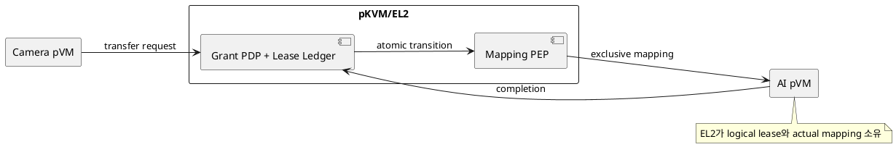
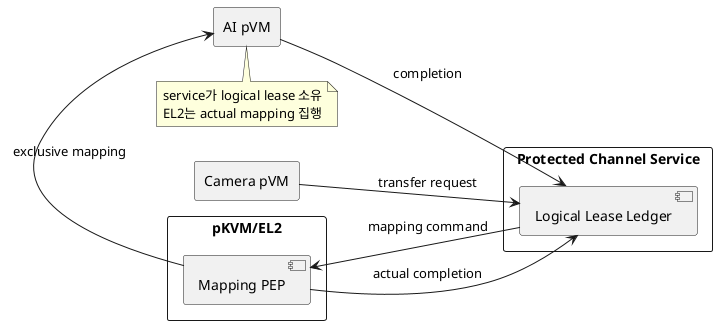

# DP-09. buffer grant와 lease ledger 소유권

## 1. 상태

**후보 작성**

## 2. 결정 목적

frame receiver, generation, lease state와 reclaim 완료를 기록하는 authoritative
buffer ledger를 EL2에 둘지 protected service pVM에 둘지 정한다.

## 3. 문제 상황

M-07은 logical lease와 ownership을 관리하고 M-09는 Stage-2/S2MPU actual state를
집행한다. Host ledger는 위조될 수 있으므로 grant와 mapping이 같은 identity,
generation과 frame에 결합됐는지 보호 경계에서 확인해야 한다.

EL2가 policy와 ledger를 직접 소유하면 actual mapping과 상태가 가까우나 parser,
timeout, queue와 policy가 EL2 TCB를 키운다. protected channel service가 logical
ledger를 소유하면 정책을 유연하게 바꿀 수 있지만 EL2 PEP와의 two-phase completion,
service 장애와 추가 hop을 처리해야 한다.

- 요구 추적: 01 §2.2, §3, §4.1-4/8, §4.3, §5
- 관련 모듈: M-07, M-09, M-06
- baseline: EL2/S2MPU actual mapping이 최종 집행 상태다.
- project-custom: logical grant/lease ledger와 reclaimer authority 위치
- 선행 DP: DP-05

## 4. 결정 질문

EL2가 buffer grant policy와 lease ledger를 직접 소유할 것인가, protected channel
service가 logical ledger를 소유하고 EL2는 mapping PEP만 담당할 것인가?

## 5. 후보 구조

### 5.1 후보 A: EL2 통합 grant/lease authority

EL2가 request identity, frame, source/destination generation과 lease state를 확인하고
mapping을 바꾼 뒤 ledger를 갱신한다.

- 장점: logical state와 actual Stage-2 state 사이 hop과 commit gap이 작다.
- 단점: channel policy, timeout과 ledger 기능이 EL2 TCB에 들어간다.

### 5.2 후보 B: protected channel service logical authority

service pVM이 logical lease를 소유하고 EL2에 좁은 mapping command를 보낸다. EL2의
actual completion을 받은 뒤에만 service가 lease를 commit한다.

- 장점: policy와 channel protocol을 EL2 밖에서 변경하고 복잡한 상태를 격리한다.
- 단점: service와 EL2 상태 불일치, 추가 지연과 service recovery가 필요하다.

## 6. 후보별 구조 다이어그램

### 6.1 후보 A

### 6.2 후보 B

## 7. 후보별 동작 구조

### 7.1 후보 A

1. EL2가 source owner, receiver와 generation을 검증한다.
2. 이전 mapping을 회수하고 새 mapping을 만든다.
3. actual update 성공과 함께 lease state를 commit한다.
4. timeout/fault 시 EL2 ledger로 미완료 mapping을 reclaim한다.

### 7.2 후보 B

1. service가 logical lease transaction을 열고 policy를 판정한다.
2. EL2 PEP에 최소 mapping command를 보낸다.
3. actual completion 뒤 service ledger를 commit한다.
4. service 재시작 시 EL2 actual state와 journal을 대조해 transaction을 닫는다.

## 8. 품질속성 비교

평가를 보류한다. 같은 frame 부하에서 grant latency, EL2 code/state 크기, crash 뒤
ledger-actual mismatch와 신규 policy 변경 범위를 비교해야 한다.

## 9. 핵심 트레이드오프

EL2 통합 authority는 state transition을 짧게 만들지만 작은 EL2 TCB 원칙과 정책
변경 용이성을 악화시킨다. protected service는 복잡한 ledger를 격리하지만 분산
commit과 service recovery를 추가한다.

## 10. 검증 기준

- stale generation, duplicate frame과 unauthorized receiver request를 주입한다.
- logical commit 전후 EL2/service crash를 주입해 actual mapping을 대조한다.
- grant/reclaim 지연과 EL2 code/data 증가량을 측정한다.
- 필요한 hypercall/ABI를 platform owner와 PoC로 확인한다.

## 11. 검토 결과

사용자 검토 전이다.

## 12. 최종 결정

