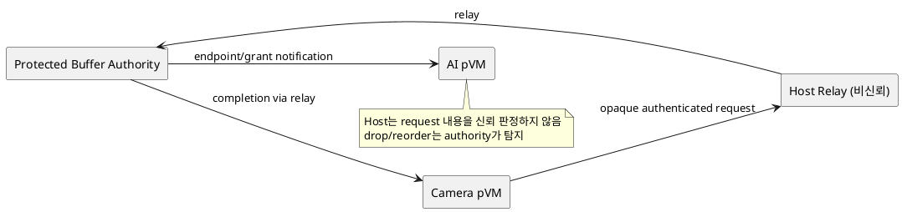
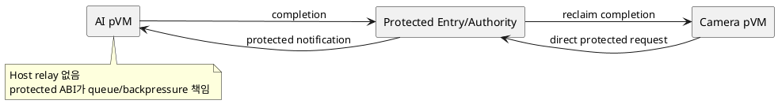

# DP-10. buffer control request 경로

## 1. 상태

**후보 작성**

## 2. 결정 목적

pVM 간 frame 전달의 control request를 Host relay를 통해 보낼지 pVM에서 protected
authority로 직접 보낼지 정한다.

## 3. 문제 상황

frame payload를 보호해도 control metadata에는 source/destination, frame timing,
format, buffer ID와 model activity가 드러날 수 있다. M-07은 request ingress와
endpoint를 관리하며 Host relay와 pVM endpoint 후보를 모두 가진다.

Host relay는 Linux native transport와 오류 처리가 단순하지만 request를 관찰,
지연, drop, replay할 수 있다. end-to-end authentication은 변조를 탐지해도 metadata
노출과 서비스 거부를 막지 못한다. direct protected entry는 Host 노출과 hop을 줄일
수 있지만 새 guest ABI와 protected endpoint를 추가한다.

- 요구 추적: 01 §2.2, §2.3, §3, §4.3, §5
- 관련 모듈: M-07, M-06, M-09
- baseline: payload ownership과 grant authority는 DP-08·09 결과를 abstract endpoint로 사용한다.
- project-custom: transfer request ingress의 control path와 신뢰 경계
- 선행 DP: DP-06, DP-08, DP-09

## 4. 결정 질문

authenticated opaque buffer request를 Host relay로 전달할 것인가, pVM이 protected
authority entrypoint를 직접 호출할 것인가?

## 5. 후보 구조

### 5.1 후보 A: Host-relayed opaque request

pVM endpoint가 request를 인증·암호화하고 Host relay가 opaque message를 authority에
전달한다. authority는 sequence, generation과 integrity를 검증한다.

- 장점: 기존 Linux/vsock transport와 timeout 처리를 재사용하기 쉽다.
- 단점: Host가 traffic pattern을 관찰하고 request를 지연·drop할 수 있다.

### 5.2 후보 B: pVM direct protected-entry request

pVM guest driver가 hypercall 또는 검증된 protected transport로 authority를 직접
호출한다. Host는 payload와 control request의 중계 경로에서 빠진다.

- 장점: Host-visible metadata와 relay hop을 줄인다.
- 단점: guest/EL2 ABI, queue와 backpressure 검증 범위가 커진다.

## 6. 후보별 구조 다이어그램

### 6.1 후보 A

### 6.2 후보 B

## 7. 후보별 동작 구조

### 7.1 후보 A

1. Camera endpoint가 request에 identity, generation, sequence와 integrity tag를 붙인다.
2. Host relay가 message를 authority에 전달한다.
3. authority가 replay와 변조를 거부하고 grant를 수행한다.
4. timeout 시 endpoint와 authority가 같은 request ID로 reclaim을 확인한다.

### 7.2 후보 B

1. Camera guest driver가 protected entry에 request를 제출한다.
2. authority가 caller context에서 identity와 generation을 얻는다.
3. grant 뒤 AI endpoint에 notification을 전달한다.
4. queue overflow, timeout 또는 pVM crash 시 authority가 request와 lease를 함께 회수한다.

## 8. 품질속성 비교

수치 평가는 보류한다. 동일 message 크기와 부하에서 control latency, Host-visible
metadata, drop/replay 탐지, ABI code size와 overload 격리를 비교해야 한다.

## 9. 핵심 트레이드오프

Host relay는 Linux 호환성과 구현 단순성에 유리하지만 metadata 관찰과 지연 경로를
남긴다. direct protected entry는 Host 노출을 줄이지만 EL2 또는 protected transport
TCB와 검증 범위를 늘린다.

## 10. 검증 기준

- Host relay에서 replay, reorder, duplicate, drop과 metadata 관찰을 시험한다.
- 같은 frame ID로 request부터 receiver-ready까지 지연을 측정한다.
- direct path queue overflow와 malicious guest flood를 주입한다.
- pVM-to-protected-service 직접 transport의 platform feasibility를 PoC로 확인한다.

## 11. 검토 결과

사용자 검토 전이다.

## 12. 최종 결정

