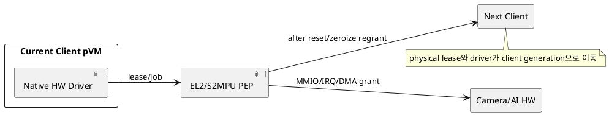
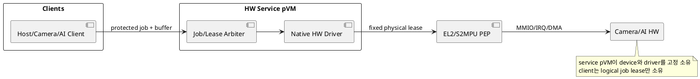

# DP-11. HW physical lease와 native driver 배치

## 1. 상태

**후보 작성**

## 2. 결정 목적

단일 Context Camera/AI HW의 physical owner와 native driver를 client domain 사이에서
교대할지, HW service pVM에 고정할지 정한다.

## 3. 문제 상황

01 문서 §4.1-7/8은 Host와 pVM이 Camera/AI HW를 시분할하되 실제 병렬 접근과 권한
중첩을 금지한다. M-08은 physical lease와 native driver placement를, M-09는
S2MPU, MMIO, IRQ와 DMA actual state를 집행한다.

client pVM에 HW를 직접 할당하면 native 성능과 기존 driver 사용에 유리하지만
owner 전환마다 driver quiesce, reset, zeroize, S2MPU와 IRQ를 바꿔야 한다. HW
service pVM이 device를 고정 소유하면 physical transition을 줄일 수 있지만 모든
job과 buffer가 service 경계를 지나며 큰 trusted driver가 공통 TCB가 된다.

- 요구 추적: 01 §2.2, §2.3, §3, §4.1-7/8, §4.3, §5
- 관련 모듈: M-08, M-09, M-06
- baseline: revoke→drain→reset→zeroize→S2MPU update→regrant 순서를 지킨다.
- project-custom: physical lease owner, native driver 실행 위치와 client interface
- 선행 DP: DP-05, DP-07

## 4. 결정 질문

physical HW lease와 native driver를 Host/pVM client generation에 직접 재할당할
것인가, verified HW service pVM이 고정 소유하고 client에 job interface를 제공할 것인가?

## 5. 후보 구조

### 5.1 후보 A: client generation별 direct assignment

현재 client가 physical lease, MMIO/IRQ와 native driver를 가진다. 전환할 때 전체
device state와 DMA 권한을 회수한 뒤 다음 client에 할당한다.

- 장점: client와 HW 사이 hop이 짧고 native driver 기능을 직접 사용한다.
- 단점: 전환 latency, driver duplication과 각 client의 trusted driver 범위가 커진다.

### 5.2 후보 B: HW service pVM의 fixed ownership

HW service pVM이 physical device와 native driver를 계속 소유한다. Host/Camera/AI
client는 검증된 job과 buffer lease를 service에 제출한다.

- 장점: physical reassignment와 driver state 이동을 줄이고 client별 fault를 중재한다.
- 단점: service가 성능 병목과 공통 장애 지점이 되며 driver가 공통 protected TCB에 들어간다.

## 6. 후보별 구조 다이어그램

### 6.1 후보 A

### 6.2 후보 B

## 7. 후보별 동작 구조

### 7.1 후보 A

1. authority가 current client generation에 physical lease를 부여한다.
2. EL2/S2MPU가 MMIO, IRQ와 DMA mapping을 client에 연다.
3. 전환 시 job drain, 권한 revoke, reset과 zeroize를 수행한다.
4. actual revoke completion 뒤 다음 client driver를 초기화한다.

### 7.2 후보 B

1. HW service가 physical device를 초기화하고 fixed lease를 유지한다.
2. client job의 identity, buffer lease와 policy를 검증한다.
3. service driver가 job을 실행하고 승인된 output만 client에 반환한다.
4. client crash 시 logical job/buffer만 취소하며 service fault 시 device 전체를 reset한다.

## 8. 품질속성 비교

평가를 보류한다. 같은 HW workload에서 job latency/throughput, owner switch 시간,
driver TCB, 장애 반경과 zeroize 검증 결과를 비교해야 한다.

## 9. 핵심 트레이드오프

direct assignment는 native data path에 유리하지만 physical 전환과 client별 driver
TCB를 늘린다. HW service는 device ownership을 안정화하지만 공통 service hop,
driver TCB와 중앙 장애 영향을 만든다.

## 10. 검증 기준

- 전환 각 단계의 권한 중첩 0건과 잔류 데이터 0건을 확인한다.
- malicious Host/client DMA와 stale IRQ/MMIO 접근을 주입한다.
- job latency, throughput과 full reset/recovery 시간을 동일 trace로 측정한다.
- SoC IOMMU/S2MPU stream 분리와 pKVM device assignment 가능성을 platform owner와 PoC한다.

## 11. 검토 결과

사용자 검토 전이다.

## 12. 최종 결정

