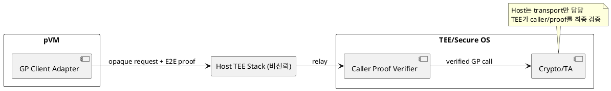
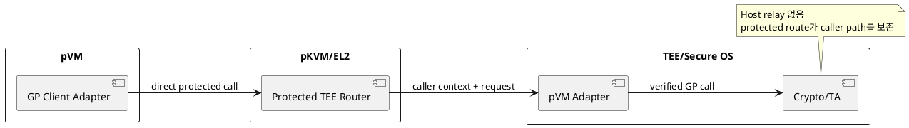

# DP-12. pVM에서 TEE로 가는 호출 경로

## 1. 상태

**후보 작성**

## 2. 결정 목적

pVM Workload의 GlobalPlatform request가 TEE에 도달할 때 caller identity와 request
integrity를 보존하는 종단 경로를 정한다.

## 3. 문제 상황

01 문서 §4.1-5는 기존 GlobalPlatform interface, Secure OS와 SMC 경로를 유지하도록
요구한다. 동시에 Host kernel은 비신뢰이므로 Host TEE driver가 pVM caller를
대신하거나 request를 변조해도 TEE가 이를 승인해서는 안 된다. M-10은 Host relay,
pVM client, EL2 router와 TEE adapter 후보를 가진다.

Host relay에 end-to-end caller proof를 싣는 구조는 기존 Linux TEE stack을 활용할
수 있지만 Host-visible metadata와 relay 지연이 남는다. protected direct route는
Host를 경로에서 줄이지만 pKVM/FF-A/SMC 연동과 기존 Secure OS 수정 범위가 늘어난다.

- 요구 추적: 01 §2.2, §3, §4.1-5, §4.3, §5
- 관련 모듈: M-10, M-05, M-06
- baseline: GP API 의미와 기존 Secure OS 기능을 유지한다.
- project-custom: pVM caller proof의 생성, 전달과 TEE 검증 경로
- 선행 DP: DP-04, DP-05

## 4. 결정 질문

Host TEE stack이 end-to-end caller proof를 중계할 것인가, pVM이 protected direct
route를 통해 TEE adapter를 호출할 것인가?

## 5. 후보 구조

### 5.1 후보 A: Host relay와 end-to-end caller binding

pVM adapter가 request에 Workload measurement, pVM generation, nonce와 integrity
proof를 결합한다. Host TEE driver는 opaque request를 전달하고 TEE가 proof를 검증한다.

- 장점: 기존 Linux TEE driver와 GP client 호환층을 활용한다.
- 단점: Host가 metadata와 timing을 관찰하고 request를 drop/replay할 수 있다.

### 5.2 후보 B: protected direct pVM→TEE route

pVM TEE driver가 EL2의 좁은 router와 FF-A/SMC 경로를 통해 Secure OS adapter를
직접 호출한다. caller context는 protected 경로에서 전달된다.

- 장점: Host relay의 위장과 metadata 노출 경로를 줄인다.
- 단점: EL2 ABI와 Secure OS adapter 변경, compatibility 검증 범위가 증가한다.

## 6. 후보별 구조 다이어그램

### 6.1 후보 A

### 6.2 후보 B

## 7. 후보별 동작 구조

### 7.1 후보 A

1. pVM adapter가 caller identity, generation, request hash와 nonce를 proof에 결합한다.
2. Host driver가 request와 shared page를 Secure OS에 전달한다.
3. TEE adapter가 proof와 policy를 검증한 뒤 GP call을 dispatch한다.
4. timeout 또는 pVM 종료 시 request/session을 generation으로 취소한다.

### 7.2 후보 B

1. pVM driver가 protected router entry를 호출한다.
2. EL2가 caller VM context와 허용 shared page를 검증한다.
3. FF-A/SMC 경로가 caller context와 request를 TEE adapter에 전달한다.
4. TEE가 GP call을 수행하고 같은 protected route로 결과를 반환한다.

## 8. 품질속성 비교

수치 평가는 보류한다. caller spoof/replay 차단, GP conformance, call latency,
Host-visible metadata, EL2/Secure OS code 증가량을 같은 call corpus로 비교한다.

## 9. 핵심 트레이드오프

Host relay는 기존 Linux/GP 자산 호환에 유리하지만 Host 관찰과 서비스 거부 경로를
남긴다. protected direct route는 caller path 보존을 단순화할 수 있지만 EL2와
Secure OS의 변경 및 검증 범위를 늘린다.

## 10. 검증 기준

- Host caller spoof, replay, request/shared-page swap을 주입한다.
- GP Client API conformance와 기존 TA 회귀 시험을 수행한다.
- sync/async call latency와 shared memory lifetime을 같은 trace로 측정한다.
- FF-A/SMC route와 pKVM vendor extension feasibility를 공식 interface와 PoC로 확인한다.

## 11. 검토 결과

사용자 검토 전이다.

## 12. 최종 결정

