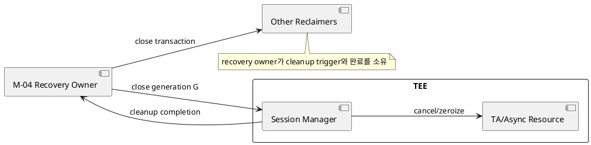
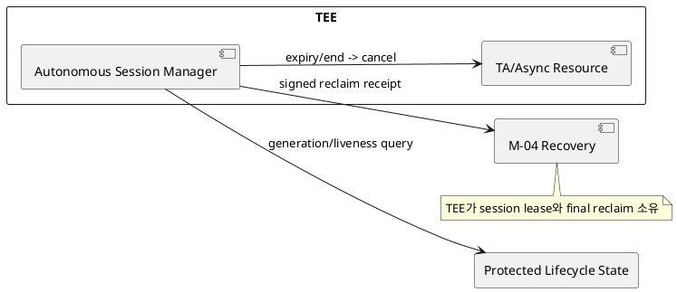

# DP-13. TEE session과 비동기 자원 회수 authority

## 1. 상태

**후보 작성**

## 2. 결정 목적

pVM 종료·장애 뒤 TEE session, async request와 shared resource의 최종 회수 책임을
Framework recovery owner와 TEE session manager 중 어디에 둘지 정한다.

## 3. 문제 상황

01 문서 §2.3과 §5는 종료나 장애 뒤 TEE session을 포함한 모든 자원을 누수 없이
회수하도록 요구한다. M-10은 session lifecycle을 관리하고 M-04는 전체 recovery
completion을 모은다. pVM generation이 끝났는데 TEE session이 남으면 stale caller가
재사용되거나 TEE의 제한된 memory가 고갈될 수 있다.

Framework recovery owner가 session 회수를 주도하면 전체 resource transaction과
정렬할 수 있지만 TEE가 외부 cleanup message에 의존한다. TEE session manager가
generation/liveness로 자율 회수하면 local leak를 빨리 막을 수 있지만 liveness
판정, timer와 복구 정책이 TEE에 들어가고 오탐 회수 위험이 있다.

- 요구 추적: 01 §2.2, §2.3, §4.2, §4.3, §5
- 관련 모듈: M-10, M-04, M-02
- baseline: session과 shared resource는 pVM identity/generation에 결합한다.
- project-custom: cleanup trigger, authoritative session state와 final reclaimer
- 선행 DP: DP-02, DP-07, DP-12

## 4. 결정 질문

lifecycle/recovery owner가 TEE session 정리를 주도할 것인가, TEE session manager가
pVM generation 상태를 확인해 자율적으로 회수할 것인가?

## 5. 후보 구조

### 5.1 후보 A: recovery owner 주도 cleanup

M-04가 recovery transaction에서 TEE cleanup request를 발행한다. TEE는 caller와
generation을 확인해 session/async/shared page를 닫고 completion을 반환한다.

- 장점: buffer, HW, storage와 TEE 회수를 같은 fault transaction으로 추적한다.
- 단점: cleanup request가 유실되거나 coordinator가 실패하면 TEE resource가 남을 수 있다.

### 5.2 후보 B: TEE session manager 자율 회수

TEE가 session별 caller generation과 lease expiry를 소유한다. protected lifecycle
state가 종료되거나 heartbeat/lease가 만료되면 session을 스스로 닫는다.

- 장점: 외부 cleanup message 없이 TEE local resource를 제한한다.
- 단점: protected liveness query, timer와 recovery policy가 TEE TCB를 늘리고 오탐을 만들 수 있다.

## 6. 후보별 구조 다이어그램

### 6.1 후보 A

### 6.2 후보 B

## 7. 후보별 동작 구조

### 7.1 후보 A

1. M-04가 pVM 종료/fault와 generation을 확정한다.
2. TEE에 해당 generation의 session close를 요청한다.
3. TEE가 async operation을 cancel하고 shared page/key handle을 zeroize한다.
4. completion을 받은 뒤 recovery transaction이 session 항목을 닫는다.

### 7.2 후보 B

1. TEE가 session 생성 때 generation과 lease를 기록한다.
2. protected lifecycle state를 조회하거나 lease expiry를 감지한다.
3. 종료된 generation의 operation과 resource를 자율 회수한다.
4. signed receipt를 M-04에 보내 전체 recovery evidence에 합류시킨다.

## 8. 품질속성 비교

평가를 보류한다. cleanup request loss, coordinator/TEE crash, session exhaustion과
long-running async call에서 leak 0건, 오탐 회수와 recovery time을 비교한다.

## 9. 핵심 트레이드오프

recovery owner 주도 방식은 전체 자원 회수의 일관성을 높이지만 cleanup path의
가용성에 의존한다. TEE 자율 회수는 local leak를 제한하지만 TEE에 liveness와
정책 상태를 추가하고 정상 장기 호출을 잘못 닫을 위험을 만든다.

## 10. 검증 기준

- pVM crash, cleanup message drop과 TEE restart를 조합해 주입한다.
- 종료 generation의 session 재사용과 shared page 접근이 거부되는지 확인한다.
- TEE memory/session quota가 정상 범위로 돌아오는 시간을 측정한다.
- long-running async request에서 false reclaim과 duplicate cleanup idempotence를 검증한다.

## 11. 검토 결과

사용자 검토 전이다.

## 12. 최종 결정

