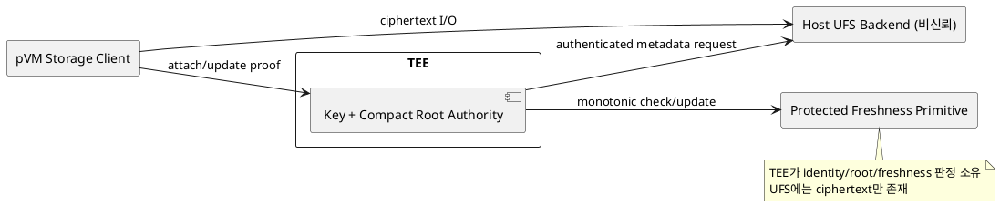
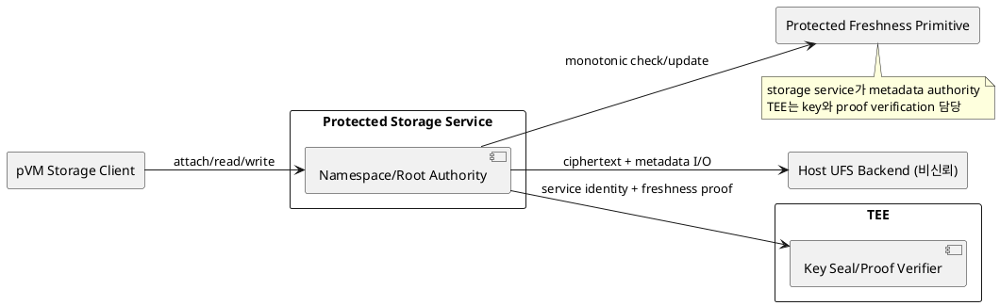

# DP-14. persistent storage metadata와 freshness authority

## 1. 상태

**후보 작성**

## 2. 결정 목적

pVM 수명보다 오래 유지되는 ciphertext namespace의 identity binding, authenticated
root와 freshness state를 TEE가 소유할지 protected storage service가 소유할지 정한다.

## 3. 문제 상황

01 문서 §4.2는 TEE에 영구 저장장치가 없고 memory도 작으므로 bulk data와 sealed key
blob을 Host UFS에 저장하도록 규정한다. Host는 ciphertext와 metadata를 함께 과거
상태로 되돌릴 수 있다. 암호화와 sealed generation만으로는 최신 상태인지 판정할
외부 기준이 없으므로 rollback 대응은 별도 protected freshness primitive를 필요로 한다.

이번 DP의 두 후보는 RPMB가 아닌 platform-approved monotonic counter, protected
clock 또는 동등한 freshness primitive가 존재한다는 공통 feasibility gate를 둔다.
그 gate가 닫히지 않으면 두 후보 모두 확정할 수 없다.

- 요구 추적: 01 §2.2, §4.1-10, §4.2, §4.3, §5
- 관련 모듈: M-11, M-10, M-06
- baseline: bulk ciphertext와 key blob은 Host UFS에 저장하며 RPMB는 사용하지 않는다.
- project-custom: namespace metadata, authenticated root와 freshness proof의 owner
- 선행 DP: DP-03, DP-04, DP-05, DP-12

## 4. 결정 질문

TEE가 namespace의 compact authenticated root와 freshness state를 직접 소유할
것인가, protected storage service가 metadata authority를 소유하고 TEE는 그
freshness proof와 key binding만 검증할 것인가?

## 5. 후보 구조

### 5.1 후보 A: TEE compact root authority

TEE가 Workload identity별 root hash, version/freshness와 key binding을 판정한다.
Host M-11은 ciphertext tree, quota와 UFS I/O를 수행하고 TEE는 compact state만
runtime에 유지한다.

- 장점: 저장 identity와 key/freshness 판정을 기존 trust anchor 안에 둔다.
- 단점: TEE memory, call 수와 storage metadata code가 늘어난다.

### 5.2 후보 B: protected storage service metadata authority

storage service pVM이 namespace, Merkle root, quota와 freshness transaction을
소유한다. TEE는 service measurement와 freshness proof를 확인해 key seal/unseal만 한다.

- 장점: 복잡한 storage metadata와 quota를 TEE 밖으로 분리한다.
- 단점: 별도 protected service의 persistent recovery, key trust와 자원 비용이 증가한다.

## 6. 후보별 구조 다이어그램

### 6.1 후보 A

### 6.2 후보 B

## 7. 후보별 동작 구조

### 7.1 후보 A

1. pVM이 identity와 generation으로 namespace attach를 요청한다.
2. Host가 ciphertext metadata를 TEE에 전달한다.
3. TEE가 authenticated root와 protected freshness 값을 비교한다.
4. 검증 성공 시 key handle을 pVM session에 결합하고 update마다 root를 commit한다.

### 7.2 후보 B

1. pVM이 protected storage service에 namespace attach를 요청한다.
2. service가 UFS metadata를 읽고 freshness primitive로 최신 root를 확인한다.
3. TEE가 service measurement, Workload binding과 proof를 확인해 key를 제공한다.
4. service가 update transaction, quota와 retention을 관리하고 signed receipt를 반환한다.

## 8. 품질속성 비교

freshness primitive가 확인되기 전 gate는 두 후보 모두 **확인 필요**다. 이후 rollback
탐지, attach/update latency, TEE/protected memory, UFS 공간과 service recovery를
같은 namespace workload로 평가한다. 별점은 작성하지 않는다.

## 9. 핵심 트레이드오프

TEE authority는 key와 metadata trust를 한 경계에 모으지만 제한된 TEE memory와
call overhead를 늘린다. storage service authority는 복잡한 metadata를 분리하지만
새 protected service와 그 persistent recovery를 신뢰·검증 범위에 추가한다.

## 10. 검증 기준

- ciphertext, key blob, metadata와 전체 snapshot rollback을 각각 주입한다.
- Workload identity/version 바꿔치기와 namespace 오연결을 시험한다.
- update 단계별 power loss로 atomicity와 fail-closed를 확인한다.
- RPMB 없이 사용할 protected freshness primitive와 protection level을 platform owner가 확인한다.
- quota 초과, UFS full과 service/TEE restart 뒤 reclaim을 검증한다.

## 11. 검토 결과

Herdr의 Claude 검토에서 외부 freshness anchor 없는 generation binding은 필수 gate를
통과하지 못한다고 확인했다. 후보는 공통 freshness feasibility gate를 갖도록
재정의했다. 사용자 검토 전이다.

## 12. 최종 결정

