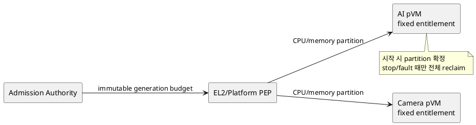
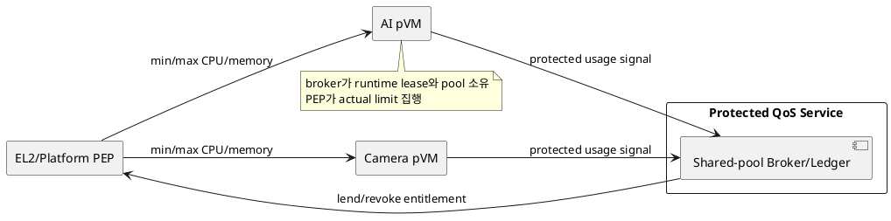

# DP-15. CPU와 memory entitlement authority

## 1. 상태

**후보 작성**

## 2. 결정 목적

Host scheduler와 allocator를 신뢰하지 않는 조건에서 pVM별 CPU time과 memory
capacity를 고정 partition으로 보호할지 runtime shared pool로 대여·회수할지 정한다.

## 3. 문제 상황

01 문서 §4.3은 2-domain pipeline의 실시간 frame 처리와 overload 격리를 요구하며
embedded CPU, memory와 전력이 유한하다고 규정한다. M-12는 admission, min/max
entitlement와 reclaim을 관리하지만 protected authority와 allocation model은 열려 있다.

고정 partition은 예측성과 격리에 유리하지만 idle resource를 다른 pVM이 쓸 수 없다.
shared-pool broker는 utilization을 높이지만 runtime 정책, revocation과 overload
feedback이 복잡해진다. 일반 pKVM의 vCPU가 Host scheduler thread로 실행되는 경우
악의적 Host starvation을 막는 보장은 기본 제공되지 않으므로 protected CPU dispatch
집행 가능성을 별도 feasibility gate로 확인해야 한다.

- 요구 추적: 01 §2.2, §4.2, §4.3, §5
- 관련 모듈: M-12, M-02, M-04, M-09
- baseline: Host scheduler/allocator는 mechanism이며 최종 entitlement 근거가 아니다.
- project-custom: protected entitlement owner와 fixed/dynamic allocation model
- 선행 DP: DP-02, DP-05, DP-07

## 4. 결정 질문

pVM 시작 전에 fixed protected CPU/memory partition을 부여할 것인가, protected
runtime broker가 shared pool의 entitlement를 동적으로 대여·회수할 것인가?

## 5. 후보 구조

### 5.1 후보 A: fixed protected partition

admission 때 pVM generation별 CPU budget/core set과 memory capacity를 정하고 실행
중에는 변경하지 않는다. EL2/platform PEP가 상한과 최소 보장을 집행한다.

- 장점: deadline과 overload 격리의 분석 및 검증이 단순하다.
- 단점: idle capacity를 재사용하기 어렵고 peak 기준 과예약이 필요하다.

### 5.2 후보 B: protected shared-pool broker

protected service pVM이 pool ledger와 min/max entitlement를 소유한다. load signal과
lease expiry에 따라 여유 CPU/memory를 대여하고 회수 command를 protected PEP에 보낸다.

- 장점: 유한 resource utilization과 workload 변화 대응에 유리하다.
- 단점: broker/telemetry 신뢰, revocation latency와 정책 oscillation을 처리해야 한다.

## 6. 후보별 구조 다이어그램

### 6.1 후보 A

### 6.2 후보 B

## 7. 후보별 동작 구조

### 7.1 후보 A

1. workload manifest와 pipeline budget으로 admission을 판정한다.
2. generation에 fixed CPU/memory entitlement를 결합한다.
3. 실행 중 Host mechanism이 budget 밖 allocation을 요청하면 PEP가 거부한다.
4. stop/fault completion 뒤 partition 전체를 zero/reclaim한다.

### 7.2 후보 B

1. broker가 minimum entitlement를 admission하고 pool lease를 연다.
2. protected usage/deadline signal로 추가 capacity를 대여한다.
3. expiry, pressure 또는 fault 때 entitlement를 revoke한다.
4. PEP actual completion을 받은 뒤 pool ledger를 갱신한다.

## 8. 품질속성 비교

protected CPU dispatch feasibility는 두 후보 모두 **확인 필요**다. 대표 frame 부하와
Host overload에서 deadline miss, throughput, memory pressure, utilization, reclaim
시간과 protected overhead를 측정한 뒤 평가한다.

## 9. 핵심 트레이드오프

fixed partition은 예측성과 분석 가능성을 높이지만 idle capacity를 낭비한다.
shared-pool broker는 자원 효율을 높일 수 있지만 runtime policy, telemetry와
revocation의 TCB 및 장애 경로를 늘린다.

## 10. 검증 기준

- Host scheduler starvation과 allocator pressure를 주입한다.
- Camera/AI 각 minimum entitlement와 max limit의 actual enforcement를 측정한다.
- overload가 다른 domain의 deadline과 memory isolation에 미치는 영향을 확인한다.
- pKVM/SoC에서 protected CPU dispatch와 memory capacity PEP 구현 가능성을 PoC한다.
- broker crash와 oscillating load에서 lease 회수와 fail-closed를 검증한다.

## 11. 검토 결과

사용자 검토 전이다.

## 12. 최종 결정

