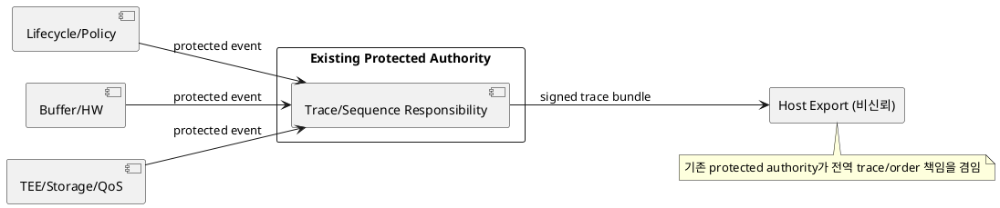
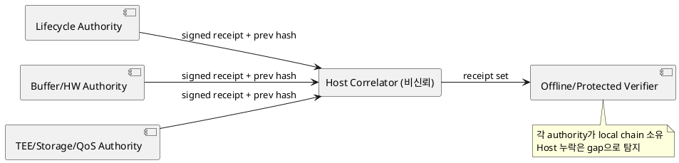

# DP-16. trace와 evidence 상관 authority

## 1. 상태

**후보 작성**

## 2. 결정 목적

lifecycle, policy, buffer, HW, TEE, storage와 QoS event를 동일 identity, generation,
epoch와 trace로 상관하고 변조·누락을 탐지하는 evidence 구조를 정한다.

## 3. 문제 상황

01 문서 §4.3과 §5는 격리, 권한 전환, 장애 회수와 성능을 동일 trace로 객관적으로
재현하도록 요구한다. 02 문서는 evidence를 별도 모듈로 두지 않고 각 모듈의 검증
contract에 포함한다. 비신뢰 Host가 로그를 수집하면 event를 변조, 재정렬 또는
선택적으로 누락할 수 있다.

02 문서 §5는 evidence를 별도 핵심 모듈로 분리하지 않도록 고정한다. 따라서 중앙
수집 후보도 새 evidence module을 만들지 않고 기존 protected authority 중 하나가
trace 책임을 겸임한다. 이 방식은 완전성과 상관분석을 단순화하지만 모든 critical
path가 같은 기존 authority에 의존한다. 각 protected authority가 hash-chained
receipt를 발급하고 Host가 사후 상관하면 runtime 결합은 줄지만 Host의 선택적
누락은 chain gap으로 탐지할 뿐 예방하지 못한다.

- 요구 추적: 01 §2.2, §4.3, §5
- 관련 모듈: M-01~M-12 cross-cutting verification contract
- baseline: evidence는 보안 허가의 대체물이 아니며 payload secret을 포함하지 않는다.
- project-custom: trace ID 발급, event ordering, integrity와 completeness 책임
- 선행 DP: DP-02, DP-07

## 4. 결정 질문

기존 protected authority 하나가 trace/evidence의 중앙 수집 책임을 겸임할 것인가,
각 protected module이 hash-chained receipt를 발급하고 Host가 사후 상관할 것인가?

## 5. 후보 구조

### 5.1 후보 A: 기존 protected authority의 중앙 수집 책임

M-04 또는 M-06처럼 이미 선택된 protected authority 하나가 trace ID, sequence와
event digest 수집 책임을 겸임한다. 각 authority는 state transition 전후 receipt를
그 endpoint에 commit하고 Host는 export만 담당한다.

- 장점: 별도 핵심 모듈 없이 cross-module ordering과 recovery completion 상관을 단순화한다.
- 단점: 기존 authority의 storage/call overhead, 장애 영향과 민감 metadata 집중이 커진다.

### 5.2 후보 B: federated hash-chained receipts

각 protected authority가 이전 receipt hash, local sequence, identity/generation과
event digest를 서명한다. Host는 receipt를 저장·상관하며 chain gap은 검증 시 탐지한다.

- 장점: 공통 중앙 수집 endpoint 의존과 특정 authority의 TCB 증가를 줄인다.
- 단점: 전역 ordering과 completeness 증명이 복잡하고 Host가 receipt 전달을 지연·누락할 수 있다.

## 6. 후보별 구조 다이어그램

### 6.1 후보 A

### 6.2 후보 B

## 7. 후보별 동작 구조

### 7.1 후보 A

1. 선택된 기존 protected authority가 pipeline epoch와 trace ID를 발급한다.
2. 각 module이 transition request/completion digest를 commit한다.
3. 같은 authority가 ordering, missing completion과 critical path를 상관한다.
4. trace 종료 또는 fault 때 signed evidence bundle을 Host UFS로 export한다.

### 7.2 후보 B

1. 각 authority가 local sequence와 이전 receipt hash를 유지한다.
2. event마다 identity/generation/trace와 digest를 포함한 receipt를 발급한다.
3. Host correlator가 timestamp와 relation ID로 receipt set을 조립한다.
4. verifier가 signature, chain gap, duplicate와 cross-resource relation을 확인한다.

## 8. 품질속성 비교

수치 평가는 보류한다. fault/attack injection에서 event tamper·drop 탐지율, ordering
정확성, runtime latency, protected memory, UFS 사용량과 중앙 책임/module 장애 영향을
같은 trace로 비교한다.

## 9. 핵심 트레이드오프

기존 authority의 중앙 수집 책임은 전역 순서와 completeness를 강하게 관리하지만
그 authority의 TCB, 저장과 critical-path overhead를 늘린다. federated receipt는
runtime 결합을 줄이지만 전역 상관이 복잡하고 Host의 선택적 누락을 사후 탐지하는
데 그친다.

## 10. 검증 기준

- event 변조, reorder, duplicate, selective drop과 Host UFS rollback을 주입한다.
- 같은 fault ID로 모든 resource reclaim completion을 재구성할 수 있는지 확인한다.
- capture→AI result critical path timestamp의 신뢰성과 overhead를 측정한다.
- 중앙 수집 책임을 맡은 authority 또는 한 receipt 발급 authority가 crash한 뒤
  chain/trace continuity를 검증한다.
- evidence quota, retention과 UFS full 처리 시 보안 event가 조용히 유실되지 않는지 확인한다.

## 11. 검토 결과

Herdr의 Claude 검토에서 federated 후보도 receipt 무결성을 갖도록 보강하고 Host의
선택적 누락 한계를 명시했다. 사용자 검토 전이다.

## 12. 최종 결정
