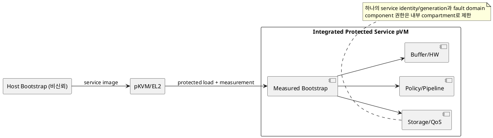
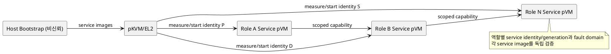

# DP-17. protected service pVM 배치 토폴로지

## 1. 상태

**후보 작성**

## 2. 결정 목적

선행 DP에서 protected service 경계를 선택한 lifecycle, policy, pipeline, buffer,
HW, storage와 QoS authority를 하나의 service pVM에 통합할지 역할별 pVM으로
분리할지 정한다.

## 3. 문제 상황

01 문서 §3과 02 문서 §3은 protected service pVM을 고정 구성요소가 아닌 후보 실행
경계로 둔다. 여러 선행 DP가 service pVM 후보를 선택할 수 있지만 그 결과를 그대로
구현하면 service pVM의 수, fault domain, memory, boot order와 trust chain이 정해지지
않는다.

하나의 pVM에 authority를 통합하면 공통 bootstrap, IPC와 memory를 줄일 수 있지만
한 authority 결함이 다른 자원의 policy와 recovery에 전파된다. 역할별로 분리하면
least privilege와 fault containment가 선명해지지만 pVM별 image 검증, 시작 순서,
channel과 reserved memory가 증가한다. 두 후보 모두 DP-04의 검증 계약으로 service
image와 manifest를 측정하고 service identity를 발급해야 한다.

- 요구 추적: 01 §3, §4.1-4, §4.3, §5; 02 §2, §3, §4.1
- 관련 모듈: service 경계를 선택한 M-02~M-12 논리 모듈
- baseline: protected service pVM은 필수가 아니며 선택된 논리 책임만 배치한다.
- project-custom: protected service의 consolidation 단위, boot trust와 fault domain
- 선행 DP: DP-04와 protected service 후보를 선택한 DP-02, DP-05, DP-06, DP-08,
  DP-09, DP-11, DP-14, DP-15, DP-16

## 4. 결정 질문

선택된 protected authority를 하나의 통합 service pVM에 배치할 것인가, 자원 역할별
service pVM으로 분리해 각각 독립 측정·부팅할 것인가?

## 5. 후보 구조

### 5.1 후보 A: 통합 protected service pVM

선택된 authority component를 하나의 service image와 pVM generation에 배치한다.
공통 bootstrap이 전체 manifest와 component measurement를 검증하고 내부 IPC로
책임을 연결한다.

- 장점: pVM 수, boot/channel 수와 중복 runtime memory를 줄일 수 있다.
- 단점: TCB와 권한 집합이 커지고 한 component crash가 모든 authority에 영향을 준다.

### 5.2 후보 B: 역할별 분리 protected service pVM

policy, channel, HW, storage, QoS 등 선택된 authority를 독립 service pVM에 배치한다.
각 image를 별도 측정하고 capability로 service 간 호출을 제한한다.

- 장점: least privilege, independent update와 fault containment가 명확하다.
- 단점: boot dependency, protected IPC, memory와 recovery transaction이 늘어난다.

## 6. 후보별 구조 다이어그램

### 6.1 후보 A

### 6.2 후보 B

## 7. 후보별 동작 구조

### 7.1 후보 A

1. 공통 service manifest가 포함할 authority component와 최소 권한을 선언한다.
2. DP-04 verifier가 image와 전체 manifest를 검증하고 service identity를 발급한다.
3. 하나의 pVM을 시작하고 내부 component readiness를 확인한다.
4. 한 component fault 시 내부 격리에 실패하면 service pVM 전체를 재시작한다.

### 7.2 후보 B

1. 역할별 image/manifest와 dependency graph를 검증한다.
2. 각 service pVM에 별도 identity와 generation을 발급한다.
3. dependency 순서로 부팅하고 service 간 scoped capability를 bind한다.
4. 한 service fault 시 연관 capability만 revoke하고 해당 service를 독립 복구한다.

## 8. 품질속성 비교

service 후보를 두 개 이상 선택하기 전에는 이 DP의 적용 여부가 **확인 필요**다.
적용 시 같은 authority set으로 boot time, protected memory, IPC latency, TCB/권한
크기, fault 전파와 update 영향 범위를 비교한다. 별점은 작성하지 않는다.

## 9. 핵심 트레이드오프

통합 pVM은 boot와 resource 중복을 줄이지만 TCB, 권한과 fault domain을 넓힌다.
역할별 pVM은 least privilege와 장애 격리를 높이지만 protected IPC, dependency,
시작 시간과 memory overhead를 늘린다.

## 10. 검증 기준

- 모든 service image/manifest가 DP-04의 byte/measurement binding을 통과하는지 확인한다.
- component/service crash가 비연관 authority에 전파되는지 fault injection한다.
- cold boot, service-ready, protected memory와 cross-service call latency를 측정한다.
- capability 오연결, stale service generation과 boot 순서 변경을 공격 시험한다.
- 통합 후보의 내부 compartment가 least privilege를 실제 집행하는지 feasibility를 확인한다.

## 11. 검토 결과

Herdr의 Claude 최종 리뷰에서 여러 DP의 protected service pVM 후보가 공유할 배치와
자체 boot trust chain이 누락되었다고 확인해 추가했다. 사용자 검토 전이다.

## 12. 최종 결정
