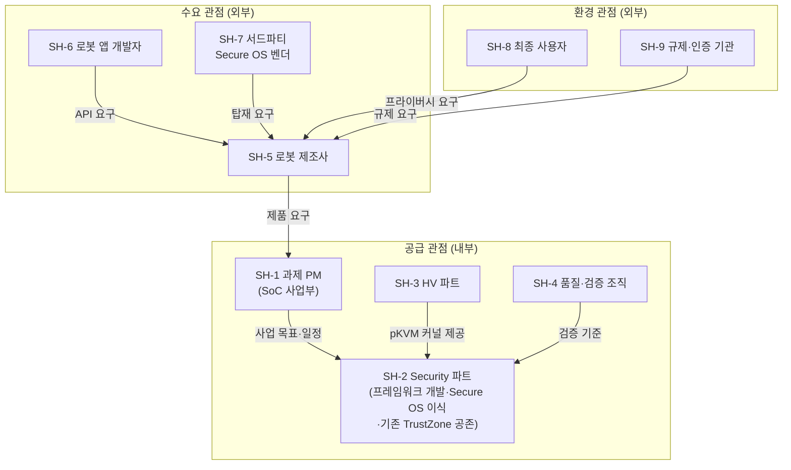

# 요구사항 수집

> 본 문서는 `00_overview.md`(과제 소개)를 기준 문서로 하여, 요구사항 분석의 첫 단계인 **요구사항 수집** 결과를 정리한다.
> 진행 순서: **요구사항 수집(본 문서)** → 요구사항 도출(FR/QA/CONST) → 품질 속성 선정(QAW) → Architectural Driver 선정

---

## 1. 주요 Stakeholder 정의

### 1.1 Stakeholder 식별 기준

본 과제의 산출물은 "로봇용 커스텀 SoC와 함께 제공되는 보안 프레임워크"이므로, 다음 세 관점에서 이해관계자를 식별한다.

- **공급 관점**: 프레임워크를 개발·검증·유지하는 조직
- **수요 관점**: 프레임워크를 채택·사용·확장하는 고객과 개발자
- **환경 관점**: 프레임워크가 충족해야 할 규제·인증·보안 환경을 형성하는 주체

### 1.2 Stakeholder 목록

| ID | Stakeholder | 구분 | 역할 및 관심사 | 영향도 |
|----|-------------|------|---------------|:------:|
| SH-1 | 과제 PM (SoC 사업부) | 내부/공급 | 로봇용 커스텀 SoC 사업 진입. 일정(10개월) 내 레퍼런스 시나리오 검증과 사업 경쟁력(확장성) 확보 | 상 |
| SH-2 | Security 파트 (국내 9명 + 해외 SRCX 연구소 5명) | 내부/공급 | pVM 생명주기 미들웨어·커널 드라이버·보안 통신 등 프레임워크 본체 개발. **기존 Secure OS의 pVM 이식·수정**(SRCX 담당) 및 키 관리·인증 등 **기존 TrustZone Secure OS 기능의 무중단 유지·공존**(회귀 방지)까지 담당. 구조 명확성, 명확한 포팅 인터페이스, 공존 시 회귀 방지에 관심 | 상 |
| SH-3 | HV 파트 (3명) | 내부/공급 | 기 포팅된 pKVM 커널(EL2) 제공·유지. 프레임워크가 요구하는 hypercall 인터페이스 협의 | 중 |
| SH-4 | 품질·검증 조직 | 내부/공급 | 격리 보장·성능 목표의 객관적 검증. 시험 가능한 형태의 요구사항 정의에 관심 | 중 |
| SH-5 | 로봇 제조사 (SoC 직접 고객) | 외부/수요 | 카메라 영상·AI 모델 보호를 전제 조건으로 하는 제품 출시. Linux(Yocto 등) 네이티브 동작, 실시간 성능, 보안 사고 방지 | 상 |
| SH-6 | 로봇 애플리케이션 개발자 | 외부/수요 | 프레임워크 API를 사용해 보안 워크로드를 개발·탑재. API 사용성·문서·디버깅 용이성에 관심 | 중 |
| SH-7 | 서드파티 Secure OS 벤더 | 외부/수요 | 자사 Secure OS를 pVM으로 탑재·판매. 프레임워크 수정 없는 탑재 구조(플러그인형)와 이식 비용에 관심 | 중 |
| SH-8 | 최종 사용자 (가정·공장) | 외부/환경 | 가정 내 영상·공장 설계 데이터의 프라이버시. 직접 접점은 없으나 보안 요구의 근원 | 중 |
| SH-9 | 규제·인증 기관 | 외부/환경 | GDPR·개인정보보호법 등 영상·생체 데이터 처리의 기술적 격리 요구. 격리 증빙 가능성에 관심 | 중 |

### 1.3 Stakeholder 관계

---

## 2. 수집 방법

| # | 방법 | 대상 Stakeholder | 수집 내용 |
|---|------|------------------|-----------|
| M-1 | **문서 분석** | SH-1, SH-3 | 과제 소개서(`00_overview.md`), 2026-05-29 리뷰 회의 결정사항(과제명 변경, pKVM 포팅 제외, Secure OS 이식 포함), 보안 사고 사례 자료 [A][C][F][G] |
| M-2 | **이해관계자 인터뷰** | SH-1, SH-2, SH-5 | 사업부의 SoC 사업 전략, 로봇 제조사의 제품 요구(기술 미팅), Security 파트 내 기존 TrustZone Secure OS 운영 측면의 공존 조건 |
| M-3 | **레퍼런스 시나리오 워크스루** | SH-2, SH-5, SH-6 | Secure Vision AI 파이프라인(캡처→ISP→NPU 추론→판단 결과 전달)을 단계별로 추적하며 기능·품질 요구 식별 |
| M-4 | **경쟁·유사 솔루션 벤치마킹** | SH-2, SH-7 | Android AVF(Microdroid, VirtualizationService) 구조 분석을 통한 기능 기준선 및 차별화 지점(Linux 네이티브, Secure OS 수용, TrustZone 공존) 식별 |
| M-5 | **표준·규제 분석** | SH-9 | GDPR·개인정보보호법의 기술적 격리 요구, ARM Architecture Reference Manual(EL2, Stage-2, FEAT_VHE) 제약 |
| M-6 | **기술 검증(PoC)·파트 간 기술 협의** | SH-2, SH-3 | pKVM hypercall 인터페이스 범위, HW IP(ISP·NPU) passthrough 가능 범위, Secure OS 이식(SRCX 담당) 작업량 등 기술 제약 수집 |
| M-7 | **품질 속성 워크숍(QAW)** | 전체 | 수집된 VOS를 품질 시나리오로 구체화하고 우선순위 결정 (3단계 "품질 속성 선정"에서 수행) |

---

## 3. VOS (Voice of Stakeholder) 정리

수집 방법(M-1~M-6)을 통해 확보한 이해관계자의 원시 요구를 VOS로 정리한다.
각 VOS는 이후 단계(요구사항 도출)에서 FR(기능 요구사항), QA(품질 속성), CONST(제약사항)로 분류·정제된다.

| ID | Stakeholder | VOS (원시 요구) | 출처 | 요구 유형(예상) |
|----|-------------|-----------------|------|----------------|
| VOS-01 | SH-5 로봇 제조사 | "Host OS(Linux 커널)가 해킹되더라도 카메라 영상 원본, AI 모델 가중치, 추론 중간 데이터는 절대 노출되면 안 된다." | M-2, M-1(R-1) | QA(보안) |
| VOS-02 | SH-5 로봇 제조사 | "영상 처리와 AI 추론은 ISP·NPU 하드웨어 가속을 그대로 써야 한다. SW 처리만으로는 실시간성이 안 나온다." | M-2, M-3(R-2) | FR + QA(성능) |
| VOS-03 | SH-5 로봇 제조사 | "우리 제품은 Yocto/Ubuntu 기반 Linux다. Android 스택에 종속된 솔루션은 채택할 수 없다." | M-2, M-4 | CONST |
| VOS-04 | SH-5 로봇 제조사 | "보안 기능을 켰을 때 전력·메모리 오버헤드가 과도하면 제품에 탑재할 수 없다." | M-2 | QA(성능·자원 효율) |
| VOS-05 | SH-1 과제 PM | "Secure Vision AI 하나만 되는 솔루션은 의미가 없다. 이후 시나리오(개인정보 처리, 펌웨어 보호 등)를 프레임워크 수정 없이 수용해야 SoC 사업 경쟁력이 생긴다." | M-2, M-1(4절) | QA(확장성) |
| VOS-06 | SH-1 과제 PM | "2026-10-30까지 Secure Vision AI End-to-End 데모가 동작해야 한다. 인력은 Security 9명, HV 3명, SRCX 5명이다." | M-1(5.1절) | CONST |
| VOS-07 | SH-2 Security 파트 | "Secure Camera 도메인과 Secure AI 도메인은 서로 독립적으로 동시에 떠 있어야 하고, 한쪽이 침해돼도 다른 쪽은 안전해야 한다." | M-3(R-3) | FR + QA(보안) |
| VOS-08 | SH-2 Security 파트 | "ISP·NPU를 pVM에 할당할 때 DMA 경로(SMMU/IOMMU)까지 막지 않으면 격리가 깨진다." | M-6 | QA(보안) |
| VOS-09 | SH-2 Security 파트 | "두 격리 도메인 간(Camera→AI), pVM↔Host 간 데이터 전달은 노출 없이, 그리고 영상 파이프라인을 막지 않을 만큼 빠르게 이뤄져야 한다." | M-3 | FR + QA(성능·보안) |
| VOS-10 | SH-3 HV 파트 | "pKVM 커널(EL2)은 기 포팅된 것을 그대로 쓴다. EL2 코드 수정이 필요한 설계는 받을 수 없고, 제공되는 hypercall 인터페이스 범위 안에서 설계해야 한다." | M-6, M-1(5.2절) | CONST |
| VOS-11 | SH-2 Security 파트 (SRCX, Secure OS 이식) | "기존 Secure OS를 pVM에 올리는 이식 작업의 인터페이스가 명확해야 한다. 프레임워크가 바뀔 때마다 이식을 다시 하는 구조면 일정 내 불가능하다." | M-6 | QA(변경 용이성·이식성) |
| VOS-12 | SH-2 Security 파트 (기존 TrustZone 공존) | "키 관리·인증 등 기존 TrustZone TEE 기능은 지금 그대로 동작해야 한다. 신규 프레임워크 도입으로 기존 SMC 경로가 깨지면 안 된다." | M-2(R-5) | FR + CONST |
| VOS-13 | SH-4 품질·검증 조직 | "Host 침해 시에도 격리가 유지된다는 주장을 객관적으로 검증할 수 있어야 한다. 검증 불가능한 보안 요구는 받을 수 없다." | M-2 | QA(시험 용이성) |
| VOS-14 | SH-6 로봇 앱 개발자 | "pVM 생성·실행·통신을 위한 API가 단순하고 문서화되어 있어야 한다. 보안 전문가가 아니어도 보안 워크로드를 탑재할 수 있어야 한다." | M-3 | QA(사용성) |
| VOS-15 | SH-7 서드파티 Secure OS 벤더 | "우리 Secure OS를 프레임워크 소스 수정 없이 패키징해서 pVM으로 탑재·교체할 수 있어야 한다. 펌웨어 재배포 방식은 받아들일 수 없다." | M-4(R-4) | FR + QA(확장성) |
| VOS-16 | SH-8 최종 사용자 | "로봇이 찍는 우리 집 영상이 유출될까 불안하다. 사고가 났다는 뉴스(Ecovacs, IP카메라 12만 대)를 보면 사고 싶지 않다." | M-1(1.1절) | QA(보안) — 근원 요구 |
| VOS-17 | SH-9 규제·인증 기관 | "GDPR·개인정보보호법상 영상·생체 데이터 처리 과정의 기술적 격리를 증빙해야 한다." | M-5 | CONST + QA(보안) |
| VOS-18 | SH-2 Security 파트 | "pVM이 비정상 종료되거나 보안 워크로드가 오동작해도 Host와 다른 pVM, 그리고 로봇의 기본 동작은 영향받지 않아야 한다." | M-3, M-6 | QA(가용성) |

### 3.1 VOS와 기준 문서 요구사항(R-1~R-5)의 대응

`00_overview.md` 2.2절의 시나리오 요구사항은 VOS의 핵심을 선반영한 것이며, 대응 관계는 다음과 같다. R-1~R-5에 직접 대응되지 않는 VOS(굵게)는 다음 단계(요구사항 도출)에서 추가로 다룬다.

| 기준 문서 요구사항 | 대응 VOS |
|--------------------|----------|
| R-1 Host 비신뢰 격리 | VOS-01, VOS-16, VOS-17 |
| R-2 HW 고성능 연산 지원 | VOS-02, VOS-08 |
| R-3 다중 격리 도메인 동시 운용 | VOS-07, VOS-09 |
| R-4 동적 확장성 | VOS-05, VOS-15 |
| R-5 기존 Secure OS 상호운용 | VOS-11, VOS-12 |
| (R-1~R-5 외 신규) | **VOS-03(Linux 네이티브), VOS-04(자원 효율), VOS-06(일정·인력), VOS-10(pKVM 전제), VOS-13(시험 용이성), VOS-14(사용성), VOS-18(가용성)** |

---

## 다음 단계

수집된 VOS-01~VOS-18을 입력으로, **요구사항 도출** 단계에서 FR(기능 요구사항), QA(품질 속성), CONST(제약사항)를 도출한다.
