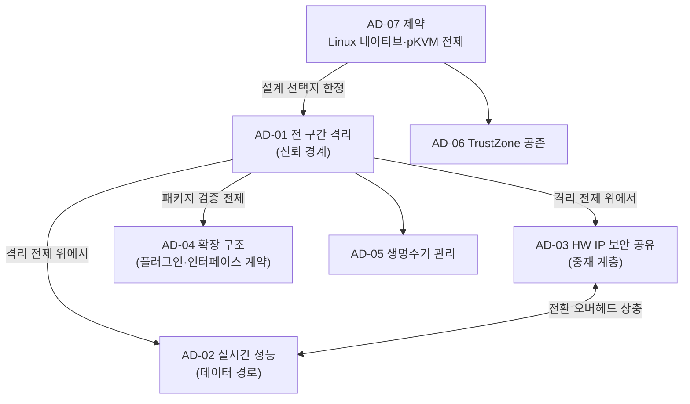

# Architectural Driver 선정

> 본 문서는 요구사항 분석의 마지막 단계로, `02_requirements.md`(FR·CONST)와 `03_quality_attribute_workshop.md`(핵심 QA)를 입력으로 아키텍처 설계를 주도할 **Architectural Driver(AD)** 를 선정한다.
> 진행 순서: 요구사항 수집 → 요구사항 도출 → 품질 속성 선정(QAW) → **Architectural Driver 선정(본 문서)**

---

## 1. 선정 기준

Architectural Driver는 아키텍처 구조(컴포넌트 분할, 신뢰 경계, 인터페이스, 데이터 경로)를 직접 결정하는 요구사항이다. 다음 기준으로 선정한다.

- **구조 결정성**: 이 요구사항을 충족하는 방식에 따라 아키텍처의 큰 틀이 달라지는가
- **실패 비용**: 미충족 시 과제 목표(사업 진입, 레퍼런스 시나리오, 확장성)가 무산되는가
- **변경 비용**: 설계 후반에 바꾸기 어려운 결정을 강제하는가

입력은 다음과 같다.

| 입력 | 출처 | 내용 |
|------|------|------|
| 기능 요구사항 | `02_requirements.md` | FR-01~FR-09 |
| 핵심 품질 속성 | `03_quality_attribute_workshop.md` | 1순위: QS-01, QS-03, QS-04, QS-07, QS-11 / 2순위: QS-02, QS-05, QS-08 |
| 제약사항 | `02_requirements.md` | CONST-01~CONST-06 |

---

## 2. Architectural Driver 목록

### AD-01: Host 비신뢰 전제의 전 구간 격리 [품질 — 보안]

| 항목 | 내용 |
|------|------|
| 내용 | Host OS(Linux 커널 포함)를 신뢰하지 않는 전제에서, pVM의 메모리·통신·HW 접근 전 구간이 격리되어야 한다. 침해 영향은 도메인 단위로 한정된다. |
| 출처 | QS-01, QS-02, FR-01, FR-04, FR-05 |
| 구조 영향 | 시스템의 **신뢰 경계**를 결정한다. 신뢰 주체는 EL2 Hypervisor(pKVM)뿐이며, Host에 위치하는 프레임워크 컴포넌트(미들웨어·드라이버)는 모두 비신뢰 영역으로 설계해야 한다. 즉 프레임워크 자신도 공격자일 수 있다는 전제에서, 보안 보장은 Host 컴포넌트의 올바름이 아니라 Stage-2·SMMU 메커니즘에만 의존하도록 책임을 배치해야 한다. |

### AD-02: 격리 환경에서의 실시간 파이프라인 성능 [품질 — 성능]

| 항목 | 내용 |
|------|------|
| 내용 | 격리 경계를 넘는 데이터 경로(캡처→ISP→도메인 간 전달→NPU 추론)에서 실시간 처리 목표(30fps, E2E 100ms 이하 — 가정치)를 달성해야 한다. |
| 출처 | QS-04, QS-05, FR-04 |
| 구조 영향 | **데이터 경로 설계**를 결정한다. 격리 경계 통과 횟수를 최소화하는 파이프라인 배치, zero-copy 공유 메모리 채널, 대용량 데이터와 제어 신호의 경로 분리(데이터/제어 분리) 구조를 강제한다. AD-01과 직접 상충하므로, 격리를 유지하면서 복사를 제거하는 채널 구조가 설계의 중심 문제가 된다. |

### AD-03: 단일 컨텍스트 HW IP의 보안 공유 [품질 — 보안·성능 / 제약]

| 항목 | 내용 |
|------|------|
| 내용 | 다중 컨텍스트를 지원하지 않는 ISP·NPU를 Host와 pVM이 동시에 사용해야 한다. pVM 사용 구간의 DMA 격리와 사용 주체 전환 시 잔류 데이터 소거를 보장하면서, 전환 오버헤드는 양쪽 실시간성을 해치지 않아야 한다. |
| 출처 | QS-03, QS-11, FR-03, CONST-05 |
| 구조 영향 | **HW IP 중재 계층**이라는 신규 구조 요소를 강제한다. 중재자의 위치(Host 커널/전용 pVM/EL2), 스케줄링 단위(잡/프레임), SMMU 재구성과 소거 시점이 보안과 성능을 동시에 결정한다. 본 과제 고유의 난제로, 세 핵심 QA가 모두 걸리는 지점이다. |

### AD-04: 프레임워크 수정 없는 워크로드 확장 구조 [품질 — 확장성]

| 항목 | 내용 |
|------|------|
| 내용 | 신규 보안 워크로드와 서드파티 Secure OS를 프레임워크 코어 수정 없이(0 LoC) 패키징·탑재만으로 수용해야 하며, Secure OS 교체 시 무관 SW의 수정이 없어야 한다. |
| 출처 | QS-07, QS-08, FR-06, FR-07, CONST-06 |
| 구조 영향 | **플러그인형 구조와 안정적 인터페이스 계약**을 강제한다. 워크로드 패키지 형식(이미지·매니페스트·서명), 프레임워크-게스트 간 ABI(부팅 규약, 가상 디바이스, 통신 규약)를 초기에 고정해야 하며, 이 인터페이스의 안정성이 확장성의 성패를 결정한다. 동적 탑재가 공격 경로가 되지 않도록 패키지 검증 구조(AD-01과의 접점)가 전제된다. |

### AD-05: 다중 pVM 생명주기 관리 [기능]

| 항목 | 내용 |
|------|------|
| 내용 | 복수의 pVM을 독립적으로 생성·운용·종료하고, 장애 시 자원을 안전하게 회수·재시작하는 Linux 네이티브 관리 체계가 필요하다. |
| 출처 | FR-01, FR-02, FR-09, QS-09 |
| 구조 영향 | 프레임워크 본체(미들웨어)의 **책임 분할**을 결정한다. pVM 단위 독립 관리(한 pVM의 장애·재시작이 다른 pVM 관리에 영향 없음), 격리 메모리의 안전 회수 절차(소거 후 반환)가 컴포넌트 경계에 반영되어야 한다. |

### AD-06: 기존 TrustZone TEE와의 공존 [기능 / 제약]

| 항목 | 내용 |
|------|------|
| 내용 | 기존 TrustZone Secure OS의 SMC 경로와 TEE 기능(키 관리·인증)을 변경 없이 유지하면서, pVM 워크로드가 기존 TEE 기능을 호출할 수 있어야 한다. |
| 출처 | FR-08, CONST-03 |
| 구조 영향 | EL2(pKVM)와 EL3(Secure Monitor) 사이의 **세계 간 호출 경로 설계**를 강제한다. pVM에서 발생한 TEE 요청의 라우팅(pVM→Host 경유 여부, SMC 포워딩)과 기존 경로의 무회귀를 동시에 만족하는 연동 계층이 필요하다. |

### AD-07: Linux 네이티브, pKVM hypercall 범위 내 설계 [제약]

| 항목 | 내용 |
|------|------|
| 내용 | Android 스택 의존 없이 Linux에서 동작해야 하며, 기 포팅된 pKVM 커널을 전제로 EL2 코드 수정 없이 제공되는 hypercall 인터페이스 범위 안에서 설계해야 한다. |
| 출처 | CONST-01, CONST-02 |
| 구조 영향 | 설계 선택지의 **하한선과 상한선**을 동시에 정한다. 모든 격리·할당 기능은 표준 Linux 커널 인터페이스와 기존 hypercall의 조합으로 실현해야 하므로, hypercall 범위에 대한 HV 파트와의 조기 인터페이스 확정이 설계 착수 조건이 된다. |

---

## 3. Driver 우선순위와 관계

### 3.1 우선순위

| 순위 | Driver | 사유 |
|:----:|--------|------|
| 1 | AD-01 (전 구간 격리) | 신뢰 경계는 모든 구조 결정의 전제. 가장 먼저 확정해야 하며 사후 변경 비용이 최대 |
| 2 | AD-03 (HW IP 보안 공유) | 세 핵심 QA가 교차하는 고유 난제. 실현 가능성이 과제 성패를 좌우하므로 조기 PoC 필요 |
| 3 | AD-02 (실시간 성능) | AD-01·AD-03의 해법이 성능 목표를 만족하는지로 구조 후보가 걸러짐 |
| 4 | AD-04 (확장 구조) | 사업 경쟁력의 핵심. 인터페이스 계약은 초기 고정이 필요하나, 구조 자체는 AD-01~03 위에 성립 |
| 5 | AD-05~AD-07 | 기능 배치와 제약 준수. 상위 driver의 해법 안에서 설계 |

### 3.2 Driver 간 관계

---

## 4. 요구사항 분석 단계 완료 요약

| 단계 | 산출물 | 결과 |
|------|--------|------|
| 1. 요구사항 수집 | `01_requirements_collection.md` | Stakeholder 9개, 수집 방법 7개, VOS 18건 |
| 2. 요구사항 도출 | `02_requirements.md` | FR 9건, QA 11건, CONST 6건 (VOS 추적성 확보) |
| 3. 품질 속성 선정 | `03_quality_attribute_workshop.md` | 시나리오 QS-01~11, 핵심 QA: 보안·성능·확장성 |
| 4. Architectural Driver 선정 | `04_architectural_drivers.md` (본 문서) | AD-01~AD-07, 1순위 AD-01(신뢰 경계) |

## 다음 단계

선정된 AD-01~AD-07을 입력으로 아키텍처 설계 단계로 진입한다. 우선순위에 따라 신뢰 경계 확정(AD-01)과 HW IP 중재 구조의 실현 가능성 검증(AD-03 PoC)을 먼저 수행하고, 이를 기준으로 후보 구조를 설계·평가한다.
