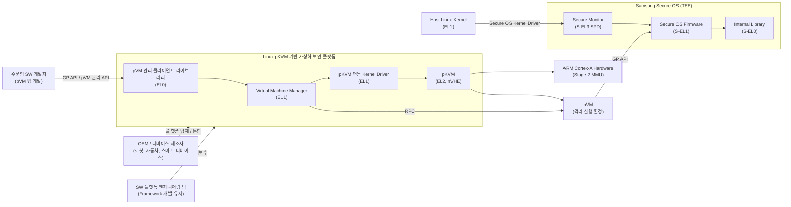

# 시스템 정의

## 시스템 개요

### 시스템 이름

Linux pKVM 기반 가상화 보안 플랫폼

### 시스템 목적

ARM TrustZone의 이진 격리 구조 한계를 극복하고, ARM 기반 Linux 환경에서 Stage-2 Page Table 기반 다중 격리 도메인을 통해 다양한 보안 시나리오에 대응하는 가상화 플랫폼이다.

로봇, 스마트 디바이스, 자동차 등 임베디드 Linux 디바이스는 사이버 공격에 노출되고 있으며, 기존 ARM TrustZone의 이진 격리 구조(REE/TEE)로는 Secure AI, Secure Camera, 개인정보 보호 처리, 펌웨어 역분석 방지 등 다수의 독립 보안 도메인을 동시에 수용할 수 없다.

Linux pKVM 기반 가상화 보안 플랫폼는 pKVM(Protected KVM)을 기반으로 복수의 pVM(Protected Virtual Machine)을 실행·관리하고, 각 pVM을 Host OS로부터 완전히 격리하여 다양한 보안 워크로드를 안전하게 실행할 수 있는 플랫폼을 제공한다. Android AVF와 동등하거나 우수한 성능·가용성·보안·변경 용이성을 목표로 하되, Android 종속성 없이 Linux에 최적화된 독자적인 Framework로 구현한다.

---

## 시스템 범위 (TBD)

### 포함 기능

- **pKVM (Linux용)**: EL2 nVHE 모드 동작, Stage-2 Page Table 기반 물리 메모리 격리
- **Virtual Machine Manager (VMM)**: pVM 생명주기 관리 (생성, 실행, 중단, 소멸)
- **pVM 이미지 서명 검증**: 미서명 pVM 실행 차단, 무결성 보장
- **pVM 관리 클라이언트 라이브러리 (EL0)**: 주문형 SW 개발자가 pVM을 제어하는 API
- **pKVM 연동 Kernel Driver (EL1)**: Host Linux 커널과 pKVM 간 인터페이스
- **Secure OS Kernel Driver (EL1)**: Samsung Secure OS와의 커널 수준 연동
- **Secure OS Client Library (EL0)**: GP API를 통해 TEE 서비스에 접근하는 REE 측 라이브러리
- **GP API (pVM 내부 지원)**: pVM에서 실행되는 보안 워크로드가 표준 GP API로 TEE 서비스 접근
- **Host-pVM RPC**: Host와 pVM 간 양방향 원격 프로시저 호출 인터페이스
- **기존 TrustZone 연동**: S-EL3 Secure Monitor, S-EL1 Samsung Secure OS, S-EL0 Internal Library와의 상호운용성

### 제외 기능

- Android AVF 코드 포팅 또는 재사용
- x86, RISC-V 아키텍처 지원 (ARM 전용, 추후 검토)
- 클라우드 환경 배포 (Edge/Embedded 디바이스 우선)

### 범위 설정 근거

- ARM nVHE 기반 pKVM이 Stage-2 격리의 핵심 기술적 토대이므로, ARM 아키텍처에 집중하여 기술 완성도를 먼저 확보한다.
- Android AVF는 참조 모델이지 이식 대상이 아니다. Linux 커널 생태계와 삼성 Secure OS와의 연동에 최적화된 독자 구현을 목표로 한다.
- 클라우드 확장은 임베디드 플랫폼으로서의 기반이 갖춰진 이후 단계로 미룬다.

---

## 시스템 경계 (TBD)

### 사용자 유형

- **주문형 SW 개발자**: pVM에서 동작할 보안 워크로드(Secure AI, Secure Camera, 개인정보 처리 앱 등)를 개발하는 엔지니어. pVM 관리 클라이언트 라이브러리와 GP API를 통해 Framework와 상호작용한다.
- **OEM / 디바이스 제조사**: 로봇, 자동차, 스마트 디바이스에 이 Framework를 탑재하여 제품 보안을 강화하는 조직. 플랫폼 통합 및 디바이스별 구성(Configuration)을 담당한다.
- **SW 플랫폼 엔지니어링 팀**: Framework 자체를 설계·구현·유지보수하는 내부 개발팀. 모든 계층(EL0~EL2) 및 TEE 연동 인터페이스를 관리한다.

### 외부 환경

- **Samsung Secure OS (TEE)**: S-EL1 Firmware, S-EL0 Internal Library, S-EL3 Secure Monitor로 구성. 기존 TrustZone 기반 TEE 기능을 제공하며, pVM에서 GP API를 통해 접근한다.
- **ARM Cortex-A Hardware**: Stage-2 MMU, EL2 nVHE 모드를 지원하는 물리 하드웨어. Framework의 핵심 격리 기능이 하드웨어 수준에 의존한다.
- **Host Linux Kernel**: EL1에서 동작하는 Host OS 커널. pKVM 연동 Driver와 Secure OS Kernel Driver를 통해 Framework 및 TEE와 통신한다.
- **pVM (Protected Virtual Machine)**: Framework가 생성·관리하는 격리 실행 환경. Host OS에서 물리 메모리에 접근할 수 없으며, 보안 워크로드가 내부에서 실행된다.

### 인터페이스 (고수준)

- **pVM 관리 API (EL0 Client Library)**: 주문형 SW 개발자가 pVM 생성, 이미지 로드, 실행, 종료를 요청하는 인터페이스
- **GP API (pVM → TEE)**: pVM 내 보안 워크로드가 Samsung Secure OS의 TEE 서비스에 접근하는 표준 GlobalPlatform 인터페이스
- **Host-pVM RPC**: Host와 pVM 간 데이터·서비스 요청을 전달하는 양방향 원격 프로시저 호출. pVM 간 직접 통신은 허용하지 않음.
- **EL1-EL2 하이퍼바이저 호출 인터페이스**: Kernel Driver가 pKVM에 pVM 생명주기 명령을 전달하는 저수준 인터페이스
- **EL1-EL3 Secure Monitor Call (SMC)**: Secure OS Kernel Driver가 TrustZone Secure Monitor를 통해 TEE 서비스를 호출하는 인터페이스

---

## 제약사항 (TBD)

### 기술적 제약사항

- ARM Cortex-A (nVHE 지원 SoC)로 한정. nVHE 미지원 SoC는 대상에서 제외된다.
- Host Linux 커널 버전 **6.12 이상** 필요. pKVM 통합 및 Stage-2 Page Table 관리 기능이 요구된다.
- EL2 TCB(Trusted Computing Base) 최소화 원칙. EL2에는 pKVM 핵심 코드만 상주하며, 불필요한 기능의 포함을 금지한다.
- pVM 간 직접 메모리 공유 불허. Stage-2 격리 원칙을 유지하며, pVM 간 통신은 Host를 경유한 RPC만 허용한다.
- pVM 이미지 서명 검증 필수. 미서명 pVM은 실행이 차단된다.
- pVM 내 GP(GlobalPlatform) API 필수 지원. pVM에서 실행되는 보안 워크로드가 표준 GP API를 통해 TEE 서비스에 접근할 수 있어야 한다.

### 비기술적 제약사항

- Android AVF 코드를 포팅하거나 재사용하지 않는다. Linux에 최적화된 독자적인 구현이 요구된다.
- 클라우드 배포보다 Edge/Embedded 디바이스(로봇, 자동차, 스마트 디바이스)를 우선 대상으로 한다.

### 품질 목표

- CPU/메모리 집약 워크로드 오버헤드: 네이티브 Linux 대비 5% 이내
- I/O 집약 워크로드 오버헤드: 네이티브 Linux 대비 10% 이내
- pVM 부팅 시간: 1초 이내
- Host-pVM RPC 레이턴시: 100μs 이내
- 성능, 가용성, 보안, 변경 용이성 4개 품질 지표에서 Android AVF 대비 동등 이상
