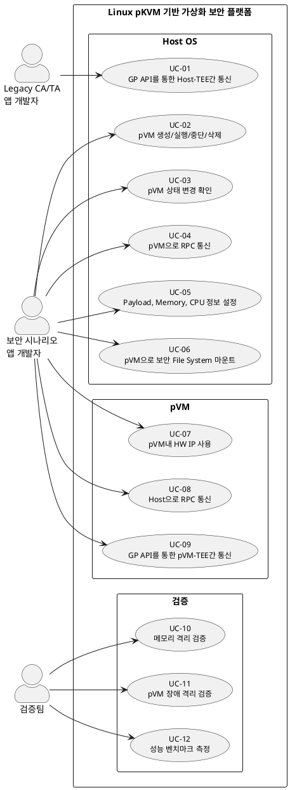

# Use Case 목록

시스템: **Linux pKVM 기반 가상화 보안 플랫폼**

---

## 액터

| ID | 액터 | 설명 |
|----|------|------|
| A1 | Legacy CA/TA 앱 개발자 | GlobalPlatform API 기반 기존 CA(Client Application)를 Host OS에서 실행하는 개발자 |
| A2 | 보안 시나리오 앱 개발자 | Noraml Host Application 및 pVM 기반 보안 워크로드(Secure AI, Secure Camera 등)를 개발하는 개발자 |
| A3 | 검증팀 | 플랫폼의 격리·성능 요구사항을 검증하는 팀 |

---

## Use Case 목록

### Host OS

| UC ID | 이름 | 액터 | 설명 |
|-------|------|------|------|
| UC-01 | GP API를 통한 Host-TEE간 통신 | A1 | CA 앱이 GP Client API를 통해 Host OS에서 Secure OS(TEE)로 통신 |
| UC-02 | pVM 생성/실행/중단/삭제 | A2 | pVM Framework API로 pVM의 전체 생명주기를 관리 |
| UC-03 | pVM 상태 변경 확인 | A2 | 실행 중인 pVM의 상태(실행·중단·오류 등)를 조회 |
| UC-04 | pVM으로 RPC 통신 | A2 | Host OS 앱에서 pVM 내부 서비스를 RPC로 호출 |
| UC-05 | Payload, Memory, CPU 정보 설정 | A2 | pVM 생성 시 워크로드 Payload, 메모리 크기, vCPU 수를 설정 |
| UC-06 | pVM으로 보안 File System 마운트 | A2 | Host OS에서 pVM으로 보안 파일 시스템을 마운트하여 격리된 저장소 제공 |

### pVM

| UC ID | 이름 | 액터 | 설명 |
|-------|------|------|------|
| UC-07 | pVM내 HW IP 사용 | A2 | pVM 내 워크로드가 카메라·NPU 등 HW IP에 직접 접근 |
| UC-08 | Host으로 RPC 통신 | A2 | pVM 내부 서비스가 Host OS 앱으로 RPC 응답을 전달 |
| UC-09 | GP API를 통한 pVM-TEE간 통신 | A2 | pVM 내 앱이 GP Client API를 통해 Secure OS(TEE)와 통신 |

### 검증

| UC ID | 이름 | 액터 | 설명 |
|-------|------|------|------|
| UC-10 | 메모리 격리 검증 | A3 | Stage-2 Page Table 기반으로 Host OS가 pVM 메모리에 접근 불가함을 검증 |
| UC-11 | pVM 장애 격리 검증 | A3 | 단일 pVM 장애 발생 시 Host OS 및 타 pVM이 무중단 유지됨을 검증 |
| UC-12 | 성능 벤치마크 측정 | A3 | 네이티브 Linux 대비 CPU·메모리·I/O·부팅 시간 오버헤드 측정 |

---

## Use Case 상세

### UC-01: GP API를 통한 Host-TEE간 통신

| 항목 | 내용 |
|------|------|
| 액터 | Legacy CA/TA 앱 개발자 (A1) |
| 목적 | Host OS에서 기존 GP Client API를 그대로 사용하여 Secure OS TEE와 통신한다 |
| 사전 조건 | Secure OS가 초기화되어 TA가 로드된 상태, GP Client API 라이브러리 설치 완료 |
| 사후 조건 | TEE 처리 결과가 CA 앱으로 반환된다 |

**기본 흐름**

1. CA 앱이 GP Client API(`TEEC_OpenSession`)로 TEE 세션을 개설한다
2. Secure OS Kernel Driver가 SMC(Secure Monitor Call)를 생성하여 Secure World로 전환한다
3. Secure Monitor(S-EL3)가 요청을 Secure OS(S-EL1)로 전달한다
4. TEE에서 TA가 요청을 처리하고 결과를 반환한다
5. CA 앱이 결과를 수신하고 세션을 종료한다

**예외 흐름**

- TA 로드 실패 시: `TEEC_ERROR_ITEM_NOT_FOUND` 반환
- TEE 통신 타임아웃 시: `TEEC_ERROR_COMMUNICATION` 반환

---

### UC-02: pVM 생성/실행/중단/삭제

| 항목 | 내용 |
|------|------|
| 액터 | 보안 시나리오 앱 개발자 (A2) |
| 목적 | pVM Framework API를 통해 보안 워크로드 pVM의 전체 생명주기(생성·실행·중단·삭제)를 관리한다 |
| 사전 조건 | Hypervisor(pKVM)가 초기화되어 있고, 워크로드 Payload 바이너리가 준비된 상태 |
| 사후 조건 | 요청한 생명주기 전환이 완료되고 상태가 반영된다 |

**기본 흐름**

1. 앱이 pVM Framework API에 Payload 경로와 설정값을 전달하여 생성을 요청한다
2. Framework가 Hypervisor에 pVM 생성을 지시한다
3. Hypervisor가 Stage-2 Page Table로 pVM 전용 메모리 격리 영역을 할당한다
4. pVM이 부팅되어 워크로드가 실행된다
5. 앱이 필요 시 중단(Pause) 또는 삭제(Destroy) API를 호출한다
6. 삭제 시 Hypervisor가 Stage-2 Page Table 매핑을 해제하고 자원을 반납한다

**예외 흐름**

- 메모리 부족 시: 할당 실패 오류 반환, pVM 미생성
- Payload 검증 실패 시: 실행 거부, 오류 코드 반환

---

### UC-03: pVM 상태 변경 확인

| 항목 | 내용 |
|------|------|
| 액터 | 보안 시나리오 앱 개발자 (A2) |
| 목적 | 실행 중인 pVM의 상태(실행·중단·오류·종료 등)를 조회하여 워크로드 진행을 확인한다 |
| 사전 조건 | pVM이 생성된 상태 |
| 사후 조건 | 현재 pVM 상태 정보가 앱에 반환된다 |

**기본 흐름**

1. 앱이 pVM Framework API에 상태 조회를 요청한다
2. Framework가 Hypervisor로부터 pVM 상태를 읽어온다
3. 상태 정보(실행 중·일시 중지·오류·종료)를 앱에 반환한다

**예외 흐름**

- 존재하지 않는 pVM ID 조회 시: 오류 반환

---

### UC-04: pVM으로 RPC 통신

| 항목 | 내용 |
|------|------|
| 액터 | 보안 시나리오 앱 개발자 (A2) |
| 목적 | Host OS 앱이 실행 중인 pVM 내부 서비스를 RPC 인터페이스로 호출한다 |
| 사전 조건 | pVM이 실행 중이고 RPC 서버가 pVM 내에서 구동 중인 상태 |
| 사후 조건 | pVM 내 서비스 처리 결과가 Host OS 앱으로 반환된다 |

**기본 흐름**

1. Host OS 앱이 RPC 채널(vsock 기반)을 통해 pVM에 요청을 전송한다
2. pVM 내 RPC 서버가 요청을 수신하여 처리한다
3. 처리 결과를 RPC 응답으로 Host OS 앱에 반환한다

**예외 흐름**

- pVM 미실행 상태에서 호출 시: 연결 실패 오류 반환
- 레이턴시 목표(100μs) 초과 시: 타임아웃 처리

---

### UC-05: Payload, Memory, CPU 정보 설정

| 항목 | 내용 |
|------|------|
| 액터 | 보안 시나리오 앱 개발자 (A2) |
| 목적 | pVM 생성 전 워크로드 Payload 경로, 메모리 크기, vCPU 수를 설정한다 |
| 사전 조건 | Payload 바이너리가 파일 시스템에 존재하는 상태 |
| 사후 조건 | 설정값이 pVM 생성 파라미터로 확정된다 |

**기본 흐름**

1. 앱이 pVM 설정 구조체에 Payload 경로를 지정한다
2. 메모리 크기(MB 단위)와 vCPU 수를 설정한다
3. 설정값을 UC-02(pVM 생성)에 전달한다

**예외 흐름**

- 시스템 가용 메모리 초과 요청 시: 생성 단계에서 실패 반환

---

### UC-06: pVM으로 보안 File System 마운트

| 항목 | 내용 |
|------|------|
| 액터 | 보안 시나리오 앱 개발자 (A2) |
| 목적 | Host OS에서 pVM으로 보안 파일 시스템을 마운트하여 격리된 저장 공간을 제공한다 |
| 사전 조건 | pVM이 실행 중인 상태 |
| 사후 조건 | pVM 내에서 마운트된 파일 시스템에 접근 가능하고, Host OS는 pVM 내 데이터에 직접 접근 불가 |

**기본 흐름**

1. 앱이 Framework에 보안 파일 시스템 마운트를 요청한다
2. Framework가 가상 블록 디바이스를 pVM에 노출한다
3. pVM 내 워크로드가 마운트된 파일 시스템을 사용한다

**예외 흐름**

- 파일 시스템 무결성 검증 실패 시: 마운트 거부

---

### UC-07: pVM내 HW IP 사용

| 항목 | 내용 |
|------|------|
| 액터 | 보안 시나리오 앱 개발자 (A2) |
| 목적 | pVM 내 워크로드가 카메라, NPU 등 HW IP에 직접 접근하여 격리 환경에서 하드웨어를 사용한다 |
| 사전 조건 | pVM이 실행 중이고, Hypervisor가 해당 HW IP를 pVM에 할당한 상태 |
| 사후 조건 | HW IP가 pVM에 독점 할당되어 Host OS 및 타 pVM은 접근 불가 |

**기본 흐름**

1. pVM 생성 시 HW IP 디바이스를 pVM에 할당하도록 설정한다
2. Hypervisor가 Stage-2 Page Table로 해당 HW IP 물리 주소 영역을 pVM에만 매핑한다
3. pVM 내 워크로드가 HW IP 드라이버를 통해 디바이스를 사용한다

**예외 흐름**

- 이미 다른 pVM에 할당된 HW IP 요청 시: 충돌 오류 반환

---

### UC-08: Host으로 RPC 통신

| 항목 | 내용 |
|------|------|
| 액터 | 보안 시나리오 앱 개발자 (A2) |
| 목적 | pVM 내부 서비스가 처리 결과를 Host OS 앱으로 RPC를 통해 전달한다 |
| 사전 조건 | pVM이 실행 중이고 Host OS 측 RPC 수신 서버가 구동 중인 상태 |
| 사후 조건 | 처리 결과가 Host OS 앱에 전달된다 |

**기본 흐름**

1. pVM 내 서비스가 RPC 채널(vsock 기반)을 통해 Host OS로 결과를 전송한다
2. Host OS 앱이 결과를 수신하여 후처리한다

**예외 흐름**

- Host OS 수신 서버 미구동 시: 연결 실패 처리

---

### UC-09: GP API를 통한 pVM-TEE간 통신

| 항목 | 내용 |
|------|------|
| 액터 | 보안 시나리오 앱 개발자 (A2) |
| 목적 | pVM 내 앱이 GP Client API를 통해 Secure OS(TEE)와 통신하여 TrustZone 기반 기능을 활용한다 |
| 사전 조건 | pVM이 실행 중이고, Secure OS가 초기화되어 TA가 로드된 상태 |
| 사후 조건 | TEE 처리 결과가 pVM 내 앱으로 반환된다 |

**기본 흐름**

1. pVM 내 앱이 GP Client API로 TEE 세션을 개설한다
2. pVM-Secure OS 통신 채널을 통해 SMC가 전달된다
3. TEE에서 TA가 요청을 처리하고 결과를 반환한다

**예외 흐름**

- pVM에서 TEE 통신 채널 미지원 시: 오류 반환

---

### UC-10: 메모리 격리 검증

| 항목 | 내용 |
|------|------|
| 액터 | 검증팀 (A3) |
| 목적 | Stage-2 Page Table 기반 메모리 격리가 정상 동작하여 Host OS가 pVM 메모리에 접근 불가함을 검증한다 |
| 사전 조건 | pVM이 실행 중인 상태, 메모리 접근 테스트 도구 준비 완료 |
| 사후 조건 | Host OS → pVM 메모리 접근 시도가 차단됨을 확인한다 |

**기본 흐름**

1. pVM을 생성하고 테스트 데이터를 pVM 메모리에 기록한다
2. Host OS에서 해당 물리 주소에 직접 접근을 시도한다
3. Stage-2 Page Table 오류로 접근이 차단됨을 확인한다
4. 결과를 검증 보고서에 기록한다

**합격 기준**: Host OS의 pVM 메모리 직접 접근이 100% 차단

---

### UC-11: pVM 장애 격리 검증

| 항목 | 내용 |
|------|------|
| 액터 | 검증팀 (A3) |
| 목적 | 단일 pVM에 장애가 발생하더라도 Host OS 및 타 pVM이 무중단으로 유지됨을 검증한다 |
| 사전 조건 | 복수의 pVM이 실행 중인 상태 |
| 사후 조건 | 장애 pVM만 종료되고 Host OS와 나머지 pVM은 정상 동작을 유지한다 |

**기본 흐름**

1. 다수의 pVM을 실행하고 각 pVM에서 워크로드를 수행한다
2. 특정 pVM에 강제 장애(크래시·무한 루프 등)를 주입한다
3. Host OS와 타 pVM의 정상 동작 여부를 확인한다
4. 장애 pVM이 격리 종료됨을 확인한다

**합격 기준**: 장애 pVM 외 Host OS 및 타 pVM 무중단 유지

---

### UC-12: 성능 벤치마크 측정

| 항목 | 내용 |
|------|------|
| 액터 | 검증팀 (A3) |
| 목적 | 네이티브 Linux 대비 pVM 워크로드의 CPU·메모리·I/O·부팅 시간 오버헤드를 측정한다 |
| 사전 조건 | 벤치마크 도구 및 기준 측정값(네이티브 Linux) 준비 완료 |
| 사후 조건 | 항목별 오버헤드 측정값이 기록되고 목표 기준과 비교된다 |

**기본 흐름**

1. 동일 워크로드를 네이티브 Linux 환경에서 측정하여 기준값을 확보한다
2. 동일 워크로드를 pVM 내에서 실행하여 측정한다
3. 항목별 오버헤드를 산출한다
4. 목표 기준과 비교하여 합격 여부를 판정한다

**목표 기준**

| 항목 | 목표 |
|------|------|
| CPU/메모리 집약 워크로드 | 네이티브 대비 5% 이내 |
| I/O 집약 워크로드 | 네이티브 대비 10% 이내 |
| pVM 부팅 시간 | 1초 이내 |
| Host-pVM RPC 레이턴시 | 100μs 이내 |
