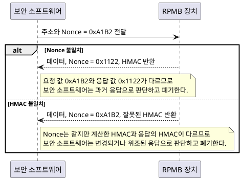
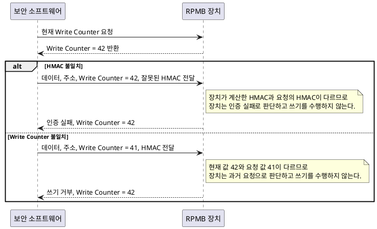

# RPMB 동작 방식

## 개요

`RPMB`(`Replay Protected Memory Block`)는 `eMMC`, `UFS`, `NVMe` 같은 저장장치에 마련된 보호 영역이다. `Authentication Key`, `HMAC-SHA256`, `Write Counter`, `Nonce`를 사용하여 데이터의 위조와 이전 데이터의 재사용을 탐지한다.

## 핵심 요소

| 요소 | 역할 | 생성 및 관리 주체 |
| --- | --- | --- |
| `Authentication Key` | 장치와 보안 소프트웨어가 공유하는 비밀 값이다. 요청과 응답의 인증에 사용한다. | 장치와 보안 소프트웨어가 각각 안전하게 보관한다. |
| `HMAC-SHA256` | 데이터가 올바른 주체에게서 왔고 변경되지 않았는지 확인한다. | 보안 소프트웨어는 쓰기 요청의 `HMAC`을 생성하고, 장치는 읽기 및 결과 응답의 `HMAC`을 생성한다. |
| `Write Counter` | 쓰기가 성공할 때마다 증가한다. 과거 쓰기 요청의 재사용을 차단한다. | 장치가 값을 관리하고 성공한 쓰기 이후 증가시킨다. |
| `Nonce` | 읽기 요청마다 새로 생성하는 임의 값이다. 과거 읽기 응답의 재사용을 탐지한다. | 보안 소프트웨어가 읽기 요청마다 생성한다. |

## 초기 설정

1. 안전한 환경에서 장치에 `Authentication Key`를 등록한다.
2. 보안 소프트웨어도 같은 `Authentication Key`를 안전하게 보관한다.
3. 등록 이후 모든 인증된 읽기와 쓰기는 이 값을 기준으로 검증한다.

## 읽기 과정

1. 보안 소프트웨어가 주소와 새 `Nonce`를 장치에 보낸다.
2. 장치는 데이터, `Nonce`, `HMAC`을 반환한다.
3. 보안 소프트웨어는 `Nonce`와 `HMAC`을 확인한다.
4. 보안 소프트웨어는 두 값이 모두 올바를 때만 데이터를 신뢰한다.

### 읽기 실패

## 쓰기 과정

1. 보안 소프트웨어가 현재 `Write Counter`를 읽는다.
2. 보안 소프트웨어는 데이터, 주소, `Write Counter`로 `HMAC`을 생성하여 장치에 보낸다.
3. 장치는 `HMAC`과 `Write Counter`를 확인한다.
4. 장치는 검증에 성공하면 데이터를 기록하고 `Write Counter`를 증가시킨다.
5. 보안 소프트웨어는 장치가 반환한 결과의 `HMAC`을 확인한다.

### 쓰기 실패

## 보안 범위

- 장치는 `Write Counter`가 맞지 않는 과거 쓰기 요청을 거부한다.
- 보안 소프트웨어는 `Nonce`가 맞지 않는 과거 읽기 응답을 거부한다.
- 보안 소프트웨어는 `HMAC` 검증으로 데이터 변경을 탐지한다.
- `RPMB`는 데이터 암호화를 보장하지 않는다.
- 사용자는 `Authentication Key`가 노출된 경우 `RPMB`의 보호 기능을 신뢰할 수 없다.
