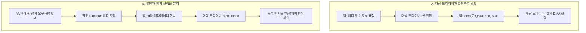

# 드라이버 할당 버퍼와 외부 버퍼 import의 품질 트레이드오프

조사일: 2026-09-05. Linux 공식 문서의 공개 API와 설계 계약을 기준으로 분석한다. 특정 SoC/BSP의 드라이버 구현이나 성능을 실측한 결과는 아니다. 문서에 명시된 API 동작에는 출처를 붙였으며, 품질 비교와 권고는 그 계약을 바탕으로 한 설계 분석이다.

**장치가 정해진 스트리밍 시스템에서는 드라이버가 버퍼 풀까지 관리하는 구조가 상태와 검증 범위를 제한하기 쉽다. 여러 장치가 같은 데이터를 처리하는 시스템에서는 할당자를 분리하고 버퍼를 import하는 구조가 공유와 재사용에 유리하다. 주요 교환관계는 제어 범위를 좁혀 얻는 단순성·예측 가능성과, 공유 범위를 넓혀 얻는 자원 효율·유연성이다.**

다만 이 특성은 절대적인 우열이 아니다. 외부 버퍼도 미리 할당하고 등록하여 고정 풀로 운영할 수 있고, 드라이버가 할당한 버퍼도 외부로 공유할 수 있다. 품질을 결정하는 것은 할당 위치만이 아니라 지원하는 버퍼 종류, 접근권 전환, 자원 상한과 장애 복구 계약이다.

## 1. 비교 대상을 정확히 정의하기

### 1.1 V4L2와 DRM/GEM은 서로 반대되는 할당 모델이 아니다

| 질문에서 떠올린 구조 | Linux에서의 정확한 의미 |
|---|---|
| V4L2처럼 커널이 생성하고 앱이 deq/enq | 대표적으로 `V4L2_MEMORY_MMAP`: 앱이 `VIDIOC_REQBUFS`로 요청하면 대상 드라이버가 버퍼를 마련한다. 필요하면 앱에 `mmap`하고, `QBUF/DQBUF`로 사용 순서를 관리한다. |
| DRM/GEM처럼 앱이 생성하여 커널에 전달 | 일반적인 GEM도 객체와 backing memory를 커널이 관리한다. 앱이 생성 ioctl을 호출하고 handle로 작업을 제출하는 것을 사용자 공간에서 물리 메모리를 직접 할당하는 것과 구분해야 한다. |
| 다른 곳에서 마련한 버퍼를 대상 드라이버에 전달 | DMA-HEAP, 다른 장치 드라이버 등의 allocator가 만든 DMA-BUF를 fd로 받아 import하는 경우가 비교 의도에 가장 가깝다. 이 allocator 역시 커널 안에 있을 수 있다. |

GEM은 객체 생성과 실제 backing memory 마련을 구분하며, 모든 객체가 같은 메모리 배치나 할당 시점을 사용하는 것은 아니다. GEM handle은 해당 DRM 파일의 이름 공간에 속하며, 공유에는 PRIME/DMA-BUF 같은 별도 경로를 사용한다. [GEM 생성·수명·이름 관리](https://docs.kernel.org/gpu/drm-mm.html#gem-objects-creation), [DMA-HEAP](https://docs.kernel.org/userspace-api/dma-buf-heaps.html)

V4L2도 `V4L2_MEMORY_DMABUF`로 외부 버퍼를 받아 **동일하게 `QBUF/DQBUF`를 사용**한다. 반대로 MMAP 버퍼를 `VIDIOC_EXPBUF`로 DMA-BUF fd로 내보낼 수도 있다. 각 기능의 지원 여부는 대상 드라이버에서 확인해야 한다. [V4L2 DMA-BUF import](https://docs.kernel.org/userspace-api/media/v4l/dmabuf.html), [V4L2 DMA-BUF export](https://docs.kernel.org/userspace-api/media/v4l/vidioc-expbuf.html)

따라서 이 문서는 다음 두 구조를 비교한다.

- **A — 대상 드라이버가 할당까지 담당:** 장치를 실행하는 드라이버가 장치용 버퍼 풀도 마련하고 관리한다.
- **B — 할당과 장치 실행을 분리:** 앱 또는 상위 관리자가 별도 allocator를 선택하고, 대상 드라이버는 전달받은 버퍼를 검증·import하여 사용한다. 주된 비교 대상은 참조 계수가 있는 DMA-BUF다.

여기서 “외부”는 **대상 장치 드라이버의 외부**라는 뜻이다. 같은 GEM 드라이버가 생성한 객체에 handle을 붙여 제출하는 것만으로 B라고 분류하지 않는다.

### 1.2 독립적으로 결정해야 하는 네 가지 축

| 설계 축 | 결정할 내용 | 혼동하면 생기는 오류 |
|---|---|---|
| 할당 정책 | 누가 크기·개수·메모리 영역·배치를 선택하는가? | 앱이 요청했으므로 커널이 메모리를 관리하지 않는다고 생각한다. |
| 저장 수명 | 어떤 참조가 남아 있을 때 메모리를 유지하는가? | `close(fd)`가 곧 DMA 중인 메모리의 즉시 해제라고 생각한다. |
| 현재 접근권과 완료 | 누가 읽고 쓸 수 있고, 언제 다음 주체가 재사용하는가? | refcount가 남아 있으니 덮어써도 안전하다고 생각한다. |
| 준비 시점 | 언제 할당·import·DMA mapping을 수행하고 얼마나 재사용하는가? | 외부 버퍼는 프레임마다 새로 할당하거나 매핑해야 한다고 생각한다. |

**할당·수명 관리와 작업 큐는 결합할 수도, 분리할 수도 있다.** A/B의 품질을 비교할 때 고정 풀과 동적 할당, 단일 장치와 다중 장치라는 조건까지 함께 바꾸면 원인을 잘못 판단하게 된다.

## 2. 동작 흐름과 책임 차이

아래 그림의 “버퍼 전달”은 객체를 식별하는 fd/handle과 메타데이터의 전달이다. 픽셀 payload를 복사한다는 뜻이 아니다.



### 2.1 V4L2 capture 기준의 실제 API 대응

| 단계 | A: MMAP | B: DMA-BUF import |
|---|---|---|
| 설정 | 지원 기능 조회, 형식 협의, `S_FMT` | 지원 기능 조회, 대상 장치들과 형식·크기·메모리 제약 협의 |
| 준비 | `REQBUFS(MMAP)` → `QUERYBUF` → CPU 접근이 필요하면 `mmap` | 별도 allocator에서 버퍼 확보, `REQBUFS(DMABUF)`로 큐 설정 |
| 제출 | `QBUF(index)` | `QBUF(index, fd/plane 정보)` |
| 실행 | 필요한 버퍼를 큐에 넣고 `STREAMON` | 필요한 버퍼를 큐에 넣고 `STREAMON` |
| 완료와 재사용 | `DQBUF` → 데이터 소비 → `QBUF` | `DQBUF` → 데이터 소비 → `QBUF` |
| 종료 | 스트림 중지, 매핑·외부 참조·풀 정리 | 스트림 중지, importer와 allocator 측 참조·매핑 정리 |

DMABUF 모드의 `REQBUFS`는 영상 payload 메모리를 할당하지 않고 큐 구성을 준비한다. 구체적인 attach/map 시점과 재사용 방식은 드라이버에 달려 있다. 공통 V4L2 API에 별도 `REGISTER_BUFFER` ioctl이 있다고 전제해서는 안 된다. MMAP 모드도 실제 반환된 버퍼 개수는 요청과 다를 수 있다. [REQBUFS](https://docs.kernel.org/userspace-api/media/v4l/vidioc-reqbufs.html)

Capture의 `QBUF`는 채울 버퍼를 장치에 맡기고, `DQBUF`는 처리된 버퍼를 앱이 회수하는 동작이다. Output에서는 앱이 채운 버퍼를 제출하고 소비가 끝난 버퍼를 회수한다. `DQBUF` 자체는 할당이나 해제가 아니다. 또한 성공한 dequeue에도 `V4L2_BUF_FLAG_ERROR`가 있으면 데이터가 손상되었을 수 있다. [QBUF/DQBUF](https://docs.kernel.org/userspace-api/media/v4l/vidioc-qbuf.html)

### 2.2 USERPTR는 별도 비교가 필요하다

앱이 `malloc` 등으로 만든 메모리 주소를 넘기는 `V4L2_MEMORY_USERPTR`는 DMA-BUF fd import와 다른 계약이다. 페이지 확보·pinning과 앱 메모리의 재사용을 함께 다뤄야 한다. 앱이 완료 전에 `free`하면 할당기가 같은 영역을 다른 용도로 재사용해 DMA와 충돌할 수 있다. 이 위험을 DMA-BUF 전체의 고유 단점으로 옮겨 설명하면 부정확하다. [V4L2 USERPTR](https://docs.kernel.org/userspace-api/media/v4l/userp.html)

## 3. 품질 속성별 장단점

아래 표는 **A를 제한된 장치용 풀**, **B를 여러 allocator·소비 장치를 허용하는 공유 구조**로 운용할 때의 일반적인 설계 경향이다. B도 허용 조합과 풀을 제한하면 A의 장점을 상당 부분 얻는다.

| 품질 속성 | A: 대상 드라이버 할당 | B: 별도 할당 후 import | 실제 교환관계 |
|---|---|---|---|
| 안정성·정확성 | 장치에 맞는 크기·정렬·배치를 직접 만들므로 입력 조합을 줄이기 쉽다. 다만 잘못된 재큐잉과 DMA 종료 처리는 여전히 결함 원인이다. | 기존 객체를 안전하게 참조할 수 있지만 fd, 크기, plane 범위, 장치 호환성과 실패 정리를 검증해야 한다. | 제한된 입력의 단순성 ↔ 다양한 입력 수용 |
| 데이터 무결성 | 단일 큐의 제출·완료 전환으로 접근 순서를 표현하기 쉽다. export하면 외부 접근도 추적해야 한다. | 여러 장치의 producer/consumer 의존성을 표현해야 한다. 누락된 완료 대기는 오래된 데이터나 덮어쓰기를 만든다. | 국소 상태 관리 ↔ 장치 간 동기화 |
| 가용성·복구 | 장치·스트림 단위로 정리할 책임이 모이기 쉽다. 장치 장애가 그 풀을 사용하는 흐름에 함께 영향을 줄 수 있다. | 저장 수명을 소비 장치와 분리할 수 있다. 반면 지연된 consumer나 fence가 공유 버퍼 회수를 막을 수 있다. | 복구 책임의 집중 ↔ 수명 분리와 복구 조정 비용 |
| 지연·지터 | 미리 할당한 고정 풀은 실행 중 준비 작업을 줄인다. 큐 적체와 스케줄링 지연까지 제거하지는 않는다. | 동적 할당·첫 import/map은 지연 변동을 늘릴 수 있다. 사전 준비와 재사용으로 완화할 수 있다. | 짧고 일정한 실행 경로 ↔ 동적 자원 활용 |
| 처리량·전력 | 한 장치에 맞춘 배치가 효율적일 수 있다. 다음 장치와 공유할 수 없으면 복사나 변환이 추가된다. | 장치 간 payload 복사를 없애 메모리 대역폭과 전력을 줄일 여지가 크다. 공통 배치가 각 장치의 최적 배치라는 보장은 없다. | 장치별 최적화 ↔ 파이프라인 전체 최적화 |
| 메모리 효율 | 풀의 상한을 계산하기 쉽다. 장치별 여유 풀과 최대 크기 예약이 유휴 메모리를 만든다. | 같은 버퍼의 중복 할당을 줄일 수 있다. 장기 참조·pinning·느린 consumer가 회수를 늦춘다. | 예약에 따른 예측 가능성 ↔ 공유에 따른 절약과 결합 |
| 보안·격리 | 허용 버퍼 집합을 제한하기 쉽다. 커널 할당이라는 사실만으로 앱·다른 장치의 접근이 차단되지는 않는다. | fd를 이용해 공유 대상을 관리할 수 있다. import 메타데이터 검증, 공유 권한과 DMA 접근 통제 범위가 넓어진다. | 공유 범위 제한 ↔ 세밀한 공유 정책 |
| 유지보수·변경 용이성 | 작은 제품에서는 구현 책임이 명확하다. allocator 정책과 장치 로직을 강하게 묶으면 변경이 드라이버로 전파된다. | allocator와 장치 실행을 각각 변경하기 좋다. 대신 ABI·호환성·동기화 계약을 관리할 책임이 생긴다. | 초기 단순성 ↔ 장기 조합 가능성 |
| 이식성·상호운용성 | 장치 API가 메모리 제약을 숨겨 앱을 단순하게 만들 수 있다. 다른 장치와 연결할 때 제약이 드러난다. | DMA-BUF로 공통 교환 경로를 만들 수 있다. 같은 fd 타입이라고 모든 장치에서 import 가능한 것은 아니다. | 장치 안의 추상화 ↔ 장치 사이의 협상 |
| 시험·관측 가능성 | 풀 개수와 상태 전이가 제한되면 재현·결함 위치 파악이 쉽다. | allocator × importer × 메모리 종류 × 동기화 조합을 검증해야 한다. 책임별 계측과 모의 구현은 분리하기 좋다. | 작은 통합 시험 범위 ↔ 모듈별 시험과 조합 시험 비용 |
| 앱 개발 편의 | 정해진 index를 순환하는 API가 단순하다. 다른 처리 그래프에 끼워 넣기에는 경직될 수 있다. | 상위 프레임워크가 풀과 수명을 통합하기 좋다. 개별 앱에 fd·완료·반환 관리를 모두 노출하면 사용 오류가 늘어난다. | 단순한 개별 앱 ↔ 유연한 프레임워크 |

이는 소프트웨어·시스템 품질 비교다. **같은 데이터를 같은 형식으로 올바르게 처리한다면 할당 방식만으로 화질이나 추론 정확도가 좋아지지는 않는다.** 품질 차이는 프레임 유실, 오래된 프레임 처리, 데이터 손상, deadline 초과, 메모리 고갈 같은 경로로 나타난다.

## 4. 품질을 좌우하는 핵심 트레이드오프

### 4.1 저장 수명, 실행 완료, 캐시 일관성은 서로 다르다

| 보장 | 답하는 질문 | 보장하지 않는 것 |
|---|---|---|
| 객체 참조 계수 | 이 객체를 아직 해제하면 안 되는가? | 현재 쓰는 장치가 끝났는지, CPU가 최신 값을 보는지 |
| 큐 완료·fence·상위 프로토콜 | 선행 작업이 끝났고 다음 접근을 시작해도 되는가? | 모든 CPU 캐시가 올바르게 정리되었는지 |
| 캐시 일관성 처리 | CPU와 장치가 같은 데이터 내용을 보게 되었는가? | 다른 주체의 동시 접근을 금지했는지 |

GEM은 마지막 참조가 해제될 때 객체를 파괴한다. 따라서 올바른 드라이버가 작업 동안 참조를 유지하면, 앱의 handle/fd 종료가 곧 DMA 중 use-after-free를 뜻하지 않는다. 반대로 참조나 DMA 종료 처리가 잘못된 드라이버라면 A/B 모두 안전하지 않다. [GEM 객체 수명](https://docs.kernel.org/gpu/drm-mm.html#gem-objects-lifetime)

DMA-BUF의 `DMA_BUF_IOCTL_SYNC`는 CPU `mmap` 접근 전후의 캐시 일관성을 위한 계약이다. 이것만으로 다른 장치나 프로세스의 접근을 막을 수 없다. 선행 작업 완료를 확보하고 `SYNC_START → CPU 접근 → SYNC_END` 순서를 지켜야 한다. implicit fence와 explicit fence 중 무엇을 사용하고 실제로 누가 wait/signal하는지는 참여 API·드라이버별로 확인한다. [DMA-BUF CPU 접근·동기화](https://docs.kernel.org/driver-api/dma-buf.html#cpu-access-to-dma-buffer-objects)

**설계상 함의:** A를 선택해도 mmap된 메모리를 앱이 임의로 덮어쓰는 위험이 사라지지는 않는다. Q/DQ는 사용 계약이며, 보통 매번 CPU 페이지 접근권을 강제로 철회하는 보안 경계가 아니다. B를 선택해도 동기화를 앱에 전부 떠넘길 필요는 없다. 공통 드라이버 계층이나 상위 프레임워크가 의존성과 반환 조건을 관리할 수 있다.

단순한 직렬 Camera→NPU 경로라면 `Camera DQBUF → NPU 제출 → NPU 완료 확인 → Camera QBUF`라는 접근 순서를 설계할 수 있다. Camera의 dequeue만으로 NPU까지 사용을 마쳤다고 판단해서는 안 된다. 참여 API가 허용하면 각 장치의 완료 통지로 순서를 보장할 수도 있으며, 모든 DMA-BUF 경로에 별도 fence fd가 반드시 필요한 것은 아니다. fence 역시 완료를 알리는 도구이므로, 참여자들의 접근권 규칙을 대신하는 잠금으로 해석하지 않는다.

CPU가 payload에 접근하지 않는 경로에는 CPU 접근용 `SYNC_START/END`를 일률적으로 추가하지 않는다. 장치 간 완료 순서와 드라이버의 DMA 일관성 처리는 여전히 필요하다.

### 4.2 사전 준비는 양쪽 모두 가능하며, 자원을 오래 묶는 대가가 있다

설계 비교용으로 한 작업의 경로를 다음처럼 분해할 수 있다. 항목별 시간은 장치·워크로드에 따라 달라지며 아래 식은 실측값이 아니다.

```text
작업 지연 ≈ 그 작업에서 수행한 할당/import/map 준비
          + 큐 대기 + 선행 작업 대기 + 캐시 처리
          + 장치 실행 + 필요한 복사/변환 + 완료 전달
```

A의 장점으로 흔히 제시하는 “실행 중 할당이 없다”는 고정 풀 정책의 효과다. B도 지원되는 드라이버에서 버퍼를 미리 할당·import하고 필요한 DMA mapping을 준비해 반복 사용할 수 있다. 반대로 A도 해상도 변경이나 풀 재생성 경로에서 할당 실패와 지연을 겪는다.

단, **사전 import했다고 모든 메모리·DMA 주소가 영구 고정되는 것은 아니다.** exporter의 이동성, importer의 mapping 계약과 장치 상태에 따라 다시 준비해야 할 수 있다. 실제 DMA mapping은 장치별 주소와 제약을 반영하므로 다른 장치의 주소를 재사용해서는 안 된다. [DMA 주소와 mapping](https://docs.kernel.org/core-api/dma-api-howto.html#cpu-and-dma-addresses)

미리 준비한 mapping과 pinned memory를 오래 유지하면 실행 경로는 단순해지지만, 메모리 회수·이동과 IOVA 공간의 활용 여지가 줄 수 있다. 제품에서는 세션 단위 재사용, byte 상한과 비활성 세션 회수 정책을 함께 결정해야 한다. 평균 latency만으로 선택하지 말고 초기 준비 시간과 반복 실행의 p99/p99.9를 분리해 측정한다.

### 4.3 Zero-copy의 이익과 공통 배치의 비용

A의 MMAP streaming도 커널과 앱 사이에서 payload 복사 없이 동작할 수 있다. 여기에 export/import를 연결하면 장치 간 공유도 가능하다. B는 이 공유를 파이프라인 정책으로 묶기 편리하지만, DMA-BUF 사용 자체가 전체 경로의 zero-copy를 증명하지는 않는다. [V4L2 MMAP](https://docs.kernel.org/userspace-api/media/v4l/mmap.html), [V4L2 EXPBUF](https://docs.kernel.org/userspace-api/media/v4l/vidioc-expbuf.html)

모든 참여 장치가 format, modifier, plane별 offset/stride와 추가 정렬·메모리 제약을 만족해야 한다. format/modifier의 교집합이 있어도 추가 제약으로 import가 실패할 수 있다. [버퍼 형식 협상과 import](https://docs.kernel.org/userspace-api/dma-buf-alloc-exchange.html#negotiation)

예를 들어 카메라는 linear NV12를 만들고 다음 장치는 다른 배치나 입력 형식을 요구한다면 변환이 필요하다. 반대로 공유를 위해 모두 linear로 통일했는데 GPU의 대역폭 효율이 나빠진다면, 변환 비용을 지불하고 각 단계의 최적 배치를 사용하는 편이 전체적으로 유리할 수도 있다. 이는 대상 장치에서 검증해야 하는 설계 가설이다.

**복사 비용의 규모를 보기 위한 산술 예시:** padding 없는 3840×2160 NV12는 프레임당 `3840 × 2160 × 1.5 = 12,441,600 bytes`다. 60 fps에서 프레임 전체를 한 번 추가 복사하면 단순 모델의 읽기+쓰기 양은 `2 × 12,441,600 × 60 = 1,492,992,000 bytes/s`, 약 **1.49 GB/s**다. 실제 DRAM traffic은 캐시·padding·압축·복사 엔진에 따라 달라지므로 이 숫자를 지연·전력 개선율로 해석해서는 안 된다.

### 4.4 풀의 크기와 반환 정책: 처리량·지연·가용성의 교환

A에서도 앱이 dequeue한 버퍼를 돌려주지 않으면 장치에 제출할 버퍼가 없어진다. B의 공유 풀에서는 후단 consumer 하나가 오래 보유해도 producer가 사용할 버퍼가 줄어든다. 커널에서 할당했는지와 별개로, **버퍼 보유 시간이 전체 시스템의 진행을 제한**한다.

| 정책 | 얻는 것 | 지불하는 것 |
|---|---|---|
| 풀을 크게 확보 | 일시적인 consumer 지연 흡수, producer 중단 완화 | 메모리 점유 증가. 오래된 프레임이 쌓이도록 운용하면 지연도 증가 |
| 풀과 in-flight 작업 수를 제한 | 메모리 상한과 과부하 동작을 명확하게 설정 | 입력 거절·대기·프레임 drop 중 제품에 맞는 정책 필요 |
| 모든 consumer와 같은 payload 공유 | 중복 저장과 복사 감소 | 가장 늦은 consumer의 반환 시점에 재사용이 묶일 수 있음 |
| 느린 consumer에 별도 사본 제공 | producer와 consumer의 버퍼 수명 분리 | 추가 메모리, 복사 대역폭·전력·시간 |

예를 들어 화면에 오래 표시할 프레임을 capture 풀에서 직접 보유하면, display의 정체가 capture 가용성까지 낮출 수 있다. 필요한 지점에서 사본을 만들면 capture 버퍼를 먼저 돌려줄 수 있다. 따라서 zero-copy만 최대화하는 정책보다, deadline을 지켜야 하는 경계에서 수명을 분리하는 정책이 제품 품질에 유리할 수 있다.

복사 경로도 producer의 완료를 확인하고 **복사가 끝날 때까지 원본의 참조와 접근 순서를 보장**해야 한다. 비동기 DMA 복사 요청을 넣자마자 원본을 반환하면 동일한 덮어쓰기 문제가 생긴다. 복사는 완료된 뒤의 수명을 분리하는 수단이다.

풀에 **할당된 개수**와 실제 **쌓인 작업 수**도 구분해야 한다. 여유 버퍼가 있다는 이유만으로 지연이 늘지는 않는다. 예를 들어 처리 간격이 16.67 ms인 직렬 경로에 앞선 작업 3개가 쌓여 있다면 약 50 ms의 대기가 추가되는 모델을 생각할 수 있다. 이는 단순 산술 예시이며 실제 장치 병렬성과 스케줄링을 반영한 측정이 필요하다.

### 4.5 장애 복구: 객체를 살려두는 것과 서비스를 복구하는 것은 다르다

A는 큐와 풀의 책임을 한 드라이버에 모으기 쉽지만, `STREAMOFF`라는 호출만으로 하드웨어가 안전하게 멈추는 것은 아니다. videobuf2의 `stop_streaming` 구현은 DMA를 멈추거나 완료를 기다리고 드라이버에 전달된 버퍼를 반환해야 한다. 이 계약은 MMAP과 DMABUF 모두에 적용된다. [videobuf2 드라이버 계약](https://docs.kernel.org/driver-api/media/v4l2-videobuf2.html)

B는 소비 장치의 세션을 정리해도 allocator의 객체를 다른 용도로 유지할 수 있다는 장점이 있다. 그러나 장치 reset 뒤에 기존 내용이 유효한지, import와 mapping을 재사용할 수 있는지, 과거 completion이 뒤늦게 도착할 수 있는지는 별도 판정해야 한다. **저장 수명 분리는 복구 선택지를 늘리지만, 복구의 정확성을 자동 보장하지 않는다.**

다음은 양쪽 구조에 적용할 설계 원칙이며, 특정 커널 API의 고정 호출 순서를 뜻하지 않는다.

1. 실패한 세션의 신규 제출을 막고 진행 중인 작업·참조를 식별한다.
2. 플랫폼이 보장하는 stop/drain/reset 및 접근 회수 절차로 해당 메모리에 대한 DMA가 끝났음을 확보한다.
3. 실패한 작업을 오류로 완료하고, 이전 세대의 completion이 새 작업을 완료시키지 않도록 구분한다.
4. 안전해진 mapping·참조를 정리하고, 새 용도에 재사용할 때 필요한 초기화와 검증을 수행한다.

**Timeout은 소프트웨어의 대기 종료일 뿐, DMA 중단의 증거가 아니다.** 시간 초과만 보고 버퍼를 다른 작업에 반환하거나 free해서는 안 된다. 공유된 외부 참조를 마음대로 없앨 수도 없으므로, 회수를 완료하지 못하면 새 제출을 제한하고 별도의 복구 정책을 적용해야 한다.

또한 A가 export를 지원하면 수명이 큐 밖으로 확장된다. MMAP된 버퍼나 export된 DMA-BUF가 남아 있을 때 재할당은 `EBUSY`가 될 수 있고, orphaned buffer 지원 여부에 따라 기존 버퍼를 참조가 사라질 때까지 유지할 수도 있다. 따라서 “A는 스트림을 닫으면 모든 메모리가 즉시 회수된다”는 보장은 없다. [REQBUFS와 orphaned buffers](https://docs.kernel.org/userspace-api/media/v4l/vidioc-reqbufs.html)

### 4.6 보안: allocator 위치보다 권한과 검증 범위가 중요하다

아래는 신뢰할 수 없는 앱이나 공유 상대를 허용할 때의 설계 분석이다.

- A는 승인한 풀의 index만 받도록 해 입력 범위를 줄이기 쉽다. 그래도 index·세션·크기 검증, 데이터 초기화, 동시 실행과 DMA 접근 통제는 필요하다.
- B는 fd를 통해 객체를 전달하지만, fd를 받았다는 사실만으로 그 객체가 현재 작업에 적합하다고 판단하면 안 된다. 객체 크기와 plane 범위, offset 계산의 overflow, 정렬, 장치의 DMA 제약과 보호 속성을 검증해야 한다.
- 앱이 제출한 메타데이터는 커널에서 검증한 사본으로 사용하고, 이후 앱이 내용을 바꾸어 검증 당시와 다른 명령이 실행되지 않도록 해야 한다.
- 참조 계수와 fd 접근 제어는 장치의 DMA 격리를 대신하지 않는다. 하드웨어 접근 범위와 권한 회수는 플랫폼의 IOMMU·보호 장치 등 실제 집행 수단과 연결해야 한다.
- 공유로 재할당 횟수가 줄어도 session별·장치별 byte 상한과 in-flight 상한이 없으면 자원 독점이 가능하다. fd 개수만으로 물리 메모리 점유를 정확히 표현할 수는 없다.

보안을 위해 물리 연속 버퍼가 반드시 필요한 것도 아니고, `system` heap이면 모든 DMA 장치가 사용 가능한 것도 아니다. 가상·물리·DMA 주소 공간의 연속성과 DMA mask, scatter-gather 지원을 각각 구분한다. 어떤 메모리 영역과 보호 속성을 제공하는지는 allocator 및 플랫폼에 달려 있다. [DMA-HEAP의 메모리 특성](https://docs.kernel.org/userspace-api/dma-buf-heaps.html), [DMA 주소 공간과 장치 제약](https://docs.kernel.org/core-api/dma-api-howto.html)

## 5. 조건별 선택과 권고

| 제품 조건 | 먼저 검토할 구조 | 선택 이유와 조건 |
|---|---|---|
| 단일 장치, 고정 해상도·포맷, 단순한 앱 | A의 제한된 풀 | 장치 요구사항과 큐 상태를 한곳에서 통제하여 초기 구현과 검증 범위를 줄이기 쉽다. |
| 카메라→NPU/GPU/디스플레이 등 동일 데이터를 여러 장치에서 사용 | B 또는 A의 export와 후단 import | 전체 장치의 요구사항을 만족하는 버퍼를 공유해 복사·중복 저장을 줄인다. 별도 allocator가 필수는 아니다. |
| 상위 프레임워크가 이미 버퍼를 보유 | B | 대상 드라이버를 위해 다시 할당하고 복사하는 비용을 피하기 좋다. 호환성과 동기화가 충족되어야 한다. |
| p99 지연과 메모리 상한이 우선 | A/B 모두 사전 준비한 제한된 풀 | 실행 중 할당·첫 mapping을 줄이고 admission과 큐 길이를 제한한다. API 이름만으로 실시간성을 판단하지 않는다. |
| 느리거나 불안정한 consumer로부터 producer 진행을 보호해야 함 | 독립 풀 또는 필요한 경계에서 복사 | 버퍼 수명을 분리해 역방향 정체 전파를 줄인다. 추가 비용이 제품 예산 안에 들어야 한다. |
| 독립적인 allocator 변경과 여러 제품 조합이 중요 | B, 허용 조합은 명시적으로 제한 | 모듈별 변경 범위를 줄이되 모든 allocator·장치 조합을 무제한 지원하려 하지 않는다. |

새 드라이버의 실용적인 절충안은 **할당·등록 경로와 실행 큐를 분리하고, 실행은 동일한 내부 버퍼 객체로 통일**하는 것이다. 자체 할당 버퍼와 외부 import 버퍼가 준비된 뒤에는 같은 제출·완료·오류·복구 상태 머신을 사용하게 한다. 이렇게 하면 버퍼 출처마다 DMA 실행 로직을 복제하는 문제를 줄일 수 있다.

다만 자체 할당, import, export를 모두 구현하면 지원 조합과 회귀 시험 비용도 커진다. 제품에 필요한 경로만 구현하고, 나머지는 이후 확장 가능한 내부 경계로 남기는 편이 낫다. DMA-BUF import를 지원하기 위해 GEM이나 DRM 전체를 도입해야 하는 것도 아니다.

공통 내부 계약에는 다음 책임을 명시한다.

| 책임 | 권장 계약 |
|---|---|
| 준비 | 지원 제약 협의 → 크기·범위 검증 → 참조 확보 → 필요한 장치 mapping. 실패한 단계까지 정확하게 rollback |
| 제출 | 준비된 객체만 접수, 작업 동안 필요한 참조 유지, 선행 작업 완료와 현재 접근권 확인 |
| 완료 | 객체/작업/세대 식별, 성공과 오류 구분, 다음 주체에게 전달할 수 있는 조건 명시 |
| 반환·해제 | 사용 중인 작업과 외부 공유가 남았는지 구분하고, DMA 안전 조건이 충족된 자원만 재사용·해제 |
| 자원 상한 | 세션별 byte·객체 수·in-flight 작업 상한, 부족할 때 block/reject/drop 정책 |
| 관측 | 준비 지연, 큐 대기, 장치 실행, 완료 대기, 보유 시간과 회수 결과를 같은 작업 ID로 추적 |

## 6. 저장소의 Camera→AI/pVM 설계에 적용할 때

이 절은 일반적인 A/B 비교를 저장소의 [시스템 개요](../docs/01_시스템_개요.md)에 적용한 조건부 분석이다. 해당 문서는 Camera→AI 두 도메인, Host Linux kernel까지 비신뢰, pKVM/EL2와 보호 경계의 권한 집행을 전제로 한다.

이 전제에서는 **Host 커널에서 할당했다는 사실도, Host가 DMA-BUF fd를 전달했다는 사실도 보호 버퍼의 신뢰 근거가 될 수 없다.** allocator의 배치 선택과 별개로 최종 접근 허가, 실제 DMA 통제, 회수 완료의 근거를 보호 경계에 두어야 한다.

같은 커널 내부의 fd/객체 참조와 pVM 경계를 넘는 공유 권한은 다른 계약으로 취급한다. fd 숫자를 다른 VM에 전달하는 것만으로 버퍼 공유와 권한 이전이 완료되었다고 판단하면 안 된다. 구체적인 공유 수단은 대상 pKVM 포팅과 장치 보호 기능을 확인한 뒤 선택해야 한다.

현재 두 도메인에 한정하면 우선 검토할 후보는 다음과 같다.

- Camera가 마련한 제한된 풀을 AI가 승인된 경로로 사용한다. Camera 중심의 수명과 후단 반환 지연을 함께 관리한다.
- 별도 버퍼 관리 책임이 양쪽 장치의 제약에 맞는 풀을 마련한다. Camera·AI는 허가받은 객체만 제출하고, 종료 시 권한과 자원을 함께 대조한다.

두 후보 모두 사전 준비와 제한된 큐를 사용할 수 있다. 선택 기준은 보호 집행 기능의 실현 가능성, Camera의 진행 보장, 메모리 예산과 장애 회수 복잡도다. 일반 Linux API 문서만으로 대상 플랫폼의 보호 버퍼·pVM 간 zero-copy 지원을 확정할 수는 없다.

4.4절의 선택적 복사를 적용한다면 원본과 사본 모두 승인된 보호 영역에 있어야 하고, 복사를 실행하는 CPU/장치에도 적절한 접근권이 있어야 한다. 비신뢰 Host에 평문을 노출하는 복사로 가용성 문제를 해결해서는 안 된다. 허가된 복사 경로가 없다면 제한된 큐와 거절·drop·복구 정책으로 대응한다.

## 7. 품질 차이를 검증할 시나리오와 지표

아래는 **향후 구현 비교를 위한 제안**이며, 이번 조사에서 시험하거나 수치 목표를 확정한 것은 아니다. 같은 하드웨어·형식·프레임률·풀 크기·동시 작업 수로 비교하고 초기 준비 구간과 반복 실행 구간을 나눈다.

| 시나리오 | 확인할 품질·판정 근거 |
|---|---|
| 정상 지속 스트리밍 | 처리량, end-to-end p50/p99/p99.9, deadline miss, frame drop, CPU 사용량·메모리 대역폭·전력 |
| 첫 사용과 반복 사용, 메모리 압박 | 할당/import/map의 지연·실패율, pin된 메모리와 IOVA 사용량, 반복 실행에 준비 비용이 재등장하는지 |
| 앱의 반환 지연·중단, 후단 consumer 정체 | 풀 점유와 보유 시간, producer 중단 시간, overload 정책과 세션 간 영향 |
| CPU 접근과 장치 접근 교차 | 완료 대기·캐시 처리 순서, frame sequence와 payload 패턴을 이용한 오래된 데이터·덮어쓰기 검출 |
| 잘못된 fd, 크기, plane/offset/stride, 중복 제출 | 안전한 오류 반환, 부분 준비 자원 회수, 허용 범위 밖 접근 방지 |
| 작업 중 fd close·프로세스 종료 | 진행 작업의 참조 유지와 정리, 종료 후 남은 공유 참조의 설명 가능성, UAF·영구 누수 여부 |
| timeout·장치 hang/reset·지연된 완료 통지 | DMA 정지/격리 확인, 오류 전파, 이전 세대 완료 무시, 안전한 재사용과 복구 시간 |
| 해상도·포맷 변경, import 실패 | 기존 버퍼의 수명 처리, 재협상, rollback, 메모리 상한 준수 |
| pVM 경계를 적용하는 경우 | 비인가 접근 차단, generation별 공유·회수의 실제 상태, Host 보고와 보호 경계 증거의 대조 |

“B가 빨랐다”는 결과를 얻었다면 복사 제거 때문인지, 큐 길이·메모리 배치·사전 준비 차이 때문인지 분리한다. “A가 안정적이었다”는 결과도 지원 조합을 제한한 효과인지, import 경로 구현의 결함인지 구분해야 다른 제품에 판단을 재사용할 수 있다.

## 8. Herdr 옆 패널의 Claude와 논의한 결과

Claude와 1차 의견 교환, 반론에 대한 수정 검토, 초안 대조 검토를 진행했다. 아래는 대화 원문이 아닌 최종 반영 내용의 요약이다. API 사실의 근거는 본문에 연결한 Linux 공식 문서이며, 모델 간 동의 자체를 성능이나 구현 지원의 증거로 사용하지 않는다.

| 논의한 쟁점 | 최종 정리와 문서 반영 |
|---|---|
| 외부 allocator가 다중 consumer 공유에 필수인가? | 필수는 아니다. MMAP+EXPBUF도 공유할 수 있다. 할당 정책의 책임과 참여 장치의 제약 협상으로 비교한다. |
| import가 본질적으로 UAF에 더 취약한가? | 구조적 필연으로 단정하지 않는다. 올바른 참조·DMA 종료 계약이 필요하며, 지원 조합이 늘면 검증 범위가 커진다. |
| refcount나 fence가 배타적 접근을 보장하는가? | 참조는 수명, fence는 완료를 다룬다. 실제 접근 순서는 별도 ownership·스케줄링 계약으로 보장한다. |
| 모든 DMA-BUF에 같은 fence·CPU sync가 필요한가? | 참여 API와 CPU 접근 여부에 따른다. 특정 fence를 커널 내부 다중 consumer에만 쓰는 것으로 제한하지도 않는다. |
| 양쪽에 고정 풀을 쓰면 지연 특성도 같은가? | 둘 다 고정 풀을 구현할 수 있으나 mapping/pinning, 메모리 배치, 이동성과 스케줄링 차이는 남는다. |
| zero-copy가 항상 품질에 유리한가? | 느린 consumer가 공유 풀을 막으면 일부 경로의 복사가 가용성에 유리할 수 있다. 복사 완료와 보호 영역 조건도 지킨다. |
| timeout 이후 바로 회수해도 되는가? | DMA 종료·차단의 실제 근거를 확보한 뒤 재사용·해제한다. Timeout만으로는 충분하지 않다. |

최종 초안 검토에서 Claude는 중대한 기술 오류나 위 정리와 모순되는 서술을 발견하지 못했다고 답했다. 복사 완료까지 원본 수명을 보장해야 한다는 보강 의견은 4.4절과 pVM 적용 조건에 반영했다.
