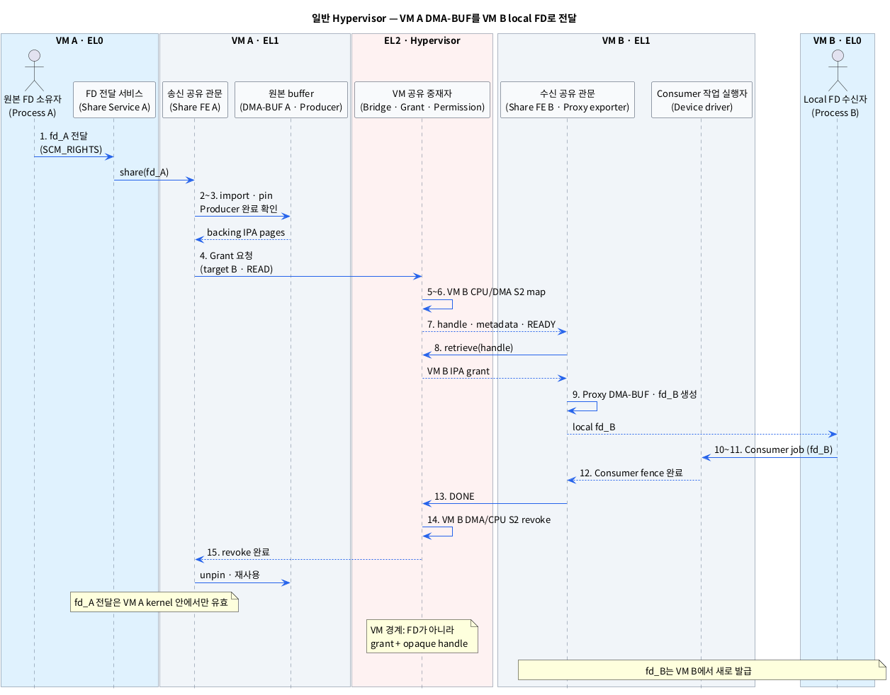
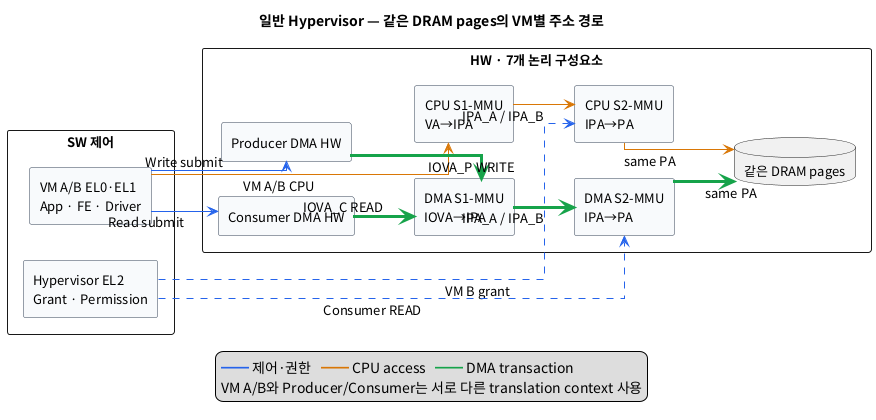

# 일반 Type-1 Hypervisor에서 DMA-BUF를 다른 VM에 전달하는 단계

## 1. 범위와 핵심 결론

이 문서는 Red Bend/HARMAN 또는 XGEN과 같은 **일반 Type-1 Hypervisor** 환경에서 VM A의 DMA-BUF를 VM B에 전달하고, VM B의 DMA HW가 같은 DRAM backing pages를 사용하는 과정을 다룬다. pKVM과 pVM의 protected-memory 동작은 포함하지 않는다.

- `Type-1 Hypervisor`: Host OS를 거치지 않고 HW 위의 EL2에서 여러 VM과 장치를 관리하는 Hypervisor다.
- `DMA-BUF`: 같은 Linux kernel 안에서 여러 프로세스와 장치가 같은 buffer memory를 공유할 수 있게 하는 kernel 객체다.
- `DMA HW`: CPU 대신 DRAM을 직접 읽거나 쓰는 Camera, ISP, GPU, NPU, Display 등의 장치다.
- `DRAM backing pages`: DMA-BUF의 실제 frame data가 저장되는 DRAM 영역이다.

이 문서에서 말하는 inter-VM FD passing의 핵심은 다음 한 문장이다.

> **원본 FD는 VM 경계를 통과하지 않는다. VM A에서는 `fd_A`, VM B에서는 새 `fd_B`를 사용하며, VM 경계에서는 page grant와 opaque buffer handle만 전달한다.**

- `FD`: 한 프로세스가 자기 Linux kernel의 열린 file을 가리킬 때 사용하는 정수 번호다.
- `page grant`: 한 VM의 memory pages를 다른 VM이나 장치가 지정된 권한으로 접근하도록 Hypervisor가 허용하는 기능이다.
- `opaque buffer handle`: Raw 주소나 kernel pointer를 노출하지 않고 Hypervisor와 VM Share Frontend만 해석하는 buffer 식별자다.

따라서 실제 전달은 세 구간으로 나뉜다.

1. **VM A 내부:** `SCM_RIGHTS`로 Process A의 `fd_A`가 Share Service/Frontend에 전달된다.
2. **VM 경계:** Hypervisor가 backing pages를 grant하고 handle·metadata·상태 message를 VM B에 전달한다.
3. **VM B 내부:** Proxy exporter가 grant pages로 새 local DMA-BUF와 `fd_B`를 만들고 Consumer Process/Driver에 전달한다.

- `SCM_RIGHTS`: 같은 Linux kernel 안에서 열린 file 참조를 다른 프로세스의 FD table에 복제하는 Unix socket 기능이다.
- `metadata`: Size, plane offset, stride와 format처럼 Consumer가 buffer를 해석하는 정보다.
- `proxy exporter`: Grant받은 pages를 VM B의 local DMA-BUF로 감싸는 kernel 모듈이다.

Frame payload는 복사하지 않고 같은 physical pages를 공유할 수 있다. 단, Hypervisor가 같은 PA pages를 두 VM과 Consumer DMA HW에 안전하게 map하는 기능을 제공해야 한다.

- `zero-copy`: Frame payload를 다른 DRAM buffer로 복사하지 않고 같은 physical pages를 이어서 사용하는 방식이다.
- `PA`: 실제 DRAM에 도달할 때 사용하는 Physical Address다.

## 2. 전달 전후 객체 관계

### 2.1 VM A 내부

**Process A `fd_A` → VM A `struct file` → VM A `struct dma_buf` → VM A exporter → source backing pages**

- `struct file`: Linux kernel이 열린 file의 상태와 reference count를 관리하는 객체다.
- `struct dma_buf`: Backing memory와 공유 동작을 관리하는 DMA-BUF의 kernel 표현이다.
- `exporter`: Backing memory를 소유하고 DMA-BUF 동작을 제공하는 kernel 모듈이다.

### 2.2 VM 경계

**VM A local object → Hypervisor grant record·opaque handle → VM B grant mapping**

VM 경계에는 `fd_A`, `struct file *`, `struct dma_buf *`, `dma_resv *`, `dma_fence *`와 raw `sg_table`을 싣지 않는다.

- `dma_resv`: 한 DMA-BUF에 연결된 비동기 작업들의 완료 순서를 관리하는 kernel 객체다.
- `dma_fence`: 특정 DMA 작업의 완료를 알리는 kernel 동기화 객체다.
- `sg_table`: 여러 backing page를 주소와 길이의 scatter-gather 목록으로 나타내는 Linux 구조체다.

### 2.3 VM B 내부

**Grant된 VM B IPA pages → VM B proxy exporter → VM B `struct dma_buf`·`struct file` → `fd_B`**

- `IPA`: 각 VM이 물리 주소처럼 사용하는 Intermediate Physical Address다.

`fd_A`와 `fd_B`는 숫자가 같을 필요가 없으며 서로 다른 kernel 객체를 가리킨다. 두 DMA-BUF가 공유하는 것은 file object가 아니라 Hypervisor가 같은 PA pages에 연결한 backing memory다.

## 3. 레이어별 모듈

표기 형식은 **추상화한 모듈 (`실제 이름 또는 구현 후보`)**이다.

### 3.1 EL0 — VM A

| 추상 모듈 (실제 이름 또는 후보) | 책임 |
|---|---|
| 원본 FD 소유자 (`Producer Process A`) | DMA-BUF를 할당하고 Producer 작업과 공유를 요청한다. |
| FD 전달 서비스 (`Share Service A`, `sendmsg()`) | `SCM_RIGHTS`로 `fd_A`를 VM A kernel의 Share Frontend에 연결된 서비스로 전달한다. |

Share Service를 별도 프로세스로 두지 않는 구현에서는 Process A가 Share Frontend의 ioctl에 `fd_A`를 직접 전달할 수 있다.

- `ioctl`: EL0 프로세스가 device별 명령과 인자를 kernel driver에 전달하는 system call이다.

### 3.2 EL1 — VM A Guest Linux

| 추상 모듈 (실제 이름 또는 후보) | 책임 |
|---|---|
| 원본 공유 객체 관리자 (`DMA-BUF core A`) | `fd_A`를 VM A의 `struct dma_buf` 참조로 바꾼다 (`dma_buf_get()`). |
| 원본 page 제공자 (`DMA-BUF exporter A`) | Backing page 목록과 page pin·release 동작을 제공한다. |
| Producer 작업 실행자 (`Producer device driver`) | Producer DMA HW의 write 완료와 local fence를 관리한다. |
| 송신 공유 관문 (`VM-Share Frontend A`) | DMA-BUF를 import하고 pages를 pin/register한 뒤 Hypervisor grant를 요청한다. |
| 송신 동기화 변환기 (`dma_resv`/`dma_fence` bridge) | Producer 완료를 기다린 뒤 `READY(sequence)`를 만들고 `DONE` 전 재사용을 막는다. |

- `pin`: 공유가 끝날 때까지 backing page가 이동하거나 해제되지 않도록 고정하는 동작이다.
- `sequence`: 같은 buffer의 여러 사용 차례를 구분하는 증가 번호다.

### 3.3 EL2 — Hypervisor

| 추상 모듈 (제품 대응 이름) | 책임 |
|---|---|
| Peer 통신 중재자 (`Inter-VM Bridge`, Red Bend `vLink` 후보, XGEN 동등 모듈) | Handle과 `READY`/`DONE`/오류 message를 올바른 VM에 전달한다. |
| Memory grant 관리자 (`Hypervisor memory grant/mapper`) | VM A IPA pages를 확인하고 동일 PA pages를 VM B IPA에 map한다. |
| CPU Stage-2 관리자 (`Hypervisor Stage-2 MMU manager`) | VM별 CPU `IPA → PA` mapping과 R/W 권한을 설정·회수한다. |
| DMA 권한 관리자 (`Hypervisor SMMU/S2MPU manager`) | Consumer DMA HW가 grant pages에 접근하도록 DMA Stage-2 permission을 설정·회수한다. |
| 알림 중재자 (`Cross-interrupt`/`XIRQ`/virtual IRQ 후보) | `READY`, `DONE`과 mapping 오류를 대상 VM에 알린다. |
| 수명·복구 관리자 (`Grant lifecycle manager`) | Timeout, VM reset, stale handle과 부분 mapping을 정리한다. |

- `vLink`: Red Bend/HARMAN 계열 공개 매뉴얼 사본에서 VM 간 resource link를 나타내는 이름이다.
- `XIRQ`: 같은 자료에서 VM 간 event를 전달하는 cross-interrupt 이름이다.
- `SMMU`: DMA 주소 변환과 접근 제어를 제공하는 Arm System MMU다.
- `S2MPU`: 일부 SoC에서 DMA의 physical memory 접근 권한을 검사하는 보호 HW다.
- `stale handle`: 이전 buffer generation이나 종료된 VM에서 만들어져 더 이상 유효하지 않은 handle이다.

위 제품 이름은 공개 자료에서 확인되는 대응 후보이며 Linux DMA-BUF 전용 API가 보장된다는 뜻이 아니다. XGEN의 실제 module과 ABI 이름은 공급사 자료로 확인해야 한다.

- `ABI`: 서로 다른 SW 계층이 호출 번호, 인자와 결과 형식을 합의한 binary interface다.

### 3.4 EL1 — VM B Guest Linux

| 추상 모듈 (실제 이름 또는 후보) | 책임 |
|---|---|
| 수신 공유 관문 (`VM-Share Frontend B`) | Handle을 retrieve하고 VM B IPA grant와 metadata를 검증한다. |
| Proxy buffer 제공자 (`Proxy DMA-BUF exporter`) | Grant pages를 VM B local `struct dma_buf`와 `struct file`로 만든다. |
| Local FD 발급기 (`dma_buf_fd()`, VM B process FD table) | Proxy DMA-BUF를 가리키는 `fd_B`를 발급한다. |
| Consumer 작업 실행자 (`Consumer device driver`) | `fd_B`를 import하고 attach/map한 뒤 Consumer DMA HW를 실행한다. |
| VM B DMA 매핑 관리자 (`DMA API`, Guest IOMMU/SMMU driver) | `IOVA_C → IPA_B` DMA Stage-1 page table을 설정한다. |
| 수신 동기화 변환기 (`local dma_fence`, `DONE(sequence)`) | `READY`를 local dependency로 바꾸고 Consumer 완료를 `DONE`으로 전달한다. |

- `retrieve`: Receiver가 handle을 제시하여 grant된 pages와 권한을 자기 IPA space에 받는 동작이다.
- `IOVA_C`: Consumer DMA HW에 전달되는 Consumer-local DMA virtual address다.

### 3.5 EL0 — VM B

| 추상 모듈 (실제 이름 또는 후보) | 책임 |
|---|---|
| Local FD 수신자 (`Consumer Process B`) | VM B에서 새로 발급된 `fd_B`로 Consumer 작업을 요청한다. |

`fd_B`는 VM-Share Frontend ioctl의 반환값으로 직접 받거나, VM B 내부 Share Service가 `SCM_RIGHTS`로 Consumer Process에 전달할 수 있다. 두 방식 모두 VM B kernel 안에서만 동작한다.

### 3.6 HW

이 문서의 HW는 다음 7개 논리 구성요소로 한정한다. VM과 장치마다 서로 다른 translation table/context를 사용할 수 있다.

| 추상 모듈 (실제 이름) | 책임 |
|---|---|
| VM CPU 1차 변환기 (`CPU S1-MMU`, VA→IPA) | VM A/B의 VA를 각 VM의 IPA로 변환한다. |
| VM CPU 2차 변환기 (`CPU S2-MMU`, IPA→PA) | 각 VM IPA를 같은 PA pages에 연결하고 Hypervisor 권한을 검사한다. |
| VM DMA 1차 변환기 (`DMA S1-MMU`, IOVA→IPA) | Producer/Consumer IOVA를 해당 VM IPA로 변환한다. |
| VM DMA 2차 변환기 (`DMA S2-MMU`, IPA→PA) | DMA IPA를 같은 PA pages에 연결하고 장치별 권한을 검사한다. |
| 데이터 생성 장치 (`Producer DMA HW`) | VM A에서 frame을 backing pages에 write한다. |
| 데이터 소비 장치 (`Consumer DMA HW`) | VM B에서 같은 backing pages의 frame을 read한다. |
| 물리 데이터 저장소 (`DRAM pages`) | 복사 없이 VM A와 VM B가 공유하는 frame data를 저장한다. |

- `CPU S1-MMU`: Guest EL1이 관리하는 VA→IPA 1차 CPU 주소 변환 HW다.
- `CPU S2-MMU`: Hypervisor EL2가 관리하는 IPA→PA 2차 CPU 주소 변환 HW다.
- `DMA S1-MMU`: Guest 또는 device owner가 관리하는 IOVA→IPA 1차 DMA 주소 변환 HW다.
- `DMA S2-MMU`: Hypervisor/BSP가 관리하는 IPA→PA 2차 DMA 주소 변환·보호 HW다.
- `Producer DMA HW`: Frame을 DRAM에 write하는 장치다.
- `Consumer DMA HW`: Frame을 DRAM에서 read하는 장치다.
- `BSP`: 특정 SoC에서 Hypervisor, Guest OS와 HW를 연결하는 플랫폼 지원 소프트웨어다.

## 4. 사전 준비 — VM·장치 초기화 시

| 단계 | 모듈 이동 | 동작 | 결과 |
|---|---|---|---|
| A1. Peer 관계 설정 | **EL2** Hypervisor configuration → **EL2** Peer 통신 중재자 | VM A와 VM B의 identity, 허용 방향과 channel을 설정한다. | 허가된 두 VM만 handle과 event를 교환한다. |
| A2. 장치 배정 | **EL2** 장치/DMA 권한 관리자 → **HW** DMA S1/S2-MMU | Producer와 Consumer DMA HW의 Stream ID를 각 VM의 DMA context에 연결한다. | 장치 DMA 요청이 올바른 VM translation을 사용한다. |
| A3. Grant 정책 설정 | **EL2** Memory grant 관리자 | Source/target, maximum size, alignment, CPU/DMA R/W와 timeout을 설정한다. | 임의 VM이나 장치의 memory 접근을 제한한다. |
| A4. Frontend 준비 | **EL2** Bridge → **EL1** VM-Share Frontend A/B | Control channel, notification과 reset callback을 연결한다. | Runtime grant protocol을 사용할 수 있다. |

- `Stream ID`: SMMU가 DMA 요청을 어느 device와 translation context에 연결할지 구분하는 식별자다.
- `alignment`: 주소와 크기를 page 또는 protection 단위의 경계에 맞추는 조건이다.

## 5. 단계별 Inter-VM FD Passing

### 5.1 VM A 내부 FD 전달과 buffer 등록

| 단계 | 모듈 이동 | 동작 | 결과 |
|---|---|---|---|
| 1. Local FD 전달 | **VM A EL0** Process A → **VM A EL0/EL1** Share Service/Frontend | 별도 Share Service를 쓰면 Unix socket의 `SCM_RIGHTS`로 `fd_A`의 열린 file 참조를 복제한다. 직접 ioctl 방식은 `fd_A`를 driver 인자로 전달한다. | VM A Share Frontend가 source DMA-BUF를 import할 수 있다. |
| 2. DMA-BUF import | **VM A EL1** Share Frontend A → **VM A EL1** DMA-BUF core/exporter | `dma_buf_get(fd_A)` 후 share용 attachment 또는 pin을 만들고 backing page 목록을 얻는다. | Grant 기간 동안 유지할 source pages가 정해진다. |
| 3. Producer 완료 | **VM A EL1** Producer driver/fence bridge | Producer DMA fence 완료와 필요한 cache maintenance를 확인하고 새 write·free를 막는다. | Consumer에게 공개해도 되는 frame 상태가 된다. |

- `cache maintenance`: CPU와 DMA cache가 같은 최신 data를 보도록 clean/invalidate 등을 수행하는 동작이다.

### 5.2 VM 경계의 page grant와 handle 전달

| 단계 | 모듈 이동 | 동작 | 결과 |
|---|---|---|---|
| 4. Grant 요청 | **VM A EL1** Share Frontend A → **EL2** Memory grant 관리자 | Source VM identity, IPA page range, target VM, size, Consumer READ 권한과 generation을 제출한다. | Hypervisor가 source mapping과 요청 권한을 검증한다. |
| 5. VM B mapping | **EL2** Memory grant/CPU Stage-2 관리자 → **HW** CPU S2-MMU | 같은 PA pages를 VM B의 `IPA_B`에 map한다. Source는 read-only 또는 기존 mapping을 유지하되 `DONE` 전 overwrite하지 못하게 한다. | VM B가 같은 backing pages를 볼 수 있다. |
| 6. Consumer DMA 권한 | **EL2** DMA 권한 관리자 → **HW** DMA S2-MMU | Consumer Stream ID에 대해 `IPA_B → 같은 PA + READ` permission을 설정하고 TLB invalidation을 완료한다. | Consumer DMA HW가 grant pages에 접근할 수 있다. |
| 7. Handle·READY 전달 | **EL2** Peer 통신/알림 중재자 → **VM B EL1** Share Frontend B | `handle + generation + metadata + READY(sequence)`를 전달한다. | VM B가 mapping 완료와 Producer 완료를 함께 확인한다. |

- `generation`: Buffer나 VM을 재사용했을 때 이전 handle과 새 handle을 구분하는 값이다.
- `TLB invalidation`: Page-table 변경 후 MMU가 오래된 주소 변환 cache를 사용하지 않도록 지우는 동작이다.

VM B에는 raw PA나 VM A의 raw scatter-gather table을 보내지 않는다. Hypervisor가 검증한 handle을 기준으로 이미 승인된 VM B IPA range만 Frontend에 제공한다.

### 5.3 VM B local FD 생성과 Consumer DMA 사용

| 단계 | 모듈 이동 | 동작 | 결과 |
|---|---|---|---|
| 8. Grant retrieve | **VM B EL1** Share Frontend B → **EL2** Memory grant 관리자 | Handle, target identity와 generation을 확인하고 grant된 `IPA_B` pages를 받는다. | VM B proxy exporter가 사용할 page view가 준비된다. |
| 9. Local DMA-BUF·FD 생성 | **VM B EL1** Proxy exporter/DMA-BUF core → **VM B EL0** Consumer Process | Grant pages를 `dma_buf_export()`로 감싸고 `dma_buf_fd()`로 새 `fd_B`를 만든다. | VM B에 독립된 DMA-BUF object와 FD가 생긴다. |
| 10. Consumer attach/map | **VM B EL0** Consumer Process → **VM B EL1** Consumer driver/DMA-BUF core → **HW** DMA S1-MMU | `dma_buf_get(fd_B)`, `dma_buf_attach()`와 `dma_buf_map_attachment()`으로 `IOVA_C → IPA_B` PTE를 설정한다. | Consumer-local DMA address가 준비된다. |
| 11. DMA 실행 | **VM B EL1** Consumer driver → **HW** Consumer DMA HW → **HW** DMA S1-MMU → **HW** DMA S2-MMU → **HW** DRAM pages | Consumer descriptor를 submit하고 `IOVA_C → IPA_B → 같은 PA`로 frame을 읽는다. | Payload 복사 없이 VM A가 생성한 frame을 사용한다. |

- `PTE`: Page table 한 항목으로 입력 page를 출력 page와 접근 속성에 연결한다.
- `descriptor`: DMA HW에 전달할 IOVA, 길이와 R/W 속성을 담은 명령 정보다.

### 5.4 완료와 회수

| 단계 | 모듈 이동 | 동작 | 결과 |
|---|---|---|---|
| 12. Consumer 완료 | **HW** Consumer DMA HW → **VM B EL1** Consumer driver/fence bridge | Consumer fence 완료를 확인하고 새 job을 차단한 뒤 DMA S1 unmap·detach를 수행한다. | Consumer DMA HW가 더 이상 pages에 접근하지 않는다. |
| 13. DONE 전달 | **VM B EL1** Share Frontend B → **EL2** Bridge → **VM A EL1** Share Frontend A | `DONE(handle, generation, sequence)`를 전달한다. | Hypervisor와 VM A가 같은 사용 차례의 완료를 확인한다. |
| 14. Grant revoke | **EL2** DMA/CPU Stage-2 관리자 → **HW** DMA S2/CPU S2-MMU | Consumer DMA S2 permission과 VM B CPU S2 mapping을 제거하고 TLB invalidation을 완료한다. | VM B와 Consumer device의 접근이 차단된다. |
| 15. Source release | **EL2** Memory grant 관리자 → **VM A EL1** Share Frontend A | Revoke 완료를 알린다. Frontend A가 unpin·put을 수행하고 source buffer 재사용을 허용한다. | VM A가 backing pages를 안전하게 재사용하거나 해제한다. |

회수 순서는 **새 Consumer submit 차단 → Consumer DMA 완료·정지 → VM B DMA S1 unmap → EL2 DMA S2 revoke → VM B CPU S2 unmap → Source unpin/reuse**를 지켜야 한다.

## 6. PlantUML Sequence Diagram

## 7. PlantUML HW Address Path

두 DMA 화살표는 동시에 같은 frame을 수정한다는 뜻이 아니다. Producer write와 fence 완료 후 Consumer read가 같은 physical pages를 순서대로 사용한다.

## 8. 동적 grant와 고정 shared pool

| 항목 | 동적 page grant | 고정 shared pool |
|---|---|---|
| S2 설정 시점 | Buffer를 전달할 때 map, 완료 후 revoke | VM boot/configuration 시 양 VM에 미리 map |
| VM 경계 전달 정보 | Grant handle + metadata | Pool buffer ID 또는 offset + metadata |
| 장점 | Buffer별 권한·노출 시간 최소화 | Frame별 EL2 map/unmap 비용이 작음 |
| 단점 | Hypercall, TLB update와 rollback 필요 | Pool 전체가 양 VM에 오래 노출될 수 있음 |
| Proxy DMA-BUF | Grant pages를 매번 또는 cache하여 생성 | Pool slice를 local DMA-BUF로 감싸서 재사용 |

Hypervisor가 임의 Guest pages의 동적 grant를 지원하지 않으면 fixed shared pool을 VM A/B 전용 allocator로 사용한다. 두 방식 모두 VM B에는 local proxy DMA-BUF가 필요하며 FD 자체를 VM 경계로 전달하지 않는다.

- `shared pool`: 여러 VM에 미리 map한 DRAM 영역을 buffer 단위로 나누어 사용하는 방식이다.
- `hypercall`: Guest EL1이 EL2 Hypervisor의 mapping·grant 기능을 요청하는 호출이다.

## 9. 동기화·수명·오류 규칙

- Producer `dma_fence`가 signal되기 전에는 `READY`를 보내지 않는다.
- VM A는 같은 generation/sequence의 `DONE`과 revoke 완료 전 buffer를 overwrite, free 또는 다른 Consumer에 재할당하지 않는다.
- VM B는 `READY`를 local fence/completion으로 변환하고 Consumer 완료를 확인한 뒤에만 `DONE`을 보낸다.
- Source와 proxy DMA-BUF의 `dma_resv`는 서로 다른 kernel 객체이므로 자동 동기화되지 않는다.
- Non-coherent platform은 Producer 완료와 Consumer 시작 사이에 BSP가 정한 cache clean/invalidate를 수행한다.
- VM B reset 시 Hypervisor가 Consumer DMA HW를 정지·reset하고 DMA/CPU S2 mapping을 강제 revoke한다.
- VM A reset 시 새 grant를 막고 outstanding Consumer가 끝나거나 강제 중단된 뒤 pages를 회수한다.
- Handle은 source/target VM identity, VM generation, buffer generation, size와 권한에 binding한다.
- Partial map 실패 시 만들어진 S2 entry를 rollback하고 양 VM에 오류를 전달하며 source 재사용을 계속 막는다.

- `non-coherent`: CPU와 DMA cache가 자동으로 같은 최신 data를 보장하지 않는 HW 특성이다.
- `rollback`: 여러 단계 중 일부만 성공했을 때 이미 적용한 mapping을 안전한 이전 상태로 되돌리는 동작이다.

## 10. 제품별 확인 항목

| 확인 항목 | Red Bend/HARMAN | XGEN |
|---|---|---|
| VM 간 control channel | `vLink`/bridge와 `XIRQ` 후보, 현재 납품 ABI 확인 필요 | Peer channel/API 확인 필요 |
| Dynamic memory grant | 공개 매뉴얼 사본에서 R/W/DMA grant 개념 확인 | Page map/grant/revoke 지원 확인 필요 |
| CPU S2 map/revoke | Second-stage MMU 개요 확인, 호출 이름 미확인 | Mapping granule과 API 확인 필요 |
| Consumer DMA S2 permission | SMMU/DMA grant 개요만 확인, 실제 HW·API 미확인 | SMMU/S2MPU와 Stream ID binding 확인 필요 |
| Guest Frontend/Proxy exporter | Linux DMA-BUF용 구현 존재 여부 미확인 | 제공 driver 또는 신규 구현 범위 확인 필요 |
| Reset cleanup | Grant와 device reset ordering 확인 필요 | 강제 revoke 완료 보장 확인 필요 |

2026-09-04 기준 `XGEN hypervisor`라는 정확한 제품명에 대응하는 공개 기술 사양은 확인하지 못했다. Xen으로 간주하지 않으며 XGEN 고유 이름과 동작은 공급사 BSP 문서로 확정해야 한다.

## 11. 구현 가능성 판정

다음 기능이 모두 있어야 inter-VM DMA-BUF zero-copy FD passing이 성립한다.

1. VM A page를 pin/register하고 Hypervisor가 검증하는 Frontend
2. 같은 PA pages를 VM B IPA에 map하는 dynamic grant 또는 고정 shared pool
3. VM B grant pages를 local `struct page`/`sg_table`과 proxy DMA-BUF로 만드는 Frontend
4. Consumer DMA HW의 `IOVA_C → IPA_B → PA` S1/S2 mapping과 permission
5. `READY`/`DONE`, generation과 timeout을 전달하는 peer channel
6. Consumer DMA 정지 후 S1/S2 revoke를 보장하는 reset·recovery 경로

하나라도 없으면 가능한 대안은 staging buffer로 복사하거나, Hypervisor/Service VM backend가 payload를 중계하는 방식이다. 이 대안들은 FD를 VM 경계로 직접 전달하는 것이 아니며 같은 pages를 쓰는 zero-copy도 아니다.

## 12. 근거

### 로컬 조사

- [`survey/dmabuf_inter_vm_cc.md`](./dmabuf_inter_vm_cc.md): 일반 Red Bend/HARMAN·XGEN 환경의 VM-local FD, page grant, proxy exporter와 HW 주소 경로.
- [`survey/dmabuf_fd_passing_baremetal.md`](./dmabuf_fd_passing_baremetal.md): 같은 kernel에서 `SCM_RIGHTS`로 열린 file 참조를 전달하는 과정.
- [`survey/dmabuf_dma_mapping_hypervisor.md`](./dmabuf_dma_mapping_hypervisor.md): Guest DMA S1과 Hypervisor DMA S2의 mapping·사용·회수 과정.
- [`survey/dmabuf_creation_hypervisor.md`](./dmabuf_creation_hypervisor.md): VM A source DMA-BUF의 생성 과정.

### 웹 자료

- [Linux unix(7)](https://man7.org/linux/man-pages/man7/unix.7.html): `SCM_RIGHTS`가 동일 kernel의 열린 file description 참조를 전달하는 의미.
- [Linux DMA-BUF 공식 문서](https://docs.kernel.org/driver-api/dma-buf.html): `dma_buf_fd()`, attachment, map/unmap, pin과 fence 계약.
- [Arm Memory Management](https://developer.arm.com/-/media/Arm%20Developer%20Community/PDF/Learn%20the%20Architecture/LearnTheArchitecture-MemoryManagement-101811_0100_00_en.pdf): CPU Stage-1의 VA→IPA와 Stage-2의 IPA→PA 변환.
- [Arm SMMU Architecture Specification](https://documentation-service.arm.com/static/66c5c097882fec713ef4a8ff): Stream ID와 DMA Stage-1/Stage-2 translation 구조.
- [HARMAN Device Virtualization](https://car.harman.com/solutions/device-virtualization): Type-1 virtualization, second-stage MMU, SMMU와 bridge 기반 VM communication 개요.
- [2021 HARMAN/Red Bend 매뉴얼 공개 사본](https://www.scribd.com/document/752680019/Hypervisor-Overview-Application-Note-Hypervisor-Description-ALL-REV-0-00): `vLink`, `XIRQ`, memory grant와 shared resource 명칭. 공식 최신 배포본이 아니므로 실제 납품 버전과 대조가 필요하다.
